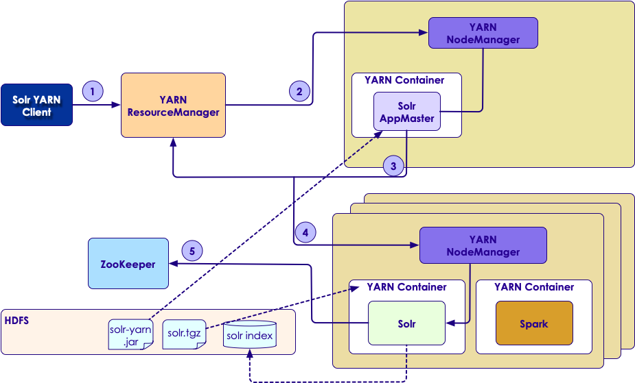

# Solr: Optimizing
---
## Session Objectives

* Being familiar with sharding and considerations
* Knowing when and how to use document routing 
* Getting familiar with disaster recovery by replication
* How to run Solr in Yarn
* And Knowing Solr cloud auto scaling and its use cases


Notes:

---
# Sharding Strategies
---

## What is Sharding?

* When a collection is too large for one node
  - Solr breaks it sections (shards) 
  - stores shards on multiple computers
* A Shard is a logical partition of the collection
* Replicas are then made for each shard


Notes:

---

## Sharding Strategies

 <!-- {"left" : 1.48, "top" : 1.55, "height" : 4.86, "width" : 7.29} -->

Notes:

---

## Sharding Strategies

* Which shard contains a specific document in a collection?
* Sharding strategy
  - for example, by a field, like country
  - better yet, by something more evenly balanced
  - for example, a "hash" on the uniqueKey of each document
  - and that, indeed, is the default

Notes:

---

## Advantages of Sharding

* Maximizes Indexing performance
* Enables horizontal scaling to massive content repositories
* When the document count exceeds 50 million in the repository

Notes:

---

## Sharding Implementation

* In SolrCloud there are no masters or slaves
* Instead
  - every shard consists of at least one physical replica
  - exactly one of which is a leader
* Leaders are automatically elected
  - initially on a first-come-first-served basis
  - and then based on the ZooKeeper
* If a leader goes down
  - one of the other replicas is automatically elected as the new leader  
  

Notes:

---

## Sharding Use

* When a document is sent to a Solr node for indexing
   - the system first determines which Shard that document belongs to
     - based on sharding policy
   - determines which node is currently hosting the leader for that shard.  
* The document is then forwarded to the current leader for indexing
* The leader forwards the update to all of the other replicas
* So, they are read-only for scalability and fault-tolerance


Notes:

---

## How Many Documents and Shards?

* No explicit rule but, generally one shard for every 50 million documents
* Monitor memory
* Monitor I/O
* Change shards
  - You want to support the query load
  - You want to support more concurrent users (similar)
  
Notes:


---
# Document Routing
---

## What is Document Routing?
* How do we decide to which shard a document belongs?
  - We need a way from the document itself.
  - No lookup tables!
* Hashing
  - Normally we decide on some kind of a hash
  - Hash Key -> token -> Find the shard.
  - *Normally* Solr wants to *balance* documents in shards
* What if we want to *route* documents using another criteria
  - Perhaps from a single customer, such as `Walmart`
  - Perhaps from a region, such as `USA`

Notes:

---

## Document Routers

* A shared key is added to the unique document id
* The key determines which document is indexed in
* The query will be limited to a specific shard

Notes:

---

## How Does CompositeId Router Work?
* If your customer is "Walmart"
* Document with the ID "13579"
* insert the prefix into the document id field: "IBM!12345"
* The exclamation mark ('!') is critical here
  - distinguishes the prefix 
  - used to determine which shard to direct the document to

Notes:

---

## Query Using Routing

* At query time
* include the prefix(es) into your query with the _route_ parameter
   - `q=solr&_route_=Walmart!`
     - direct queries to specific shards
* At times, this may improve query performance
   - it overcomes network latency when querying all the shards
* The compositeId router supports prefixes containing up to 2 levels of routing
* Example
   - prefix routing first by region
   - then by customer: `USA!Walmart!12345`  

---

## Query Without Routing

<!-- {"left" : 2.05, "top" : 2.65, "height" : 4.48, "width" : 6.15-->


* Less effective effective way to:
  - Import documents
  - Make queries


Notes:


---

## Query With Routing

<!-- {"left" : 2.05, "top" : 2.65, "height" : 4.48, "width" : 6.15} -->

* Control where documents are going
* Control where queries are going

Notes:


---

## Use Cases

* Two primary use cases:
* Multi-tenancy
  - In multi-tenant environments
  - The shard key <-- tenant id
  - All documents from a specific tenant on the same shard will be grouped
  - Not every shard in the collection needs to be searched to find a single tenant's data
  
Notes:


---

## Use Cases, contd

* Co-location
  - Some features like grouping's `ngroups` requires documents to be co-located in the same core or VM
  - For example documents need to be co-located by the grouping key
  - When the grouping key is used as the shard key document routing will do that automatically

Notes:


---
# Cross Data Center Replication
---

## Securing Your Data

 * "Don't put all your eggs in one basket!"
 * Having one copy of your data is not safe
 * Do we need to make a copy of the data?
   - How do we ensure that data is not corrupted?
   - How do we keep backup in sync?
   - How do we recover from backup if needed?


Notes:


---

## Disaster Recovery

<!-- {"left" : 0.78, "top" : 1.08, "height" : 5.8, "width" : 8.7} -->


Notes:


---

## Disaster Recovery Strategies

| Option                                           	| Risk                                                                                                                                                                                                        	|
|--------------------------------------------------	|-------------------------------------------------------------------------------------------------------------------------------------------------------------------------------------------------------------	|
| Index to two instances in different data centers 	| Often require additional custom development (may need messaging service like Apache Kafka) - No guarantee that the instances are identical                                                                  	|
| Disk Mirroring                                   	| - What if entire index, file is not copied?  - What state is the disk at the time of abrupt event? - In either case, entire index gets corrupted                                                            	|
| Regular Backups                                  	| - Works if you have low volume index updates with controlled schedule - Managing backups, storing offsite and retrieving quickly when needed is a challenge - If backup is incomplete, index gets corrupted 	|
| Backup API                                       	| - Available in Solr at collection level - Takes backup of entire data of collection along with configurations - Prone to failure at live indexing and abrupt event                                          	|


Notes:


---

## What is CDCR?

* Cross Data Center Replication (CDCR) 
* Allows to 
  - create multiple SolrCloud data centers
  - keep them in sync in case they are needed at a future time
* Now suited for separated data clusters connected by an expensive pipe
  - Because of near-real-time traffic
* Rather
  - CDCR features exist to help mitigate the risk of an entire data center outage


Notes:


---

## CDCR Details

* Source data center
* Target data center
* Source => Target
* Not Target => Source


Notes:


---

## CDCR Glossary

* Zookeeper: Centralized service for maintaining configuration and cluster state info
* Collection: A complete logical index in a SolrCloud
* Shard: A logical piece (or slice) of a collection
* Replica: One copy of a shard


Notes:


---

## CDCR Glossary contd

* Node
  - A JVM instance running Solr; a server
* Cluster
  - A set of Solr nodes managed as a single unit by a ZooKeeper ensemble, hosting one or more Collections.
* Leader
  - Each shard has one node identified as its leader
  - All the writes for documents belonging to a shard are routed through the leader
* Replica
  - A copy of a shard for use in failover or load balancing
  - Replicas comprising a shard can either be leaders or non-leaders
* Follower
  - A convenience term for a replica that is not the leader of a shard.
* Collection
  - Multiple documents that make up one logical index
  - A cluster can have multiple collections.
* Updates Log
  - An append-only log of write operations maintained by each node.


Notes:


---

## CDCR Architecture

 <!-- {"left" : 0.96, "top" : 1.83, "height" : 4.31, "width" : 8.32} -->

Notes:


---

## Cross Data Center Replication (CDCR)

* Version 6 or later
* Supports unidirectional (active-passive) and bidirectional (active-active)
* At collection level data is replicated not configurations
* APIs: 
```bash
/cdcr/action=START
/cdcr/action=STOP
/cdcr/action=STATUS
```
<!-- {"left" : 0, "top" : 3.61, "height" : 1.67, "width" : 6.17} -->

Notes:

---

## Image Of Unidirectional

* Direction: source to target
* If source goes down, you need to point querying and indexing to target cluster collection

  <!-- {"left" : 2.02, "top" : 2.52, "height" : 4.54, "width" : 6.21} -->


Notes:


---

## Concept

* Updating forwards from source data center leader nodes to target data center leader nodes at regular intervals
* Each update operation contains unique `version`, time-based import clock
* Example: _version_:1601701044254525698

Notes:


---

## Concept, contd

* The unique `version` is maintained as checkpoint, as ephemeral node on source and persistent node on target across all solr nodes

* No need any additional network traffic
* The unique ‘version’ is maintained as checkpoint, as ephemeral node on source and persistent node on target across all solr nodes.

Notes:


---

## Core Components

  <!-- {"left" : 0.35, "top" : 2.03, "height" : 3.45, "width" : 9.54} -->

Notes:


---

## Image Of Bidirectional 

* Indexing and querying must be done on a single cluster
* Second cluster is used when the first cluster is down

 <!-- {"left" : 1.38, "top" : 1.83, "height" : 5.45, "width" : 7.45} -->

Notes:


---

## CDCR Bidirectional Approach

* Decentralized, no source nor target
* No single point of failure anymore
* Indexing can be redirected to failover clusters swiftly without much human effort
* Overall traffic can be distributed to multiple data centers based on their geographical location to avoid network delay, not applicable for real-time

Notes:


---
## Update Strategy

* Must provide consistency between source and target data centers
* Minimal network traffic

<!-- {"left" : 1.72, "top" : 2.37, "height" : 4.9, "width" : 6.8} -->

Notes:


---

## Decentralized Multi-Cluster Setup

* Avoids single point of failure

<!-- {"left" : 1.03, "top" : 1.83, "height" : 5.0, "width" : 8.2} -->

Notes:


---
# Running Solr In YARN Container
---

## What Is YARN?

* Yet Another Resource Negotiator
* Introduced by Hadoop2
* Supports multi-purpose data processing platform
* Separates resource management and job scheduling from data processing in Hadoop cluster
* Allows different jobs to run in a Hadoop cluster, including `MapReduce`, `Spark` and `Storm`

Notes:


---

## Why SolrCloud On YARN?

* Improves operational efficiency
* Adding computing capacity is much easier than deploying a new cluster
* Admins can monitor the apps on a single point
* Running Solr on YARN is a simple task
* Can be used to deploy temp SolrCloud clusters to perform background tasks
  - Example: re-indexing a large collection
* After completion of the job admin can shutdown the temp cluster

Notes:


---

## Mechanism

* Follow the instructions on next slides

<!-- {"left" : 0.7, "top" : 1.83, "height" : 5.35, "width" : 8.86} -->


Notes:


---

## Step 0: Uploading Packages?

* Upload the Solr distribution bundle (solr.tgz) and Solr YARN client JAR (solr-yarn.jar) to HDFS

```java
hdfs dfs -put solr-yarn/jar solr/
hdfs dfs -put solr.tgz solr/
```
<!-- {"left" : 0.0, "top" : 2, "height" : 1.05, "width" : 8.19} -->

* Then run SolrClient

Notes:


---

## Step 1: Running SolrClient

* It's a java application 
* Uses YARN Java API
* Launches the SolrMaster app in the cluster
* Example:

```java
hadoop jar solr-yarn.jar org.apache.solr.cloud.yarn.SolrClient
-nodes=2
-zkHost=localhost:2181
-solr=hdfs://localhost:9000/solr/solr.tgz
-jar=hdfs://localhost:9000/solr/solr-yarn.jar
-memory 512
-hdfs_home=hdfs://localhost:9000/solr/index_data
```
<!-- {"left" : 0.0, "top" : 3.28, "height" : 2.13, "width" : 10.25} -->

Notes:

This example requests Solr to be deployed into two YARN containers in the cluster,
each having 512M of memory allocated to the container. Notice that you also need 
to give the ZooKeeper connection string (-zkHost) and location where Solr should 
create indexes in HDFS (-hdfs_home). Consequently, you need to setup a ZooKeeper 
ensemble before deploying Solr on YARN; running Solr with the embedded ZooKeeper 
is not supported for YARN clusters.

---

## Step 2: Allocate Container To Run SolrMaster

* Upon request of SolrClient, ResourceManager selects a node
* Then directs the NodeManager to launch the SolrMaster apps
* A NodeManager runs on each node in the cluster

Notes:


---

## Step 3: Requests Containers To Run Nodes

* SolrMaster performs:
  - Requests N containers (-nodes) for running SolrCloud nodes from the ResourceManager
  - Configures each container to run the start Solr command 
  - Waits for a shutdown callback to gracefully shutdown each SolrCloud node

Notes:


---

## Step 4: Containers Allocated Across Cluster

* SolrMaster adds the path to the Solr distribution bundle (solr.tgz) as a local resource to each container
* Then NodeManager extracts the `solr.tgz` on the local filesystem and makes it available as `./solr`
* This enables us to easily execute the solr start script using:  

```bash
./solr/bin/solr
```
<!-- {"left" : 0.0, "top" : 3.64, "height" : 0.69, "width" : 4.19} -->


Notes:


---

## Step 5: Node Connects To ZooKeeper

* It connects to ZooKeeper to join the SolrCloud cluster
* Usually Solr is configured so that it uses the `HdfsDirectoryFactory` 
* Using the `-hdfs_home` parameter on the SolrClient
* Any file Created locally in the container will be lost when you shutdown the container

Notes:


---

## Shutting down A SolrCloud Cluster

* It's done by custom Jetty shutdown hook
* The custom shutdown handler accepts a Jetty stop request from SolrMaster IP address
* SolrMaster computes a secret Jetty stop key
* Finally triggers a shutdown request

Notes:


---

# SolrCloud Autoscaling
---

## Overview

* Provides good defaults
* Results in a `SolrCloud` cluster remaining balanced and stable in cluster change events
* Easier, more automatic and intelligent

 <!-- {"left" : 2.56, "top" : 2.71, "height" : 1.18, "width" : 5.13} -->


* Example:
 Adding a replica for a `SolrCloud` collection When a node containing an existing replica goes down

Notes:


---

## Goals

* Making cluster management easier
* More automatic
* More intelligent
* Providing good defaults such that the cluster remains balanced and stable in the face of different events such as a node joining the cluster or leaving the cluster

Notes:


---

## Use Cases

* Problems will be addressed:
  - Deciding when to run cluster management task. 
    - Example: Fault tolerance
  - Deciding which cluster management task to run
    - Example: adding a new replica or move to a new node
  - How to run the cluster management to provide balance and stability for the cluster

Notes:


---

## A Problem

<!-- {"left" : 3.38, "top" : 4.25, "height" : 2.89, "width" : 3.12} -->


* Maintaining three replicas for every shard:

```java
replication Factor = 3
```
<!-- {"left" : 0, "top" : 1.54, "height" : 0.61, "width" : 4.99} -->

* Problem: What if a node with replica(s) crashed?
* Solution: We need additional replicas to replace
* There is an simple way. See the next slide


Notes:


---

## Adding Replicas Automatically

* Additional parameter when creating a collection with `CREATE` command of the collection API

```java
autoAddReplicas = true
```
<!-- {"left" : 0, "top" : 1.92, "height" : 0.6, "width" : 4.91} -->

* Solr monitors this collection 
* Adds new replica on other nodes after 30 sec. waiting
* Example

```java
/admin/collections?action=CREATE&name
```
<!-- {"left" : 0, "top" : 4.37, "height" : 0.54, "width" : 6.89} -->

```java
=_name_of_collection_&numShards =1&replicationFactor =3&autoAddReplicas=true
```
<!-- {"left" : 0, "top" : 5.38, "height" : 0.41, "width" : 10.25} -->

Notes:


---

## Cluster Preferences

* Will be applied on all collections
* Is a set of conditions that helps `Solr` select nodes that either maximize or minimize given metrics
* Example

```java
{minimize:cores}
```
<!-- {"left" : 0, "top" : 2.82, "height" : 0.72, "width" : 4.55} -->

* Helps `Solr` select nodes that the number. of cores on each node is minimized
* To reduce the overall load on the system

Notes:


---

## Cluster Policy

* A set of conditions that nodes, shards and collections must satisfy
* Are applied across the cluster 
* Example

```java
{"cores":"<5","node":"#ANY"}
```
<!-- {"left" : 0, "top" : 2.76, "height" : 0.72, "width" : 7.25} -->


* Any node must have less than 5 `Solr` cores in total regardless of which collection they belong to

Notes:


---

## Other Metrics

* System load Average
* Heap usage
* Free disk space

Notes:


---

## Collection-Specific Policies

* `set-policy` API is used to create a new policy
* `policy = <policy_name` parameter of `CREATE` command

```java
/admin/collections?action=CREATE&name= myCollection&
```
<!-- {"left" : 0, "top" : 2.58, "height" : 0.59, "width" : 10.25} -->


```java
numShards=1&replicationFactor =2&policy=myPolicy
```
<!-- {"left" : 0, "top" : 3.43, "height" : 0.63, "width" : 10.25} -->


* Associates `myPolicy` with `myCollection`

Notes:


---

## Conditions

* The collection follows all conditions:
  - Cluster policy
  - Collection specific policy. Only if the collection is addressed by this policy
  - Cluster preferences

Notes:


---

## Triggers

* Watches for events like node joining or leaving the cluster
* Executes a set of action that compute and execute a `plan`
* `plan` is a set of operations to change the cluster
* Policies and preferences are respected

Notes:


---

## Example

* `autoAddReplicas` parameter we talked about
* Automatically creates a trigger
* Trigger watches for a node going away
* When the trigger fires, it executes the plan
* Here plan is moving all replicas to new nodes

Notes:


---

## Trigger Actions

 <!-- {"left" : 2.72, "top" : 4.3, "height" : 2.62, "width" : 4.49} -->

* A trigger executes actions that tell Solr what to do in response to the trigger.
* Two actions are added to every trigger by default:
- `ComputePlanAction` computes the cluster management operations necessary to stabilize the cluster 
- `ExecutePlanAction` executes them on the cluster


Notes:


---

## Listeners

<!-- {"left" : 2.75, "top" : 3.44, "height" : 3.57, "width" : 4.75} -->

* Can be attached to a trigger
* Solr calls it every time the trigger fires
* As a call back mechanism
* Example: Logs details about trigger fire to `.system` collection

Notes:


---

## Autoscaling APIs

* Is available at:
`/admin/autoscaling`
* can be used to read and modify each of the components discussed above

Notes:

