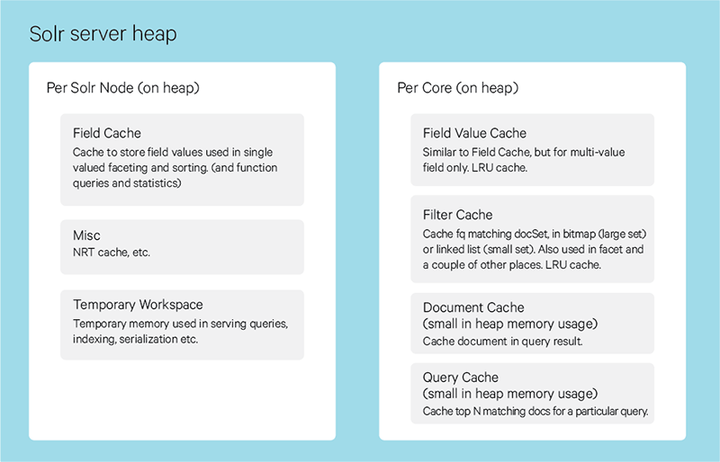

# Solr Expert Performance Tuning

---

## Expert Tuning
  *  Memory considerations
  *  Indexing threads
  *  Auto commit tuning
  *  Caches
  *  Replication throttling


---

# RAM and Heap

---


## RAM Issues

 * Solr requires *lots* of RAM
   - Don't be a cheapskate!
 * Solr likes SSDs!
   - See above
 * Solr Likes Disk Caches
   - See above
 * But more is not always better if not well-managed
   - the infamous, dreaded GC Pause!
 * One problem with performance could be solved by better managing RAM


---

## Java Heap management




Notes:

Image: https://blog.cloudera.com/apache-solr-memory-tuning-for-production/

---


## Causes of Heap Consumption

  * A large index.
  * Frequent updates.
  * Super large documents.
  * Extensive use of faceting.
  * Using a lot of different sort parameters.
  * Very large Solr caches
  * A large RAMBufferSizeMB.
  * Use of Lucene's RAMDirectoryFactory.

---

## Too Many Rows
 * One common problem:  `rows=9999999`
   - **DON'T DO THIS!**
   - Will have to allocate and GC memory for all those rows!
   - Even if you don't ever return them.
 * Use a reasonable number of rows.
 * What if you **need** lots of rows?
   - Do several queries (not one)
   - Use `CursorMark`
   - do bulk exports


---


## Garbage Collection
 * GC "Pause" or "Freeze" means a momentary "zombie" of your process
 * Difficult to debug/fix
 * Causes of Java GC woes
   - Too Much Heap (More is not necessarily better!)
   - Too Big Caches
   - Poorly Tuned JVM
   - Older JVM (Recommended OpenJDK 11+)

---

## Which JVM to use?
 * JDK versions earlier than 11
   - Not recommended
   - Solr requires Java 8+
   - Java 9,10 not LTS
 * OpenJDK 11 (LTS)
   - Open Source
   - Not much difference from Oracle JDK in V11
 * Oracle JDK 11 (LTS)
   - Not much difference from OpenJDK in V11
 * Zing from Azul
   - Proprietary
   - Has a better GC
   - Cost: $3500 / server / year

Notes:

https://www.azul.com/products/zing/

---


## JVM G1GC vs Shenandoah
  * G1GC now default in JVM v11+
  * Much better performance than older GCs
    - example: Serial and ConcMarkSweep
  * Shenandoah is the new kid on the block
    - from Red Hat, but needs custom JVM
    - has a lot of new features
    - experimental!

```bash
-XX:+UseShenandoahGC \
-Xmx2g -Xms32m \
-XX:+UnlockExperimentalVMOptions \
-XX:ShenandoahUncommitDelay=1000
-XX:ShenandoahGuaranteedGCInterval=10000
```

---

## ZGC
 * Experimental in JDK 11
   - much improved in (non-LTS) JDK 13
 * Included with OpenJDK and Oracle
   - doesn't require custom build (like Shenandoah)
 * Uses "colored pointers"
   - requires Virtualization extensions
   - 64-bit only
 * Lots of tuning available
 * Recommendation: Java 17 LTS (September 2021)


Notes:

https://blog.plan99.net/modern-garbage-collection-part-2-1c88847abcfd


---


## JVM Opts
 *  Example of G1GC logs

 ```bash
 JVM_OPTS=" \
-XX:+UseG1GC \
-XX:+PerfDisableSharedMem \
-XX:+ParallelRefProcEnabled \
-XX:G1HeapRegionSize=8m \
-XX:MaxGCPauseMillis=250 \
-XX:InitiatingHeapOccupancyPercent=75 \
-XX:+UseLargePages \
-XX:+AggressiveOpts \
"
```

## JVM GC Logging

 * How do you know how GC is doing?
   - Answer, LOGGING and Monitoring!
 * Here is some log settings for JVM:

```bash
GCLOG_OPTS=" \
-verbose:gc \
-Xloggc:logs/gc.log \
-XX:+PrintGCDateStamps \
-XX:+PrintGCDetails \
-XX:+PrintAdaptiveSizePolicy \
-XX:+PrintReferenceGC
"
```

---

# Indexing Threads

---

## Indexing Threads

 * We can adjust the indexing threads in `solrconfig.xml`
 * We should look under the `<indexConfig>` section:
 * And adjust the `<maxIndexingThreads>`
 * For example: `<maxIndexingThreads>10</maxIndexingThreads>`

---

### Ram Buffer
 * Each Thread will take a certain amount of RAM
 * We will need to set the RAM per thread
 * Set `<ramBufferSizeMB>`
 * `<ramBufferSizeMB>128</ramBufferSize>`

---

# Caching

---

## Cache Configuration
 * Caches are the **Number One** thing you can do to improve performance!
 * Caches to Look at:
    -  `filterCache`
    - `queryResultCache`
    - `documentCache`
    - `CaffieneCache`
 * `queryResultCache` and `documentCache` are only used at read-time
    - They will slow down write-time performance
    - You can disable them for write-heavy workloads.

---


## FilterCache

  * Used by `SolrIndexSearcher` for filters.
  * Control over how filter queries are handled in order to maximize performance. 
    - "autowarmed" data for read-time performance
  * Example

```xml
<filterCache
  class="solr.FastLRUCache"
  size="512"
  initialSize="512"
  autowarmCount="0"
/>
```

---

## FilterCache
  * `class`: the SolrCache implementation `LRUCache` (`LRUCache` or `FastLRUCache`)
  * `size`: the maximum number of entries in the cache
  * `initialSize`: the initial capacity (number of entries) of the cache. (see `java.util.HashMap`)
  * `autowarmCount`: the number of entries to pre-populate from and old cache.


---

## QueryResultCache
  * Holds results of previous searches
  * Autowarmed 
  * Example

```xml
<queryResultCache
  class="solr.LRUCache"
  size="512"
  initialSize="512"
  autowarmCount="0"
/>
```

---

## DocumentCache
  * Holds the Lucene Document objects
  * *NOT* Autowarmed
  * Works best for read-only use cases.

```xml
<documentCache
  class="solr.LRUCache"
  size="512"
  initialSize="512"
  autowarmCount="0"
/>
```

---

## CaffieneCache

 * New in 8.3.0
 * Much *faster* and *more efficient* cache implementation

---

## Example: Blog Posts
   * Let us say we are indexing blog posts
   * Is this a read-heavy or write-heavy use case?
   * Probably very read-heavy!
   * Enable QueryResultCache and DocumentCache!

---   

## Example: Blog Comments
   * Let us say that we have a very active set of comments on our blog posts.
   * WWould this be a read-heavy or write-heavy use case?
     - Probably write-heavy!
   * Disable QueryResultCache and DocumentCache

---

# Commit Types

---

## Using SoftCommits
  * Soft Commits can help ensure high availability 
    - if we are OK with "Eventual Consistency,
  * `softCommit=true`
  * Don't have to wait for background merges
---

## Autocommit
 * Autocommit controls whether and how often data is autocommitted

```xml
<autoCommit>
  <maxDocs>20000</maxDocs>
  <maxTime>50000</maxTime>
  <openSearcher>false</openSearcher>
</autoCommit>
```

  * `maxDocs`: The number of updates that have occurred since the last commit.
  * `maxTime`: The number of milliseconds since the oldest uncommitted update
  * `openSearcher`: if true, opens a new searcher when performing a commit. 
  p

---

## Disabling Autocommit  
   * We may want to *disable* autocommit
     - during migrations
     - bulk updates or inserts
   * How to disable
     - turn off autocommit
     - or set to a large number `<maxDocs>600000000</maxDocs>`  
   * Once finished, mmanually call commit()
   * Re-enable Autocommit

---

# Schema Optimization

---

## Dynamic Fields
  * Dynamic fields are very powerful
    - ex: `field_*`
  * But only use them if you have to!
  * Otherwise ti will slow your query parsing time down

```xml
<dynamicField
  name="*.fieldname"
  type="boolean"
  multiValued="true"
  stored="true"
/>
```

---

## Configure Indexed vs Stored Fields
  * Be careful about setting `indexed` to `true` on a field.
  * Every indexed field will slow reindexing time!
  * If you are not searching on that field, change the `indexed` to `false`
  * `<field name="foo" type="int" stored="true" indexed="false"/>`

---

## Configure Copy Fields
  * Copy field is a nice way to maximize your indexing
  * Highly recommended to use a "catch" all copy field.
     - reduced index sized!
     - `<copyField source="*_abcd" dest="wxyz"/>`
     - source: The name of the field to copy
     - dest: The name of the copy field

---

## Filter Query `fq`
   * Use the `fq` query to reduce the set of documents to search
   * Very useful for speeding up complex queries
     - you will only retrieve the relevant documents 
     - will *NOT* apply complex query to all documents
   * Example:   
```json
{
 "form_params": {
  "fq": "id=1234",
  "fl": "abc cde",
  "wt": "json"
 },
 "query": {
  "q": "*:*"
 }
}

```

---


## Use Facet Queries
  * Facets are great for aggregation!
  * If you use facets you can easily aggregate them
  * Example
```json
{
 "form_params": {
     "fq"            : "fieldName:value",
     "fl"            : "fieldName",
     "facet"         : "true",
     "facet.mincount": 1,
     "facet.limit"   : -1,
     "facet.field"   : "fieldName",
     "wt"            : "json",
 },
 "query"      : {
     "q": "*:*",
 },
}
```

---

## Facet Queries
 * fq: Filter Query
 * fl: Fields List to be returned in the result
 * facet: true/false to enable/disable facet counts
 * facet.mincount: To exclude the ranges with a count below 1
 * facet.limit: Limit groups number to be returned in result, -1 means all
 * facet.field: The field should be treated as facet (to group the results)


---

# RAM and Heap

---


## RAM Issues

 * Solr requires *lots* of RAM
   - Don't be a cheapskate!
 * Solr likes SSDs!
   - See above
 * Solr Likes Disk Caches
   - See above
 * But more is not always better if not well-managed
   - the infamous, dreaded GC Pause!
 * One problem with performance could be solved by better managing RAM
   

---

## Java Heap management


Notes:

Image: https://blog.cloudera.com/apache-solr-memory-tuning-for-production/

---


## Causes of Heap Consumption

  * A large index.
  * Frequent updates.
  * Super large documents.
  * Extensive use of faceting.
  * Using a lot of different sort parameters.
  * Very large Solr caches
  * A large RAMBufferSizeMB.
  * Use of Lucene's RAMDirectoryFactory.

---

## Too Many Rows
 * One common problem:  `rows=9999999`
   - **DON'T DO THIS!**
   - Will have to allocate and GC memory for all those rows!
   - Even if you don't ever return them.
 * Use a reasonable number of rows.
 * What if you **need** lots of rows?
   - Do several queries (not one)
   - Use `CursorMark`
   - do bulk exports


---


## Garbage Collection
 * GC "Pause" or "Freeze" means a momentary "zombie" of your process
 * Difficult to debug/fix
 * Causes of Java GC woes
   - Too Much Heap (More is not necessarily better!)
   - Too Big Caches 
   - Poorly Tuned JVM
   - Older JVM (Recommended OpenJDK 11+)

---

## Which JVM to use?
 * JDK versions earlier than 11
   - Not recommended
   - Solr requires Java 8+ 
   - Java 9,10 not LTS
 * OpenJDK 11 (LTS)
   - Open Source
   - Not much difference from Oracle JDK in V11
 * Oracle JDK 11 (LTS)
   - Not much difference from OpenJDK in V11
 * Zing from Azul
   - Proprietary
   - Has a better GC
   - Cost: $3500 / server / year

Notes:

https://www.azul.com/products/zing/

---


## JVM G1GC vs Shenandoah
  * G1GC now default in JVM v11+
  * Much better performance than older GCs 
    - example: Serial and ConcMarkSweep
  * Shenandoah is the new kid on the block
    - from Red Hat, but needs custom JVM
    - has a lot of new features
    - experimental!

```bash
-XX:+UseShenandoahGC \
-Xmx2g -Xms32m \
-XX:+UnlockExperimentalVMOptions \
-XX:ShenandoahUncommitDelay=1000 
-XX:ShenandoahGuaranteedGCInterval=10000 
```
  
---

## ZGC
 * Experimental in JDK 11
   - much improved in (non-LTS) JDK 13
 * Included with OpenJDK and Oracle
   - doesn't require custom build (like Shenandoah)
 * Uses "colored pointers"
   - requires Virtualization extensions
   - 64-bit only
 * Lots of tuning available
 * Recommendation: Java 17 LTS (September 2021)


Notes:

https://blog.plan99.net/modern-garbage-collection-part-2-1c88847abcfd


---


## JVM Opts
 *  Example of G1GC logs
 
 ```bash
 JVM_OPTS=" \
-XX:+UseG1GC \
-XX:+PerfDisableSharedMem \
-XX:+ParallelRefProcEnabled \
-XX:G1HeapRegionSize=8m \
-XX:MaxGCPauseMillis=250 \
-XX:InitiatingHeapOccupancyPercent=75 \
-XX:+UseLargePages \
-XX:+AggressiveOpts \
"
```

## JVM GC Logging

 * How do you know how GC is doing?
   - Answer, LOGGING and Monitoring!
 * Here is some log settings for JVM:

```bash
GCLOG_OPTS=" \
-verbose:gc \
-Xloggc:logs/gc.log \
-XX:+PrintGCDateStamps \
-XX:+PrintGCDetails \
-XX:+PrintAdaptiveSizePolicy \
-XX:+PrintReferenceGC
"
```
