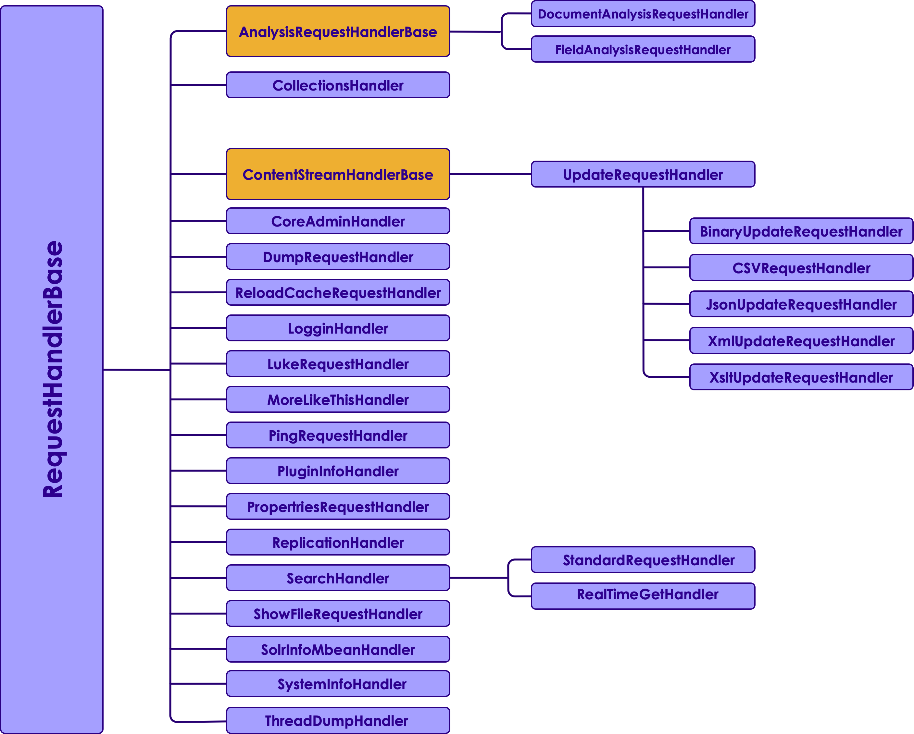
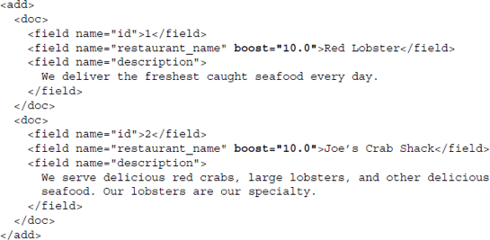
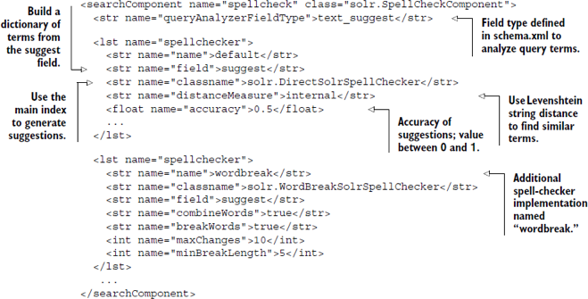

# Solr: Relevance
---
## Section Objectives

  * Know how to tune Solr to return more relevant results.
  * Incorporate special cases, such as fuzzy queries.

Notes:

---

# Field weighting

---

## The big picture

  * Solr request processing
    - Request handlers
    - Search components
    - Query parsers for 
    - Returning query results including both static and dynamic values
    - Sorting results by values, functions, and relevancy

Notes:

---

## Request handlers

<!-- {"left" : 1.45, "top" : 1.58, "height" : 5.91, "width" : 7.35} -->

Notes:

---

## Default: Lucene Query Parser

  * By example, what does this mean?

    - title:solr
       - title:"apache solr" content:(search engine)

  * Are these the same:

    - solr
       - content:solr (hint: "content" is default field)

Notes:

---

## Default: Lucene Query Parser, contd

  * **Do these mean the same?**
    - `+`solr
    - apache **AND** solr
    - apache **&&** solr
    - `+`apache `+`solr
    - apache solr _(assuming default operator is AND)_

Notes:

---

## Default: Lucene Query Parser, contd

  * And these mean the same?
    - apache OR solr
    - apache || solr
    - apache solr _(assuming default operator is OR))_

Notes:

---

# Phrase queries
---

## Phrase queries

  * **How is this implemented?**
    - "apache solr"
    - "apache software foundation"
    - (hint: think proximity)
  * **Will this also fit?**
    - "apache foundation software "
    - And the answer is...

Notes:

---

## Phrase queries explained

  * These are the same
    - "apache software foundation"
    - "apache software foundation`"~0`

Notes:

---

## Excluding terms

  * What do queries below mean?
    - solr –panel
    - solr **NOT** panel
    - solr **AND NOT** (panel OR electricity)

Notes:

---

## Range queries

  * Is the meaning below obvious?
  * What would be required of fields?
    - number:**[** 12.5 **TO** 100 **]**
    - date:[2013-11-04T10:05:00Z **TO** NOW-1DAY **]**
    - string:**[** ape **TO** apple **]**

Notes:

---

## Relevancy tuning

  * Relevancy of query results is what differentiates between search and most databases
  * Returning enormous amounts of data without highlighting the most relevant documents will prove frustrating
  * Solr provides a decent relevancy algorithm for keyword search 
  * Additional benefit can be achieved by "tuning" and otherwise experimenting with the relevancy of Solr searches.

Notes:

---

## What's your problem?

  * So what is the problem with pure Lucene Query Parser?
  * Users don't know it!
  * It throws an exception if syntax is broken
  * Enter **eDisMax** query parser

Notes:

---

## eDisMax query parser example

  * Search for 
Solr in Action
  * Using Lucene query parser

    - (((title:solr) OR (description:solr) OR (author:solr)) AND ((title:in) OR (description:in) OR (author:in)) AND ((title:action) OR (description:action) OR (author:action)))

  * With eDisMax query parser

    - q=solr in action&qf=title description author
      -Try it on your example (hint: /select?defType=edismax)

Notes:

---

## Field weighing

  * **FALSTAFF**

    - My honest lads, I will tell you what I am about.
  * **PISTOL**

    - Two yards, and more.

  * **FALSTAFF**
    
    - No quips now, Pistol! Indeed, I am in the waist two yards about; but I am now about no waste; I am about thrift.

Notes:

---

## Field weighting 

  * If you can tell Solr which fields in your document (such as a title field) are more important, for example, Solr can weight them higher when calculating relevancy scores.

Notes:

---

## Field boosting at index time

<!-- {"left" : 0.77, "top" : 1.45, "height" : 5.91, "width" : 8.38} -->

Notes:

---

## Query-time field boosts

  * Manual query

    - http://localhost:8983/solr/no-title-boost/select?
q=restaurant_name:(red lobster)^10 OR description:(red lobster)

  * eDisMax

    - `http://localhost:8983/solr/no-title-boost/select?
defType=edismax&
q=red lobster&
qf=restaurant_name^10 description`

Notes:

---

## Per-term boosting

  * Manual query

    - `http://localhost:8983/solr/no-title-boost/select?
q=restaurant_name:(red^2 lobster^8)^10
OR description:(red^2 lobster^8)`

  * eDisMax

    - `http://localhost:8983/solr/no-title-boost/select?
defType=edismax&
q=red^2 lobster^8&
qf=restaurant_name^10 description`

Notes:

---

## eDisMax queries

  * eDisMax query parser natively boosts the relevance of terms that appear closer together. 
  * A typical query using the Lucene query parser treats the relevancy of all terms the same, regardless of whether they appear
  * By contrast, eDisMax increases the score when the terms are near each other

Notes:

---

# Function queries
---

## Function queries

  * Use a function to provide a relevancy boost for more recent documents:

  * Example:

     - `recip(rord(date),1,1000,1000)`
(in short, this combination of functions increases the value when the document is more recent)

Notes:

---

## Functions in Solr

  * Functions in Solr allow you to dynamically compute values for each document
  * Can be added like keywords to a query
  * Match all documents and return their function calculation as the score
  * Example: 
`q={!func}min($f1,$f2)&f1=sqrt(popularity)&f2=1`

Notes:

---

## Frange query parser

  * Frange = function range
  * Will compute a function
  * But only return results that fall within limit
    - Different from using function for sort

Notes:

---

# Fuzzy search
---

## Fuzzy searches

  * Wildcards 
  * Levenshtein Distance (a.k.a) Edit Distance algorithm. 
  * To do a fuzzy search use the tilde, "~"
    - Example:
    - `roam~`
    - Should find "foam" and "roams"

Notes:

---

# Sounds-like
---

## Sounds like – spell check in solrconfig.xml 

<!-- {"left" : 0.42, "top" : 1.50, "height" : 4.84, "width" : 9.41} -->

Notes:

