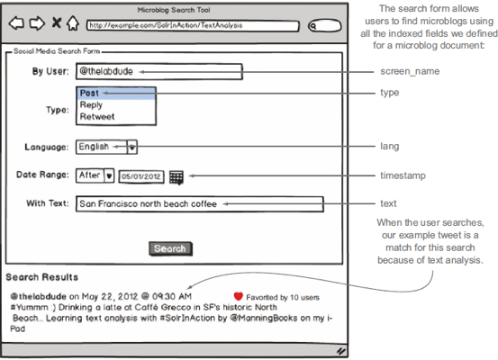
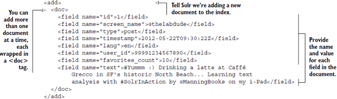
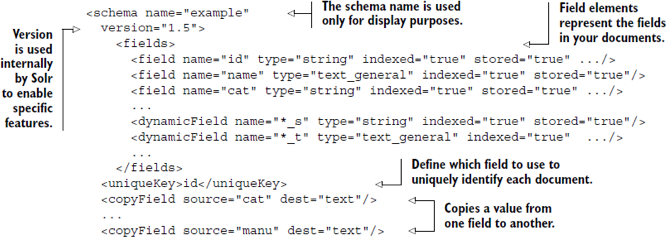
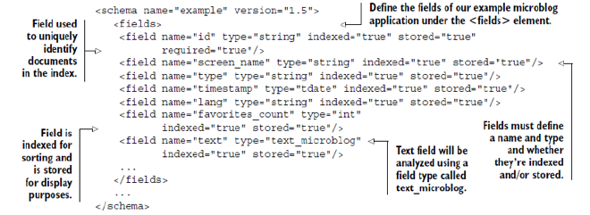
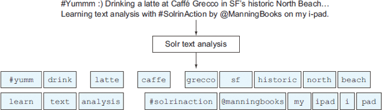

Solr: Schema Updating
===================
## Section Objectives

  * Being able to customize Solr schema for your use case
  * Modify Solr field analysis behavior


Notes:


---

# Adding fields to schema

## Schema design

 <!-- {"left" : 0.96, "top" : 0.99, "height" : 5.52, "width" : 8.33} -->


Notes:


---

## Lucene index

  * Solr uses an inverted index to find documents
  * Index is a dictionary of terms, and a list of document in which each term occurs
  * Lucene index is completely free-form
  * However, Solr imposes some structure on it, and it is called schema (specifically, `schema.xml` but in case of making schema change at runtime, `managed-schema`)

Notes:

---

## Schema and SolrCloud

  * Traditionally, Solr used an XML file called `schema.xml` to access schema.
  * Hand editing these files is now *discouraged.*
  * In fact, because SolrCloud distributes the file via zookeeper, it is not permitted to hand-edit the file in SolrCloud.
  * And nowadays most users will use SolrCloud
 
## Tweet structure – which would you search?

| Field             | Value                                                                                                                                          |
|-------------------|------------------------------------------------------------------------------------------------------------------------------------------------|
| `id`              | 1                                                                                                                                              |
| `screen_name`     | @thelabdude                                                                                                                                    |
| `type`            | post                                                                                                                                           |
| `timestamp`       | 2012-05-22T09:30:22Z                                                                                                                           |
| `lang`            | En                                                                                                                                             |
| `user_id`         | 99991234567890                                                                                                                                 |
| `favorites_count` | 10                                                                                                                                             |
| `Text`            | #Yummm :) Drinking a latte at Caffé Grecco in SF’s historic North Beach. Learning text analysis with #SolrInAction by @ManningBooks on my iPad |

<!-- {"left" : 0.99, "top" : 1.2, "height" : 5.1, "width" : 8.26, "columnwidth" : [4.13, 4.13]} -->
Notes:

---
## Sample tweet search form


 <!-- {"left" : 1.17, "top" : 1.09, "height" : 5.85, "width" : 7.91} -->


Notes:


---

## Adding document to Solr

  * Convert a document from its native format into a format supported by Solr, such as XML or JSON.
  * Add the document to Solr using one of several well-defined interfaces, typically HTTP POST.
  * Configure Solr to apply transformations to the text in the document during indexing.


Notes:


---

## Lucene doc in XML

 <!-- {"left" : 0.35, "top" : 2.15, "height" : 3.04, "width" : 9.61} -->


Notes:


---

## Questions for schema design

  * What is a document in your index?
  * How is each document uniquely identified?
  * What fields in your documents can be searched by users?
  * Which fields should be displayed to users in the search results?


Notes:


---

## What is a document

  * Book search
    - Book
    - Chapter
    - Paragraph

  * Email search
    - Email
    - Email thread
    - Text vs attachment

* (Hit highlighting may help somewhat)


Notes:


---

## Unique key

  * For books – ISBN
  * For documents – may be a natural or generated
  * Similar to the NoSQL key generation problem
  * The document with the same key is overwritten

Notes:


---

## Indexed fields

  * Can user relate to this field in a meaningful query?
  * Would something be missing if one cannot address this field in a query?
  * Examples
    - Author – indexed
    - Title – indexed
    - Editor – not indexed (typically)


Notes:


---

## More indexed fields

  * A field should be indexed if it is used for 
    - Sort
    - Facet
    - group by
    - provide query suggestions for
    - execute function


Notes:


---

## Stored fields

  * Fields that aren’t useful from a search perspective but are still useful for displaying search results
  * In Solr, these are called stored fields
  * Examples:
    - Editor of a book
    - `Favorites_count` in a tweet


Notes:


---

## Example schema


 <!-- {"left" : 0.11, "top" : 1.93, "height" : 3.63, "width" : 10.04} -->


Notes:


---

## Tweet schema

 <!-- {"left" : 0.23, "top" : 2.02, "height" : 3.46, "width" : 9.79} -->


Notes:


---

## Dynamic fields

  * apply the same definition to any field with a prefix or suffix pattern
    - Example:  `s_* or *_s`
  * Used for
    - Modeling documents with many fields
    - Supporting documents from diverse sources
    - Adding new document sources
  * Example definition
    - `<dynamicField name="*_s" type="string" indexed="true" stored="true" />`


Notes:


---

## Copy fields

  * Search in different fields
  * Apply different search criteria
  * Example:

```xml
<schema>
 <fields>
 ...
 </fields>
  <copyField source="screen_name" dest="catch_all" /> 
  <copyField source="text" dest="catch_all" />   
 <copyField source="link" dest="catch_all" />
</schema>
```

Notes:


---

## Lab – schema design for Tweets
- Overview: We will "design" a meaningful schema for tweet documents
- Pre-requisites: solr-labs/solr-intro/1-install.md   
- Approximate time: 30 minutes
- Instructions: solr-labs/schema/2-tweets.md

Notes:


---


## Schemaless

* Schemaless Mode is a set of Solr features that, when used together, allow users to rapidly construct an effective schema by simply indexing sample data, without having to manually edit the schema.

* These Solr features, all controlled via `solrconfig.xml`, are:

  1. Managed schema: Schema modifications are made at runtime through Solr APIs, which requires the use of a `schemaFactory` that supports these changes. 
  2. Field value class guessing: Previously unseen fields are run through a cascading set of value-based parsers, which guess the Java class of field values - parsers for Boolean, Integer, Long, Float, Double, and Date are currently available.
  3. Automatic schema field addition, based on field value class(es): Previously unseen fields are added to the schema, based on field value Java classes, which are mapped to schema field types.


# Analyzing text

## Non-text and text analysis

| Field type | Purpose                                                                  |
|------------|--------------------------------------------------------------------------|
| String     | Field not changed or altered                                             |
| Date       | Used for date search, as follows timestamp:`[2012-05-01T00:00:00Z TO *]` |
| Numeric    | Such as int, float Useful for numeric searches and sorting               |
| Text       | Searchable text                                                          |

<!-- {"left" : 0.75, "top" : 1.67, "height" : 4.17, "width" : 8.75, "columnwidth" : [2.84, 5.91]} -->


Notes:


---

## Analyzing text

  * Basic elements of text analysis in Solr
    - Analyzer
    - Tokenizer
    - chain of token filters.
  * How to define a custom field type in schema.xml 
    - Use for text during indexing
    - Use for query processing.
  * Common text analysis strategies:
    - removing stop words
    - lower-casing
    - removing accents
    - synonym expansion
    - stemming


Notes:


---

## Let’s say we need to search for this

 * `#Yummm :) Drinking a latte at Caffé Grecco in SF's historic North Beach... Learning text analysis with #SolrInAction by @ManningBooks on my i-Pad`


Notes:


---

## What we will miss...

| User search text | Text in document |
|------------------|------------------|
| San Francisco    | SF’s             |
| north beach      | North Beach      |
| Coffee           | latte, Caffé     |


<!-- {"left" : 0.86, "top" : 2.54, "height" : 2.42, "width" : 8.53, "columnwidth" : [4.27, 4.27]} -->


Notes:


---

## Here is what we really need in the index


 <!-- {"left" : 0.23, "top" : 2.02, "height" : 3.46, "width" : 9.79} -->


Notes:


---

## How did we do it?

| Raw text                | Transformation          | Solr technique                                                    |
|-------------------------|-------------------------|-------------------------------------------------------------------|
| All text                | Lowercased (SF’s->sf’s) | LowerCaseFilterFactory                                            |
| a, at, in, with, by, on | Removed from text       | Very common terms called “stop words” removal – StopFilterFactory |
| Drinking, learning      | drink, learn            | Stemming with KStemFilterFactory                                  |
| SF’s                    | sf, san francisco       | Apostrophe s (’s) removed by WordDelimiterFilterFactory           |


<!-- {"left" : 0.55, "top" : 1.89, "height" : 3.72, "width" : 9.15, "columnwidth" : [2.43, 3.11, 3.61]} -->


Notes:


---

## How did we do it – 2

| Raw text                     | Transformation               | Solr technique                                                                                 	|
|------------------------------|------------------------------|------------------------------------------------------------------------------------------------	|
| Caffé                        | caffe                        | Diacritic é transformed to e - ASCIIFoldingFilterFactory                                       	|
| i-Pad                        | ipad, i-pad                  | Hyphenated word correctly handled using WordDelimiterFilterFactory                             	|
| #Yummm                       | #yummm                       | Collapse repeated letters down to a maximum of two using PatternReplaceCharFilterFactory       	|
| #SolrInAction, @ManningBooks | #solrinaction, @manningbooks | Hashtags and mentions correctly preserved -,WhitespaceTokenizer and WordDelimiterFilterFactory 	|


<!-- {"left" : 0.55, "top" : 1.68, "height" : 4.13, "width" : 9.15, "columnwidth" : [2.43, 2.43, 4.3]} -->


Notes:


---

## Lab: text analysis

- Overview: We will adjust the schema to implement the text analysis techniques for tweets
- Pre-requisites: solr-labs/install/README.md   
- Approximate time: 30 minutes
- Instructions: solr-labs/textanalysis/README.md


Notes:


---


