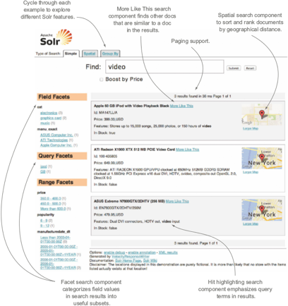
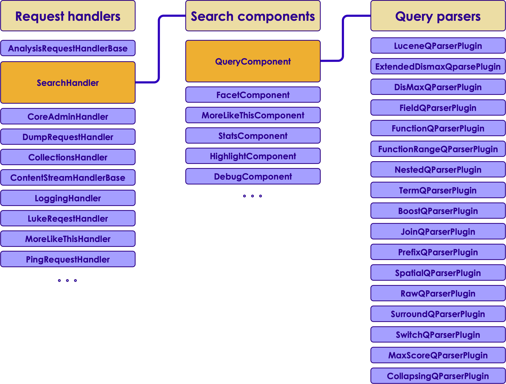
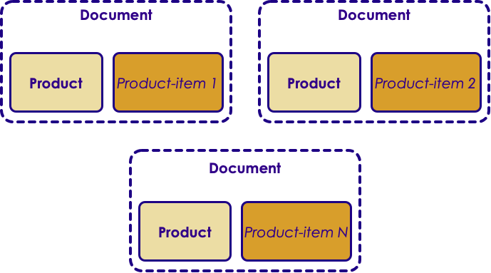

# Solr: Searching
---

## Session Objectives

  * Understand the power of Solr searches
  * Learn to tweak Solr search results
  * Explore faceting and results grouping


Notes:

---
# Introduction
---

## Ranked Retrieval

* The process of sorting documents by their relevance to a query, in which the most relevant documents are listed first.

* Contrast this to the database, where all results are returned, without any preference


Notes:

---
## Example 1

  * Try the following (running “example” data)
  * Search for iPod in the 'q' text box, and name, features, score in the 'fl' field
  * How many documents are returned?
  * Do you agree with the ranking?
  * (Hint: iPod occurs three times in the first document listed, twice in the name and once in the features; it occurs only once in the other documents)


Notes:

---
## Example 2

  * Now search thus:
  * Search for iPod power in the 'q' text box, and name, features, score in the 'fl' field
  * How many documents are returned?
  * Do you agree with the ranking? Notice the closer scores
  * (Hint: power occurs twice in the second document, so its relevance to the iPod power query is much higher than its relevance to the iPod query.)


Notes:

---
## Example 3

  * Now search thus:
  * iPod power^2, which boosts the power query term by 2.
  * How many documents are returned?
  * Can you explain the ordering now?
  * (Hint: top document contains the term power in the name and features fields, and we told Solr that power is twice as important as iPod.)

Notes:

---
## Paging And Sorting

  * Paging and sorting are related
  * Page is a small subset of results
  * Every query has page size (rows) and starting position (start)
  * Use as small a page size as possible 

    - The underlying Lucene index isn't optimized for returning many documents at once


Notes:

---
## Sorting

  * By default, results are sorted by relevance score, descending
  * You can request Solr to sort by other fields
  * Solr will return deterministic results – true or false? Why? (hint – think of relevance score)
  * What if all documents have the same relevance score? Is the result still deterministic? Why? (hint – think of internal document ID)

Notes:

---
## Expanded Search Features

  * dismax - Disjunction Max query parser
  * edismax - Extended Disjunction Max query parser 
  * hl - Hit highlighting 
  * facet - Faceting 
  * spatial - Geo-spatial search, such as sorting by geo distance 
  * spellcheck - Spell-checking on query terms 


Notes:

---

## Lab – Expanded Search/Solritas

* Overview: we will experiment with the advanced search features, as provided in the Solritas example
* Pre-requisites: solr-labs/install/1-install.md   
* Approximate time: 30 minutes
* Instructions: solr-labs/search/1-solritas-search.md


Notes:

---

## Extended Solr features (Solritas example)

<!-- {"left" : 1.83, "top" : 1.74, "height" : 6.17, "width" : 6.58} -->

Notes:

---

## Sorting - Details

  * Sorting can be done on the "score" of the document, or 
  * on any multiValued="false" indexed="true" field
    - Field must be either non-tokenized (i.e., :has no Analyzer) 
    - Or use an Analyzer that only produces a single term
  * Add parameter &sort=score desc, inStock desc, price asc
  * Can sort on function queries


Notes:

---

## Sorting On Function Queries

  * Allows deep customization of ranking, for example
http://localhost:8983/solr/select/? fl=score,id&q=DDR&sort=termfreq(text,memory)%20desc

  * Available functions 
    - sum
    - sub
    - product 
    - div 
    - pow
    - abs
    - log, sqrt, map, scale, termfreq, ...


Notes:

---

# Query Parsers
---

## Query Parsers

  * Query parsers are used to interpret a search syntax into a Lucene query 
  * Solr supports several query parsers 
  * You can write your own

Notes:

---

## Components


 <!-- {"left" : 0.86, "top" : 1.59, "height" : 6.47, "width" : 8.52} -->

Notes:

---

## Query Parser Basics

  * When executing a search, QueryComponent handles the primary user query (the q parameter)
  * It passes its value to a query parser. 
  * Default: LuceneQParserPlugin 
  * But it can be overwritten

Notes:

---

## Specifying A Default Query Parser

  * Default query parser is specified with the defType parameter

    - `/select?defType=edismax&q=...`
    - `/select?defType=term&q=...`


Notes:

---

## Specifying your Query Parser

* Specific query parser is specified with the defType parameter

  - `/select?q={!edismax}hello world`
  - `/select?q={!term}hello`
  - `/select?q={!edismax}hello world OR {!lucene}title:"my title“`

* **Two query parsers used!**


Notes:

---

## What Query Parser To Use?

  * LuceneQParserPlugin
    - Strict Lucene syntax
    - Precise
    - Breaks easily
  * DisMax (Disjunction Max)
    - Similar to Google interface
    - Appropriate for most consumer applications
  * eDisMax (Extended DisMax)
    - Improved Dismax
    - Supports the full Lucene query parser syntax.
    - Supports queries such as AND, OR, NOT, -, and +.


Notes:

---

# Defining Fields
---

## Introduction

* Fields are defined in the fields element of `schema.xml`
* After setting up the field types, defining is a simple process
* Example:
  - Defines a field called `price` with a type called `float` and a default value of `0.0`
  - The `indexed` and `stored` properties are explicitly set to `true`, while any other properties specified on the `float` field type are inherited

```java
<field name="price" type="float" default="0.0" indexed="true" stored="true"/>
```
<!-- {"left" : 0, "top" : 4.68, "height" : 0.66, "width" : 10.25} -->


Notes:

---

## Field Properties

* `name`
  - should consist of alphanumeric or underscore characters only and not start with a digit
* `type`
  - This will be found in the `name` attribute on the fieldType definition
  - Every field must have a `type`
* `default`
  - Is added automatically to documents that do not have a value in this field
  - If not specified, there will be no default


Notes:

---

## Field Types

* All are `true` or `false`
  - `indexed`: the value of the field can be used in queries to retrieve matching documents
  - `stored`: the actual value of the field can be retrieved by queries.
  - `docValues`: the value of the field will be put in a column-oriented `DocValues` structure
  - `sortMissingFirst`,`sortMissingLast`: Control the placement of documents when a sort field is not present
  - `multiValues`: indicates that a single document might contain multiple values for this field type.


Notes:

---

## Field Types, contd

  - `omitNorms`: omits the norms associated with this field
  - `omitTermFreqAndPositions`: omits term frequency, positions, and payloads from postings for this field
  - `omitPositions`: Similar to `omitTermFreqAndPositions` but preserves term frequency information
  - `termVectors`,`termPositions`,`termOffsets`,`termPayloads`: These options instruct Solr to maintain full term vectors for each document, optionally including position, offset and payload information for each term occurrence in those vectors


Notes:

---

## Field Types, contd
  - `required`: Instructs Solr to reject any attempts to add a document which does not have a value for this field

  - `useDocValuesAsStored`: If the field has `docValues` enabled, setting this to true would allow the field to be returned as if it were a stored field (even if it has `stored=false`) when matching `*` in an fl parameter

  - `large`: Large fields are always lazy loaded and will only take up space in the document cache if the actual value is < 512KB


Notes:

---

## Dynamic Fields

* Allows Solr to index fields that you did not explicitly define in your schema

* Useful when you forget to define one or more fields.

* Provides flexibility in the documents for adding to Solr so makes your application less brittle 

* Is like a regular field but has wildcard in its name

* Example:
  - Schema includes a dynamic field `*_i`
  - When indexing a doc with `cost_i` field without explicit field, it will have the field type and analysis defined for `*_i`

* Have a name, field type and options:

```java
<dynamicField name="*_i" type="int" indexed="true"  stored="true"/>
```
<!-- {"left" : 0, "top" : 6.21, "height" : 0.6, "width" : 10.25} -->


Notes:

---

## Copying Fields

* The field you copy is `source` and the copy is `destination`
* Making a copy in `schema.xml`:

```java
<copyField source="cat" dest="text" maxChars="30000" />
```
<!-- {"left" : 0, "top" : 2.45, "height" : 0.48, "width" : 8.82} -->

* Copies the `cat` field to another field `text`
* Now we have two fields with same original content


Notes:

---

## Using Wildcards

* Copy the contents of all incoming fields that match the wildcard pattern `*_t` to the text field:

```java
<copyField source="*_t" dest="text" maxChars="25000" />
```
<!-- {"left" : 0, "top" : 1.97, "height" : 0.47, "width" : 8.58} -->


* Chain copy is impossible. All must be copies from original source

```java
<copyField source="here" dest="there"/>
<copyField source="here" dest="elsewhere"/>
```
<!-- {"left" : 0, "top" : 3.49, "height" : 0.98, "width" : 9.63} -->


Notes:

---

# Faceting
---

## What Is It?

  * Faceting is one of Solr's most powerful features
  * Faceted search = faceted navigation = faceted browsing
  * Allows high level breakdown of the search results based upon one or more aspects (facets) of the documents
  * Permits users to select filters to drill into those search results


Notes:

---

## General Parameters

* Two general parameters for controlling faceting:
  - `facet` parameter: 
    - `true`: Enables facet counts in the query response
    - `false`: Disables faceting
  - `facet.query` parameter: Allows us to specify an arbitrary query in the lucene default syntax to generate a facet count


Notes:

---

## Facet Query

* By default, faceting determines the unique terms for a field and returns a count for each of those terms
* `facet.query` overrides this default and select exactly which terms or expressions to see counted
* Typically a number of `facet.query` parameters are specified
* Parameters can be numeric-range-based or prefix-based facets
* It can be set multiple times
* Example:

  ```java
  facet.query = {!myfunc}name~fred
  ```
<!-- {"left" : 0, "top" : 5.56, "height" : 0.63, "width" : 7.05} -->


Notes:

---

## facet.field Parameter

* Identifies a field that should be treated as a facet
* Iterates over each term in the field and generate a facet count using that term as the constraint
* Can be specified multiple times in a query to select multiple facet fields
* If not set at least one field in the schema, none of the other parameters described will have any effect


Notes:

---

## facet.prefix Parameter

* Limits the terms on which to facet to those starting with the given string prefix
* Does not limit the query in any way, only the facets that would be returned in response to the query
* Can be specified on a per-field basis with this syntax:

```java
f.<fieldname>.facet.prefix
```
<!-- {"left" : 0, "top" : 3.42, "height" : 0.67, "width" : 6.29} -->


Notes:

---

## facet.limit Parameter

* Specifies the maximum number of constraint counts that should be returned for the facet fields
* essentially, the number of facets for a field that are returned
* Negative value means that Solr will return unlimited number of constraint counts
* Default value: 100
* This parameter can be specified on a per-field basis to apply a distinct limit to each field
* Syntax:
 
```java 
f.<fieldname>.facet.limit
```
<!-- {"left" : 0, "top" : 5.26, "height" : 0.63, "width" : 5.78} -->


Notes:

---

## Range Faceting

* Can be used for any date or numeric field that supports range queries
* Good for stitching together a series of range queries (as facet by query) for things like prices

Notes:

---

## Parameters Related to Range (table)


| Parameter           | Description                                                                                                                            |
|---------------------|----------------------------------------------------------------------------------------------------------------------------------------|
| facet.range         | Specifies the field to facet by range                                                                                                  |
| facet.range.start   | Specifies the start of the facet range                                                                                                 |
| facet.range.end     | Specifies the end of the facet range                                                                                                   |
| facet.range.gap     | Specifies the span of the range as a value to be added to the lower bound                                                              |
| facet.range.hardend | A boolean parameter that specifies how Solr handles a range gap that cannot be evenly divided between the range start and end values   |
| facet.range.include | Specifies inclusion and exclusion preferences for the upper and lower bounds of the range                                              |
| facet.range.other   | Specifies counts for Solr to compute in addition to the counts for each facet range constraint                                         |
| facet.range.method  | Specifies the algorithm or method to use for calculating facets                                                                        |

<!-- {"left" : 0.25, "top" : 1.09, "height" : 4.61, "width" : 9.75} -->

Notes:

---

## Interval Faceting vs Facet querying

* Seems similar to rang faceting, but actually its functionality is like doing facet queries with range queries
* Allows us to set variable intervals and count the number of documents that have values within those intervals in the specified field
* Interval faceting: works for multiple intervals for the same fields
* Facet querying: environment where filter cache is more effective (static indexes for example)

Notes:

---

## Parameters

* `facet.interval`
  - Indicates the field where interval faceting must be applied
  - Can be used multiple times in the same request to indicate multiple fields
  - `facet.interval=price&facet.interval=size`

Notes:

---

## Parameters, contd

* `facet.interval.set`
  - Used to set the intervals for the field
  - can be specified multiple times to indicate multiple intervals
  - Is global parameter
  - Means that it will be used for all fields indicated with `facet.interval` unless there is an override for a specific field
  - To override this parameter on a specific field: 

  ```java
  f.<fieldname>.facet.interval.set
  ```
<!-- {"left" : 0, "top" : 4.15, "height" : 0.45, "width" : 5.09} -->

  - Example:

  ```java
  f.price.facet.interval.set=[0,10]&f.price.facet.interval.set=(10,100]
  ```
<!-- {"left" : 0, "top" : 5.34, "height" : 0.45, "width" : 10.25} -->

Notes:

---

## Lab – Faceting

* Overview: we will experiment with the advanced search features, as provided in the Solritas example
* Pre-requisites: solr-labs/install/1-install.md   
* Approximate time: 30 minutes
* Instructions: solr-labs/search/2-facet-films.md

Notes:

---

## Result Grouping 

* Different from `Faceting`
* Groups documents with a common field value into groups
* Returns the top documents for each group
* Possible to combine `faceting` and `result grouping`

Notes:

---

## Result Grouping Overview

* Example domain

 <!-- {"left" : 1.88, "top" : 1.88, "height" : 3.61, "width" : 6.49} -->

* Each Product-item is a document, but includes the product data.

Notes:

---

## Parameters

* `group`: query results will be grouped
* `group.field`: The name of the field by which to group results
* `group.func`: Group based on the unique values of a function query
* `group.query`: Return a single group of documents that match the given query
* and much more ...

Notes:

---

# Geospatial
---

## Geospatial search

  * Location-based searching
  * Index a field in each document containing a geographical point (a latitude and longitude)
  * At query time…
    - filter out documents that do not fall within a specified radius of some other point


Notes:


---

## Geospatial search - implementation

  * Old way:
   - Distance from point
  * New way
   - Based on shapes
   - Arbitrarily complex polygons


Notes:


---

## Geospatial search - setup

  * In schema.xml

```xml
<fieldType name="location"
class="solr.LatLonType"
subFieldSuffix="_coordinate" />
```
<!-- {"left" : 0, "top" : 1.62, "height" : 1.36, "width" : 7.58} -->


Notes:


---

## Geospatial search – document


 <!-- {"left" : 0.27, "top" : 1.44, "height" : 5.88, "width" : 7.23} -->

Notes:


---

## Geospatial search – result

 <!-- {"left" : 1.46, "top" : 1.56, "height" : 5.37, "width" : 7.33} -->


Notes:


---

## Lab – Geospatial

* Overview: we will experiment with the advanced search features, as provided in the Solritas example
* Pre-requisites: solr-labs/install/1-install.md   
* Approximate time: 30 minutes
* Instructions: solr-labs/search/3-geospatial.md

