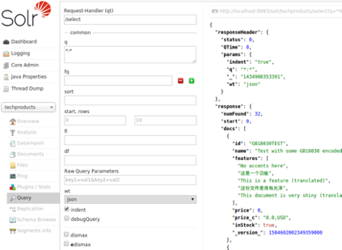
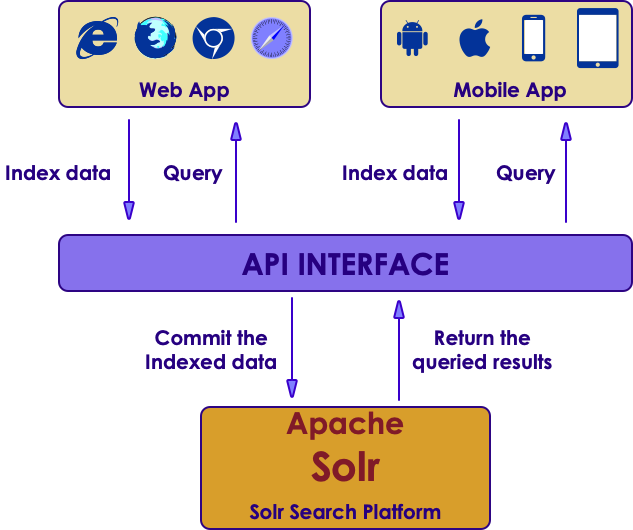

# Search Introduction
---

## Section Objectives

  * Understand Solr as a search engine
  * Get Familiar with Solr Components

# About Solr
---

## What Is Solr

* Search server
* Built upon Apache Lucene (Java)
* Fast, very
* Scalable, query load and collection size
* Interoperable
* Extensible

---

## What Is Solr, contd

 <!-- {"left" : 5.37, "top" : 1.13, "height" : 3.31, "width" : 4.65} -->

* Ready to deploy
* Optimized for search
* Large volumes of documents
* Text-Centric
* Results sorted by relevance

Notes:

---

## Overview of Solr

 <!-- {"left" : 1.55, "top" : 1.83, "height" : 5.99, "width" : 7.15} -->

---

## What Data Is Handled By Solr?

* Text-Centric
* Read-dominant
* Document-oriented
* Flexible schema

---

## Example Search Application

 <!-- {"left" : 0.75, "top" : 1.45, "height" : 6.17, "width" : 8.74} -->

Notes:

---

## Lucene

  * Information Retrieval library
  * Inverted index of documents
  * Vector space model
  * Advanced search options (synonyms, stop words, similarity, proximity)

Notes:

---

## Brief History 

 <!-- {"left" : 8.03, "top" : 1.22, "height" : 2.34, "width" : 1.98} -->

  * Lucene written by Doug Cutting in 1999
  * Replaces commercial search engines, such as Inktomi ($10K/year => $0)
  * Solr written by Yonik Seeley for CNET and contributed to Apache in 2006
  * LucidWorks – 2009
  * ElasticSearch – 2010

 <!-- {"left" : 7.97, "top" : 4.1, "height" : 2.09, "width" : 2.09} --> &nbsp;&nbsp;  &nbsp; &nbsp;<!-- {"left" : 0.33, "top" : 5.78, "height" : 2.79, "width" : 4.2} --> <!-- {"left" : 4.8, "top" : 6.43, "height" : 2.09, "width" : 2.79} -->

Notes:

---

## Solr Features

  * Scalable
  * Ready to deploy
  * Optimized for search
  * Large volumes of documents (millions of documents)
  * Text-Centric(natural-language text, like emails, web pages, resumes, PDF documents, and social messages such as tweets or blogs) 
  * Results sorted by relevance

Notes:

---

## Solr Features, contd

  * Read-dominant
    - Although, there is near real-time search (NRT)
  * Document-oriented (not DB, not large file storage)
  * Flexible schema (similar to NoSQL)

Notes:

---

## Solr Major Features

<!-- {"left" : 1.05, "top" : 1.52, "height" : 6.04, "width" : 8.14} -->

Notes:

---

## Solr Major Features, contd

<!-- {"left" : 1.58, "top" : 1.63, "height" : 6.38, "width" : 7.09} -->

Notes:

---

## Solr Features – User Experience

  * Pagination
  * Sorting
  * Auto-suggest
  * Spell-checking
  * Hit highlighting
  * Geospatial search

Notes:

---

## Solr Features - Architect

  * Result grouping/field collapsing
  * Flexible query support
  * Joins
  * Document clustering
  * Importing rich document formats such as PDF and Word
  * Importing data from relational databases
  * Multilingual support

Notes:

---

## Solr Features – (Starting From Solr4)

  * Near real-time search
  * Atomic updates with optimistic concurrency
  * Real-time get (before commit)
  * Write durability using a transaction log
  * Easy sharding and replication using ZooKeeper

Notes:

---

## New in Solr 8
 * Replication Modes:
   - New replica strategies added: `TLOG` and `PULL`
 * Autoscaling:
   - Solr now features autoscaling
 * Analytics:
   - Analytics component is refactored
 * ConfigSets:
   - Solr features `configSets` as a way to keep configs
   - `_default` ConfigSet will be used if not specified
   - ConfigSets ware uploaded to Zookeeper
 * Schemaless Mode Improvements
 * JSON
   - JSON rather than XML is now the default format

---

## Summary

  * What we've learned

    - Installing and running Solr
    - Adding content to Solr and searching
    - Changing parameters in the URL
    - Using the browser interface
    - Reading a Solr XML response

Notes:

