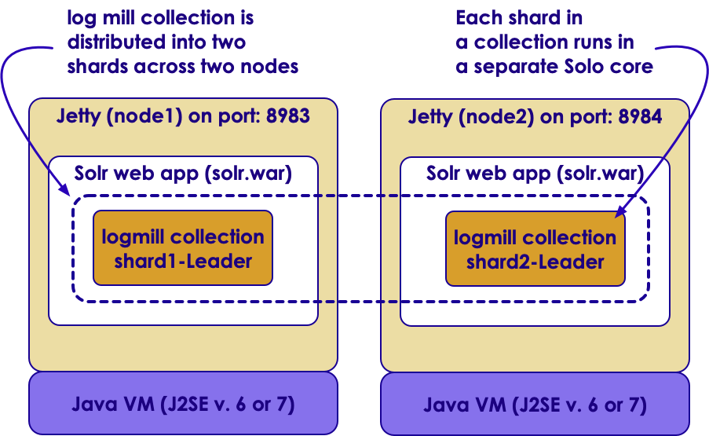

# Solr: SolrCloud
---

## Section Objectives

  * Learn what SolrCloud is
  * Be able to install and configure SolrCloud
  * Learn to manage SolrCloud configuration
  * Be able to choose the right commit strategies


Notes:


---

# Introduction to SolrCloud

---

## What is SolrCloud?

 * SolrCloud is a way to scale Solr on a *cluster*
 * Not *just* for clouds such as AWS, Azure, GCP
 * Designed to allow for distributed Data
 * Most Current (7.x) Solr installations use SolrCloud.

---

## SolrCloud major components

  * SolrCloud

    - managing a cluster of Solr servers for scalability, fault tolerance, and high availability

  * Cluster

    - a set of Solr nodes managed as a unit. They may contain many cores, collections, shards, and/or replicas

  * Node

    - JVM instance running Solr, aka Solr server

  * Collection

    - documents grouped together in a single logical index. One schema, many shards. Has a name, shard count, replication factor


Notes:


---

## SolrCloud major components, contd

  * Shard

    - a logical section of a single collection, may be spread across multiple nodes. Has a name, hash range, leader, and replication factor.

    - Hash: document => shard

  * Leader & Replica

    - Leader - the main node for each shard that routes document CRUD to other replicas in the same shard. If the current Shard Leader goes down, a new node is elected.

    - Replica – a copy of a shard or single logical index, for use in failover or load balancing.

  * Overseer

    - A single node in SolrCloud that is responsible for processing actions involving the entire cluster. Not a SPOF.


Notes:


---

# How SolrCloud works
---

## SolrCloud architecture

 <!-- {"left" : 1.05, "top" : 1.59, "height" : 5.9, "width" : 8.14} -->

Notes:


---

# Distributed Solr
---

## History

 * Before SolrCloud, Solr allowed for multiple *cores*
   - Basically an managed index
 * Multicore Solr means having multiple cores or indexes.
 * Divide and Conquer 
 * *Collections* allow us to *shard* our cores.

---

## Use cases for multiple cores

  * Multiple cores = multiple indexes and configurations

  * Data partitioning

    - New docs, old docs

    - City houses, rural houses

    - Multiple Languages: English, French, Spanish, etc.

  * One place to manage them all


Notes:


---

## Collections vs cores

  * Solr core
    - uniquely named
    - Managed
    - configured index
    - runs in a Solr server
    - Solr server can host one or more cores
    - typically used to separate documents with different schemas

  * Solr collection
    - Index that is
    - split into shards
    - distributed across multiple servers


Notes:


---

## Collection

 <!-- {"left" : 1.45, "top" : 1.58, "height" : 5.91, "width" : 7.35} -->

Notes:


---

# ZooKeeper
---

## ZooKeeper

<!-- {"left" : 7.69, "top" : 1.09, "height" : 3.46, "width" : 2.43} -->

  * Centralized service for maintaining configuration information and naming
  * Provides distributed synchronization
  * Providing group services
  * Comes from Hadoop world
  * Kinds of services used by distributed applications


Notes:


---

## ZooKeeper concepts

<!-- {"left" : 7.74, "top" : 1.19, "height" : 2.39, "width" : 2.39} -->

  * Concurrent design patterns without toil
  * Leader election (shard leader and overseer)
  * Overseer distributed work queue
  * Live Nodes
    - Ephemeral znodes used to signal a server is gone
  * Needs 3 nodes for **quorum** in production


Notes:


---

## Lab: SolrCloud install

* Overview: We will install a minimal SolrCloud, with one collection 
containing two shards
* Pre-requisites: solr-labs/install/README.md   
* Approximate time: 30 minutes
* Instructions: solr-labs/solrcloud/README.md and WIZARD.md


Notes:


---

## Collection, a.k.a Distributed Index

  * A collection is a distributed index defined by:

   - named configuration stored in ZooKeeper
   - number of shards: documents are distributed across N partitions of the index
   - document routing strategy: how documents get assigned to shards
   - replication factor: how many copies of each document in the collection

  * Collections API (example):

    - `curl "http://localhost:8983/solr/admin/collections?action=CREATE&name=logstash4solr&replicationFactor=2&numShards=2&collection.configName=logs"`


Notes:


---

# Commit strategies
---

## Commits

  * By default, commit happens at the end of indexing

```console
$ cd $SOLR_IN_ACTION/example-docs/
$ java -jar post.jar myfile

SimplePostTool: version 1.5 
SimplePostTool: POSTing files to http://localhost:8983/solr/update..
SimplePostTool: POSTing file myfile
SimplePostTool: COMMITting Solr index changes..`
```
<!-- {"left" :0, "top" : 1.69, "height" : 1.8, "width" : 10.25} -->


Notes:


---

## Commit strategies

  * Normal commit

    - Flushes all uncommitted documents and makes them ready for search

  * Soft commit

    - Since Solr4, support NRT search

  * Autocommit

    - Configurable for normal and soft commits


Notes:


---

## Normal commit

  * flushes all uncommitted documents to disk
  * refreshes an internal component called a searcher so that the newly committed documents can be searched. 
  * can be an expensive operation because it requires opening a new searcher
  * after a normal commit succeeds, the newly committed documents will survive server restarts 


Notes:


---

## Soft commit

  * A soft commit also makes documents searchable but they are not flushed to durable storage.
  * make documents searchable in near real-time 
  * skips the costly aspects of hard commits
  * you can issue a soft commit every second
  * still need to do a hard commit at some point


Notes:


---

## Auto commit

  * For hard or soft commits
  * One of the three strategies

   - Commit each document within a specified time
   - Commit all documents once a user-specified threshold of uncommitted documents is reached
   - Commit all documents on a regular time interval, such as every ten minutes


Notes:


---

## Commits in high availability

  * For high availability, you still need to have a solution for failover to another server if the disk fails

Notes:


---

# Managing Solr config files
---

## Managing Solr config files

  * Common system-administration task:

    - update the Solr configuration, such as solrconfig.xml.
	
  * Updating the configuration in SolrCloud:

    - upload your changes to ZooKeeper using Solr’s zkcli command line
    - reload the collection using the Collections API


Notes:


