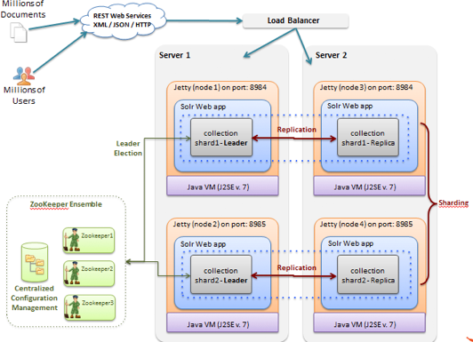
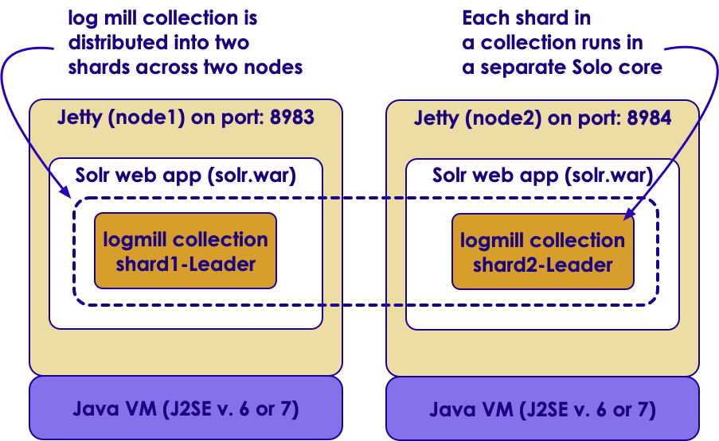

# Solr:  Expert SolrCloud
---

## Section Objectives
  *  ZooKeeper role explained
  *  Sharding and replication
  *  Rule based shard placement
  *  Cluster state explained
  *  Caches in SolrCloud
  *  Shard splitting
  *  Migrating data between collections
  *  Working with large number of collections

Notes:

---

# ZooKeeper

---

## ZooKeeper

<!-- {"left" : 7.69, "top" : 1.09, "height" : 3.46, "width" : 2.43} -->

  * Centralized service for maintaining configuration information and naming
  * Provides distributed synchronization
  * Providing group services
  * Comes from Hadoop world
  * Kinds of services used by distributed applications

Notes:

---

## ZooKeeper concepts

<!-- {"left" : 7.74, "top" : 1.19, "height" : 2.39, "width" : 2.39} -->

  * Concurrent design patterns without toil
  * Leader election (shard leader and overseer)
  * Overseer distributed work queue
  * Live Nodes
    - Ephemeral znodes used to signal a server is gone
  * Needs 3 nodes for **quorum** in production

Notes:

# Sharding And Replication

## What is Sharding?

* When a collection is too large for one node
  - Solr breaks it sections (shards)
  - stores shards on multiple computers
* A Shard is a logical partition of the collection
* Replicas are then made for each shard

Notes:

---

## Sharding Strategies

<!-- {"left" : 1.05, "top" : 2.1, "height" : 5.44, "width" : 8.16} -->

Notes:

---

## Sharding Strategies

* Which shard contains a specific document in a collection?
* Sharding strategy
  - for example, by a field, like country
  - better yet, by something more evenly balanced
  - for example, a "hash" on the uniqueKey of each document
  - and that, indeed, is the default

Notes:

---

## Advantages of Sharding

* Maximizes Indexing performance
* Enables horizontal scaling to massive content repositories
* When the document count exceeds 50 million in the repository

Notes:

---

## Sharding Implementation

* In SolrCloud there are no masters or slaves
* Instead
  - every shard consists of at least one physical replica
  - exactly one of which is a leader
* Leaders are automatically elected
  - initially on a first-come-first-served basis
  - and then based on the ZooKeeper
* If a leader goes down
  - one of the other replicas is automatically elected as the new leader

Notes:

---

## Sharding Use

* When a document is sent to a Solr node for indexing
   - the system first determines which Shard that document belongs to
     - based on sharding policy
   - determines which node is currently hosting the leader for that shard.
* The document is then forwarded to the current leader for indexing
* The leader forwards the update to all of the other replicas
* So, they are read-only for scalability and fault-tolerance

Notes:

---

## How Many Documents and Shards?

* No explicit rule but, generally one shard for every 50 million documents
* Monitor memory
* Monitor I/O
* Change shards
  - You want to support the query load
  - You want to support more concurrent users (similar)

Notes:

---

## What is SolrCloud?

 * SolrCloud is a way to scale Solr on a *cluster*
 * Not *just* for clouds such as AWS, Azure, GCP
 * Designed to allow for distributed Data
 * Most Current (7.x) Solr installations use SolrCloud.

---

## SolrCloud major components

  * SolrCloud

    - managing a cluster of Solr servers for scalability, fault tolerance, and high availability

  * Cluster

    - a set of Solr nodes managed as a unit. They may contain many cores, collections, shards, and/or replicas

  * Node

    - JVM instance running Solr, aka Solr server

  * Collection

    - documents grouped together in a single logical index. One schema, many shards. Has a name, shard count, replication factor

Notes:

---

## SolrCloud major components, contd

  * Shard

    - a logical section of a single collection, may be spread across multiple nodes. Has a name, hash range, leader, and replication factor.

    - Hash: document => shard

  * Leader & Replica

    - Leader - the main node for each shard that routes document CRUD to other replicas in the same shard. If the current Shard Leader goes down, a new node is elected.

    - Replica – a copy of a shard or single logical index, for use in failover or load balancing.

  * Overseer

    - A single node in SolrCloud that is responsible for processing actions involving the entire cluster. Not a SPOF.

Notes:

---

## SolrCloud architecture

 <!-- {"left" : 1.05, "top" : 1.59, "height" : 5.9, "width" : 8.14} -->

Notes:

---

## History

 * Before SolrCloud, Solr allowed for multiple *cores*
   - Basically an managed index
 * Multicore Solr means having multiple cores or indexes.
 * Divide and Conquer 
 * *Collections* allow us to *shard* our cores.

---

## Use cases for multiple cores

  * Multiple cores = multiple indexes and configurations

  * Data partitioning

    - New docs, old docs

    - City houses, rural houses

    - Multiple Languages: English, French, Spanish, etc.

  * One place to manage them all

Notes:

---

## Collections vs cores

  * Solr core
    - uniquely named
    - Managed
    - configured index
    - runs in a Solr server
    - Solr server can host one or more cores
    - typically used to separate documents with different schemas

  * Solr collection
    - Index that is
    - split into shards
    - distributed across multiple servers

Notes:

---

## Collection

 <!-- {"left" : 1.45, "top" : 1.58, "height" : 5.91, "width" : 7.35} -->

Notes:

---

## Collection, a.k.a Distributed Index

  * A collection is a distributed index defined by:

   - named configuration stored in ZooKeeper
   - number of shards: documents are distributed across N partitions of the index
   - document routing strategy: how documents get assigned to shards
   - replication factor: how many copies of each document in the collection

  * Collections API (example):

    - `curl "http://localhost:8983/solr/admin/collections?action=CREATE&name=logstash4solr&replicationFactor=2&numShards=2&collection.configName=logs"`

Notes:

---

