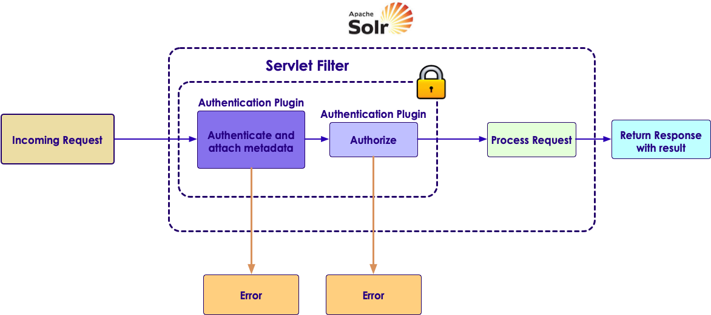
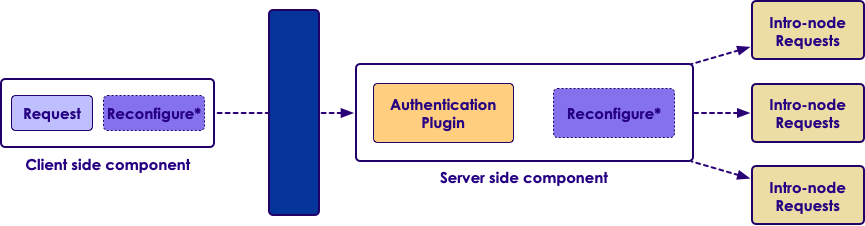
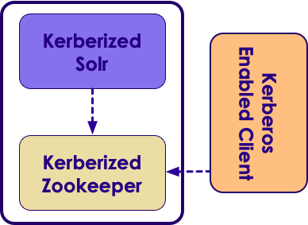

# Solr: Security
---

## Section Objectives

  * Learn the options of security in Solr
  * Be familiar with some security plugins
  * Being able to run simple basic functions

Notes:

---

# Introduction to Security


---


## Options

 * SSL support
 * ZooKeeper ACLs
 * Authentication framework
 * Authorization framework

Notes:

---

## Secutiry framework architecture

 <!-- {"left" : 0.5, "top" : 1.93, "height" : 4.12, "width" : 9.26} -->


Notes:

---
# Authentication

---


## Authentication framework

* Introduced in Solr 5.2
* Only on SolrCloud
* Two implementations: Kerberos and basic authentication

 <!-- {"left" : 0.39, "top" : 2.91, "height" : 2.48, "width" : 9.48} -->


Notes:

---

## Kerberos Authentication 

* Built on top of hadoop-auth library
* For internode communication
* Basic steps:
  - Choose service principals, client principls
`HTTP/<host>@REALM` or `zookeeper/<host>@REALM` or `user@REALM`
  - Generating keytab files for all Solr, ZK nodes
  - Starting ZK in Kerberized mode
  - Creating `security.json` file with `authc` plugin as `KerberosPlugin`
  - Creating `JAAS` config files for every Solr host, specify their path in `bin/solr.in.sh`
  - Starting Solr

Notes:

---

## Kerberos plugin
* Prerequisites:
  - Enabled by `/security.json` before starting Solr
  - Solr node must have:
    - A Kerberos service principal and key tab file 
    - Client principal and a corresponding keytab file. Can be the same as the service principal
  - Recommendations: 
    - Kerberized ZooKeeper 
  - Start Solr with the correct host-specific parameters 

 <!-- {"left" : 3.69, "top" : 4.99, "height" : 2.09, "width" : 2.87} -->


Notes:

---

## Delegation tokens
* From Solr 6.2 on
* Again built on top of hadoop-auth library
* Reduces load on KDC
* Completes Kerberos plugin
  - supports operations `RENEW`, `GET`, `CANCEL`

Nodes:

---

## Basic authentication

* From Solr 5.3 on
* Provides an API endpoint to manage user credentials
* Salted passwords stored in ZK
* Important:
  - Password in cleartext
  - `/security.json` in ZK must be write protected

Notes:

---

## Basic steps
* Setting up ZK with `security.json` with:
  - `authc` plugin as `BasicAuthPlugin`
  - A default admin username and password hash
* Starting Solr
* For adding or deleting users: `/admin/authentication`

```bash
curl --user solr:SolrRocks http://localhost:8983/solr/admin/authentication -H 
'Content-type:application/json'-d '{"set-user": {"bob" : "BobIsCool", "Tim":"TimsSecret"}}' 
```
<!-- {"left" : 0, "top" : 3.49, "height" : 0.52, "width" : 10.25} -->

Notes:

---

## Custom authentication plugin

```java
public class MyAuthcPlugin extends AuthenticationPlugin { 
  @Override 
  public void close() throws IOException {} 
  
  @Override 
  public void init(Map<String,Object> pluginConfig) {} 
  
  @Override 
  public boolean doAuthenticate(ServletRequest request, 
  ServletResponse response, FilterChain filterChain) 
     throws Exception { 
    return false; 
  } 
} 
```
<!-- {"left" : 0, "top" : 1.3, "height" : 3.9, "width" : 10.25} -->

Notes:

---
# Authorization

---

## Authorization framework

* From Solr 5.2 on
* Only on SolrCloud
* Out of box implementation:
  - `RuleBasedAuthorizationPlugin`

Notes:

---

## Rule-based Authorization plugin

* From Solr 5.2 on
* Supports both users and roles 
* Offers an API endpoint to manage users/roles 
* preconfigured permissions: 
  – security (security-read, security-edit), schema, config, core-admin, collection-admin, update, read, all 

Notes:

---

## Basics

* Add user to a role:
```bash
curl --user solr:SolrRocks 
http://localhost:8983/solr/admin/authorization -H 'Content- type:application/json' 
-d '{ "set-user-role": {"tom": ["admin","dev"}}' 
```
<!-- {"left" : 0, "top" : 1.64, "height" : 0.76, "width" : 10.25} -->

* Add permission for a role: 

```bash
curl --user solr:SolrRocks
http://localhost:8983/solr/admin/authorization -H 'Content-type:application/json' 
-d '{"set- permission" : {"name":"update", "role":"dev"}}' 
```
<!-- {"left" : 0, "top" : 3.95, "height" : 0.76, "width" : 10.25} -->

Notes:

---

## Custom authorization plugin

```java
public class MyAuthzPlugin implements AuthorizationPlugin { 
  @Override 
  public void close() throws IOException {} 
  
  @Override 
  public AuthorizationResponse authorize(AuthorizationContext context) { 
    return null; 
  } 
    
  @Override 
  public void init(Map<String,Object> initInfo) {} 
} 
```
<!-- {"left" : 0, "top" : 1.26, "height" : 2.73, "width" : 10.25} -->

Notes:

---

## Custom authorization plugin (contd)

```java
public abstract class AuthorizationContext { 
  public abstract SolrParams getParams() ; 
  public abstract Principal getUserPrincipal() ; 
  public abstract String getHttpHeader(String header); 
  public abstract Enumeration getHeaderNames(); 
  public abstract String getRemoteAddr(); 
  public abstract String getRemoteHost(); 
  public abstract List<CollectionRequest> getCollectionRequests() ; 
  public abstract RequestType getRequestType(); 
  public abstract String getResource(); 
  public abstract String getHttpMethod(); 
  public enum RequestType {READ, WRITE, ADMIN, UNKNOWN} 
  public abstract Object getHandler(); 
  } 
```

Notes:

---

# SSL

---

## Basic steps
* From Solr 4.2 for standalone and Solr 4.7 for cloud
* Basic steps:
  - Generate/obtain a certificate 
  – Convert to PEM format using OpenSSL tools 
  – Add the passwords, paths to keystore file to `bin/solr.in.sh` 
  – Set a cluster property “urlScheme” to https in ZK 
  – Start Solr 
* Might need “haveged” on Vms 
* ZooKeeper does not support SSL 
 
Notes:

---

## Self-signed certificate

* By JDK `keytool`
* Run the command Below in the `/server/etc`

```bash
keytool -genkeypair -alias solr-ssl -keyalg RSA -keysize 2048 -keypass 
secret -storepass secret -validity 9999 -keystore solr-ssl.keystore.jks
-ext SAN=DNS:localhost,IP:192.168.1.3,IP:127.0.0.1 -dname "CN=localhost, 
OU=Organizational Unit, O=Organization, L=Location, ST=State, C=Country"
```
<!-- {"left" : 0, "top" : 2, "height" : 1.06, "width" : 10.25} -->

Notes:

---

## Convert certificate and key to PEM format for use with cURL

* JKS keystore into PKCS12 format

```bash
keytool -importkeystore -srckeystore solr-ssl.keystore.jks -destkeystore 
solr-ssl.keystore.p12 -srcstoretype jks -deststoretype pkcs12
```
<!-- {"left" : 0, "top" : 1.67, "height" : 0.64, "width" : 10.25} -->

* PKCS12 to PEM

```bash
openssl pkcs12 -in solr-ssl.keystore.p12 -out solr-ssl.pem
```
<!-- {"left" : 0, "top" : 3.49, "height" : 0.53, "width" : 10.25} -->

## Setting common SSL-related properties

* `bin/solr.in.sh` example `SOLR_SSL_*` config

```bash
SOLR_SSL_KEY_STORE=etc/solr-ssl.keystore.jks
SOLR_SSL_KEY_STORE_PASSWORD=secret
SOLR_SSL_TRUST_STORE=etc/solr-ssl.keystore.jks
SOLR_SSL_TRUST_STORE_PASSWORD=secret
# Require clients to authenticate
SOLR_SSL_NEED_CLIENT_AUTH=false
# Enable clients to authenticate (but not require)
SOLR_SSL_WANT_CLIENT_AUTH=false
# Define Key Store type if necessary
SOLR_SSL_KEY_STORE_TYPE=JKS
SOLR_SSL_TRUST_STORE_TYPE=JKS
```
<!-- {"left" : 0, "top" : 1.6, "height" : 3.56, "width" : 10.25} -->

Notes:

---

## Single node solr using SSL

* By default clients wont be required to authenticate

```bash
bin/solr -p 8984
```
<!-- {"left" : 0, "top" : 1.56, "height" : 0.64, "width" : 4.07} -->

Notes:

---

# Other security options

---

## Storage level security

* Index encryption 
* HDFS security

```bash
  - Basics:
    - bin/solr start -c -Dsolr.directoryFactory=HdfsDirectoryFactory 
      - Dsolr.lock.type=hdfs 
      - Dsolr.hdfs.home=hdfs://host:port/path
```
<!-- {"left" : 0, "top" : 2.19, "height" : 1.11, "width" : 10.25} -->

Notes:

---

## Zookeeper ACL

* Protects snodes created by Solr
* Permissions:
  - create, read, write, delete, admin
* Out of the box implementation
  - `VMParamsAllAndReadonlyDigestZkACLProvider`
    - Read only user
    - User with full access

Notes:

---


