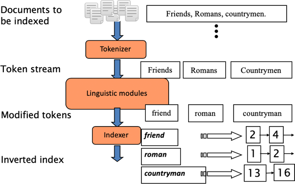

# Tokenization
---

## Basic Indexing Pipeline

 * Recall our Processing Pipeline

  <!-- {"left" : 0.7, "top" : 2, "height" : 5.66, "width" : 8.85} -->

Notes:

---

## Processing a Document

 * What format is it in?
 * pdf/word/excel/html?
 * What language is it in?
 * What character set is in use?
   - (CP1252, UTF-8, …)
 * All these problems can be done either:
   - Rule-Based
   - Machine Learning
 
---

## Format and Language

 * Documents being indexed can include docs from many different languages
 * A single index may contain terms from many languages.
 * Sometimes a document or its components can contain multiple languages/formats
 * French email with a German pdf attachment.
 * French email quote clauses from an English-language contract

 Notes:

 There are special packages that can do this
 Requires some design Decisions

---

## What is a document

 * What do we want to consider a "document"
   - A file?
   - Email?
   - Post
   - Tweet

---

## Tokenization

  * Input: `Friends, Romans and Countrymen`
  * Output:
    - Friends
    - Romans
    - Countrymen
  * A *token* is an instance of a sequence of characters
  * Each token will maybe be an index entry
    - After *further processing*
  * What tokens do we want to emit?

---

## Tokenization Issues:
  * `Ireland's capital`:
    - `Ireland' and `'s'?
    - `Irelands` ?
    - `Ireland's` ?
  * `Hewlett-Packard`:
    - `Hewlett` and `Packard` as two tokens or one?
    - `co-working`?
    - `lowercase`, `lower-case`, or `lower case`?
  * `San Francisco`:
    - One token or two?
    - How to decide?

---

## Numbers:

  * Datetimes  `02-01-2019`
  * `The B-52s`
  * `Call me 408-324-2343`
    - May have embedded spaces or dashes
  * To index or not to index?
    - What about searching for error codes, for example
  * Metadata is usually separate
    - Creation Date
---

## Language Issues

 * `L'ensemble`: One Towken or Two?
    - `L`, `L'`,`Le`, '`Le `?  
    - Should `L`ensemble` match with `un emsemble`?
      - On Google it did *not* until 2003
 * German noun combos:
   - "Lebensversicherungsgesellschaftsangestellter"
   = "Life Insurance Company Employee"
   - Should this be a single token?
   - German is usually noun-split into root stems.

---

## Spacing in CJK Languages

 * In some languages spacing is inconsistent or not present.
 * Example in Chinese:
   - "莎拉波娃现在居住在美国东南部的佛罗里达。"
   - No spaces!
 * Japanese: Multiple Alphabets:
   - "フォーチュン500社は情報不足のため時間あた$500K(約6,000万円)"
   - Katakana / Hiaragana / Kanji, and Romanji!
   - But query might be entirely in Hiragana!

---

## RTL Languages

 * Some Languages are stored RTL (Right to Left)
   - Hebrew, Arabic, Persian.
 * But, not always
   - Numbers are stored LTR
   - Foreign words (English) are written LTR.
 
---

## Stop Words

 * With a stop list, you exclude from the dictionary entirely the commonest words. Intuition:
    - They have little semantic content: the, a, and, to, be
    - There are a lot of them: ~30% of postings for top 30 words
 * But the trend is away from doing this:
    - Good compression techniques (IIR 5) means the space for including stop words in a system is very small
    - Good query optimization techniques (IIR 7) mean you pay little at query time for including stop words.
 * You need them for:
    - Phrase queries: “King of Denmark”
    - Various song titles, etc.: “Let it be”, “To be or not to be”
    - “Relational” queries: “flights to London”

Notes:
Nevertheless: “Google ignores common words and characters such as where, the, how, and other digits and letters which slow down your search without improving the results.” (Though you can explicitly ask for them to remain.)

---

## Normalization to Terms

 * We may need to “normalize” words in indexed text as well as query words into the same form
   - We want to match U.S.A. and USA

 * Result is terms: a term is a (normalized) word type, which is an entry in our IR system dictionary
 * We most commonly implicitly define equivalence classes of terms by, e.g., 
   - deleting periods to form a term
     - U.S.A., USA  ->  USA
   - deleting hyphens to form a term
     - anti-discriminatory, antidiscriminatory ->  antidiscriminatory

Notes:

---

## Normalization: other languages

 * Accents: e.g., French résumé vs. resume.
 * Umlauts: e.g., German: Tuebingen vs. Tübingen
   - Should be equivalent
 * How are your users like to write their queries for these words?
 * Even in languages that standardly have accents, users often may not type them
    - Often best to normalize to a de-accented term
    -Tuebingen, Tübingen, Tubingen -> Tubingen
