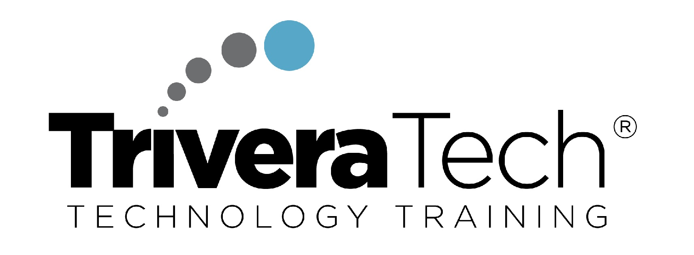
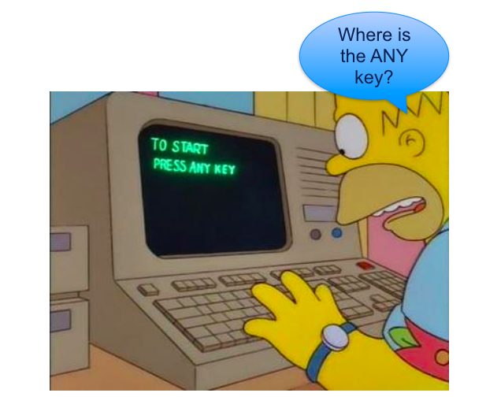
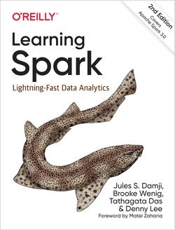
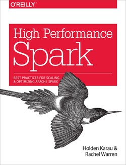

# Working With Apache Spark3

 <!-- {"left": 3.88, "top": 7.9, "height": 1.81, "width": 3.41} --> &nbsp;  &nbsp; 
 <!-- {"left": 8.58, "top": 7.82, "height": 1.99, "width": 5.41} --> 

---

## Instructor Introduction

* Instructor, please introduce yourself

* Talk about your background and your experience in the subject

---

## About This Class

<!-- {"left": 13.58, "top": 2.14, "height": 1.79, "width": 3.36} --> 

* Objectives:
    - Learn about Big Data and Spark ecosystem
    - Learn features of Spark
    - Get hands-on experience using Spark

* A **practical approach to Apache Spark**

* Skill level: **Intro to intermediate**

* Format: **50% lectures + 50% labs**

* This is a **very hands-on** class

* Work on **latest version of Spark (v3)**

Notes:

---

## Prerequisites & Expectations

* Intended audience:  
    - Data Developers, Data Scientists, Data Analysts

* Familiar with either Scala or Python language

* Basic knowledge of Linux

* This is an **intro-intermediate** level class.  No previous knowledge of Spark is assumed

Notes:

---

## Agenda (2 Days)

* **Day 1**
    - Spark intro
    - Spark Core
    - Caching

* **Day 2**
    - Dataframes
    - Spark SQL
    - Spark API

---

## Learn By Doing
 <!-- {"left": 1.05, "top": 2.98, "height": 6.95, "width": 8.62} -->  &nbsp;
 <!-- {"left": 9.18, "top": 4.52, "height": 5.18, "width": 6.34} -->

Notes:

* By the end of the class...

---

## Class Introductions

* Run a quick background survey if applicable, and go over the responses

* Students please introduce yourselfs (time permitting)
    - Your Name
    - Your background (developer, admin, manager, etc.)
    - Technologies you are familiar with
    - Familiarity with Machine Learning   
    (scale of 1 - 4 ;  1 - new, 2 - know some concepts,  3 - too a course, 4 -  using it at work)
    - Something non-technical about you!  
    (favorite ice cream flavor / hobby...etc)

 &nbsp; <!-- {"left": 2.65, "top": 8.0, "height": 3.0, "width": 3.4} --> &nbsp; <!-- {"left": 6.08, "top": 8.1, "height": 2.9, "width": 5.34} --> &nbsp; <!-- {"left": 11.46, "top": 8.0, "height": 3.0, "width": 3.4} -->

Notes:

---

## Recommended Resources

* Books:
    - [Learning Spark, 2nd Edition](https://learning.oreilly.com/library/view/learning-spark-2nd/9781492050032/) - Good overall introduction
    - [High performance Spark](https://learning.oreilly.com/library/view/high-performance-spark/9781491943199/) - Optimize and tune Spark
    - [The Internals Of Apache Spark Online Book](https://jaceklaskowski.gitbooks.io/mastering-apache-spark/content/) - updated frequently

* Online
    - [spark.apache.org](https://spark.apache.org/) - latest downolads, documentation and examples
    - [Spark by examples](https://sparkbyexamples.com/) - great resources for code snippets
    - [Official Spark Examples Repository](https://github.com/apache/spark/tree/master/examples) - latetest and official

<!-- {"left": 5.7, "top": 7, "height": 3.71, "width": 2.83} --> &nbsp;
 <!-- {"left": 8.98, "top": 7, "height": 3.71, "width": 2.83} -->

Notes:

---

## Class Logistics

* Instructor's contact

* Slides
    - For each session, slides will be emailed out or delivered via virtual classroom

* Labs
    - Lab files will be distributed

* Lab environment

---

## Let's Get Started!

