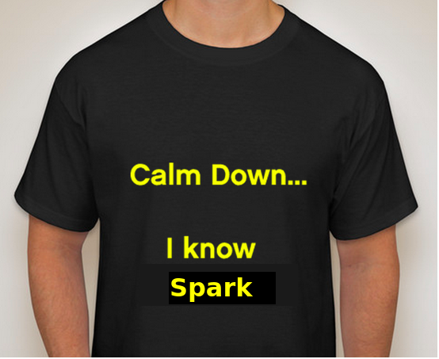

# Working With Apache Spark3

 &nbsp;  &nbsp;<!-- {"left" : 3.33, "top" : 6.2, "height" : 2.33, "width" : 2.33} -->

 <!-- {"left" : 3.33, "top" : 6.2, "height" : 2.33, "width" : 2.33} -->

---

## Instructor Introduction

* Instructor, please introduce yourself

* Talk about your background and your experience in the subject

---

## About This Class

 &nbsp;  &nbsp;<!-- {"left" : 3.33, "top" : 6.2, "height" : 2.33, "width" : 2.33} -->

* Objectives:
    - Learn about Big Data and Spark ecosystem
    - Learn features of Spark
    - Get hands-on experience using Spark

* A **practical approach to Apache Spark**

* Skill level: **Intro to intermediate**

* Format: **50% lectures + 50% labs**

* This is a **very hands-on** class

* Work on **latest version of Spark (v3)**

Notes:

---

## Prerequisites & Expectations

* Intended audience:  
    - Data Developers, Data Scientists, Data Analysts

* Familiar with either Scala or Python language

* Basic knowledge of Linux

* This is an **intro-intermediate** level class.  No previous knowledge of Spark is assumed

Notes:

---

## Agenda (2 Days)

* **Day 1**
    - Spark intro
    - Spark Core
    - Caching

* **Day 2**
    - Dataframes
    - Spark SQL
    - Spark API

---

## Learn By Doing

 <!-- {"left" : 1.15, "top" : 1.32, "height" : 6.42, "width" : 7.96} -->
 <!-- {"left" : 1.69, "top" : 2, "height" : 5.65, "width" : 6.88} -->

Notes:

* By the end of the class...

---

## Class Introductions

* Run a quick background survey if applicable, and go over the responses

* Students please introduce yourselfs (time permitting)
    - Your Name
    - Your background (developer, admin, manager, etc.)
    - Technologies you are familiar with
    - Familiarity with Machine Learning   
    (scale of 1 - 4 ;  1 - new, 2 - know some concepts,  3 - too a course, 4 -  using it at work)
    - Something non-technical about you!  
    (favorite ice cream flavor / hobby...etc)

 &nbsp; <!-- {"left" : 1.55, "top" : 6.43, "height" : 1.76, "width" : 1.99} --> &nbsp; <!-- {"left" : 3.56, "top" : 6.45, "height" : 1.7, "width" : 3.13} --> &nbsp; <!-- {"left" : 6.71, "top" : 6.43, "height" : 1.76, "width" : 1.99} -->

Notes:

---

## Recommended Resources

* Books:
    - [Learning Spark, 2nd Edition](https://learning.oreilly.com/library/view/learning-spark-2nd/9781492050032/) - Good overall introduction
    - [High performance Spark](https://learning.oreilly.com/library/view/high-performance-spark/9781491943199/) - Optimize and tune Spark
    - [The Internals Of Apache Spark Online Book](https://jaceklaskowski.gitbooks.io/mastering-apache-spark/content/) - updated frequently

* Online
    - [spark.apache.org](https://spark.apache.org/) - latest downolads, documentation and examples
    - [Spark by examples](https://sparkbyexamples.com/) - great resources for code snippets
    - [Official Spark Examples Repository](https://github.com/apache/spark/tree/master/examples) - latetest and official

 &nbsp; <!-- {"left" : 1.55, "top" : 6.43, "height" : 1.76, "width" : 1.99} -->
 &nbsp; <!-- {"left" : 3.56, "top" : 6.45, "height" : 1.7, "width" : 3.13} -->

Notes:

---

## Class Logistics

* Instructor's contact

* Slides
    - For each session, slides will be emailed out or delivered via virtual classroom

* Labs
    - Lab files will be distributed

* Lab environment

---

## Let's Get Started!

