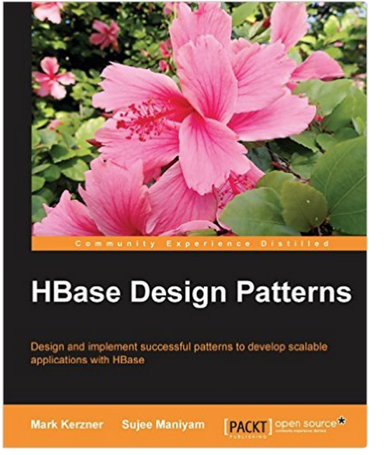

# Spark Workshop

 <!-- {"left": 4.08, "top": 7.9, "height": 1.81, "width": 3.41} --> &nbsp;  &nbsp; 
 <!-- {"left": 8.64, "top": 8.11, "height": 1.6, "width": 4.78} -->

---

## Hi, I am Sujee Maniyam

<!-- {"left": 14.37, "top": 1.89, "height": 2.48, "width": 2.99} -->
<!-- {"left": 15.04, "top": 4.64, "height": 2.84, "width": 2.41} -->

* Founder / Principal @ [ElephantScale](http://elephantscale.com)
* Consult & teach **AI, Data Science, Big Data, Cloud and Devops** technologies
* History:
    - 1993: A/L @ Jaffna Hindu College, Jaffna
    - 1995 - 1999 : Computer Engineering @ University of Melbourne, Australia
    - 2000+: Silicon Valley, California USA
* Author
    - [__'Hadoop illuminated'__](http://hadoopilluminated.com/):  open source book
    - [__'HBase Design Patterns'__](https://www.packtpub.com/big-data-and-business-intelligence/hbase-design-patterns): Packt Publishing, 2015
    - [__'Data Analytics With Spark And Hadoop'__](http://shop.oreilly.com/product/0636920052616.do):  O'Reilly video course
* Open source contributor : [github.com/sujee](https://github.com/sujee)
* Contact:
    - [https://www.linkedin.com/in/sujeemaniyam](https://www.linkedin.com/in/sujeemaniyam)
    - sujee@elephantscale.com

---

## About This Class

<!-- {"left": 13.58, "top": 2.14, "height": 1.79, "width": 3.36} --> 

* Objectives:
    - Learn about Big Data and Spark ecosystem
    - Learn features of Spark
    - Get hands-on experience using Spark

* A **practical approach to Apache Spark**

* Skill level: **Intro to intermediate**

* Format: **50% lectures + 50% labs**

* This is a **very hands-on** class

* Work on **latest version of Spark (v3)**

Notes:

---

## Prerequisites & Expectations

* Intended audience:  
    - Data Developers, Data Scientists, Data Analysts

* Familiar with Python language

* Basic knowledge of Linux

* This is an **intro-intermediate** level class.  No previous knowledge of Spark is assumed

Notes:

---

## Recommended Resources

* Books:
    - [Learning Spark, 2nd Edition](https://learning.oreilly.com/library/view/learning-spark-2nd/9781492050032/) - Good overall introduction
    - [High performance Spark](https://learning.oreilly.com/library/view/high-performance-spark/9781491943199/) - Optimize and tune Spark
    - [The Internals Of Apache Spark Online Book](https://jaceklaskowski.gitbooks.io/mastering-apache-spark/content/) - updated frequently

* Online
    - [spark.apache.org](https://spark.apache.org/) - latest downolads, documentation and examples
    - [Spark by examples](https://sparkbyexamples.com/) - great resources for code snippets
    - [Official Spark Examples Repository](https://github.com/apache/spark/tree/master/examples) - latetest and official

<!-- {"left": 5.7, "top": 7, "height": 3.71, "width": 2.83} --> &nbsp;
 <!-- {"left": 8.98, "top": 7, "height": 3.71, "width": 2.83} -->

Notes:

---

## Class Logistics

* Instructor's contact

* Slides

* Labs: https://github.com/elephantscale/spark-workshop

---

## Let's Get Started!

 <!-- {"left": 4.51, "top": 2.87, "height": 7.97, "width": 8.47} --> 