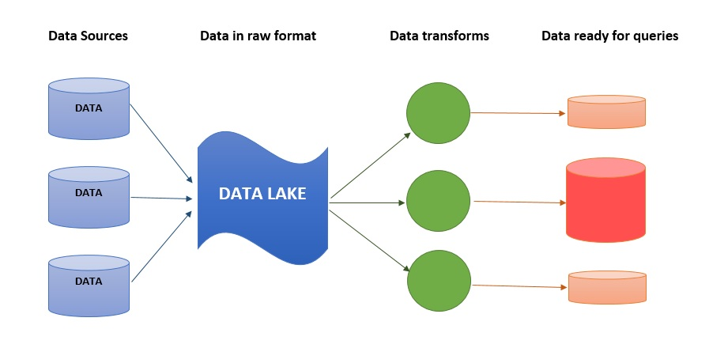
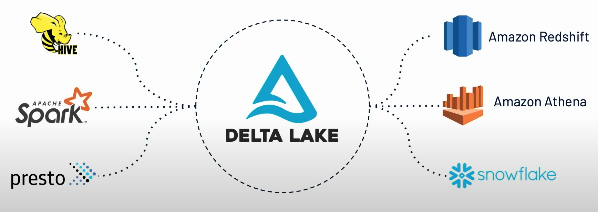

# Delta Lake

 

---

## Data Lakes Evolution

* Data Lakes have emerged as critical part of enterprises
   - 'Where all data comes to rest'
* Cheap
   - Compared to legacy databases, data lakes cost a fraction
* Durable
   - Most data lakes offer 7 - 10 nines (99.99999999) of durability
   - 7 nines means 3 second downtime per year! ([Reference](https://en.wikipedia.org/wiki/High_availability))
* Can store all kinds of data
   - Structured (csv, json) and unstructured (video, pictures, binary) data



---

## Challenges with Data Lakes

* Hard to update data
   - Appends lead to incorrect reads
   - Leads to GDPR compliance issues (can not selective delete data)

* Failed jobs can leave data in inconsistent state (A crashed job can leave temporary data behind)

* Combining real time operations (streaming) and batch analytics is not easy

* Keeping historical data for compliance purposes can get expensive.  
   - Keeping multiple copies at Petabyte scale can get expensive

* Difficult to handle large metadata
   - When data grows to Petabyte scale, metadata can become very large too (Terabytes of metadata)

---

## Challenges With Data Lakes

* Too many files
   - As data keeps accumulating, number of files increase over time, and performance decreases
   - The problem is exacerbated when there are too many small files

* Not high performant
   - Querying growing dataset takes longer and longer
   - Partitioning can help, but it is a rigid scheme and not very flexible

* Data quality issues
   - Schema changing overtime can introduce incompatibilities

---

## Delta Lake

* An **opinionated approach** to building Data Lakes

* Brings best of data warehousing and data lakes

* Open source and open format (parquet)

---

## Delta Lake Implementation

* **Every operation is transactional**

* **Fully atomic** - Either fully succeeds or fully aborted

* This fixes the following problems we observed on Data Lakes:
   - Hard to append data
   - Modification of data is difficult
   - Jobs failing midway, leaving debris

---

## Delta Lake Implementation

* All transactions are logged in a journal called **delta log**

* Here is an example, all transactions are sequenced in the order

```text
/path/to/table/_delta_log
   - 0000.json
   - 0001.json
   - ...
   - 0010.json

```

* Since all operations are transactional, now we can go back and retrieve past data easily --> **Time travel**

```sql
SELECT * FROM events
TIMESTAMP AS OF ...

SELECT * FROM events
VERSION AS OF ...
```

* This solves the problem of
   - Keeping historical data efficiently

---

## Delta Lake Implementation

* Problem: _Handling large amount of metadata (100s GB or even into TB!)_

* But Spark is already good at handling large data !

* All Delta Lake metadata is stored alongside with actual data
   - No need to keep a separate catalog!
   - And data and metadata are always in sync

* Stored in open Parquet format

* Parts of the metadata is cached and optimized for fast access

---

## Delta Lake Implementation

* Delta Lake automatically **orders and indexes** data

* Partitioning is done automatically based on data schema  (e.g timestamp)

* As the data is indexed, basic statistics like MIN, MAX are computed automatically
   - So a query like  
   `SELECT MAX(col1) from TABLE1`  
   can return results very very fast, without doing a whole table scan

* __Z-Ordering__ indexing can optimize layout across multiple columns (e.g year, month and date)

* This solves these problems:
   - Too many files
   - Poor performance

---

## Delta Lake Implementation

* All data in Delta Lake **must conform to a strict schema (star etc)**

* Schema is verified when adding/updating data

* Can **set expectations** for a table
   - Table will satisfy all expectations of the table at all times

* For example, here we can make sure `timestamp` and `source` columns are not null

```sql
CREATE TABLE events (
   timestamp  TIMESTAMP NOT NULL,
   source STRING NOT NULL,
   ...
)
```

* This solves the following problem:
   - Data quality issues

---

## Delta Lake Implementation Recap

* Delta Lake solves the common problems in Data Lakes by using the following...

* __ACID transactions__ - all or nothing updates/inserts

* __Spark under the hood__ - to handle large metadata

* __Indexing__ - Optimal data layout for efficient querying

* __Schema validation and expectations__ - to keep data quality

---

## Delta Lake Connectors

* Delta Lakes can be created on the following systems



* [Image source](https://youtu.be/OLJKIogf2nU)

---

## Creating Delta Lakes

* Creating tables is easy - just replace `USING parquet`  to <mark>`USING delta`</mark>

```sql

-- regular parquet table
CREATE TABLE 
...
USING parquet

-- Delta table
CREATE TABLE 
...
USING delta
```

* Migration is easy too

```sql
CONVERT TO DELTA table_name
```

---

## Delta Engine (Photon)

* Highly optimized query engine for Data Lake

* See [this video](https://youtu.be/OLJKIogf2nU) (from 53 minute mark) for an overview of Delta Engine

* Available on Databricks platforms (not open source)


