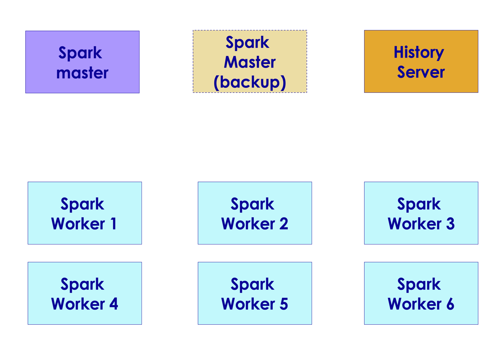
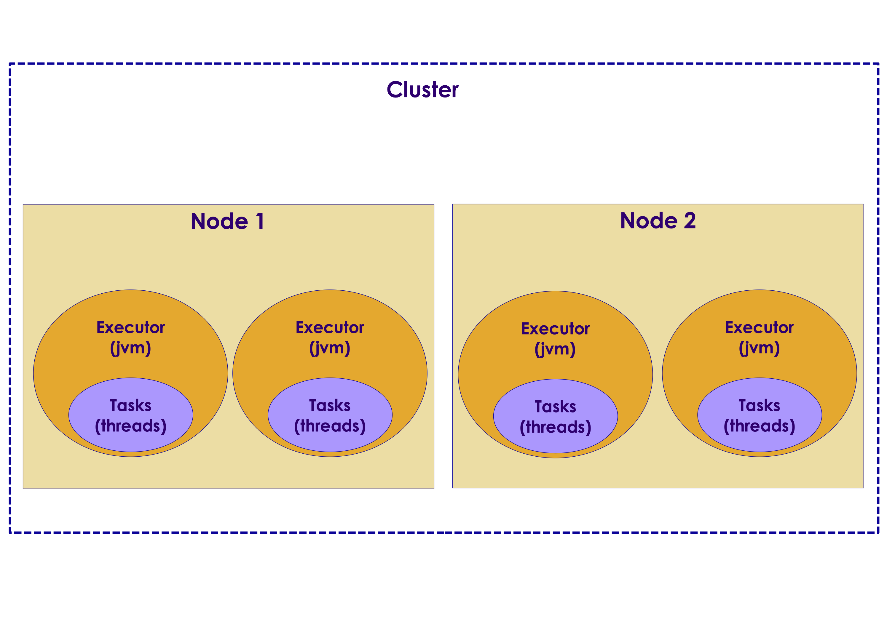
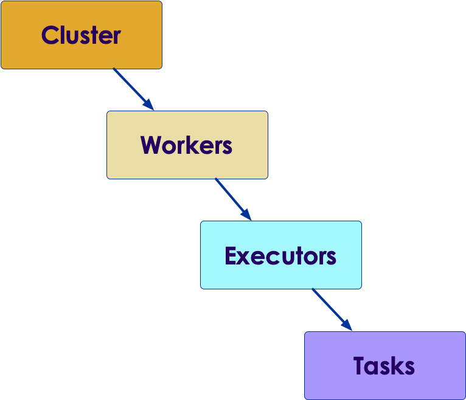

# Spark API

  <!-- {"left" : 2.75, "top" : 6.35, "height" : 1.26, "width" : 2.38} -->

---

## Objectives

* Learn Spark API
* Build and deploy Spark applications

---

# Spark API

---

## Spark API

* So far, we have been using Spark Shell

* Shell is great for
    * Ad-hoc/interactive
    * Developing apps / debugging

* Once code is ready, you generally code an application

* Can be in Scala, Python, or Java

Notes:

---

# Spark Applications

---

## Spark Runtime Components

<!-- {"left" : 6.76, "top" : 0.88, "height" : 4.37, "width" : 3.28} -->

* **Master**
    - Monitors the cluster, if a worker dies, it reassigns the task to another worker
    - In production, there would be a backup master

* **Worker**
    - Does the 'heavy lifting'

* **History Server**
    - Collects metrics from Spark servers
    - Stores them for later replay

---

## Spark Application Architecture


<!-- {"left" : 6.76, "top" : 0.88, "height" : 4.37, "width" : 3.28} -->

---

## Spark Applications : Driver

<!-- {"left" : 6.76, "top" : 0.88, "height" : 4.37, "width" : 3.28} -->

* The main method of an application
* It's where the SparkSession is created
* Establishes the connection to the cluster
* Creates a DAG (Direct Acyclic Graph) of operations
* Connects to cluster manager to allocate resources
* Acquires executors on worker nodes
* Sends app code to executors
* Sends tasks for executors to run
* Receives updates from workers (e.g.  count / collect / show ...etc)
* Driver should be close to the worker nodes
* Its location is independent of Master/Slave
* Must be in a network addressable by Workers
* Preferably on the same LAN

---

## Workers / Executors / Tasks

<!-- {"left" : 6.76, "top" : 0.88, "height" : 4.37, "width" : 3.28} -->
<!-- {"left" : 6.76, "top" : 0.88, "height" : 4.37, "width" : 3.28} -->

* **Executors**
    - Executors are **JVMs**
    - Processes that run computations and store data
    - Each app gets its own executors
    - Launched at application startup, run for duration of the app
    - Execute tasks (in threads)
    - Provide memory for data + code

* **Tasks**
    - Runs as **threads** within executor JVM
    - "Smallest" execution units
    - Process data in partitions
    - Takes into account "data locality"

---

## Spark Vs. Map Reduce

* Spark is much faster than Map Reduce
    - On disk data : 2x - 10x faster 
    - In memory data : 100x faster !
* Spark has a different execution model than MR
* In MapReduce
    - Each job is run within its own ‘container’  (JVM)
    - Once the job is done, container is terminated
    - For another job, new containers get started, and run the new tasks.
    - This is expensive (starting a new JVM for each job)
* Spark
    - Containers (called ‘executors’) are ‘long lived’ (aka not terminated between jobs) (even when not running tasks)
    - New task startup is very fast (no warm up!)
    - Task switching is very fast too.
    - Map Reduce is considering this approach too (LLAP : Long Live and Process ("Long Live and Prosper"))

---

## Process Management in MapReduce

<!-- {"left" : 6.76, "top" : 0.88, "height" : 4.37, "width" : 3.28} -->

---

## Process Management in Spark

<!-- {"left" : 6.76, "top" : 0.88, "height" : 4.37, "width" : 3.28} -->

---

## Driver Memory vs. Executor Memory

* Driver memory is generally small
* Executor memory is where data is cached–can be big
* `data.collect()` will send data to driver
* Large collections will cause out-of-memory error in driver
* Find a different way!

<!-- {"left" : 6.76, "top" : 0.88, "height" : 4.37, "width" : 3.28} -->

---

# Spark and YARN

---

## Spark and YARN

* Use YARN to deploy Spark on Hadoop cluster

* YARN provides process prioritization / isolation ..etc.

* Failure tolerant - if container crashes, YARN will restart it

* 2 Modes of deployment
    - **YARN-client** :
        - Suited for interactive applications (spark-shell)
        - Development / debugging
    - **YARN-cluster**
        - Production runs
        - Not meant for ’interactive’ applications

---

## Spark in YARN Client Mode

<!-- {"left" : 6.76, "top" : 0.88, "height" : 4.37, "width" : 3.28} -->

---

## Spark in YARN Cluster Mode

<!-- {"left" : 6.76, "top" : 0.88, "height" : 4.37, "width" : 3.28} -->

---

## Running Spark on YARN

* Client mode  (`--deploy-mode client`)

```bash
$   spark-submit --class org.apache.spark.examples.SparkPi   \
        --master yarn --deploy-mode client   \
        SPARK_HOME/lib/spark-examples.jar 10
```

* Cluster mode   (`--deploy-mode cluster`)

```bash
$   spark-submit --class org.apache.spark.examples.SparkPi   \
        --master yarn --deploy-mode cluster   \
        SPARK_HOME/lib/spark-examples.jar 10
```

---

## YARN Modes Summary

|                                                    | Standalone                          | YARN client                                       | YARN cluster                                      |
|----------------------------------------------------|-------------------------------------|---------------------------------------------------|---------------------------------------------------|
| Drivers runs in                                    | Client                              | Client                                            | App Master                                        |
| Who requests resources                             | Client                              | App Master                                        | App Master                                        |
| Who starts executor process                        | Spark Slave                         | YARN Node Manager                                 | YARN Node Manager                                 |
| Persistent services                                | - Spark master <br> - Spark workers | - YARN Resource Manager <br> - YARN Node Managers | - YARN Resource Manager <br> - YARN Node Managers |
| Supports interactive applications like Spark-shell | Yes                                 | Yes                                               | No                                                |

---

## Spark and HDFS

* When Spark is processing data in HDFS, it will use 'location hints' provided by HDFS

* Spark strives to process local data as much as possible
    - This is called **data local processing**

* Processing local data can yield very high IO throughput
    - This is a key factor in Hadoop + Spark working well together

```scala
val logs = spark.read.text("hdfs://namenode:9000/data/*.log")
val logs = spark.read.text("/data/*.log")
logs.count

```

<!-- {"left" : 0.58, "top" : 1.83, "height" : 5.41, "width" : 9.08} -->

---

# Spark API - Scala

---

## Skeleton Spark App (Scala)

* Simple App

```scala
import org.apache.spark.sql.SparkSession

object TestApp{
  def main(args: Array[String]) {
		val spark = SparkSession.builder().
								appName("Test").
						        getOrCreate()

		val f = spark.read.text("data.txt")
		println (“# lines: “ + f.count)

	  spark.stop()
	}
}

```

* Builder pattern

```scala

val spark  = SparkSession.builder.getOrCreate()

val spark  = SparkSession.builder.x().y().z().getOrCreate()

```

---

## Spark Configuration Properties

* Spark properties

```scala
// set the app name
SparkSession.builder.appName("TestApp")

// setting master urls
// local - single thread
SparkSession.builder.master("local")

// local - 4 threads on 4 cpu cores
SparkSession.builder.master("local[4]")

// local use all cpu cores
SparkSession.builder.master("local[*]")

// remote master - spark
SparkSession.builder.master("spark://master_node:7077")

// remote master - yarn
SparkSession.builder.master("yarn")

```

* Other properties

```scala
SparkSession.builder.config("db.host", "host1")

```

---

## Setting Config Properties

* We can set config parameters at launch using `--conf` parameter

```bash
$   spark-submit ... \
         --conf key1=value1 \
         --conf  key2=value2 \
         ...
```

* spark-submit will also read configuration options in the file `spark/conf/spark-defaults.conf`
    - In standard key=value properties file format

* Precedence order (highest to lowest):
    1. Properties set directly on SparkSession
    2. props passed to spark-submit
    3. spark-defaults.conf

---

## SparkSession

* Once a `SparkSession` is created, we can use the following methods

```python

# create a session
spark = SparkSession.builder.getOrCreate()

# read a file
data = spark.read.csv('data.csv')

# run a sql query
spark.sql("select * from t1")

# Only one active SparkSession per JVM
# stop() the active one before creating a new one
spark.stop()
```

---

## Tools for Coding and Building

* Editors and IDEs
    - IntelliJ: Excellent Scala support, fast/incremental compile
    - Scala IDE: Eclipse-based Scala IDE
    - Sublime: Sophisticated text editor–full Scala support
    - VSCode: Modern editor with lots of plugins

* Python build: nothing extra

* Scala build:  sbt: Simple Building Tool (http://www.scala-sbt.org/)

* Java - maven: Just need the Spark dependencies–for example:

```xml
<dependency>
  <groupId>org.apache.spark</groupId>
  <artifactId>spark-core_3.0</artifactId>
  <version>3.1.0</version>
</dependency>
```

---

## Spark Scala Project Layout


<!-- {"left" : 0.58, "top" : 1.83, "height" : 5.41, "width" : 9.08} -->

---

## Build.sbt

```scala
name:= "TestApp"

version:= "1.0"

scalaVersion:= "2.12"

// ++= means concatenate sequence of dependencies
// %% means append Scala version to next part
libraryDependencies ++= Seq(
  "org.apache.spark" % "spark-core" % "3.0.0” % “provided"
)

// need this to access files on S3 or HDFS
// += means just append the dependency
libraryDependencies += "org.apache.hadoop" % "hadoop-client" % "3.0.0" exclude("com.google.guava", "guava")


```

---

## Building

* `build.sbt` is in project root dir

* SBT will download dependencies automatically

```bash

# build
$   sbt compile

# package
$   sbt package

# assembly to build a fat jar
$   sbt assembly

# clean
$   sbt clean

# clean and package
$   sbt clean package

```

---

## Submit  Application

* Submiting a sample app

```bash
$   spark-submit --master spark://localhost:7077 \ 
         --executor-memory 4G  \
         --class  x.ProcessFiles target/scala-2.11/testapp.jar  \
         1G.data
```

* Submission syntax

```bash
$ spark-submit \
  --master <master-url> \
  --executor-memory 4g \
  --conf <key>=<value> \
  --class <main-class> \
  <application-jar> \
  [application-arguments]

```

---

## Monitor Using Spark UI (4040+)

* Each Spark application will get their own UI, starting at port 4040

<!-- {"left" : 0.58, "top" : 1.83, "height" : 5.41, "width" : 9.08} -->

---

## Scala - Lean/Fat Jars, Conflicts

* **`sbt package`** produces lean jar
    - Just our application code only
    - Good for apps with no dependencies

* **`sbt assembly`** will produce a fat jar
    - Pulls in all dependencies
    - Good if we have dependencies using custom versions

* Conflict Problem
    - System comes with V1.0 of package X, my app needs V 2.0
    - One solution: Produce a fat jar with the required dependency
    - See next slide for sbt example

---

## Scala - sbt Assembly Example

```scala
import AssemblyKeys._

name:= "TestApp"

version:= "1.0"

scalaVersion:= "2.12.1"


libraryDependencies ++= Seq(
  "org.apache.spark" %% "spark-core" % "3.0.0" % "provided"
)

// need this to access files on S3 or HDFS
libraryDependencies += "org.apache.hadoop" % "hadoop-client" % "3.0.0" exclude("com.google.guava", "guava")

assemblySettings

mergeStrategy in assembly:= {
  case m if m.toLowerCase.endsWith("manifest.mf")          => MergeStrategy.discard
  case m if m.toLowerCase.matches("meta-inf.*\\.sf$")      => MergeStrategy.discard
  case "log4j.properties"                                  => MergeStrategy.discard
  case m if m.toLowerCase.startsWith("meta-inf/services/") => MergeStrategy.filterDistinctLines
  case "reference.conf"                                    => MergeStrategy.concat
  case _                                                   => MergeStrategy.first
}

```

---

# Spark API - Python

---

## Spark Python App

* App code

```python
from pyspark.sql import SparkSession

spark = SparkSession.builder.
        appName("mysparkapp").getOrCreate()

f = spark.read.text("README.md")
count = f.count()

print("###  number of lines", count)

spark.stop()  # close the session
```

* Submit

```bash

$  spark-submit --master spark://localhost:7077 \ 
   --executor-memory 4G  \
   process-files.py 1G.data
```

---

## Submission Options

```bash

# Specify a master
$   spark-submit --master  spark://localhost:7077 ....

# Memory options
$  spark-submit  --driver-memory 1g  --executor-memory 4g ...

# Include other py files
$   spark-submit ... --py-files  another.py

# Include multiple files
$   spark-submit ... --py-files  py-files.zip

```

---

## Using Other Python Modules

* If the application depends on other python libraries (like numpy …etc)  they needed to be installed on worker machines before hand

* Spark does NOT install the packages automatically

* If using our own custom modules, use `--py-files` to ship the files

---

## Monitor Using Spark UI (4040+)

* Each Spark application will get their own UI, starting at port 4040

<!-- {"left" : 0.58, "top" : 1.83, "height" : 5.41, "width" : 9.08} -->

---

## Lab: Develop and Submit a Spark Application

<!-- {"left" : 6.76, "top" : 0.88, "height" : 4.37, "width" : 3.28} -->

* **Overview:**
   - Develop and submit a Spark application

* **Approximate run time:**
   - 20-30 mins

* **Instructions:**
   - **API-1**

Notes:

---

## Review and Q&A

<!-- {"left" : 8.24, "top" : 1.21, "height" : 1.28, "width" : 1.73} -->

* Let's go over what we have covered so far

* Any questions?

<!-- {"left" : 2.69, "top" : 4.43, "height" : 3.24, "width" : 4.86} -->
