# Spark Core

  <!-- {"left" : 2.75, "top" : 6.35, "height" : 1.26, "width" : 2.38} -->

---

## Objectives

* Learn Spark Core
* Using Spark Shell

---

# Spark Core

---

## Spark Core

<!-- {"left" : 0.58, "top" : 1.83, "height" : 5.41, "width" : 9.08} -->

* Spark Core handles 
    - Task allocation
    - memory management
    - Data APIs

Notes:

---

# Spark Shell

---

## Spark Shell

* __Spark Shell__ is an interactive environment to work with Spark

* Enables very quick iterative development - no edit/save/compile/run cycle

* Various shells for languages:
    - `spark/bin/pyspark` : Python
    - `spark/bin/spark-shell` : Scala and Java
    - `spark/bin/sparkR` : R
    - `spark/bin/spark-sql` : SQL

---

## Spark Shell Execution Modes

<!-- {"left" : 0.58, "top" : 1.83, "height" : 5.41, "width" : 9.08} -->

* Spark Shell can be run in either local or cluster mode

* __Local__ mode:
    - Every thing runs on a single machine
    - Great for developing and debugging

* __Cluster__ mode:
    - Jobs run on a cluster
    - Production

---

## Running Spark Shell (Scala)

* Start on single thread mode (default)

```bash
$   spark-shell
```

* Start with 4 worker threads

```bash
$   spark-shell  --master local[4]
```

* Start worker threads for each CPU core

```bash
$   spark-shell  --master local[*]
```

* Connect to a Spark cluster

```bash
$   spark-shell --master spark://master_host:7077
```

* Connect to a YARN cluster

```bash
$   spark-shell --master yarn
```

* See all options

```bash
$   spark-shell --help
```

---

## Running PySpark Shell (Python)

* Start on single thread mode (default)

```bash
$   pyspark
```

* Start with 4 worker threads

```bash
$   pyspark  --master local[4]
```

* Start worker threads for each CPU core

```bash
$   pyspark  --master local[*]
```

* Connect to a Spark cluster

```bash
$   pyspark  --master spark://master_host:7077
```

* Connect to a YARN cluster

```bash
$   pyspark --master yarn
```

* See all options

```bash
$   pyspark --help
```

---

## Running Spark Shell

* Spark Shell

```console
$  ./bin/spark-shell 

Spark context Web UI available at http://melbourne.lan:4040
Spark context available as 'sc' (master = local[*], app id = local-1611478668976).
Spark session available as 'spark'.
Welcome to
      ____              __
     / __/__  ___ _____/ /__
    _\ \/ _ \/ _ `/ __/  '_/
   /___/ .__/\_,_/_/ /_/\_\   version 3.0.1
      /_/
         
Using Scala version 2.12.10 (OpenJDK 64-Bit Server VM, Java 11.0.9.1)

scala> 

```

* Pyspark

```console
Python 3.8.5 (default, Sep  4 2020, 07:30:14) 
[GCC 7.3.0] :: Anaconda, Inc. on linux

Welcome to
      ____              __
     / __/__  ___ _____/ /__
    _\ \/ _ \/ _ `/ __/  '_/
   /__ / .__/\_,_/_/ /_/\_\   version 3.0.1
      /_/

Using Python version 3.8.5 (default, Sep  4 2020 07:30:14)
>>> 

```

---

## Spark Shell UI

* When Spark Shell is running, it publishes a dashboard starting on port number 4040

* This UI provides tons of details about:
    - Jobs running in the shell
    - CPU / memory usage
    - Caching details

<!-- {"left" : 0.58, "top" : 1.83, "height" : 5.41, "width" : 9.08} -->

---

## Spark API

* Within Spark shell there are two Spark API points
    - **`SparkContext`** : classic API
    - **`SparkSession`** : newer, recommended API

```console
$ pyspark

Using Python version 3.8.2 (default, Mar 26 2020 15:53:00)

>>> sc
< SparkContext master=local[*] appName=PySparkShell >

>>> spark
< pyspark.sql.session.SparkSession object at 0x7fb751d8a850 >
```

```console

$ spark-shell

Using Scala version 2.12.10 (OpenJDK 64-Bit Server VM, Java 11.0.9)

scala> sc
res0: org.apache.spark.SparkContext = org.apache.spark.SparkContext@3aac3f34

scala> spark
res1: org.apache.spark.sql.SparkSession = org.apache.spark.sql.SparkSession@337f76ff

```

---

## Loading Data in Spark  (Scala)

```scala
scala> val myfile= spark.read.text("README.md") 
myfile: org.apache.spark.sql.DataFrame = [value: string]

scala> myfile.count
res0: Long = 108

scala> myfile.show
+--------------------+
|               value|
+--------------------+
|      # Apache Spark|
|Spark is a unifie...|
|guide, on the [pr...|
...
+--------------------+
only showing top 20 rows


scala> val spark_lines = myfile.filter ($"value".contains("Spark"))
spark_lines: org.apache.spark.sql.Dataset[org.apache.spark.sql.Row] = [value: string]

scala> spark_lines.count
res2: Long = 19

scala> spark_lines.show
+--------------------+
|               value|
+--------------------+
|      # Apache Spark|
|Spark is a unifie...|
|Please review the...|
...
+--------------------+

```

---

## Loading Data in PySpark (Python)

```python
>>> myfile= spark.read.text("README.md") 

>>> myfile.show()
+--------------------+
|               value|
+--------------------+
|      # Apache Spark|
|                    |
|Spark is a unifie...|
|high-level APIs i...|
...
|guide, on the [pr...|
+--------------------+

>>> myfile.count()
108

>>> spark_lines = myfile.filter(myfile.value.contains("Spark"))

>>> spark_lines.count()
19

>>> spark_lines.show()
+--------------------+
|               value|
+--------------------+
|      # Apache Spark|
|Spark is a unifie...|
...
+--------------------+

```

---

## Spark Shell UI

* Here is how the Spark Shell UI, note the jobs running

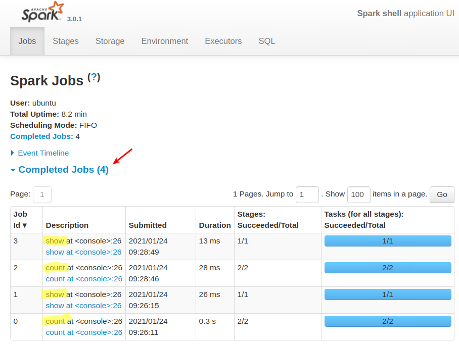<!-- {"left" : 0.58, "top" : 1.83, "height" : 5.41, "width" : 9.08} -->

---

## Spark Read Functions

* Spark supports wide variety of data formats

<br />

| Function           | Description      |
|--------------------|------------------|
| spark.read.text    | Plain text files |
| spark.read.csv     | CSV files        |
| spark.read.json    | JSON files       |
| spark.read.parquet | Parquet files    |

---

## Lab: Spark Shell

<!-- {"left" : 6.76, "top" : 0.88, "height" : 4.37, "width" : 3.28} -->

* **Overview:**
   - Get used to Spark Shell

* **Approximate run time:**
   - 20-30 mins

* **Instructions:**
   - **SHELL-1**: Use Spark Shell

Notes:

---

# Core Data Model

---

## Spark Data Model Evolution

* Spark data models have evolved over the years

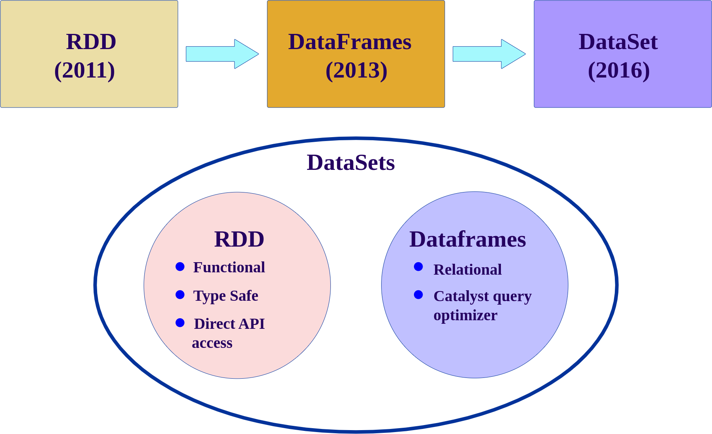<!-- {"left" : 0.58, "top" : 1.83, "height" : 5.41, "width" : 9.08} -->

---

## Spark Data Models Comparison

|                     | RDD                                             | Dataframe                                                   | Dataset                               |
|---------------------|-------------------------------------------------|-------------------------------------------------------------|---------------------------------------|
| Since               | Since v1                                        | Since Spark 1.3                                             | Since Spark v2                        |
| Data Representation | Distributed data                                | Represents a table in a database or a Dataframe in Pandas/R | Distributed data                      |
| Typing              | Typed                                           | Generic                                                     | Strong typing                         |
| Suited for          | Unstructured data                               | Structured Data                                             | Semi-structured and structured data.  |
| Optimizations       | Minimal.  User is responsible for optimizations | Offers exceptional optimization                             | Offers exceptional optimization       |
| Languages           | Java, Scala, Python                             | Java, Scala, Python                                         | Java, Scala, Python (partial support) |

<br />

* References: 
    - [A Tale of Three Apache Spark APIs: RDDs vs DataFrames and Datasets](https://databricks.com/blog/2016/07/14/a-tale-of-three-apache-spark-apis-rdds-dataframes-and-datasets.html)
    - [Converting Spark RDD to DataFrame and Dataset](https://indatalabs.com/blog/convert-spark-rdd-to-dataframe-dataset)

---

## RDD (Resilient Distributed Datasets)

* RDDs are the original (classic) API

* Low level API

* Even though it is still supported, they not the preferred API post Spark 2+

* Dataframes/Datasets APIs are the recommended ones

```python
lines = sc.textFile("data.txt")
lines.collect()
```

---

## Dataframes

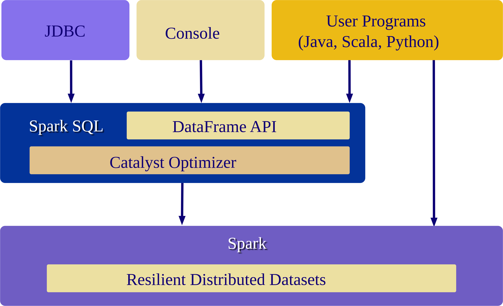<!-- {"left" : 0.58, "top" : 1.83, "height" : 5.41, "width" : 9.08} -->

* Dataframes are created for providing easy to use APIs for structured data

* Dataframes work very similar to Pandas and R Dataframes
    - But Spark dataframes are distributed (can be very large!)
    - Spark DF does not need to fit in one machine's memory like Pandas DF

* Dataframes are **'untyped'** or **'generic'**

* Dataframes are highly efficient

* **Catalyst Optimizer** does very good job of optimizing of user code/queries

```python
data = spark.read.csv("orders.csv")
data.show()
```

---

## Dataset

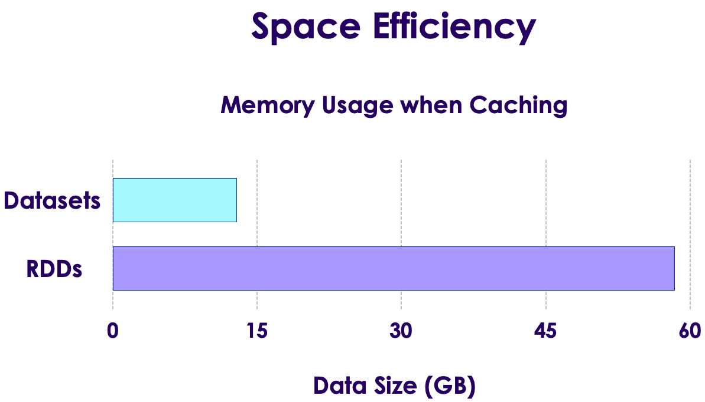<!-- {"left" : 0.58, "top" : 1.83, "height" : 5.41, "width" : 9.08} -->

* Datasets were introduced in Spark 2

* They provide a unified APIs

* Datasets can support strongly typed  data (Customer type, Order type ..etc)
    - Strong typing is only available on Java and Scala
    - Only partial support in Python, as Python is not a strongly typed language

* Datasets are highly efficient

* Here we see how Datasets are very memory efficient compared to RDDs


---

## Spark Datamodel Features

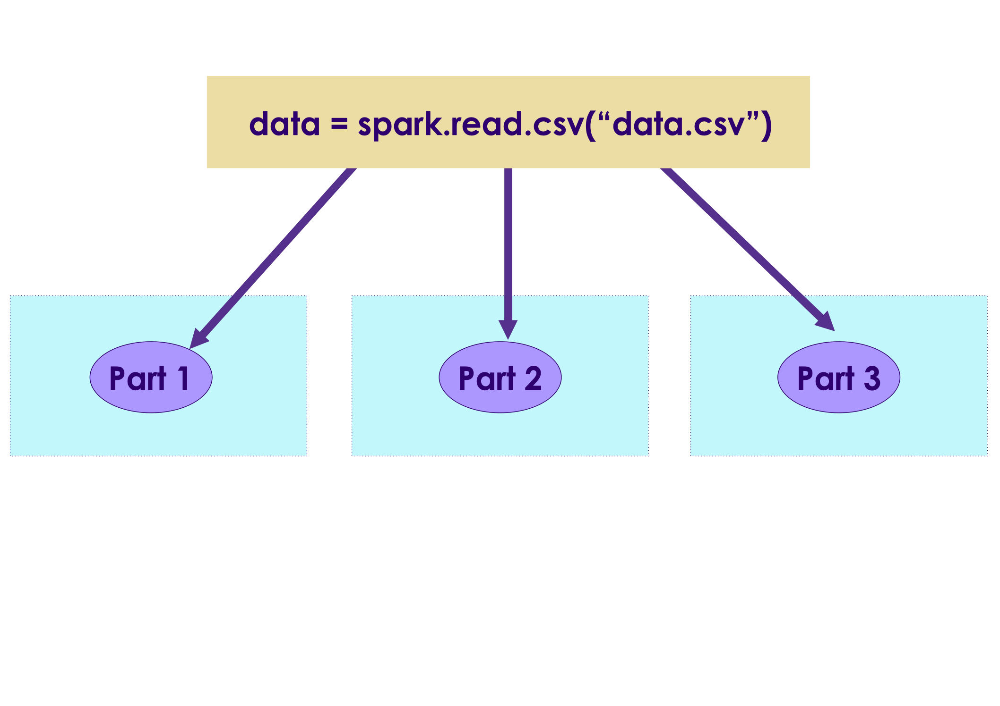<!-- {"left" : 0.58, "top" : 1.83, "height" : 5.41, "width" : 9.08} -->

* Spark data is **distributed** - they can be spread across the cluster
    - They don't have to fit on a single machine memory

* Once data is read, it is **immutable**, it can not be changed
    - This may seem like a limitation, but it really helps with parallel operations by avoiding race conditions

<!-- {"left" : 0.58, "top" : 1.83, "height" : 5.41, "width" : 9.08} -->

* Data can be processed in parallel operations

* There are two kinds of operations:
    - __Transformation__ : Changing one dataset into another
    - __Action__ : gathering results

---

## Spark Data Lifecycle

<!-- {"left" : 0.58, "top" : 1.83, "height" : 5.41, "width" : 9.08} -->

* We are loading a file: `data1`

* Then a filter is applied to `data1`

* Since Spark data can not be modified in place, this filter operation creates another dataset `data2`

* Another filter is applied to `data2` resulting in another dataset `data3`

* The copying is done very effectively - Spark only creates copies of modified data;  Non-modified data is referenced by pointers

---

## Lazy Transformations

<!-- {"left" : 0.58, "top" : 1.83, "height" : 5.41, "width" : 9.08} -->

* Spark **lazily** evaluates transformations

* Here all operations `read` and `filter` are lazy operations - they are not executed right away

* Spark  will defer these transformations

* When an **`action`** is encountered, Spark will execute **all pending transformations**

* This is done so Spark can effectively execute a batch of transformations
    - Spark may do optimizations by combining operations 

---

## Distrubted Data and Partitions

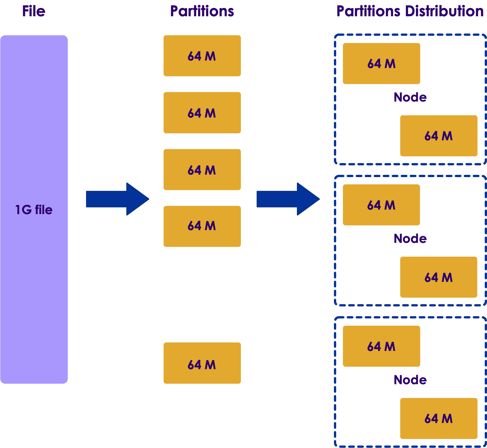<!-- {"left" : 0.58, "top" : 1.83, "height" : 5.41, "width" : 9.08} -->

* Distributed file systems will be store data on multiple nodes

* Here we see a 1G file being split into many chunks/partitions/blocks
    - Here partition size is 64M (configurable)
    - **Question for class** : What is default block size in HDFS?

* And the partitions are distributed across many nodes

---

## Distributed Processing

* When Spark is processing data, it will examine the file partitions

* And will spin up one task per partition

* So partitions can be processed in parallel!

<!-- {"left" : 0.58, "top" : 1.83, "height" : 5.41, "width" : 9.08} -->

---

## Spark and HDFS

* When Spark is processing data in HDFS, it will use 'location hints' provided by HDFS

* And then Spark will place tasks on nodes, where data is available

* Spark strives to process local data as much as possible
    - This is called **data local processing**

* Processing local data can yield very high IO throughput
    - This is a key factor in Hadoop + Spark working well together

<!-- {"left" : 0.58, "top" : 1.83, "height" : 5.41, "width" : 9.08} -->

---

## Transformation and Partitions

* Since data is split into partitions, Spark operations happen at partition level

* Here the filter operations are applied per partition level
    - And they are execute in parallel

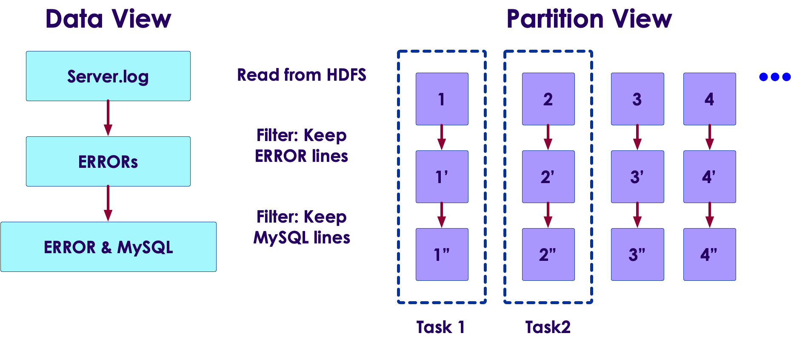<!-- {"left" : 0.58, "top" : 1.83, "height" : 5.41, "width" : 9.08} -->

---

## An Example

* Let's run through an example

* We have a log file that is split into 3 partitions

<!-- {"left" : 0.58, "top" : 1.83, "height" : 5.41, "width" : 9.08} -->

---

## An Example

<!-- {"left" : 0.58, "top" : 1.83, "height" : 5.41, "width" : 9.08} -->

---

## An Example

<!-- {"left" : 0.58, "top" : 1.83, "height" : 5.41, "width" : 9.08} -->

---

## An Example

<!-- {"left" : 0.58, "top" : 1.83, "height" : 5.41, "width" : 9.08} -->

---

## Rebalancing Partitions

* During a multi-step workflow, partitions might get uneven

* We can use the following methods to rebalance partitions:
    - **`repartition`** : can increase/decrease partition count
    - **`coalesce`** : only decreases partitions, and more efficient

* Rebalancing partitions, will involve streaming data between nodes.  This is called **shuffling**
    - Shuffling data can be expensive, at large scale

---

## Fault Tolerance

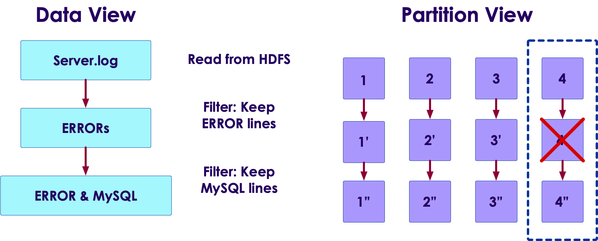<!-- {"left" : 0.58, "top" : 1.83, "height" : 5.41, "width" : 9.08} -->

* Failures do happen (when, not if) in distributed computing
    - Machines can crash, processes can crash (running out of memory ..etc)
    - **Question for the class**: What other failure scenarios can you think of?
* Spark can **automatically recover** from run time errors!
    - No intervention required from devs or admins
* Spark tracks transformation **lineage**
* So if a partition is missing,  it can be re-calculated from its parents
* Here if partition 4' is missing (due to a crash) it can be recomputed from 4
    - Spark can re-read partition 4 from storage (HDFS or Cloud storage) and recompute 4'

---

## Fault Tolerance

* Narrow dependency examples : filter, distinct

* Wide dependency examples : join, merge, sort

* __Narrow dependency__ lineages are quicker to recover than __wide dependencies__

* **Question for the class**:
    - Why are narrow dependencies easier to recover in failure?

<!-- {"left" : 0.58, "top" : 1.83, "height" : 5.41, "width" : 9.08} -->
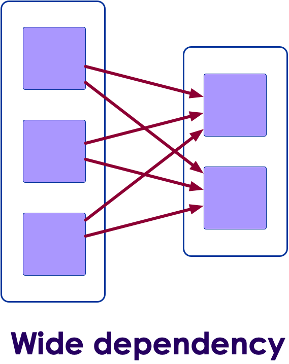<!-- {"left" : 0.58, "top" : 1.83, "height" : 5.41, "width" : 9.08} -->

Notes:

Narrow dependencies are easier to recover, because the amount of data to re-read is smaller

---

## Fault Tolerance

* Spark can recover from run-time failures
    - Nodes crashing
    - Tasks crashing

* How ever it can not recover from 'user code' errors :-)

* __Question for class__: how can the following code fail?

```python
average = total / count
```

```scala
val name_lower = name.toLower()
```

---

## Anatomy of a Spark Job

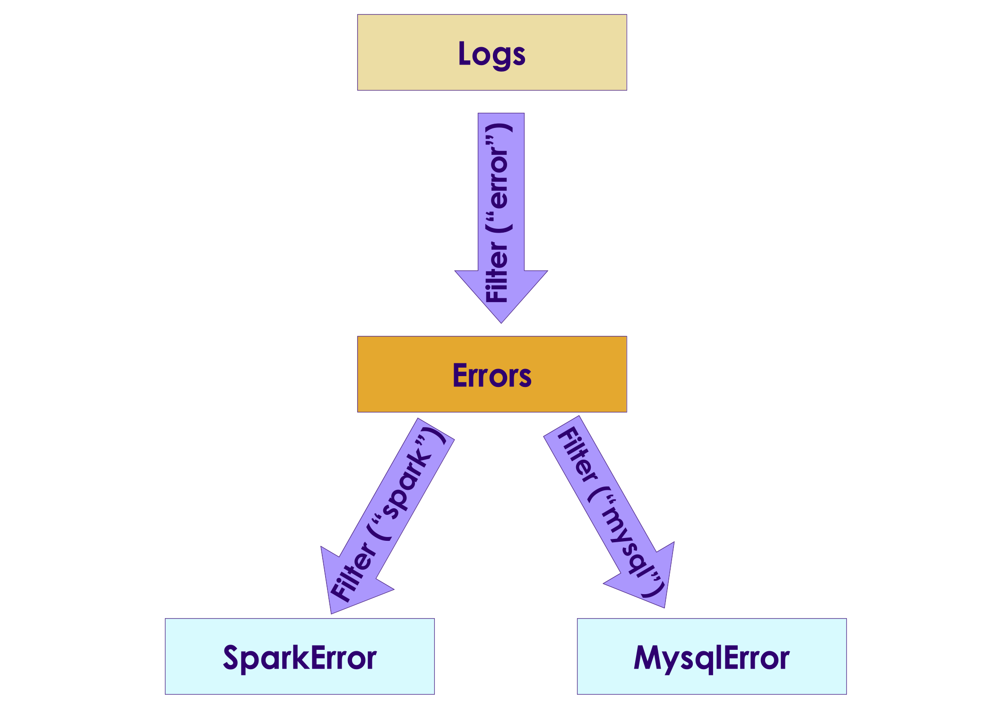<!-- {"left" : 0.58, "top" : 1.83, "height" : 5.41, "width" : 9.08} -->

```scala
val logs = sc.textFile("server.log")
val errors = logs.filter(_.contains("Error"))
val mysqlError = errors.filter(_.contains("mysql"))
val sparkError = errors.filter(_.contains("spark"))
```

* Spark executes the workflow as a DAG (Direct Acyclic Graph)
    - Directed (data flows in a certain direction
    - Acyclic (no cycles/loops)

* You can see DAGs from Spark UI

---

## Anatomy of a Spark Job

* Application can have many **actions** (`count` , `save` ..etc)

* Each action is a **job**

* A Job may be executed in one or many **stages** (depending on the complexity)

* A Stage may have one or more **tasks**

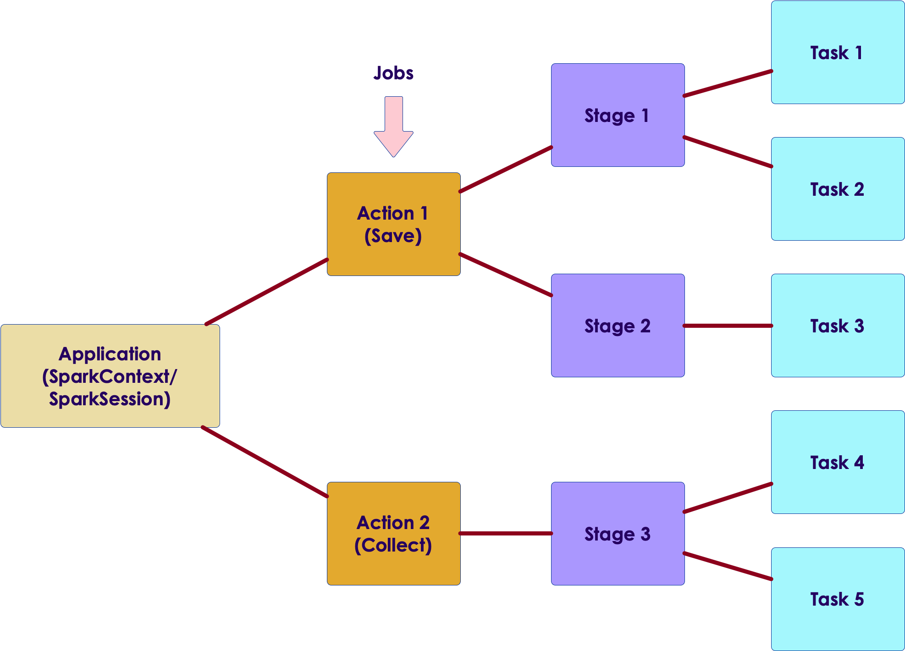<!-- {"left" : 0.58, "top" : 1.83, "height" : 5.41, "width" : 9.08} -->

---

## Anatomy of a Spark Job - Stage

* Stage is collection of tasks that can be executed in **ONE Executor without talking to another Executor**

* If network communication is required then another stage begins
    - E.g. shuffle operation

* Operations that cause a shuffle operation : Sort,  groupByKey,  Join

* Stages for a Job are usually executed in sequence
    - One Stage's output is fed as input another Stage

---

## Shuffles

* In the diagram below, key-value pairs are scattered across the nodes

* If we want to group the data by keys (A, B),  we need to exchange/stream data across nodes over the network
    - This is called **shuffle**

* Shuffles tend to be slower operations than reading local data

* Some operations needing shuffle : join, sort, group by

<!-- {"left" : 0.58, "top" : 1.83, "height" : 5.41, "width" : 9.08} -->

---

## Spark Sample Program (Python)

```python
# read data
f = spark.read.text("twinkle.txt")
print(f.count())
# 5

f.show(truncate=False)
# +---------------------------+
# |value                      |
# +---------------------------+
# |twinkle twinkle little star|
# |how I wonder what you are  |
# |up above the world so high |
# |like a diamond in the sky  |
# |twinkle twinkle little star|
# +---------------------------+

## Run a filter
filtered = f.filter(f.value.contains("twinkle"))
filtered = f.filter(f["value"].contains("twinkle"))

print(filtered.count())
# 2

filtered.show(truncate=False)

# +---------------------------+
# |value                      |
# +---------------------------+
# |twinkle twinkle little star|
# |twinkle twinkle little star|
# +---------------------------+

```

---

## Spark Sample Program (Scala)

```scala
// read data
val f = spark.read.text("twinkle.txt")
f.count()
// 5

f.show(truncate=false)

// +---------------------------+
// |value                      |
// +---------------------------+
// |twinkle twinkle little star|
// |how I wonder what you are  |
// |up above the world so high |
// |like a diamond in the sky  |
// |twinkle twinkle little star|
// +---------------------------+

//// Run a filter
val filtered = f.filter ($"value".contains("twinkle"))

filtered.count()
// 2

filtered.show(truncate=false)

// +---------------------------+
// |value                      |
// +---------------------------+
// |twinkle twinkle little star|
// |twinkle twinkle little star|
// +---------------------------+

```

---

## Lab: Spark Data Loading / Spark UI

<!-- {"left" : 6.76, "top" : 0.88, "height" : 4.37, "width" : 3.28} -->

* **Overview:**
   - Loading  datasets in Spark and getting familiar with Spark UI

* **Approximate run time:**
   - 15-20 mins

* **Instructions:**
   - Lab 3.2

Notes:

---

# Caching

---

## Caching

* In real world scenarios, we load the data from disks

* If we try to load the same data again, caching from OS will speed things up a bit
    - Imagine loading the same word document  again; It will be faster second time around

* How ever a generic caching from OS, may not understand usage patterns of our data

* Spark can cache data natively - for more efficient operations

---

## Spark Caching

* Spark can cache data in
    - Memory
    - Disk
    - Across nodes
    - or various combinations

<!-- {"left" : 0.58, "top" : 1.83, "height" : 5.41, "width" : 9.08} -->

* Why cache data on disk?
    - Some times we don't want to repeat expensive operations like join, multiple times
    - Do it once and cache the results (e.g. `data3`)

* Why cache on more than one node?
    - Prevent data loss, in case a node goes down

---

## Spark Caching in Memory

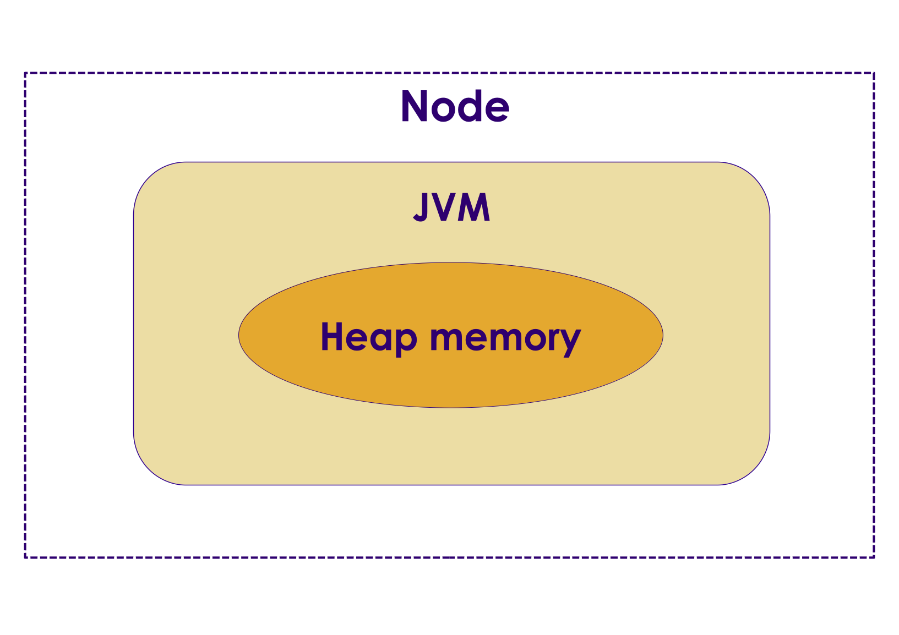<!-- {"left" : 0.58, "top" : 1.83, "height" : 5.41, "width" : 9.08} -->

* Earlier Spark versions (pre v2), Spark cached data in Java Heap memory

* While this was fast (because code and data are within the same memory space), it wasn't scalable

* When caching in JVMs we have to contend with **garbage collector**
    - JVM garbage collectors are not good at dealing with large memory amounts (100 of Gigs)
    - These days memory is cheap, Spark servers can have lot of memory (256 G,  512 G and more)
    - New generation garbage collectors like G1 are more effective, but still don't scale to 100s of Gigs of memory pools

* JVM memory issue has been a limiting factor for Big Data applications written in Java (Hadoop, Cassandra, Spark)

---

## Off Heap Caching

* To overcome large memory issues in JVM, a new technique is developed to allocate memory outside JVM
    - This is **off heap caching**

* This method by passes JVM and allocates memory directly on Linux
    - This eliminates garbage collector contention issues

* Starting with Spark v2, the Tungsten engine, uses this memory allocation scheme by default

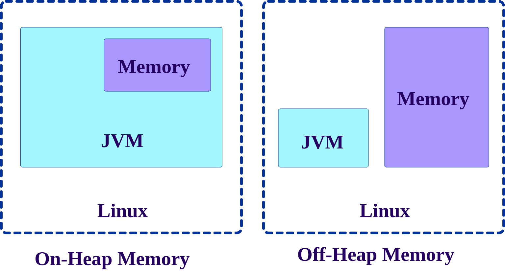<!-- {"left" : 0.58, "top" : 1.83, "height" : 5.41, "width" : 9.08} -->

---

## Caching in Memory

* Data can be cached in memory raw (un-compressed) or compressed

* Text data (CSV, JSON) compresses pretty well
    - 5 - 10x compression possible
    - So 10G data, can be cached in 1G memory space (10x compression)

* Binary data (parquet data, photos ..etc) don't compress well - they are already in compressed format
    - So caching these data types will take just as much space in memory
    - Don't recommend compressing them again for caching (CPU cycles wasted, but don't result in any meaningful compression)

```scala

// cache raw data in memory, without compression
data.cache()
data.persist(StorageLevel.MEMORY_ONLY)

// cache compressed data
data.persist(StorageLevel.MEMORY_ONLY_SER)
```

---

## Caching in Disk

* If data is large, we may not have enough memory to cache it

* So disk cache may be an option, to cache results of expensive operations (join, sort)

* We can also cache **both in memory and disk**
    - If not enough memory is available, Spark will evict previously cached data to make room for new data
    - This will result in **data thrashing or swapping**, resulting in very bad performance
    - So save both in memory and disk.  Even data is evicted from memory cache, it can be found in disk cache

```scala
// disk only
data.persisit(StorageLevel.DISK_ONLY)

// memory and disk - no compression
data.persisit(StorageLevel.MEMORY_AND_DISK)

// memory and disk - compressed
data.persisit(StorageLevel.MEMORY_AND_DISK_SER)
```

---

## Caching on Two Nodes

* Data can be cached in two nodes

* Protects against data loss if a node goes down

```scala

// cache in memory
data.persist (StorageLevel.MEMORY_ONLY_2)

// disk only
data.persist (StorageLevel.DISK_ONLY_2)

// memory and disk
data.persist (StorageLevel.MEMORY_AND_DISK_2)

```

---

## Spark Caching Performance RDD vs Dataset

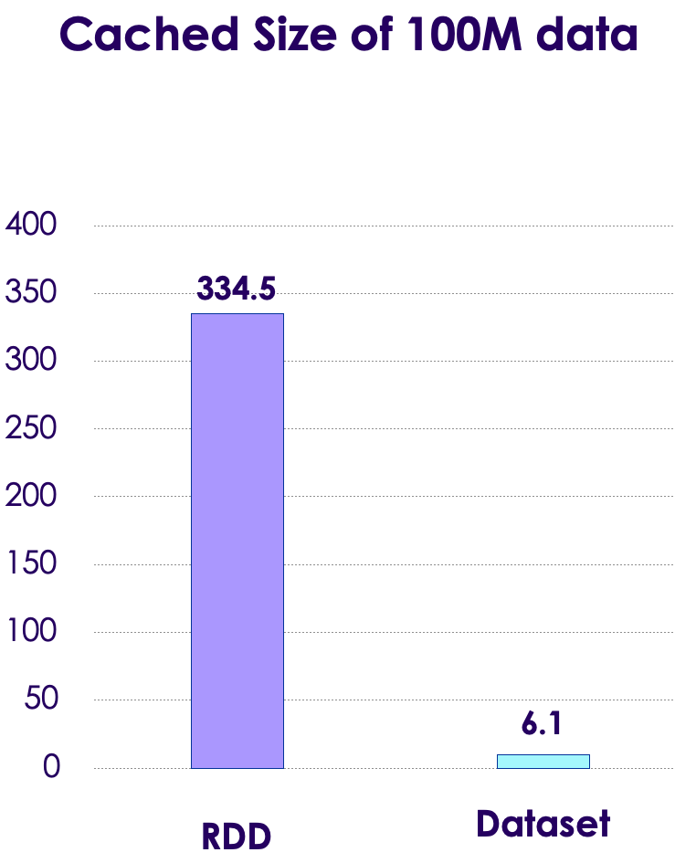<!-- {"left" : 0.58, "top" : 1.83, "height" : 5.41, "width" : 9.08} -->

* Here we see caching stats from Spark v1 and Spark v2 (using Tungsten engine)

* Original datafile is 100M of CSV data
    - RDD takes 334 M memory (3.3 x overhead)
    - Dataset only taks 6.1 M (highly compressed, text data compresses well)

* Tungsten provides highly effective caching:
    - Compresses data smartly (e.g text data is compressed, not binary data)
    - Uses **off heap caching** to allocate memory outside JVM

---

## In Memory File Systems

* **Memory is the new disk**

* Memory prices have been falling
    - Year 2000 = $1000/GB
    - Year 2016 = $3/GB

* Typical Hadoop/Spark node has 100–300 G memory
    - 10 node cluster @ 256 GB each = 2 TB of distributed memory!

* In-memory processing is very attractive for iterative workloads like machine learning
    - Baidu uses 100 node spark cluster with 2 PB of memory

<!-- {"left" : 0.58, "top" : 1.83, "height" : 5.41, "width" : 9.08} -->
---

## In Memory File Systems

* We are seeing in memory file systems coming mainstream
    - Tachyon (Alluxio)
    - Ignite from Gridgain

* These in-memory file systems act as a giant, distributed cache between Spark and file systems (HDFS or Cloud file systems)

<!-- {"left" : 0.58, "top" : 1.83, "height" : 5.41, "width" : 9.08} -->

---

## Lab: Spark Caching

<!-- {"left" : 6.76, "top" : 0.88, "height" : 4.37, "width" : 3.28} -->

* **Overview:**
   - Understand Spark caching

* **Approximate run time:**
   - 20-30 mins

* **Instructions:**
   - 3.3

Notes:

---

## Review and Q&A

<!-- {"left" : 8.24, "top" : 1.21, "height" : 1.28, "width" : 1.73} -->

* Let's go over what we have covered so far

* Any questions?

<!-- {"left" : 2.69, "top" : 4.43, "height" : 3.24, "width" : 4.86} -->
