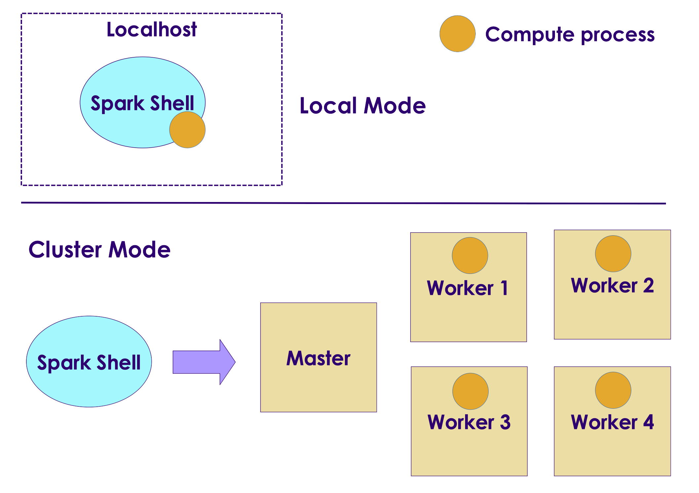

# Spark Core

  <!-- {"left" : 2.75, "top" : 6.35, "height" : 1.26, "width" : 2.38} -->

---

## Objectives

* Learn Spark Core
* Using Spark Shell

---

# Spark Core

---

## Spark Core

<!-- {"left" : 0.58, "top" : 1.83, "height" : 5.41, "width" : 9.08} -->

* Spark Core handles 
    - Task allocation
    - memory management
    - Data APIs

Notes:

---

# Spark Shell

---

## Spark Shell

* __Spark Shell__ is an interactive environment to work with Spark

* Enables very quick iterative development - no edit/save/compile/run cycle

* Various shells for languages:
    - `spark/bin/pyspark` : Python
    - `spark/bin/spark-shell` : Scala and Java
    - `spark/bin/sparkR` : R
    - `spark/bin/spark-sql` : SQL

---

## Spark Shell Execution Modes

<!-- {"left" : 0.58, "top" : 1.83, "height" : 5.41, "width" : 9.08} -->

* Spark Shell can be run in either local or cluster mode

* __Local__ mode:
    - Every thing runs on a single machine
    - Great for developing and debugging

* __Cluster__ mode:
    - Jobs run on a cluster
    - Production

---

## Running Spark Shell (Scala)

* Start on single thread mode (default)

```bash
$   spark-shell
```

* Start with 4 worker threads

```bash
$   spark-shell  --master [4]
```

* Start worker threads for each CPU core

```bash
$   spark-shell  --master [*]
```

* Connect to a Spark cluster

```bash
$   spark-shell --master spark://master_host:7077
```

* Connect to a YARN cluster

```bash
$   spark-shell --master yarn
```

* See all options

```bash
$   spark-shell --help
```

---

## Running PySpark Shell (Python)

* Start on single thread mode (default)

```bash
$   pyspark
```

* Start with 4 worker threads

```bash
$   pyspark  --master [4]
```

* Start worker threads for each CPU core

```bash
$   pyspark  --master [*]
```

* Connect to a Spark cluster

```bash
$   pyspark  --master spark://master_host:7077
```

* Connect to a YARN cluster

```bash
$   pyspark --master yarn
```

* See all options

```bash
$   pyspark --help
```

---

## Running Spark Shell

* Spark Shell

```console
$  ./bin/spark-shell 

Spark context Web UI available at http://melbourne.lan:4040
Spark context available as 'sc' (master = local[*], app id = local-1611478668976).
Spark session available as 'spark'.
Welcome to
      ____              __
     / __/__  ___ _____/ /__
    _\ \/ _ \/ _ `/ __/  '_/
   /___/ .__/\_,_/_/ /_/\_\   version 3.0.1
      /_/
         
Using Scala version 2.12.10 (OpenJDK 64-Bit Server VM, Java 11.0.9.1)

scala> 

```

* Pyspark

```console
Python 3.8.5 (default, Sep  4 2020, 07:30:14) 
[GCC 7.3.0] :: Anaconda, Inc. on linux

Welcome to
      ____              __
     / __/__  ___ _____/ /__
    _\ \/ _ \/ _ `/ __/  '_/
   /__ / .__/\_,_/_/ /_/\_\   version 3.0.1
      /_/

Using Python version 3.8.5 (default, Sep  4 2020 07:30:14)
>>> 

```

---

## Spark Shell UI

* When Spark Shell is running, it publishes a dashboard starting on port number 4040

* This UI provides tons of details about:
    - Jobs running in the shell
    - CPU / memory usage
    - Caching details

<!-- {"left" : 0.58, "top" : 1.83, "height" : 5.41, "width" : 9.08} -->

---

## Spark API

* Within Spark shell there are two Spark API points
    - **`SparkContext`** : classic API
    - **`SparkSession`** : newer, recommended API

```console
$ pyspark

Using Python version 3.8.2 (default, Mar 26 2020 15:53:00)

>>> sc
< SparkContext master=local[*] appName=PySparkShell >

>>> spark
< pyspark.sql.session.SparkSession object at 0x7fb751d8a850 >
```

```console

$ spark-shell

Using Scala version 2.12.10 (OpenJDK 64-Bit Server VM, Java 11.0.9)

scala> sc
res0: org.apache.spark.SparkContext = org.apache.spark.SparkContext@3aac3f34

scala> spark
res1: org.apache.spark.sql.SparkSession = org.apache.spark.sql.SparkSession@337f76ff

```

---

## Loading Data in Spark  (Scala)

```scala
scala> val myfile= spark.read.text("README.md") 
myfile: org.apache.spark.sql.DataFrame = [value: string]

scala> myfile.count
res0: Long = 108

scala> myfile.show
+--------------------+
|               value|
+--------------------+
|      # Apache Spark|
|Spark is a unifie...|
|guide, on the [pr...|
...
+--------------------+
only showing top 20 rows


scala> val spark_lines = myfile.filter ($"value".contains("Spark"))
spark_lines: org.apache.spark.sql.Dataset[org.apache.spark.sql.Row] = [value: string]

scala> spark_lines.count
res2: Long = 19

scala> spark_lines.show
+--------------------+
|               value|
+--------------------+
|      # Apache Spark|
|Spark is a unifie...|
|Please review the...|
...
+--------------------+

```

---

## Loading Data in PySpark (Python)

```python
>>> myfile= spark.read.text("README.md") 

>>> myfile.show()
+--------------------+
|               value|
+--------------------+
|      # Apache Spark|
|                    |
|Spark is a unifie...|
|high-level APIs i...|
...
|guide, on the [pr...|
+--------------------+

>>> myfile.count()
108

>>> spark_lines = myfile.filter(myfile.value.contains("Spark"))

>>> spark_lines.count()
19

>>> spark_lines.show()
+--------------------+
|               value|
+--------------------+
|      # Apache Spark|
|Spark is a unifie...|
...
+--------------------+

```

---

## Spark Shell UI

* Here is how the Spark Shell UI, note the jobs running

<!-- {"left" : 0.58, "top" : 1.83, "height" : 5.41, "width" : 9.08} -->

---

## Spark Read Functions

* Spark supports wide variety of data formats

<br />

| Function           | Description      |
|--------------------|------------------|
| spark.read.text    | Plain text files |
| spark.read.csv     | CSV files        |
| spark.read.json    | JSON files       |
| spark.read.parquet | Parquet files    |

---

## Lab: Spark Shell

<!-- {"left" : 6.76, "top" : 0.88, "height" : 4.37, "width" : 3.28} -->

* **Overview:**
   - Get used to Spark Shell

* **Approximate run time:**
   - 20-30 mins

* **Instructions:**
   - **SHELL-1**: Use Spark Shell

Notes:

---

# Core Data Model

---

## Spark Data Model Evolution

* Spark data models have evolved over the years

<!-- {"left" : 0.58, "top" : 1.83, "height" : 5.41, "width" : 9.08} -->

---

## Spark Data Models Comparison

|                     | RDD                                             | Dataframe                                                   | Dataset                               |
|---------------------|-------------------------------------------------|-------------------------------------------------------------|---------------------------------------|
| Since               | Since v1                                        | Since Spark 1.3                                             | Since Spark v2                        |
| Data Representation | Distributed data                                | Represents a table in a database or a Dataframe in Pandas/R | Distributed data                      |
| Typing              | Typed                                           | Generic                                                     | Strong typing                         |
| Suited for          | Unstructured data                               | Structured Data                                             | Semi-structured and structured data.  |
| Optimizations       | Minimal.  User is responsible for optimizations | Offers exceptional optimization                             | Offers exceptional optimization       |
| Languages           | Java, Scala, Python                             | Java, Scala, Python                                         | Java, Scala, Python (partial support) |

<br />

* References: 
    - [A Tale of Three Apache Spark APIs: RDDs vs DataFrames and Datasets](https://databricks.com/blog/2016/07/14/a-tale-of-three-apache-spark-apis-rdds-dataframes-and-datasets.html)
    - [Converting Spark RDD to DataFrame and Dataset](https://indatalabs.com/blog/convert-spark-rdd-to-dataframe-dataset)

---

## RDD (Resilient Distributed Datasets)

* RDDs are the original (classic) API

* Low level API

* Even though it is still supported, they not the preferred API post Spark 2+

* Dataframes/Datasets APIs are the recommended ones

```python
lines = sc.textFile("data.txt")
lines.collect()
```

---

## Dataframes

<!-- {"left" : 0.58, "top" : 1.83, "height" : 5.41, "width" : 9.08} -->

* Dataframes are created for providing easy to use APIs for structured data

* Dataframes work very similar to Pandas and R Dataframes
    - But Spark dataframes are distributed (can be very large!)
    - Spark DF does not need to fit in one machine's memory like Pandas DF

* Dataframes are **'untyped'** or **'generic'**

* Dataframes are highly efficient

* **Catalyst Optimizer** does very good job of optimizing of user code/queries

```python
data = spark.read.csv("orders.csv")
data.show()
```

---

## Dataset

* Datasets were introduced in Spark 2

* They provide a unified APIs

* Dataframes are strongly typed  (Int, String ..etc)
    - So the API is fully available on Java and Scala
    - Only partial support in Python, as Python is not a strongly typed language

* Datasets are highly efficient

* Here we see how Datasets are very memory efficient compared to RDDs

<!-- {"left" : 0.58, "top" : 1.83, "height" : 5.41, "width" : 9.08} -->

---

## Spark Datamodel Features

<!-- {"left" : 0.58, "top" : 1.83, "height" : 5.41, "width" : 9.08} -->

* Spark data is **distributed** - they can be spread across the cluster
    - They don't have to fit on a single machine memory

* Once data is read, it is **immutable**, it can not be changed
    - This may seem like a limitation, but it really helps with parallel operations by avoiding race conditions

<!-- {"left" : 0.58, "top" : 1.83, "height" : 5.41, "width" : 9.08} -->

* Data can be processed in parallel operations

* There are two kinds of operations:
    - __Transformation__ : Changing one dataset into another
    - __Action__ : gathering results

---

## Spark Data Lifecycle

<!-- {"left" : 0.58, "top" : 1.83, "height" : 5.41, "width" : 9.08} -->

* We are loading a file: `data1`

* Then a filter is applied to `data1`

* Since Spark data can not be modified in place, this filter operation creates another dataset `data2`

* Another filter is applied to `data2` resulting in another dataset `data3`

* The copying is done very effectively - Spark only creates copies of modified data;  Non-modified data is referenced by pointers

---

## Lazy Transformations

<!-- {"left" : 0.58, "top" : 1.83, "height" : 5.41, "width" : 9.08} -->

* Spark **lazily** evaluates transformations

* Here all operations `read` and `filter` are lazy operations - they are not executed right away

* Spark  will defer these transformations

* When an **`action`** is encountered, Spark will execute **all pending transformations**

* This is done so Spark can effectively execute a batch of transformations
    - Spark may do optimizations by combining operations 

---

## Distrubted Data and Partitions

<!-- {"left" : 0.58, "top" : 1.83, "height" : 5.41, "width" : 9.08} -->

* Distributed file systems will be store data on multiple nodes

* Here we see a 1G file being split into many chunks/partitions/blocks
    - Here partition size is 64M (configurable)
    - **Question for class** : What is default block size in HDFS?

* And the partitions are distributed across many nodes

---

## Distributed Processing

* When Spark is processing data, it will examine the file partitions

* And will spin up one task per partition

* So partitions can be processed in parallel!

<!-- {"left" : 0.58, "top" : 1.83, "height" : 5.41, "width" : 9.08} -->

---

## Spark and HDFS

* When Spark is processing data in HDFS, it will use 'location hints' provided by HDFS

* And then Spark will place tasks on nodes, where data is available

* Spark strives to process local data as much as possible
    - This is called **data local processing**

* Processing local data can yield very high IO throughput
    - This is a key factor in Hadoop + Spark working well together

<!-- {"left" : 0.58, "top" : 1.83, "height" : 5.41, "width" : 9.08} -->

---

## Transformation and Partitions

* Since data is split into partitions, Spark operations happen at partition level

* Here the filter operations are applied per partition level
    - And they are execute in parallel

<!-- {"left" : 0.58, "top" : 1.83, "height" : 5.41, "width" : 9.08} -->

---

## An Example

* Let's run through an example

* We have a log file that is split into 3 partitions

<!-- {"left" : 0.58, "top" : 1.83, "height" : 5.41, "width" : 9.08} -->

---

## An Example

<!-- {"left" : 0.58, "top" : 1.83, "height" : 5.41, "width" : 9.08} -->

---

## An Example

<!-- {"left" : 0.58, "top" : 1.83, "height" : 5.41, "width" : 9.08} -->

---

## An Example

<!-- {"left" : 0.58, "top" : 1.83, "height" : 5.41, "width" : 9.08} -->

---

## Rebalancing Partitions

* During a multi-step workflow, partitions might get uneven

* We can use the following methods to rebalance partitions:
    - **`repartition`** : can increase/decrease partition count
    - **`coalesce`** : only decreases partitions, and more efficient

* Rebalancing partitions, will involve streaming data between nodes.  This is called **shuffling**
    - Shuffling data can be expensive, at large scale

---
