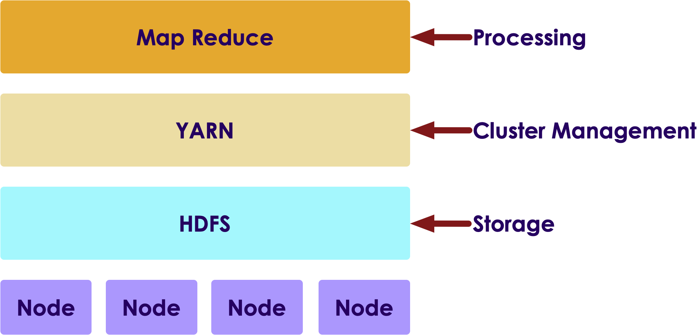
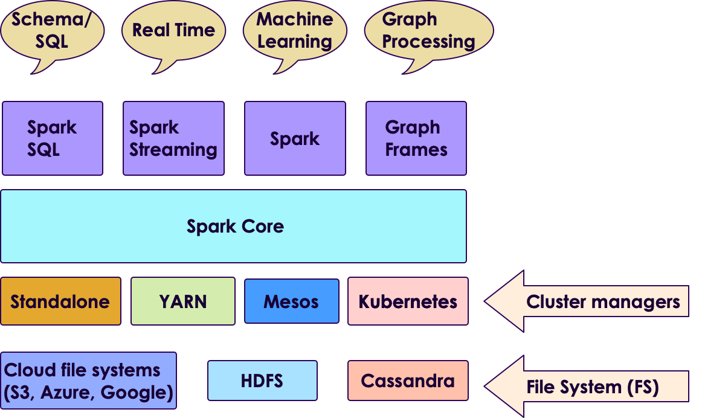
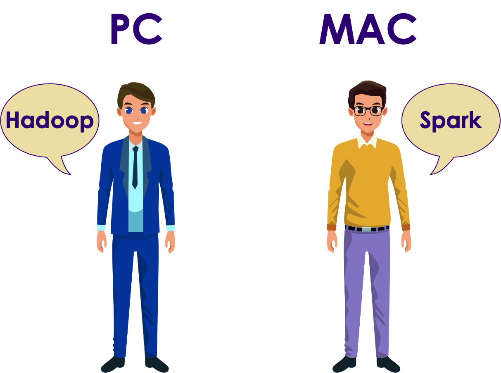
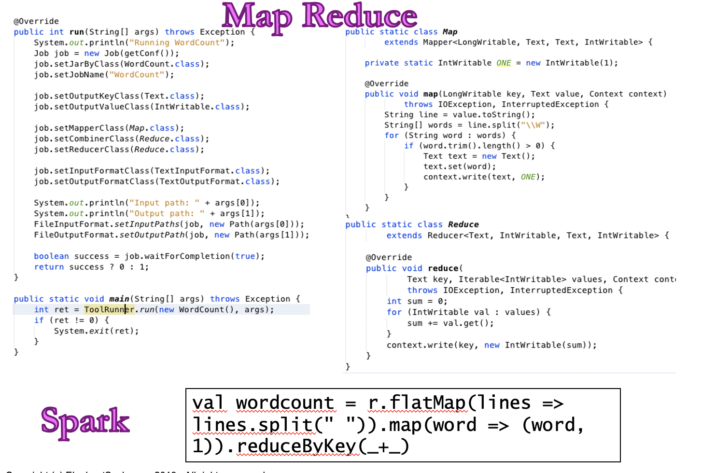
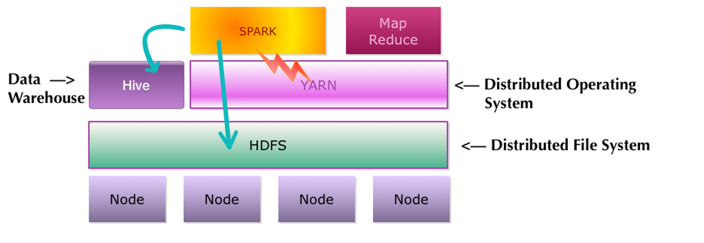
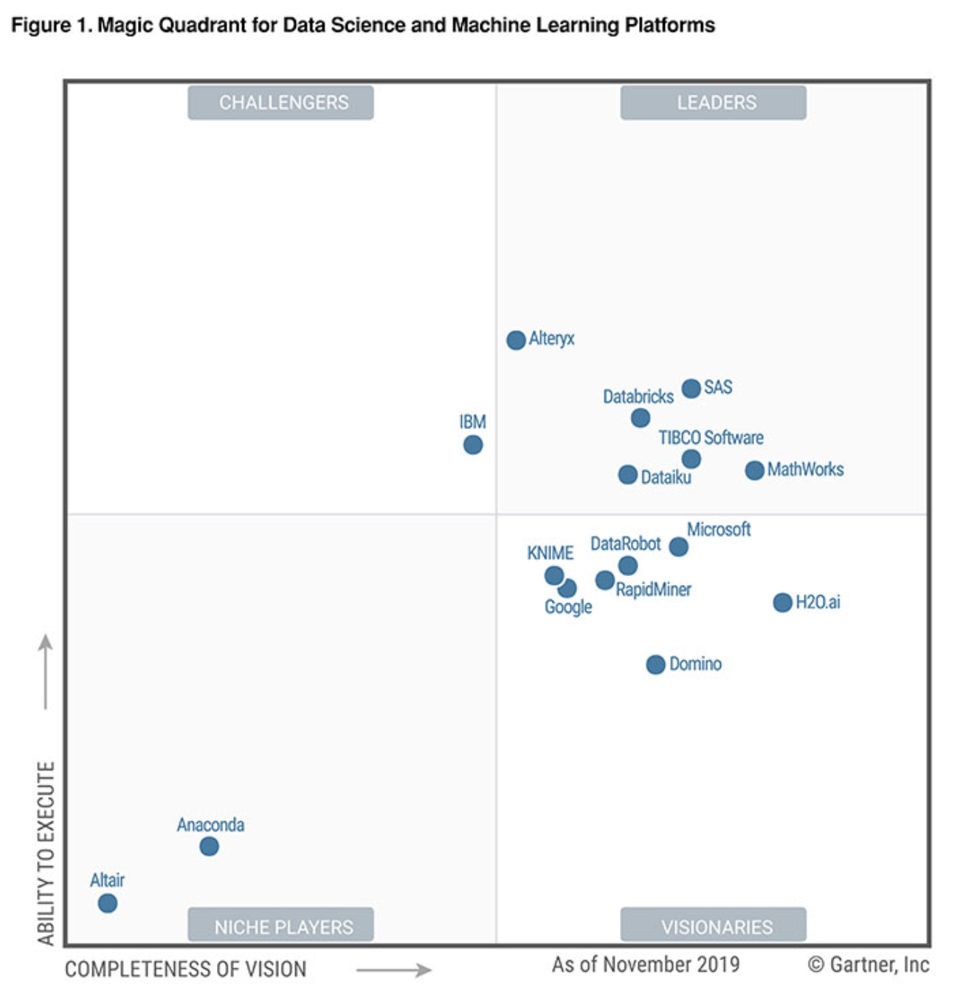
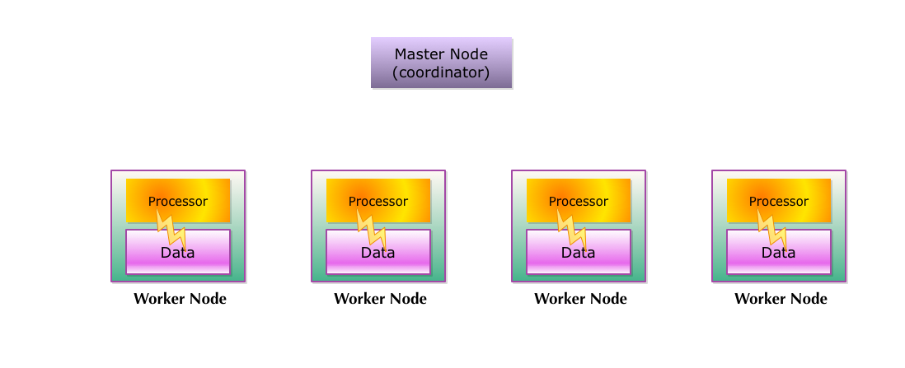
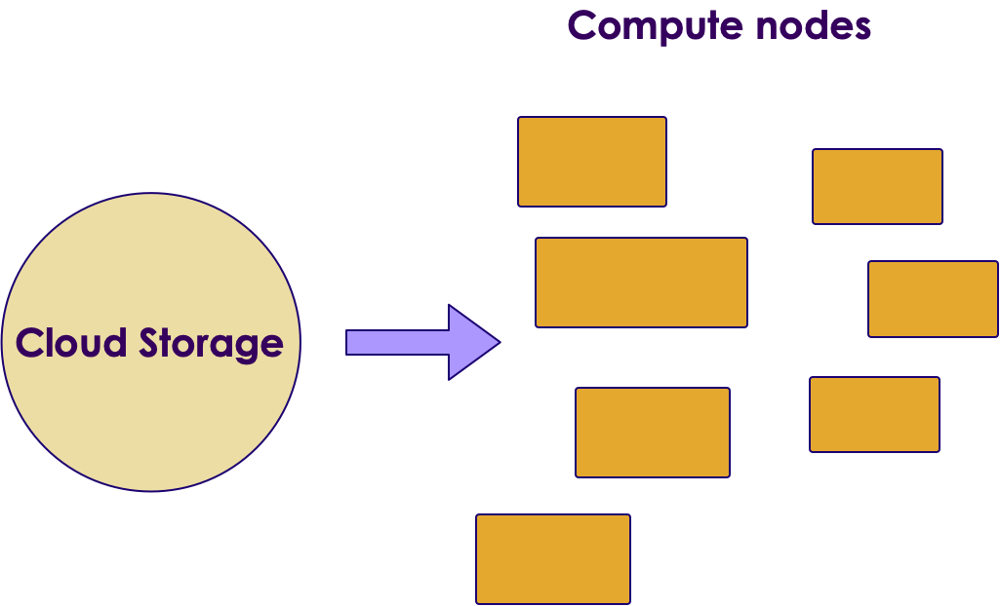
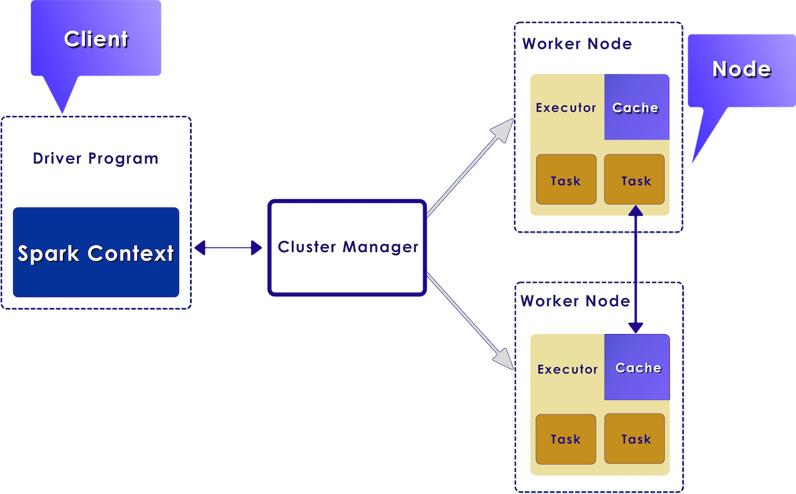

# Spark Introduction

  <!-- {"left" : 2.75, "top" : 6.35, "height" : 1.26, "width" : 2.38} -->

---

## Objectives

* Learn about Spark ecosystem
* Understand Spark use cases
* Installing and running Spark
* Using Spark Shell

---

# Spark Intro

---

## Big Data V1: Hadoop

<!-- {"left" : 7.31, "top" : 0.97, "height" : 0.66, "width" : 2.83} -->

* Hadoop was the first Big Data platform to be widely adopted

* Hadoop has three main components

    - Storage: **HDFS** - Store huge amount of data in a distributed fashion
    - Operating System: **YARN** - manage the cluster
    - Processing: **MapReduce Engine** - distributed computing

<!-- {"left" : 2.02, "top" : 5.6, "height" : 2.98, "width" : 6.21} -->

Notes:

---

## MapReduce Engine

<!-- {"left" : 6.96, "top" : 1.11, "height" : 0.99, "width" : 3.11} -->

* MapReduce was state of the art around 2008

* It was written for a time when
  - Data was on disk
  - And most processing was batch

* How ever MR had its limitations
  - It had high overhead
  - It didn't support 'in-memory' processing
  - It couldn't do 'streaming / real time' work loads

Notes:

---

## Spark

<!-- {"left" : 8.11, "top" : 1.11, "height" : 1.01, "width" : 1.91} -->

* [Spark](https://spark.apache.org) is an **open Source distributed computing engine**
    - Very fast: On-disk ops are **10x** faster than MR
    - In-memory ops **100x** faster than MR

* General purpose: MR, SQL, streaming, machine learning, analytics

* Hadoop compatible: Runs over Hadoop, Mesos, Yarn, or standalone

* Plays nicely with Big Data ecosystem (S3, Cassandra, HBase)

* Very easy to use API

* _"Spark is the First Big Data platform to integrate batch, streaming and interactive computations in a unified framework." - stratio.com_

---

## Spark's History

* Spark was created at [Berkeley AMP Lab](https://amplab.cs.berkeley.edu/)

* Now top-level Apache project

* **[Databricks](https://databricks.com/)** -  Supporting and developing Spark
    - Founded by Spark's creators
    - Employs the most active committers

* Spark is now included with most modern Hadoop distributions

---

## Why is Spark Popular?

* Ease of use
    - Easy to get up and running
    - Develop on laptop, deploy on cluster

* Multiple language support
    - Java, Scala, Python and R
    - Developers (Java/Scala),   Data Scientists (Python, R)

* High performant

* Plays nice with BigData eco system

* Out of the box functionality
    - Modern functional programming constructs
    - Machine Learning / Streaming / Graph processing

Notes:

---

## Spark Versions

| Version | Release Date | Description            |
|---------|--------------|------------------------|
| 1.0     | 2014-05-30   | Initial Apache release |
| 1.6     | 2016-01-04   | Stable 1.x release     |
| 2.0     | 2016-07      | Big update from V1     |
| 2.4     | 2020-01      | Stable v2 release      |
| 3.0     | 2020 Q2      | V3 release             |

<!-- {"left" : 0.25, "top" : 1.5, "height" : 3, "width" : 9.75} -->

Notes:

---

## Spark Components

<!-- {"left" : 0.58, "top" : 1.83, "height" : 5.41, "width" : 9.08} -->

Notes:

---

## Spark Components

* __Data Storage:__ Pluggable data storage systems
    - Integrates with HDFS, S3, Cassandra DB, and more

* __Cluster Manager:__ Manages distributed node clusters
    - Provides the distributed execution environment
    - Works with Mesos, Yarn, and its own standalone manager

* __Spark Core:__ Distributed computing engine

Notes:

---

## Spark Components: Core

* **Core** has basic building blocks for distributed computing engine

* Task schedulers and memory management

* Fault recovery (recovers missing pieces on node failure)

* Storage system interfaces

* Defines Spark API

* Data Model: RDD/Dataframe/Dataset
    - Distributed collection of items
    - Can be worked on in parallel
    - Easily created from many data sources

---

## Spark Components

* __Spark SQL:__ Analyze structured data
    - Supports SQL and HQL (Hive Query Language)
    - Data sources include Hive tables, JSON, CSV, Parquet

* __Spark Streaming:__ Live streams of data in real-time
    - Low latency, high throughput (1000s events per second)
    - Log files, stock ticks, sensor data, IOT (Internet of Things)

* __Spark ML:__ Machine Learning at scale
    - Classification/regression, collaborative filtering
    - Model evaluation and data import

* __GraphX / GraphFrames:__ Graph manipulation, graph-parallel computation
    - Social network friendships, link data
    - Graph manipulation, operations, and common algorithms

---

## Spark: Unified Stack

* Spark support multiple programming models
    - MapReduce style batch processing
    - Streaming/real-time processing
    - Querying via SQL
    - Machine learning
    - Graph Processing

* All modules are tightly integrated; Facilitates rich applications

* Spark can be the only stack you need!
    - No need to run multiple clusters (Hadoop cluster, Storm cluster, etc.)

---

## Spark Use Cases

<!-- {"left" : 8.22, "top" : 0.96, "height" : 0.83, "width" : 1.99} -->

* Teralytics (Telco data)
    - Processing cell phone events
    - 180 billion events per day
    - Spark + HDFS
    - Estimating usage patterns to enhance coverage (sporting events, commuting, etc.)
    - Source: [1](http://bigdatausecases.info/entry/origin-destination-matrix-using-mobile-network-data-with-spark), [2](https://databricks.com/session/origin-destination-matrix-using-mobile-network-data-with-spark)

<!-- {"left" : 8.35, "top" : 4.29, "height" : 0.49, "width" : 1.85} -->

* Spark at Yahoo
    - News personalization
    - 120 line Scala program with ML lib replaced 15,000 lines of C++
    - Spark took 30 minutes to run on 100 million samples
    - [Source](https://www.dezyre.com/article/top-5-apache-spark-use-cases/271)

---

## Spark Use Cases

<!-- {"left" : 7.43, "top" : 1.09, "height" : 1.21, "width" : 2.63} -->

* Netflix
    - Recommendations using Spark + Cassandra
    - Analyzes streaming events (450 billion events per day)
    - Personalization through recommendations
    - Sources: [1](http://bigdatausecases.info/entry/netflix-recommendations-using-spark-and-cassandra-cassandra-summit-2016),  [2](https://www.slideshare.net/DataStax/netflix-recommendations-using-spark-cassandra)

* More case studies @ [BigDataUseCases.Info](http://bigdatausecases.info/)

---

## Spark at Large Scale

<!-- {"left" : 8.59, "top" : 1.02, "height" : 0.91, "width" : 1.58} -->

* Tencent (Social network in China)
  - 8000 nodes
  - 400 TB+ data

   
<!-- {"left" : 7.72, "top" : 2.86, "height" : 0.5, "width" : 2.52} -->

* Alibaba (largest e-commerce site in China)
  - 1 PB scale processing
  - Large scale image processing

   
<!-- {"left" : 7.96, "top" : 4.01, "height" : 0.91, "width" : 2.16} -->

* Streaming @ Jenelia Farm
  - 1 TB per hour
  - Analyze medical images

---

# Spark vs. Hadoop

---

## Spark and Hadoop Timeline

| Hadoop    | Year | Spark                                      |
|-----------|------|--------------------------------------------|
| Created   | 2006 |                                            |
|           | 2009 | Starts at AMP lab                          |
|           | 2010 | Open sourced                               |
| Version 1 | 2011 |                                            |
| Version 2 | 2013 |                                            |
|           | 2014 | Version 1,   Apache top level project |
|           | 2016 | Version 2                                  |
| Version 3 | 2019 |                                            |
|           | 2020 | Version 3                                  |

<!-- {"left" : 0.25, "top" : 1.32, "height" : 5.19, "width" : 9.75} -->

---

## Hadoop vs. Spark

<!-- {"left" : 1.65, "top" : 1.45, "height" : 5.17, "width" : 6.94} -->

[Video](https://www.youtube.com/watch?v=qfv6Ah_MVJU)

---

## Spark vs. MapReduce

<!-- {"left" : 0.66, "top" : 1.53, "height" : 6.02, "width" : 8.93} -->

---

## Spark vs. MapReduce

* Spark is easier to use than MapReduce

* Friendlier development environment
  - Interactive shells allow faster development
  - Web based UI notebooks allow easier development

* Multiple language support: Java, Python, Scala, R

* Spark is high performant than MR

---

## Spark vs. MapReduce Benchmark

* Daytona Grey Benchmark: Sort 100TB of data
* References:
    - [Databricks blog](https://databricks.com/blog/2014/11/05/spark-officially-sets-a-new-record-in-large-scale-sorting.html)
    - http://sortbenchmark.org/

<!-- {"left" : 1.02, "top" : 3.48, "height" : 4.52, "width" : 8.21} -->

---

## Spark and Hadoop

* Spark is a better distributed engine the MapReduce

* Works well with Hadoop components: HDFS, YARN and Hive

<!-- {"left" : 0.48, "top" : 3.29, "height" : 3.07, "width" : 9.29} -->

---

# Running Spark

---

## Spark Runtimes

* On-Premise
  - Spark is part of most modern Hadoop distributions
  - Spark can also be downloaded and installed as a standalone system

* Hosted solutions
  - Databricks cloud - hosted Spark platform
  - Cloud vendors: Amazon, Azure, Google

 

<!-- {"left" : 0.32, "top" : 5.52, "height" : 0.37, "width" : 2.19} -->
 &nbsp;  &nbsp;<!-- {"left" : 3, "top" : 5.35, "height" : 0.71, "width" : 2.17} -->
 &nbsp;  &nbsp;<!-- {"left" : 5.56, "top" : 5.38, "height" : 0.63, "width" : 1.68} -->
 &nbsp;  &nbsp;<!-- {"left" : 7.63, "top" : 5.35, "height" : 0.71, "width" : 2.46} -->

---

## Databricks

<!-- {"left" : 5.84, "top" : 1.09, "height" : 4.5, "width" : 4.4} -->

* Founded by Spark's founders

* Develops majority of Spark platform and offers commercial support

* Also provides hosted Spark platform (**Databricks Cloud**)

* Databricks is recognized as a leading provider for Data Analytics and Machine Learning platform  (Source: [Gartner report](https://databricks.com/p/whitepaper/gartner-magic-quadrant-2020-data-science-machine-learning))

<!-- {"left" : 0.6, "top" : 7.87, "height" : 0.56, "width" : 3.28} -->

---

## Databricks Cloud

<!-- {"left" : 5.58, "top" : 1.26, "height" : 2.8, "width" : 4.34} -->

* A hosted platform of Spark

* Zero maintenance

* Auto scale  based on work loads

* Community edition is free
  - A single node with 6GB memory
  - Notebook environment

* https://community.cloud.databricks.com/

---

## Spark in the Cloud

* Spark is pretty well supported on all major cloud platforms

* Basic idea:
    - Upload data into Cloud storage
    - Spin up on-demand Spark cluster to process your data
    - Shutdown when done
    - Pay for use of compute and storage

* Amazon offers **Elastic Map Reduce (EMR)** that includes Spark

* Google has **DataProc** that provisions Spark clusters

* Azure has **HDInsight*** that includes Spark

 

<!-- {"left" : 3, "top" : 5.35, "height" : 0.71, "width" : 2.17} -->
 &nbsp;  &nbsp;<!-- {"left" : 5.56, "top" : 5.38, "height" : 0.63, "width" : 1.68} -->
 &nbsp;  &nbsp;<!-- {"left" : 7.63, "top" : 5.35, "height" : 0.71, "width" : 2.46} -->

---

## On Prem Deployment: System Requirements

* Operating system
  - Development: Windows, Mac, Linux
  - Deployment: Linux
* Languages:
    - JDK 8
    - Scala 2.11, 2.12
    - Python 3
* Hardware

| Resource | Development                       | Production                                                        |
|----------|-----------------------------------|-------------------------------------------------------------------|
| CPU      | 2+ core                           | 12+ core                                                          |
| Memory   | 4+ G                              | 256+ G                                                            |
| Disk     | - Single spindle   - Few gigs | - Multiple spindles   - Several Terabytes per node    |

---

# Spark Scaling

---

## Spark is a Distributed Engine

* Spark distributes the work across many machines to achieve impressive scaling

* Spark has been demonstrated to scale to thousands of nodes!

* Let's look at how Spark scales
    - on Hadoop
    - in the Cloud

---

## Scaling on Hadoop (On Premise)

* Hadoop achieves scale by **co-locating** data and compute
* So applications running on Hadoop cluster, mostly process local data (aka **data locality**)
* Pros:
    - Works well on on-prem architecture (1G-10G networks)
    - Very fast processing, because of data locality
* Cons:
    - The cluster size is fixed; very hard to scale up/down dynamically based on demand

<!-- TODO shiva -->
<!-- {"left" : 6.76, "top" : 0.88, "height" : 4.37, "width" : 3.28} -->
<!-- {"left" : 6.76, "top" : 0.88, "height" : 4.37, "width" : 3.28} -->

---

## Spark Scaling on the Cloud

<!-- TODO shiva -->
  <!-- {"left" : 1.02, "top" : 3.44, "height" : 4.98, "width" : 8.21} -->  

* In Cloud architecture, storage and compute are separate!

* Compute nodes stream data from storage (called buckets)

* For this to work, compute nodes and storage must have **ultra high speed** network

* Google built the next gen network for their data centers  using custom hardware, software, network switches ([source](https://cloudplatform.googleblog.com/2015/06/A-Look-Inside-Googles-Data-Center-Networks.html))

* It can deliver more than **1 Petabit/sec** of total bisection bandwidth.

* To put this in perspective,
    - enough for 100,000 servers to exchange information at 10Gb/s each
    - enough to read the entire scanned contents of the Library of Congress in less than 1/10th of a second

---

## Spark Scaling on the Cloud

<!-- TODO shiva -->
  <!-- {"left" : 1.02, "top" : 3.44, "height" : 4.98, "width" : 8.21} -->  

* Pros:
    - Gives a lot of flexibility on scaling and scheduling computes
    - Can dynamicaly scale compute capacity up/down
    - Leverages massive infrastructure the cloud vendors have
    - Implemented by cloud vendors / hosted platforms

* Cons:
    - Not easily implemented on-prem/in-house
    - Need to be on a cloud environment
    - Costs can add up for storage and compute
---

## Running a Spark Job

* When a Spark application is launched, the following things happen:
    - Spark talks to the **cluster manager (CM)**, to request resources
    - CM allocates resources for the Spark application
    - Spark then distributes the code to **worker nodes**
    - **Executors** on worker nodes start computing
    - Each Executor can employ multiple **tasks** to parallize the work

<!-- TODO shiva -->
<!-- {"left" : 6.76, "top" : 0.88, "height" : 4.37, "width" : 3.28} -->

---

## Lab: Doing XYZ

<!-- {"left" : 6.76, "top" : 0.88, "height" : 4.37, "width" : 3.28} -->

* **Overview:**
    - Work with xyz

* **Approximate run time:**
    - 20-30 mins

* **Instructions:**
    - Please complete A, B, C

Notes:

---

## Review and Q&A

<!-- {"left" : 8.24, "top" : 1.21, "height" : 1.28, "width" : 1.73} -->

* Let's go over what we have covered so far

* Any questions?

<!-- {"left" : 2.69, "top" : 4.43, "height" : 3.24, "width" : 4.86} -->
