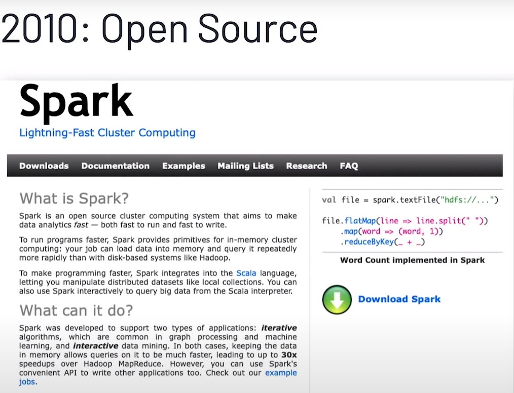
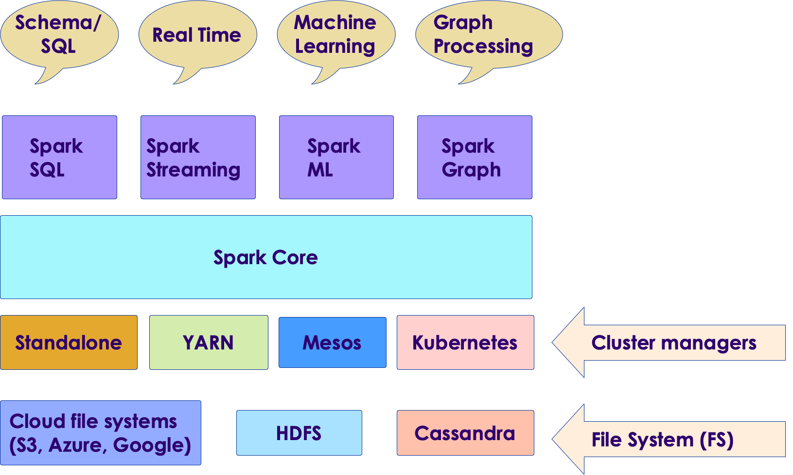
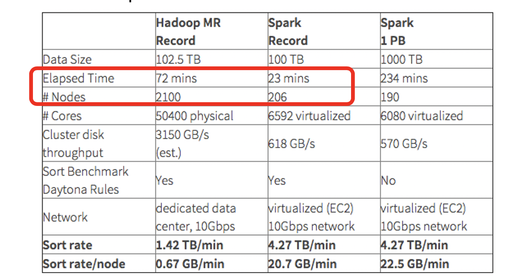
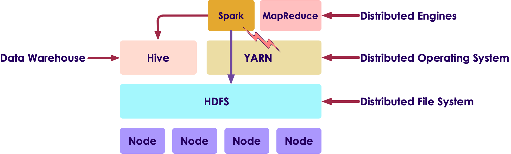
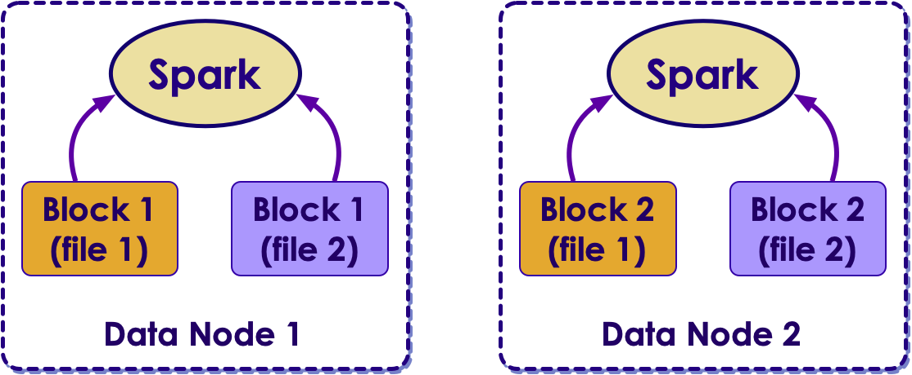
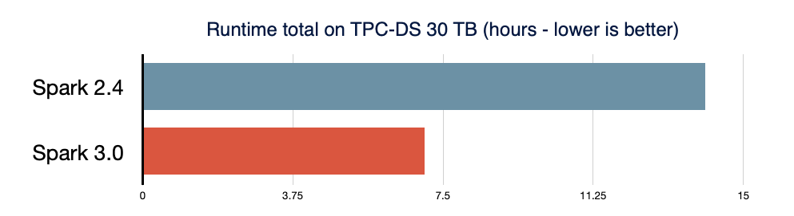
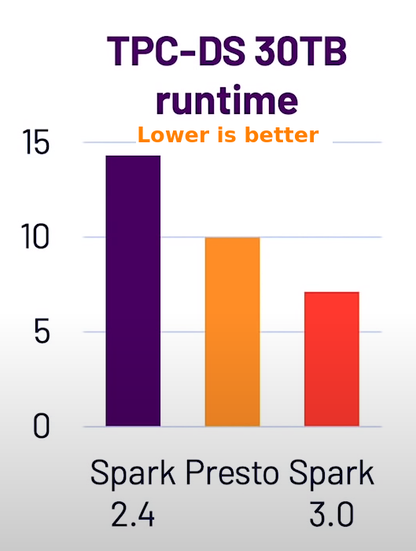
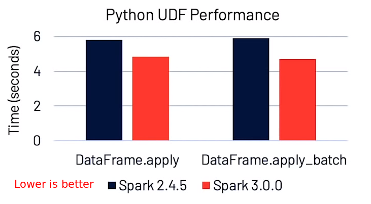
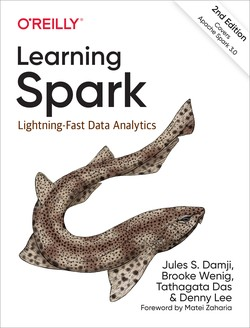
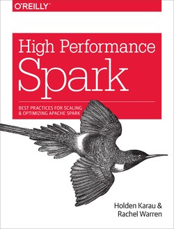

# Spark Introduction

  <!-- {"left" : 2.75, "top" : 6.35, "height" : 1.26, "width" : 2.38} -->

---

## Objectives

* Learn about Spark ecosystem
* Understand Spark use cases
* Installing and running Spark
* Using Spark Shell

---

# Spark Intro

---

## Big Data V1: Hadoop

<!-- {"left" : 7.31, "top" : 0.97, "height" : 0.66, "width" : 2.83} -->

* Hadoop was the first Big Data platform to be widely adopted

* Hadoop has three main components
   - Storage: **HDFS** - Store huge amount of data in a distributed fashion
   - Operating System: **YARN** - manage the cluster
   - Processing: **MapReduce Engine** - distributed computing

<!-- {"left" : 2.02, "top" : 5.6, "height" : 2.98, "width" : 6.21} -->

Notes:

---

## MapReduce Engine

<!-- {"left" : 6.96, "top" : 1.11, "height" : 0.99, "width" : 3.11} -->

* MapReduce was state of the art around 2008

* It was written for a time when
  - Data was on disk
  - And most processing was batch

* How ever MR had its limitations
  - It had high overhead
  - It didn't support 'in-memory' processing
  - It couldn't do 'streaming / real time' work loads

Notes:

---

## Spark

<!-- {"left" : 8.11, "top" : 1.11, "height" : 1.01, "width" : 1.91} -->

* [Spark](https://spark.apache.org) is an **open Source distributed computing engine**
  - Very fast: On-disk ops are **10x** faster than MR
  - In-memory ops **100x** faster than MR

* General purpose: MR, SQL, streaming, machine learning, analytics

* Hadoop compatible: Runs over Hadoop, Mesos, Yarn, or standalone

* Plays nicely with Big Data ecosystem (S3, Cassandra, HBase)

* Very easy to use API

* _"Spark is the First Big Data platform to integrate batch, streaming and interactive computations in a unified framework." - stratio.com_

---

## Spark's History

<!-- {"left" : 5.96, "top" : 1.11, "height" : 0.99, "width" : 3.11} -->

<!-- {"left" : 6.96, "top" : 1.11, "height" : 0.99, "width" : 3.11} -->

* Spark was created at [Berkeley AMP Lab](https://amplab.cs.berkeley.edu/) around 2009.  First open source release 2010

* Now top-level Apache project

* **[Databricks](https://databricks.com/)** -  Supporting and developing Spark
  - Founded by Spark's creators
  - Employs the most active committers

* Spark is now included with most modern Hadoop distributions

* [Nice video of Spark's history](https://youtu.be/OLJKIogf2nU) - from Spark + AI Summit 2020 

---

## Why is Spark Popular?

<!-- {"left" : 5.96, "top" : 1.11, "height" : 0.99, "width" : 3.11} -->

* Ease of use
   - Easy to get up and running
   - Develop on laptop, deploy on cluster

* Multiple language support
   - Java, Scala, Python and R
   - Developers (Java/Scala),   Data Scientists (Python, R)

* High performant

* Plays nice with BigData eco system

* Out of the box functionality
   - Modern functional programming constructs
   - Machine Learning / Streaming / Graph processing

* [Image source and reference](https://youtu.be/OLJKIogf2nU)

Notes:

---

## Spark Versions

| Version | Release Date | Description            |
|---------|--------------|------------------------|
| 1.0     | 2014-05-30   | Initial Apache release |
| 1.6     | 2016-01-04   | Stable 1.x release     |
| 2.0     | 2016-07      | Big update from V1     |
| 2.4     | 2020-01      | Stable v2 release      |
| 3.0     | 2020 Q2      | V3 release             |

<!-- {"left" : 0.25, "top" : 1.5, "height" : 3, "width" : 9.75} -->

Notes:

---

## Spark Components

<!-- {"left" : 0.58, "top" : 1.83, "height" : 5.41, "width" : 9.08} -->

Notes:

---

## Spark Components

<!-- {"left" : 0.58, "top" : 1.83, "height" : 5.41, "width" : 9.08} -->

* __Data Storage:__ Pluggable data storage systems
   - Integrates with HDFS, S3, Cassandra DB, and more

* __Cluster Manager:__
   - Runs Spark on multiple nodes
   - Provides the distributed execution environment
   - Works with Mesos, Yarn, Kubernetes, and its own standalone manager


Notes:

---

## Spark Components: Core

<!-- {"left" : 0.58, "top" : 1.83, "height" : 5.41, "width" : 9.08} -->

* **Core** has basic building blocks for distributed computing engine

* Task schedulers and memory management

* Fault recovery (recovers missing pieces on node failure)

* Storage system interfaces

---

## Spark Components

<!-- {"left" : 0.58, "top" : 1.83, "height" : 5.41, "width" : 9.08} -->

* __Spark SQL:__
   - Analyze structured data using SQL

* __Spark Streaming:__
   - Process live streams of data in real-time
   - Low latency, high throughput (1000s events per second)

* __Spark ML:__
   - Machine Learning at scale
   - Classification/regression, collaborative filtering

* __GraphX / GraphFrames:__
   - Graph manipulation, graph-parallel computation
   - Social network friendships, link data

---

## Spark is a Unified Stack

<!-- {"left" : 0.58, "top" : 1.83, "height" : 5.41, "width" : 9.08} -->

* Spark support multiple programming models
   - MapReduce style batch processing
   - Streaming/real-time processing
   - Querying via SQL
   - Machine learning
   - Graph Processing

* All modules are tightly integrated; Facilitates rich applications

* Spark can be the only stack you need!

---

# Spark Use Cases

---

## Spark Use Cases

<!-- {"left" : 7.43, "top" : 1.09, "height" : 1.21, "width" : 2.63} -->

* __Netflix__
   - Recommendations using Spark + Cassandra
   - Analyzes streaming events (450 billion events per day)
   - Personalization through recommendations
   - Sources: [1](http://bigdatausecases.info/entry/netflix-recommendations-using-spark-and-cassandra-cassandra-summit-2016),  [2](https://www.slideshare.net/DataStax/netflix-recommendations-using-spark-cassandra)

<!-- {"left" : 7.43, "top" : 1.09, "height" : 1.21, "width" : 2.63} -->

* __Starbucks__
   - 30,000+ stores generate Petabyte scale data
   - 1000+ data pipelines in Spark
   - Large scale machine learning using Spark
   - Stack:  Azure cloud + Spark + Delta Lake
   - [Source](https://databricks.com/customers/starbucks)

* More case studies @ [BigDataUseCases.Info](http://bigdatausecases.info/)

---

## Spark Use Cases

<!-- {"left" : 8.22, "top" : 0.96, "height" : 0.83, "width" : 1.99} -->

* __Teralytics__
   - Processing cell phone events
   - 180 billion events per day
   - Spark + HDFS
   - Estimating usage patterns to enhance coverage (sporting events, commuting, etc.)
   - Source: [1](http://bigdatausecases.info/entry/origin-destination-matrix-using-mobile-network-data-with-spark), [2](https://databricks.com/session/origin-destination-matrix-using-mobile-network-data-with-spark)

<!-- {"left" : 8.35, "top" : 4.29, "height" : 0.49, "width" : 1.85} -->

* __Yahoo__
   - News personalization
   - 120 line Scala program with ML lib replaced 15,000 lines of C++
   - Spark took 30 minutes to run on 100 million samples
   - [Source](https://www.dezyre.com/article/top-5-apache-spark-use-cases/271)

---

## More Spark Use Cases

* [CERN](https://databricks.com/session/cerns-next-generation-data-analysis-platform-with-apache-spark)

* [Genomics](https://databricks.com/session/scaling-genomics-on-apache-spark-by-100x)

* [Time series](https://databricks.com/session/distributed-indexing-framework-for-big-time-series-data-for-apache-spark)

* Checkout [customer success strories](https://databricks.com/customers/) at Databricks

---

## Spark at Large Scale

<!-- {"left" : 8.59, "top" : 1.02, "height" : 0.91, "width" : 1.58} -->

* Tencent (Social network in China)
  - 8000 nodes
  - 400 TB+ data

<br clear="all"/>  
<!-- {"left" : 7.72, "top" : 2.86, "height" : 0.5, "width" : 2.52} -->

* Alibaba (largest e-commerce site in China)
  - 1 PB scale processing
  - Large scale image processing

<br clear="all"/>  
<!-- {"left" : 7.96, "top" : 4.01, "height" : 0.91, "width" : 2.16} -->

* Streaming @ Jenelia Farm
  - 1 TB per hour
  - Analyze medical images

---

# Spark and Hadoop

---

## Spark and Hadoop Timeline

| Hadoop    | Year | Spark                                      |
|-----------|------|--------------------------------------------|
| Created   | 2006 |                                            |
|           | 2009 | Starts at AMP lab                          |
|           | 2010 | Open sourced                               |
| Version 1 | 2011 |                                            |
| Version 2 | 2013 |                                            |
|           | 2014 | Version 1, <br /> Apache top level project |
|           | 2016 | Version 2                                  |
| Version 3 | 2019 |                                            |
|           | 2020 | Version 3                                  |

<!-- {"left" : 0.25, "top" : 1.32, "height" : 5.19, "width" : 9.75} -->

---

## Spark vs. MapReduce

<!-- {"left" : 0.66, "top" : 1.53, "height" : 6.02, "width" : 8.93} -->

---

## Spark vs. MapReduce

* Spark is easier to use than MapReduce

* Friendlier development environment
  - Interactive shells allow faster development
  - Web based UI notebooks allow easier development

* Multiple language support: Java, Python, Scala, R

* Spark is high performant than MR

---

## Spark vs. MapReduce Benchmark

* Daytona Grey Benchmark: Sort 100TB of data
* References:
   - [Databricks blog](https://databricks.com/blog/2014/11/05/spark-officially-sets-a-new-record-in-large-scale-sorting.html)
   - http://sortbenchmark.org/

<!-- {"left" : 1.02, "top" : 3.48, "height" : 4.52, "width" : 8.21} -->

---

## Spark and Hadoop

* Hadoop is a **Data Platform**  comprised of:
   - HDFS: File system
   - YARN: Cluster manager
   - Hive: Data warehouse
   - Engines: MapReduce, Spark

* Spark and Hadoop work well together
   - Spark can utilize HDFS distributed data

<!-- {"left" : 0.48, "top" : 3.29, "height" : 3.07, "width" : 9.29} -->

---

# Running Spark

---

## Spark is a Distributed Engine

* Spark is distributed / cluster system
   - Runs on many nodes to achieve scaling
   - Spark has been demonstrated to scale to thousands of nodes!

* Spark is a Master-Worker architecture

* __Master__ plays coordinator role

* __Workers__ perform computation

<!-- {"left" : 6.76, "top" : 0.88, "height" : 4.37, "width" : 3.28} -->

---

## Spark Runtimes

* On-Premise
  - Spark is part of most modern Hadoop distributions
  - Spark can also be downloaded and installed as a standalone system

* Hosted solutions
  - Databricks cloud - hosted Spark platform
  - Cloud vendors: Amazon, Azure, Google

<br clear="all" />

<!-- {"left" : 0.32, "top" : 5.52, "height" : 0.37, "width" : 2.19} -->
 &nbsp;  &nbsp;<!-- {"left" : 3, "top" : 5.35, "height" : 0.71, "width" : 2.17} -->
 &nbsp;  &nbsp;<!-- {"left" : 5.56, "top" : 5.38, "height" : 0.63, "width" : 1.68} -->
 &nbsp;  &nbsp;<!-- {"left" : 7.63, "top" : 5.35, "height" : 0.71, "width" : 2.46} -->

---

## Databricks

<!-- {"left" : 5.84, "top" : 1.09, "height" : 4.5, "width" : 4.4} -->

* Founded by Spark's founders

* Develops majority of Spark platform and offers commercial support

* Also provides hosted Spark platform (**Databricks Cloud**)

* Databricks is recognized as a leading provider for Data Analytics and Machine Learning platform  (Source: [Gartner report](https://databricks.com/p/whitepaper/gartner-magic-quadrant-2020-data-science-machine-learning))

<!-- {"left" : 0.6, "top" : 7.87, "height" : 0.56, "width" : 3.28} -->

---

## Databricks Cloud

<!-- {"left" : 5.58, "top" : 1.26, "height" : 2.8, "width" : 4.34} -->

* A hosted platform of Spark

* Zero maintenance

* Auto scale  based on work loads

* Community edition is free
  - A single node with 6GB memory
  - Notebook environment

* https://community.cloud.databricks.com/

---

## Spark in the Cloud

* Spark is pretty well supported on all major cloud platforms

* Basic idea:
   - Upload data into Cloud storage
   - Spin up on-demand Spark cluster to process your data
   - Shutdown when done
   - Pay for use of compute and storage

* Amazon offers **Elastic Map Reduce (EMR)** that includes Spark

* Google has **DataProc** that provisions Spark clusters

* Azure has **HDInsight*** that includes Spark

<br clear="all" />

<!-- {"left" : 3, "top" : 5.35, "height" : 0.71, "width" : 2.17} -->
 &nbsp;  &nbsp;<!-- {"left" : 5.56, "top" : 5.38, "height" : 0.63, "width" : 1.68} -->
 &nbsp;  &nbsp;<!-- {"left" : 7.63, "top" : 5.35, "height" : 0.71, "width" : 2.46} -->

---

## System Requirements

* Operating system
  - Development: Windows, Mac, Linux
  - Deployment: Linux
* Languages:
   - Spark 3:  JDK 11, Scala 2.12+,  Python 3
   - Spark 2:  JDK 8 or 11,  Scala 2.11,  Python 2 or 3
* Hardware

| Resource | Development                       | Production                                                        |
|----------|-----------------------------------|-------------------------------------------------------------------|
| CPU      | 2+ core                           | 12+ core                                                          |
| Memory   | 4+ G                              | 256+ G                                                            |
| Disk     | - Single spindle <br/> - Few gigs | - Multiple spindles <br /> - Several Terabytes per node <br />  |

---

## Scaling on Hadoop (On Premise)

* Hadoop achieves scale by **co-locating** data and compute
* So applications running on Hadoop cluster, mostly process local data (aka **data locality**)
* Pros:
   - Works well on on-prem architecture (1G-10G networks)
   - Very fast processing, because of data locality
* Cons:
   - The cluster size is fixed; very hard to scale up/down dynamically based on demand

<!-- TODO shiva -->
<!-- {"left" : 6.76, "top" : 0.88, "height" : 4.37, "width" : 3.28} -->
<!-- {"left" : 6.76, "top" : 0.88, "height" : 4.37, "width" : 3.28} -->

---

## Spark Scaling on the Cloud

<!-- TODO shiva -->
  <!-- {"left" : 1.02, "top" : 3.44, "height" : 4.98, "width" : 8.21} -->  

* In Cloud architecture, storage and compute are separate!

* Compute nodes stream data from storage (called buckets)

* For this to work, compute nodes and storage must have **ultra high speed** network

* Google built the next gen network for their data centers  using custom hardware, software, network switches ([source](https://cloudplatform.googleblog.com/2015/06/A-Look-Inside-Googles-Data-Center-Networks.html))

* It can deliver more than **1 Petabit/sec** of total bisection bandwidth.

* To put this in perspective,
   - enough for 100,000 servers to exchange information at 10Gb/s each
   - enough to read the entire scanned contents of the Library of Congress in less than 1/10th of a second

---

## Spark Scaling on the Cloud

<!-- TODO shiva -->
  <!-- {"left" : 1.02, "top" : 3.44, "height" : 4.98, "width" : 8.21} -->  

* Pros:
   - Gives a lot of flexibility on scaling and scheduling computes
   - Can dynamically scale compute capacity up/down
   - Leverages massive infrastructure the cloud vendors have
   - Implemented by cloud vendors / hosted platforms

* Cons:
   - Not easily implemented on-prem/in-house
   - Need to be on a cloud environment
   - Costs can add up for storage and compute

---

## Running a Spark Job

* When a Spark application is launched, the following things happen:
   - Spark talks to the **cluster manager (CM)**, to request resources
   - CM allocates resources for the Spark application
   - Spark then distributes the code to **worker nodes**
   - **Executors** on worker nodes start computing
   - Each Executor can employ multiple **tasks** to parallelize the work

<!-- TODO shiva -->
<!-- {"left" : 6.76, "top" : 0.88, "height" : 4.37, "width" : 3.28} -->

---

## Parallelizing Computations

<!-- TODO shiva -->
<!-- {"left" : 0.58, "top" : 1.83, "height" : 5.41, "width" : 9.08} -->

* Here is a simple example of doing a COUNT in a distributed way

* Each worker computes the count for the data it has

* And then an 'aggregator (reducer)' combines the results from multiple workers to produce a final count

* Machine learning computations are more complex; But Spark handles the parallelism

---

# Spark 3

---

## Spark 3

<!-- {"left" : 5.96, "top" : 1.11, "height" : 0.99, "width" : 3.11} -->
<!-- {"left" : 5.96, "top" : 1.11, "height" : 0.99, "width" : 3.11} -->

* Spark 3 is a big release;  2020 Q3
* __Performance focused__
* Over 3400+ patches (alost half of them for Spark SQL)
* Easy to switch from 2.x
* Spark 3 features:
   - Delta Lake
   - Spark SQL improvements (adaptive query execution)
   - Better python performance
   - Better Structured Streaming + metrics
   - More on these in the next slides
* References
   - [Spark Summit 2020 Keynote - Spark 3](https://youtu.be/OLJKIogf2nU)
   - [Introducing Apache Spark 3.0 - blog](https://databricks.com/blog/2020/06/18/introducing-apache-spark-3-0-now-available-in-databricks-runtime-7-0.html)
   - [Spark 3.0 Features with Examples](https://sparkbyexamples.com/spark/spark-3-0-features-with-examples-part-i/)

---

## Spark 3 SQL Improvements

<!-- {"left" : 5.96, "top" : 1.11, "height" : 0.99, "width" : 3.11} -->

<!-- {"left" : 5.96, "top" : 1.11, "height" : 0.99, "width" : 3.11} -->

* Spark SQL is very widely used

* Spark has one of the best SQL engines around

* ANSI SQL support improved

* __Adaptive Query Execution (AQE)__:
   - Can adjust execution plan at runtime (change number of reduces ..etc)
   - Can even observe **data skew** and make changes (This is a big deal, as it happens a lot in real life workloads)
   - Can do effective joins automatically

* [Source](https://youtu.be/OLJKIogf2nU)

---

## Spark 3 Python Improvements

* New APIs for Pandas function

* Faster [Apache Arrow](https://arrow.apache.org/) based calls to Python user code
   - Apache Arrow is a language-independent columnar memory format, for efficient operations on modern hardware like CPUs and GPUs. 
   - Also supports zero-copy reads for lightning-fast data access without serialization overhead.

* UDFs (User Defined Functions) are easier to write and perform better

* [Source](https://youtu.be/OLJKIogf2nU)

<!-- {"left" : 5.96, "top" : 1.11, "height" : 0.99, "width" : 3.11} -->

---

## Spark 3 and GPU

<!-- {"left" : 5.96, "top" : 1.11, "height" : 0.99, "width" : 3.11} -->

* Spark 3 recognizes GPUs as a first-class resource along with CPU and system memory

* So Spark can place GPU-accelerated workloads directly onto servers containing the necessary GPU resources

* Operations on Dataframes, Spark SQL and Spark ML can utilize GPU

* [NVIDIA Rapids](https://www.nvidia.com/en-us/deep-learning-ai/solutions/data-science/apache-spark-3/) library enables GPU acceleration for Spark

- References:
   - [NVIDIA page on Spark + GPU](https://www.nvidia.com/en-us/deep-learning-ai/solutions/data-science/apache-spark-3/)
   - [Get free ebook on Spark + GPU](https://www.nvidia.com/en-us/deep-learning-ai/solutions/data-science/apache-spark-3/ebook-sign-up/)

---

## Spark Ecosystem Projects

* [Koalas](https://github.com/databricks/koalas) :  Pandas API over Spark

* [Delta Lake](https://delta.io/) - Reliable, transactional table storage for Big Data

* [Scikit Learn on Spark](https://pypi.org/project/spark-sklearn/)  Run ML algorithms from Scikit Learn library on Spark

* [Spark Rapids](https://nvidia.github.io/spark-rapids/) - GPU acceleration

* [Data-fu Spark](https://datafu.apache.org/docs/spark/getting-started.html) - A good collection of UDFs for Spark

* [MLFLow](https://mlflow.org/) - Manage machine learning lifecycle

* [More](https://spark.apache.org/third-party-projects.html) 

<!-- {"left" : 6.76, "top" : 0.88, "height" : 4.37, "width" : 3.28} -->
<!-- {"left" : 6.76, "top" : 0.88, "height" : 4.37, "width" : 3.28} -->

---

## Delta Lake

* Delta Lake is an implementation of modern Data Lake

* Features:
    - Fully atomic operations
    - Transactions are supported
    - Scalable to massive amount of data

* For more details see **Delta-Lake** section

---

## Future of Spark

* [Project Zen](https://databricks.com/blog/2020/09/04/an-update-on-project-zen-improving-apache-spark-for-python-users.html) - Improve Python usability and Spark

* Continue improving Spark SQL Adaptive Query Execution (AQE) engine

* Continue improving ANSI SQL compliance

---

## Further Reading

* [Learning Spark - 2nd edition](https://www.oreilly.com/library/view/learning-spark-2nd/9781492050032/) by Jules S. Damji, Brooke Wenig, Tathagata Das, Denny Lee

* [High Performance Spark](https://www.oreilly.com/library/view/high-performance-spark/9781491943199/) by Holden Karau, Rachel Warren

* [Spark - 10 years](https://youtu.be/OLJKIogf2nU) - from Spark + AI Summit 2020 

* [Databricks blog](https://databricks.com/blog) - keep up with latest Spark news

<!-- {"left" : 6.76, "top" : 0.88, "height" : 4.37, "width" : 3.28} -->  &nbsp; 
<!-- {"left" : 6.76, "top" : 0.88, "height" : 4.37, "width" : 3.28} -->

---

# Hands on With Spark

---

## Lab: Access Lab Environment

<!-- {"left" : 1.84, "top" : 6.25, "height" : 2.18, "width" : 6.57} -->
<!-- {"left" : 5.8, "top" : 1.1, "height" : 4.02, "width" : 4.3} -->

* We can use either
   - training VMs in the Cloud
   - or [Databricks community cloud](https://community.cloud.databricks.com/)

* If using **training VMs**
  - Allocate VMs to students in class

  - Point them to IP address of the machine

  - Access the IP address in a browser

  - Make sure they can see the sandbox splash page

---

## Lab: Test Jupyter + Spark UI

 <!-- {"left" : 5.52, "top" : 1.8, "height" : 4.4, "width" : 4.46} -->

 * Access **Jupyter Labs**

 * Access **Spark Master UI**

 * If accessing services don't work, it is highly likely a network issue. Try the following
     - Try proxy access button
     - Disable any VPN software on student's laptop
     - Connect to 'guest' network
     - Try connecting via 'mobile hotspot'

Notes:

---

## Lab: Distribute Lab Bundle

* **To instructor:**
   - create a lab bundle

```bash
        $   cd spark-labs
        $  ./assemble-labs.sh
```

<!-- {"left" : 0, "top" : 2.37, "height" : 1.05, "width" : 5.62} -->

* This will create a zip file (`labs.out/spark-labs.zip`)
* Distribute this bundle to students
    - Upload it to Google drive or Amazon S3
    - **Explain the difference between .md, .ipynb, .html files**

* **To students**
     - You can open html files in browser to see lab instructions
     - If you have Jupyter environment setup, you can run
     __`./run-jupyter.sh`__
     and view the notebooks

Notes:

---

## Lab: Lab Setup

<!-- {"left" : 7.02, "top" : 1.16, "height" : 3.88, "width" : 2.91} -->

* **Overview:**
   - Setting up the labs

* **Approximate time:**
   - 5 mins

* **Instructions:**
   - **SETUP-1** : instructions in the lab bundle

Notes:

---

## Lab:  Testing123

<!-- {"left" : 7.02, "top" : 1.16, "height" : 3.88, "width" : 2.91} -->

* **Overview:**
   - Testing the environment

* **Approximate time:**
   - 5 mins

* **Instructions:**
   - Testing123

Notes:

---

## Lab: First Look at Spark

<!-- {"left" : 6.76, "top" : 0.88, "height" : 4.37, "width" : 3.28} -->

* **Overview:**
   - We will get started with Spark

* **Approximate run time:**
   - 20-30 mins

* **Instructions:**
   - **Start-1**: First look at Spark (lab 2.1)

Notes:

---

## Review and Q&A

<!-- {"left" : 8.24, "top" : 1.21, "height" : 1.28, "width" : 1.73} -->

* Let's go over what we have covered so far

* Any questions?

<!-- {"left" : 2.69, "top" : 4.43, "height" : 3.24, "width" : 4.86} -->
