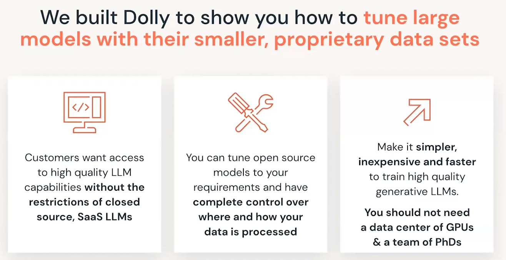
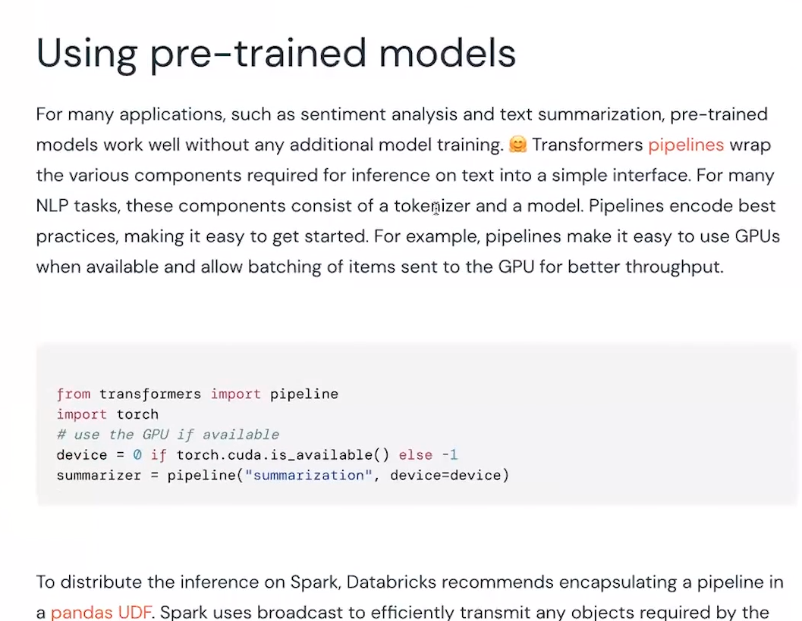

# LLM on DataBricks

## LLM
* LLM stands for Large Language Models (think ChatGPT)

---

## LLM
* LLM stands for Large Language Models (think ChatGPT)

---

## LLM
* LLM stands for Large Language Models (think ChatGPT)

---

## LLM
* LLM stands for Large Language Models (think ChatGPT)

---

## LLM
* LLM stands for Large Language Models (think ChatGPT)

---

## LLM
* LLM stands for Large Language Models (think ChatGPT)

---

## LLM
* LLM stands for Large Language Models (think ChatGPT)
  

---

## LLM
* LLM stands for Large Language Models (think ChatGPT)
  

---

## LLM
* LLM stands for Large Language Models (think ChatGPT)
  

---

## LLM
* LLM stands for Large Language Models (think ChatGPT)
  

---

## LLM
* LLM stands for Large Language Models (think ChatGPT)
  

---

## LLM
* LLM stands for Large Language Models (think ChatGPT)
  

---

## LLM
* LLM stands for Large Language Models (think ChatGPT)
  

---

## LLM
* LLM stands for Large Language Models (think ChatGPT)
  

---

## LLM
* LLM stands for Large Language Models (think ChatGPT)
  

---

## LLM
* LLM stands for Large Language Models (think ChatGPT)
  

---

## LLM
* LLM stands for Large Language Models (think ChatGPT)
  

---

## LLM
* LLM stands for Large Language Models (think ChatGPT)
  

---

## LLM
* LLM stands for Large Language Models (think ChatGPT)
  

---

## LLM
* LLM stands for Large Language Models (think ChatGPT)
  

---

## LLM
* LLM stands for Large Language Models (think ChatGPT)
  

---

## LLM
* LLM stands for Large Language Models (think ChatGPT)
  

---

## LLM
* LLM stands for Large Language Models (think ChatGPT)
  

---

## LLM
* LLM stands for Large Language Models (think ChatGPT)
  

---

## LLM
* LLM stands for Large Language Models (think ChatGPT)
  

---

## LLM
* LLM stands for Large Language Models (think ChatGPT)
  

---

## LLM
* LLM stands for Large Language Models (think ChatGPT)
  

---

## LLM
* LLM stands for Large Language Models (think ChatGPT)
  

---

## LLM
* LLM stands for Large Language Models (think ChatGPT)
  

---

## LLM
* LLM stands for Large Language Models (think ChatGPT)
  

---

## LLM
* LLM stands for Large Language Models (think ChatGPT)
  

---

## LLM
* LLM stands for Large Language Models (think ChatGPT)
  

---

## LLM
* LLM stands for Large Language Models (think ChatGPT)
  

---

## LLM
* LLM stands for Large Language Models (think ChatGPT)
  

---

## LLM
* LLM stands for Large Language Models (think ChatGPT)
  

---

## LLM
* LLM stands for Large Language Models (think ChatGPT)
  

---

## LLM
* LLM stands for Large Language Models (think ChatGPT)
  

---
