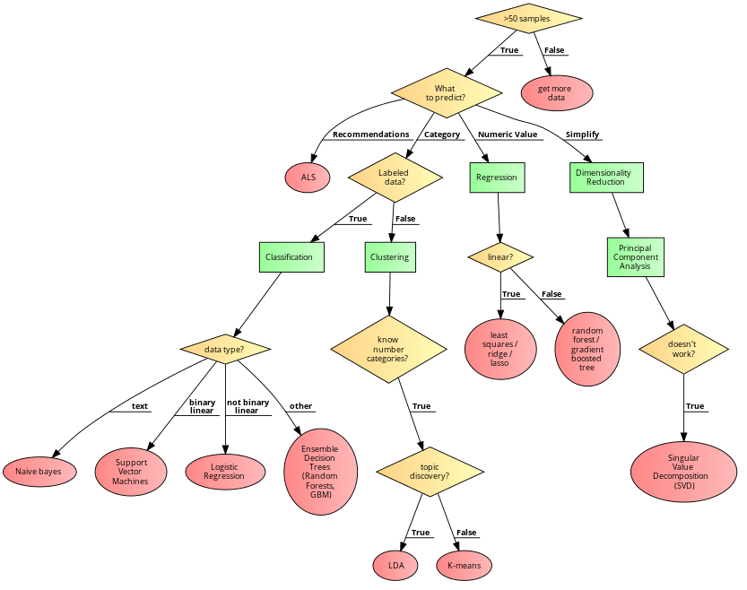

# Spark Machine Learning Library (Spark ML)

  <!-- {"left" : 2.75, "top" : 6.35, "height" : 1.26, "width" : 2.38} -->

---

## Objectives

* Learn about Spark ML
* Algorithm overview
* Using Spark ML

---

# Spark ML Intro

---

## Spark Components

<!-- {"left" : 0.58, "top" : 1.83, "height" : 5.41, "width" : 9.08} -->

Notes:

---

## Machine Learning @ Scale

* Traditionally  ML has been performed on small set of data, usually on a single machine

* As the data volume started going up, we needed scale

* And distributed systems like Hadoop/Spark offered a great platform to build scalable ML

<!-- {"left" : 0.58, "top" : 1.83, "height" : 5.41, "width" : 9.08} -->

---

## Machine Learning @ Scale

* Going from laptop to cluster requires lot of effort
  -Usually involves multiple teams

* Spark enables laptop-->cluster
  -Develop on laptop
  -Deploy on cluster

* Cloud vendors are trying simplify this too

<!-- TODO shiva -->
<!-- {"left" : 0.58, "top" : 1.83, "height" : 5.41, "width" : 9.08} -->

---

## Scalable ML with Hadoop

* Hadoop was the first popular distributed platform

* 'Mahout' is a machine learning library built on top of Hadoop's MapReduce (MR)
 engine

* How ever, MR wasn't so great for iterative algorithms (machine learning)

---

## Scalable ML on Spark

* One of the design goals of Spark was to be a distributed ML Engine

  -k engine is much faster than MR; it does great at iterative tasks
    - Lot of ML algorithms iterate over data to find convergence

  -k includes a native ML library
  -Includes lot of popular algorithms out of the box!
    - And the implementations are parallelized!

  -k supports caching datasets in memory:
  -Datasets can be entirely cached in memory
    - And then do **in-memory compute** --> Super fast!

  -iple language APIs are supported: Java / Scala / Python / R
    - **Spark + Python** is a very popluar combination
---

## Parallelizing Computations

<!-- TODO shiva -->
<!-- {"left" : 0.58, "top" : 1.83, "height" : 5.41, "width" : 9.08} -->

* Here is a simple example of doing a COUNT in a distributed way

* Each worker computes the count for the data it has

* And then an 'aggregator (reducer)' combines the results from multiple workers to produce a final count

* Machine learning computations are more complex; But Spark handles the parallelism

---

## Spark ML Library Evolution

  -ier version of Spark ML implementation is **Spark MLLib**
  -It is built on RDD data structures
    - Not the highest performance

  -r implementation is **Spark ML**
    - Uses newer/faster data structures ('dataframes/datasets')

* Recommended to use the newer **ML** library

* The older library is in maintenance mode

---

## SparkML Algorithm Overview

<!-- {"left" : 6.76, "top" : 0.88, "height" : 4.37, "width" : 3.28} -->

---

## Lab: Doing XYZ

<!-- {"left" : 6.76, "top" : 0.88, "height" : 4.37, "width" : 3.28} -->

  -erview:**
    - Work with xyz

  -proximate run time:**
    - 20-30 mins

  -structions:**
    - Please complete A, B, C

Notes:

---

## Review and Q&A

<!-- {"left" : 8.24, "top" : 1.21, "height" : 1.28, "width" : 1.73} -->

* Let's go over what we have covered so far

* Any questions?

<!-- {"left" : 2.69, "top" : 4.43, "height" : 3.24, "width" : 4.86} -->
