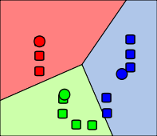
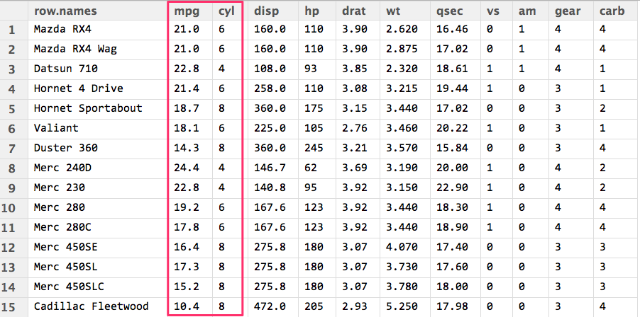
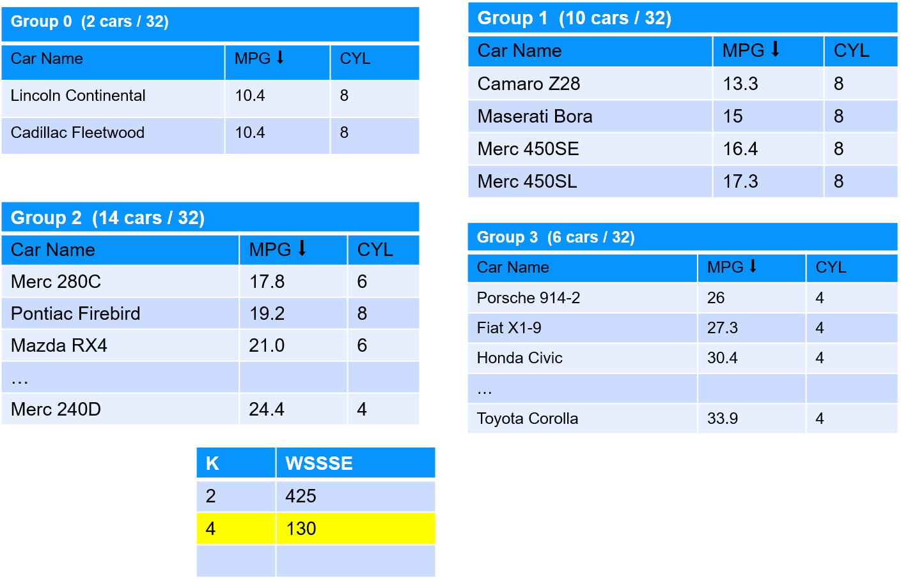

# Machine Learning with Spark

  <!-- {"left" : 2.75, "top" : 6.35, "height" : 1.26, "width" : 2.38} -->

---

## Objectives

* Machine learning overview
* Algorithm overview
* Learn about Spark ML

---

# Machine Learning Primer

---

## Machine Learning is Taking Over the World

 <!-- {"left" : 5.3, "top" : 1.23, "height" : 3.54, "width" : 4.72} -->

* Think of something you did today / this week that is AI powered

---

[../../machine-learning/generic/ML-What-is-ML.md](../../machine-learning/generic/ML-What-is-ML.md)

---

## Machine Learning Use Cases

|       Finance       |         Healthcare        |        Retail       |        Manufacturing       |    Network & Security    |
|:-------------------:|:-------------------------:|:-------------------:|:--------------------------:|:------------------------:|
| Fraud Detection     | Diagnosis                 | Recommendations     | Identify defects           | Identify security breach |
| Algorithmic trading | Patient care              | Customer retentions | Fully automated assemblies | Facial recognition       |
| Credit Approvals    | Treatment recommendations |                     |                            |                          &nbsp;|

<!-- {"left" : 0.1, "top" : 1.17, "height" : 3.08, "width" : 10.05, "columnwidth" : [1.88, 2.14, 2.23, 1.94, 1.86]} -->

---

## Machine Learning Algorithms

* Regressions
    - When we need to predict numbers
    - Examples:  house prices, stock prices ...etc

* Classifications
    - When we need to categorize things
    - Examples: classifying emails as spam or not;  categorizing credit card transactions as fraud or not

* Clustering
    - When we need to segment things
    - Examples: segmenting network traffic

---

## Regression

* Let's calculate house price from a few inputs

* Here we have some data points we can learn from, and then we predict on new data

* Typically 'learning data' can be 100s or 1000s of data points.  Large data can be millions of data points

| Bedrooms (input 1) | Bathrooms (input 2) | Size (input 3) | Predicted Sale Price (in thousands) |
|--------------------|---------------------|----------------|------------------------------------------------------|
| 3                  | 1                   | 1500           | 230                                                  |
| 3                  | 2                   | 1800           | 320                                                  |
| 5                  | 3                   | 2400           | 600                                                  |
| 4                  | 2                   | 2000           | ???                                                  |
| 4                  | 3.5                 | 2200           | ???

<!-- {"left" : 0.25, "top" : 3.16, "height" : 1.69, "width" : 9.75, "columnwidth" : [1.61, 1.86, 1.92, 4.36]} -->

---

## Classification

* Classification is a model that predicts data into "buckets"
    - Email is  **SPAM**  or  **HAM**  (not-SPAM)
    - A cell is  **cancerous**  or  **healthy**
    - Hand-written numbers -> any digits -1, 0, 1,..., 8

* Classification algorithm learns from training data (Supervised learning) and predicts on new data

* In the example below, we input mixed data to the model, and the model classifies them into A or B

<!-- {"left" : 1.21, "top" : 5.37, "height" : 2.88, "width" : 7.83} -->

---

## Clustering

* Clustering finds natural groupings in data

* Here we are grouping alcohol beverages according to 2 dimensions (alcohol %, fizziness); And we see similar drinks fall into natural groups

* In real world applications, we could be clustering by many dimensions (10s or 100s)

<!-- {"left" : 5.41, "top" : 1.5, "height" : 1.79, "width" : 4.72} -->

---

## Clustering Application: Fraud/Anomaly Detection

<!-- TODO shiva -->
<!-- {"left" : 2.34, "top" : 3.62, "height" : 4.52, "width" : 5.57} -->

* Anomaly detection is used to:

    - Find fraud

    - Detect network intrusion attack

    - Discover problems on servers

* Here we see an anomaly (top left) that doesn't fall into the usual pattern (bottom right)

Notes:

---

# Spark ML Intro

---

## Spark Components

<!-- {"left" : 0.58, "top" : 1.83, "height" : 5.41, "width" : 9.08} -->

Notes:

---

## Machine Learning @ Scale

* Traditionally  ML has been performed on small set of data, usually on a single machine

* As the data volume started going up, we needed scale

* And distributed systems like Hadoop/Spark offered a great platform to build scalable ML

<!-- {"left" : 0.58, "top" : 1.83, "height" : 5.41, "width" : 9.08} -->

---

## Machine Learning @ Scale

* Going from laptop to cluster requires lot of effort
  - Usually involves multiple teams

* Spark enables laptop-->cluster
  - Develop on laptop
  - Deploy on cluster

* Cloud vendors are trying simplify this too

<!-- TODO shiva -->
<!-- {"left" : 0.58, "top" : 1.83, "height" : 5.41, "width" : 9.08} -->

---

## Scalable ML with Hadoop

* Hadoop was the first popular distributed platform

* 'Mahout' is a machine learning library built on top of Hadoop's MapReduce (MR) engine

* How ever, MR wasn't so great for iterative algorithms (machine learning)

---

## Scalable ML on Spark

* One of the design goals of Spark was to be a distributed ML Engine

* Spark engine is much faster than MR; it does great at iterative tasks
  - Lot of ML algorithms iterate over data to find convergence

* Spark includes a native ML library
  - Includes lot of popular algorithms out of the box!
    - And the implementations are parallelized!

* Spark supports caching datasets in memory:
  - Datasets can be entirely cached in memory
  - And then do **in-memory compute** --> Super fast!

* Multiple language APIs are supported: Java / Scala / Python / R
    - **Spark + Python** is a very popluar combination

---

## Parallelizing Computations

<!-- TODO shiva -->
<!-- {"left" : 0.58, "top" : 1.83, "height" : 5.41, "width" : 9.08} -->

* Here is a simple example of doing a COUNT in a distributed way

* Each worker computes the count for the data it has

* And then an 'aggregator (reducer)' combines the results from multiple workers to produce a final count

* Machine learning computations are more complex; But Spark handles the parallelism

---

## Spark ML Library Evolution

* Earlier version of Spark ML implementation is **Spark MLLib**
    - It is built on RDD data structures
    - Not the highest performance

* Newer implementation is **Spark ML**
    - Uses newer/faster data structures ('dataframes/datasets')

* Recommended to use the newer **ML** library

* The older library is in maintenance mode

---

## SparkML Algorithm Overview

<!-- {"left" : 6.76, "top" : 0.88, "height" : 4.37, "width" : 3.28} -->

---

# Clustering with Spark ML

---

## KMeans Clustering

* K-means will partition a data set into K  **distinct, non-overlapping** segments/clusters

* To start K-Means, we need to specify the number of clusters (K)

* Visualizations: [viz1](https://www.naftaliharris.com/blog/visualizing-k-means-clustering/), [viz2](http://www.bytemuse.com/post/k-means-clustering-visualization/)

<!-- {"left" : 1.27, "top" : 1.08, "height" : 3.86, "width" : 7.71} -->

---

## K-Means Clustering Walkthrough

* **Step 1:** Centroids are randomly seeded in the data.  
Example: 3 centroids (red, green, blue)
* **Step 2:** Each point in the dataset is associated with its nearest centroid, as determined by a distance measurement.
* **Step 3:** The centroid (geometric center) of the clustered points becomes the new centroid of that cluster. Each centroid  updated.
* **Step 4:** Repeat steps 2 and 3 until convergence is reached (the points move less than the threshold amount).

  &nbsp; &nbsp; <!--  {"left" : 0.19, "top" : 6.01, "height" : 2.39, "width" : 2.48} --><!--  {"left" : 2.88, "top" : 6.32, "height" : 1.76, "width" : 2.04} --> &nbsp; &nbsp; <!--  {"left" : 4.68, "top" : 6.01, "height" : 2.39, "width" : 2.77} --> &nbsp; &nbsp; <!--  {"left" : 7.6, "top" : 6.32, "height" : 1.76, "width" : 2.04} -->

---

## MTCars Clustering

<!--  {"left" : 5.18, "top" : 2.72, "height" : 2.47, "width" : 4.97} -->

* We are going to cluster cars using two attributes: MPG & CYL

* This is `mtcars` dataset, has 32 data points

* Attributes
    - name - name of the car
    - mpg - Miles/(US) gallon
    - cyl - Number of cylinders
    - disp - Displacement (cu.in.)
    - hp - Gross horsepower
    - drat - Rear axle ratio

---

## Starting With K = 2  (Find 2 clusters)

<!-- {"left" : 1.02, "top" : 2.29, "height" : 4.48, "width" : 8.21} -->

---

## Starting With K = 4  (Find 4 clusters)

<!-- {"left" : 1.02, "top" : 1.89, "height" : 5.28, "width" : 8.21} -->

---

## Evaluating K-Means With WSSSE

* Goal is to  **minimize WSSSE** with  **reasonable effort**

* We look for elbows - that indicates a reasonable clustering

* After the elbow, the improvement is minimal

* **Question for class:** At  **k=32**  we have achieved  **WSSSE=0** , as in perfect fit !How is that?

<!-- {"left" : 1.02, "top" : 4.1, "height" : 3.5, "width" : 8.21} -->

---

## Lab: KMeans with Spark

<!-- {"left" : 6.76, "top" : 0.88, "height" : 4.37, "width" : 3.28} -->

* **Overview:**
    - Run KMeans algorithm with Spark

* **Approximate run time:**
    - 20-30 mins

* **Instructions:**
    - Follow KMeans instructions

---

## Review and Q&A

<!-- {"left" : 8.24, "top" : 1.21, "height" : 1.28, "width" : 1.73} -->

* Let's go over what we have covered so far

* Any questions?

<!-- {"left" : 2.69, "top" : 4.43, "height" : 3.24, "width" : 4.86} -->
