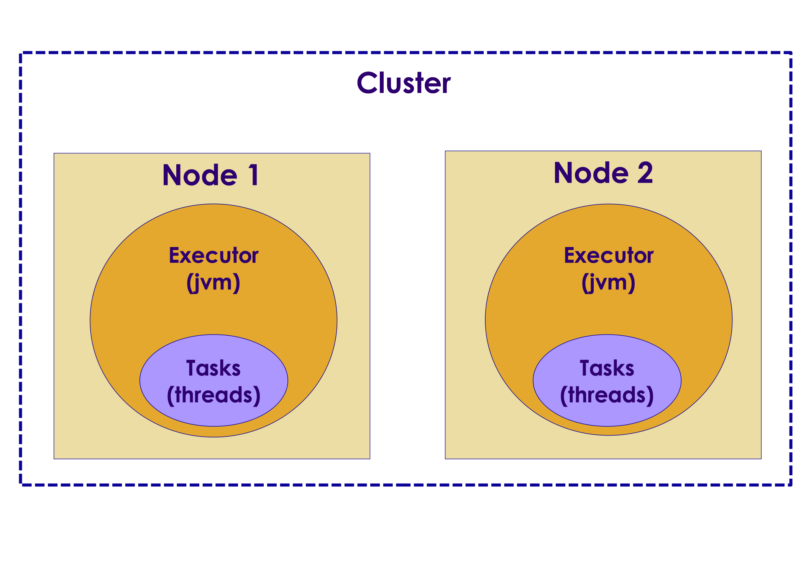
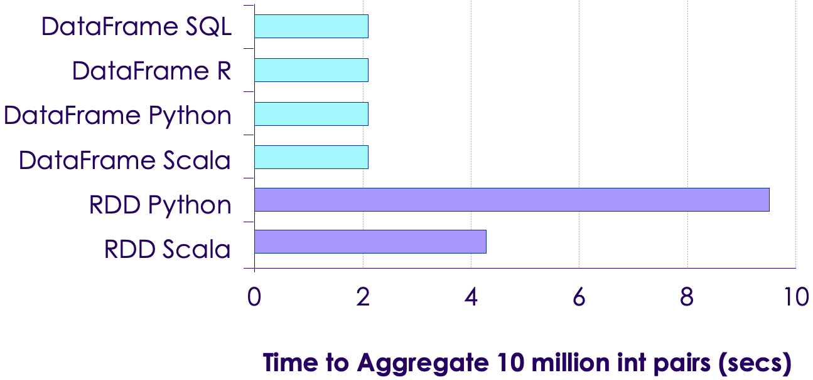
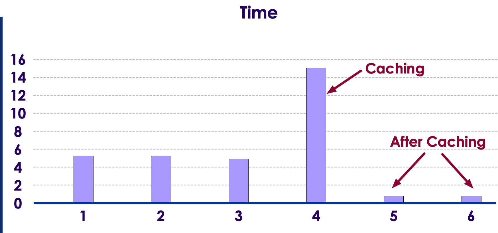
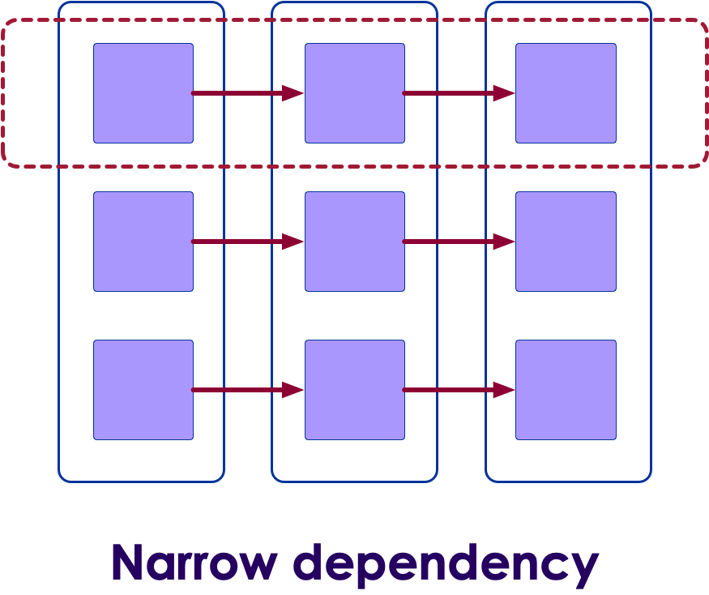
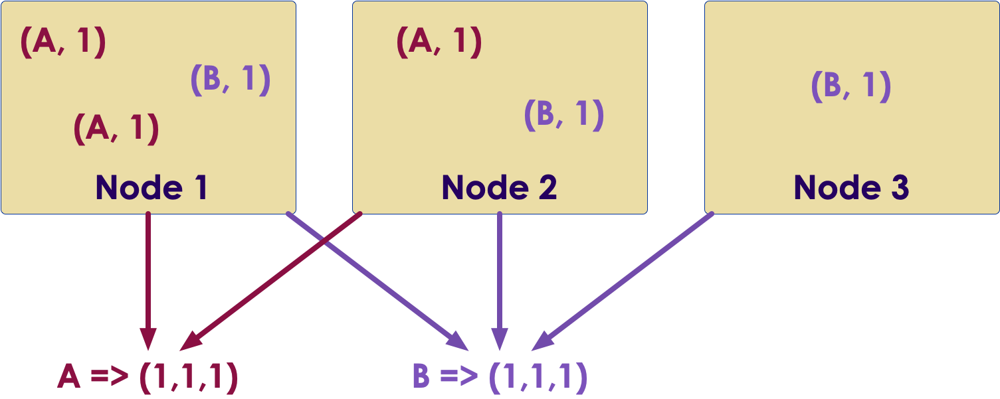
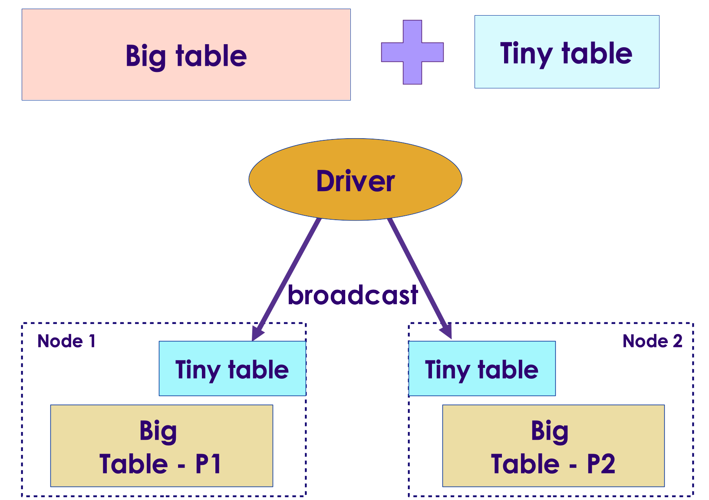

# Spark Performance

  <!-- {"left" : 2.75, "top" : 6.35, "height" : 1.26, "width" : 2.38} -->

---

## Objectives

* Learn techniques for Spark performance

---

# Monitoring

---

## What to Monitor

  <!-- {"left" : 2.75, "top" : 6.35, "height" : 1.26, "width" : 2.38} -->

* Monitoring is the first step to improve performance

* What to monitor?
    - Spark Applications and Jobs
    - JVM
    - OS/Machine
    - Cluster

* When to monitor?
    - Start while developing
    - During debugging

Notes:

---

## Cluster Monitoring

<!-- {"left" : 2.17, "top" : 1, "height" : 4.14, "width" : 5.92} -->

* Monitoring entire Spark cluster will gives an overall idea of load and performance on the cluster
    - Number of jobs running
    - Jobs waiting ..etc

* There are tons of tools available;  most are open source and very capable. Choose one that works with your environment
    - [Prometheus](https://prometheus.io/)
    - [Nagios](https://www.nagios.org/projects/nagios-core/)
    - [Cacti](https://www.cacti.net/)
    - [M/Monit](https://mmonit.com/)

* References
  - [1](https://geekflare.com/best-open-source-monitoring-software/),  [2](https://devopscube.com/best-opensource-monitoring-tools/),  [3](https://geekflare.com/best-open-source-monitoring-software/)

Notes:

---

## OS / Machine Monitoring

  <!-- {"left" : 2.75, "top" : 6.35, "height" : 1.26, "width" : 2.38} -->

* Monitoring tools can zoom into machine level

* Monitor the following:
    - CPU
    - Network
    - I/O

* There are also more specific tools
    - dstat
    - iostat
    - iotop

---

## JVM Monitoring

  <!-- {"left" : 2.75, "top" : 6.35, "height" : 1.26, "width" : 2.38} -->

* Spark runs the executors in individual Java Virtual Machines (JVMs)

* Monitor the individual virtual machines (VMs) to better understand how your code is running

* JVM utilities
    - jstack - provides stack traces
    - jmap  - creates heap-dumps
    - jstat   - reports time–series statistics
    - jconsole  -  visually explores various JVM properties
    - jvisualvm - profile Spark jobs

---

# Best Practices for Performance

---

## Use Spark Application UI

  <!-- {"left" : 2.75, "top" : 6.35, "height" : 1.26, "width" : 2.38} -->

* There is a wealth of information available in Spark UI  (port number 4040+)

* Important information to look for:
    - Amount of data processed per job / task
    - Memory usage
    - GC collection
    - Times taken by tasks

---

## Monitor Garbage Collection

* Spark runs within JVM ; and Spark can be very memory intensive.  So we need to keep an eye on garbage collection

* The new **G1 garbage collector** is used by default

* Spark UI displays GC stats (Task level view)
    - Keep an eye on this - GC time should be in milliseconds (here you see GC is taking seconds!)

  <!-- {"left" : 1.75, "top" : 6.35, "height" : 1.26, "width" : 2.38} -->

---

## Use Latest API

  <!-- {"left" : 2.75, "top" : 6.35, "height" : 1.26, "width" : 2.38} -->

* Prefer to use Dataframe/Dataset based APIs
    - They give better performance than RDD based APIs
    - And they are easier to use
    - Consistent performance across languages: SQL, Python, Scala
    - Catalyst Optimizer!

* Take full use of Spark SQL
    - One of the best SQL engines around
    - With Spark 3, 'Adaptive Optimizer' gives superb performance

---

## Prefer SQL > Spark API > UDF

* When processing data, prefer SQL, Spark API and than User Defined Functions (UDFs)

* Spark SQL engine is one the best around, so the queries can be optimized well
    - The new 'Adaptive Query Engine' can do some really nice optimizations

* Not every thing can be done via SQL, you may need to write code

* In this case try to use as much of Spark APIs (filter, map, flatmap, union ..etc)

* Because the optimizer knows how to optimize API calls ; It doesn't do well on custom user code

---

## Use Effective Data Stores

  <!-- {"left" : 2.75, "top" : 6.35, "height" : 1.26, "width" : 2.38} -->

* Spark can read/write data to multiple data stores
* For batch workloads use:
    - HDFS
        - Reliable, scalable, distributed file system
        - Proven and field tested with Petabytes of data
        - Spark works very well with HDFS, utilizing **data locality**
    - Cloud file systems (S3, Google FS ..etc)
        - Reliable and massively distributed
        - Infinitely scale with very little maintenance
        - Spark streams data out of these
        - Highspeed networks can deliver data at very fast rates
* For streaming / realtime workloads use:
    - NoSQL datastores like Cassandra, CouchDB
    - Kafka for streams

---

## Use Effective Data Formats

* Most ML data tends to be in text (csv,json) format

* Even though these are user friendly, they are not very fast to load or query

* Convert the text data into one of the faster formats (parquet or ORC)

* As you can see from benchmark below
    - They are very fast to load
    - Support schema
    - And very fast to query

  <!-- {"left" : 2.75, "top" : 6.35, "height" : 1.26, "width" : 2.38} -->

---

## Specify Schema for JSON/CSV Data

* Spark can go through JSON/CSV files and figure out the schema

* How ever this comes with a performance penalty!
    - Spark has to parse the file to infer the schema
    - We can limit the amount of data Spark has to parse 

* A better approach is to specify schema
    - This way, Spark will not need to parse file at opening.  It can do **lazy loading**
    - And it will **apply our schema** while reading the file

* See next slide for examples

---

## Schema Options for JSON/CSV

```python

## Option 1 - Let Spark infer the schema
## Will parse all data, can be expensive for large datasets
data = spark.read.csv('data/csv/',   inferSchema=True, header=True)
data = spark.read.json('data/json/')

## Option-2  -  Let Spark infer the schema, 
## But limit the amount of data
## Here we are doing 10% sampling (=0.1)
data = (spark.read.options('samplingRatio', 0.1)
                  .json('data/json/'))
data = (spark.read.options('samplingRatio', 0.1)
                  .csv('data/csv/', header=True, inferSchema=Trure))

## Option 3 - Specify schema
## Recommended for large datasets
from pyspark.sql.types import *

schema = StructType ([
            StructField("Name", StringType()),
            StructField("Age", IntegerType()),
            StructField("Height", FloatType()),
            StructField('LastActivityDate', TimestampType()),
        ])
data = spark.read.json('data/json/', schema=schema, )
data = spark.read.csv('data/json/',  schema=schema, header=True)
```

---

## Store and Load Schemas

* This is a cool technique, you can use when:
    - The schema is stable
    - And we have lots of columns, and we don't want to manually write the schema for 100s of columns

```python
import json

## first, infer the schema on a small sample file
data = spark.read.json('sample.json')
schema = data.schema()

## let's see the schema
# print(json.dumps(schema.jsonValue(), indent=2))
# {
#   "type": "struct",
#   "fields": [
#     {
#       "name": "Name",
#       "type": "string",
#       "nullable": true,
#       "metadata": {}
#     },
#     {
#       "name": "Age",
#       "type": "integer",
#       "nullable": true,
#       "metadata": {}
#     }
#     ...
#   ]
# }
```

---

## Store and Load Schema

* Here, we are going to calculate the schema once and store it, so it can be retrieved later

* Infer schema from sample data and save the schema - one time action

```python
## first, infer the schema on a small sample file
data = spark.read.json('sample-data.json')
schema = data.schema()
schema_json = schema.json()
## Save 'schema_json' to a file named 'schema_json.txt'

```

* Now any time we read the data file, read the schema back and use it - again and again!

```python
import json 

## read back the schema file (small file, reading is very fast!)
schema_json = spark.read.text("schema_json.txt").first()[0]

## recreate schema from it
schema = StructType.fromJson(json.loads(schema_json))

## And supply the schema when reading data
data = spark.read.json('/data/json/', schema=schema)
```

* References: [1](https://szczeles.github.io/Reading-JSON-CSV-and-XML-files-efficiently-in-Apache-Spark/)

---

## Caching

* Spark's memory caching offers 'in-memory' processing
    - Superfast, if done correctly

* Make sure to have enough memory to cache 100% of data

* Caching can really speed up iterative workloads like Machine Learning
    - ML workloads can iterate over the same data 100s of times!

  <!-- {"left" : 2.75, "top" : 6.35, "height" : 1.26, "width" : 2.38} -->

---

## Caching Example

* We can observe caching in **Spark UI --> Storage** tab

```python

data = spark.read.csv(...)

data.cache()
data.count()  #  force caching of data

# from this point on all operations on 'data' will be in-memory!

...

# to uncache
data.unpersist()

```

* Caching SQL tables

```python

spark.catalog.cacheTable("table1") 
spark.sql("select ... from table1")

```

---

## Filter Early

* Filtering early helps cut-down the data Spark has to process
    - If possible, filter early in the pipeline

* Avoid this

```python
data = spark.read...()
a = data.some_operation
b = a.some_operation()
c = b.some_operation()
d = c.filter( ) # <-- filter just before saving
d.save()
```

* Do this, if possible

```python
data = spark.read...()
a = data.filter()  # <-- filter early
b = a.some_operation()
c = ...
d = ...
d.save()
```

---

## Understand Dependencies

* Narrow dependency examples : filter, distinct

* Wide dependency examples : join, merge, sort

* Wide dependency involves shuffles (next slide)

<!-- {"left" : 0.58, "top" : 1.83, "height" : 5.41, "width" : 9.08} -->
<!-- {"left" : 0.58, "top" : 1.83, "height" : 5.41, "width" : 9.08} -->

---

## Understand Shuffles

* When data has to be transfered from one machine to another, that is called **shuffle**

- At large scale, shuffles can stream a lot of data over network

* Shuffles performance depends on network throughput
    - Fast networks (10G+) can deliver data at very good  speeds

* Some operations needing shuffle : join, sort, group by

<!-- {"left" : 0.58, "top" : 1.83, "height" : 5.41, "width" : 9.08} -->

---

## Smart Joins

<!-- {"left" : 0.58, "top" : 1.83, "height" : 5.41, "width" : 9.08} -->

* Joins are 'expensive' operations.  We can use a few techniques to speed up joins

* Joins usually involves shuffles

* We can cache/save joined data

```python
## Option 1 - adhoc join every time
df1 = spark.read....
df2 = spark.read...
joined = joined.df1.join(df2....)
result = joined.some_query(...)

# option 2 - temporary cache: memory or disk
joined.persist (...)
# spark will use cache when possible
result = joined.some_query(...)

# option 3 - save as permanent table
joined.write....('joined.saved')
# read it back and join at a later time
joined2 = spark.read...('joined.saved')
result = joined2.some_query(...)
```

---

## Broadcast Joins

<!-- {"left" : 0.58, "top" : 1.83, "height" : 5.41, "width" : 9.08} -->

* When joining large tables against small tables
    - Large table is well distributed across many machines, so they get parallelism
    - Small table is probably only residing on ONE machine

* So all executors will start streaming small table data from that ONE machine
    - bottleneck!

* If the data is small enough to fit in one machine's memory... we can distribute the small data to **all** machines.  This is **broadcasting**

* Now during join, we do **in-memory look ups** rather than streaming/shuffling

---

## Doing Broadcast Joins

* Here is a 'vanilla' join

<pre>
large_df = spark.read...
tiny_df = spark.read...

joined = large_df.join(tiny_df,  large_df.key1 = tiny_df.key2)
</pre>

* Doing broadcast join

<pre>
large_df = spark.read...
tiny_df = spark.read...

joined = large_df.join( <mark>broadcast(tiny_df)</mark>),  large_df.key1 = tiny_df.key2)
</pre>

<pre>
spark.table("large_df").join(spark.table("tiny_df").<mark>hint("broadcast")</mark>, "key").show()
</pre>

<pre>
-- provide hint as BROADCAST, BROADCASTJOIN and MAPJOIN for broadcast hint
SELECT <mark> /*+ BROADCAST(tiny_df)*/</mark> * FROM large_df  JOIN tiny_df ON large_df.key1 = tiny_df.key2
</pre>

<!-- {"left" : 0.58, "top" : 1.83, "height" : 5.41, "width" : 9.08} -->

* References:
    - [Spark performance tunining guide](https://spark.apache.org/docs/latest/sql-performance-tuning.html)
    - [Broadcast joins](https://mungingdata.com/apache-spark/broadcast-joins/)

---

# Spark ML Specific Optimizations

---

## Caching + ML

* Caching can make a big difference in ML, as we iterate over data many many times!

```python

data = spark.read.csv(...)

data.cache()
data.count()  #  force caching of data

# from this point on all operations on 'data' will be in-memory!

(train, test) = data.randomSplit ([0.8, 0.2])

# say we have an algorithm that iterates over the data 100 times
# all those operations will be super fast!

...

# to uncache
data.unpersist()

```

---

## Eliminate Unnecessary Columns

* Let's say we have a dataset with 100s of columns

* But we only needs a few columns, so select the columns we need to carry forward

* This cuts-down the amount of data we have to process in ML pipeline

```python

data = spark.read...

columns = ['a', 'b', 'c', ...]

data2 = data.select[columns]
# continue working on data2

```

---

## Optimizing for CPU

* [Intel-Optimized Math Library](https://software.intel.com/content/www/us/en/develop/tools/oneapi/components/onemkl.html) (successor to Intel Math Kernel Library - Intel MKL) library provides optimized Math routines on chip

* This can accelerate machine learning, scientific, financial computing

* This library can not be distributed with Spark due to licensing restrictions.  So install them separately.

* If Spark finds these libraries, it will automatically use the optimized library

<!-- {"left" : 0.58, "top" : 1.83, "height" : 5.41, "width" : 9.08} -->

---

## Optimizing for GPU

<!-- {"left" : 5.96, "top" : 1.11, "height" : 0.99, "width" : 3.11} -->

* Spark 3 recognizes GPUs as a first-class resource along with CPU and system memory

* So Spark can place GPU-accelerated workloads directly onto servers containing the necessary GPU resources

* Operations on Dataframes, Spark SQL and Spark ML can utilize GPU

* [NVIDIA Rapids](https://www.nvidia.com/en-us/deep-learning-ai/solutions/data-science/apache-spark-3/) library enables GPU acceleration for Spark

- References:
   - [NVIDIA page on Spark + GPU](https://www.nvidia.com/en-us/deep-learning-ai/solutions/data-science/apache-spark-3/)
   - [Get free ebook on Spark + GPU](https://www.nvidia.com/en-us/deep-learning-ai/solutions/data-science/apache-spark-3/ebook-sign-up/)

---

# Troubleshooting Spark

---

## Spark Jobs Not Starting

* One of the most common (and annoying) issue

* Possible fixes:
    - Ensure that Spark nodes can communicate with one another (firewall  rules)
    - Ensure the client machine has open connectivity to Spark cluster
    - Check YARN jobs queue.  If lot of jobs are queued up, then jobs are not being scheduled.  Inspect YARN logs to see why
    - Check Spark job configuration - are you asking for more resources than allowed (quota ...etc)

---

## Lazy Execution Fails

* Spark defers execution until it encounters an action

* So the reported errors may not be happen at the action stage


```python
a = spark.read...
b = a.some_transformation()
c = b.some_transformation()
result = c.count()  # <-- execution happens here
```

* Force execution in intermediate steps by doing a `count`

```python
a = spark.read...
a.count() # <-- force execution

b = a.some_transformation()
b.count() # <-- force execution

c = b.some_transformation()
c.count() # <-- force execution

result = c.count() 
```

---

## Null Pointer Errors!

* Never assume data is clean, check every thing!

* This code is not well protected and can fail due to null pointer exception

```python
a = spark.read....

# 'col1' can be null and this will fail
b = a.filter (a['col1'].contains('spark'))
```

* A better code 

```python
a = spark.read....

## since we are using 'col1' let's make sure it is not null
b = a.filter ('col1 is NOT NULL')
## or use na.drop
b = a.na.drop(subset=['col1'])

# 'col1' can be null and this will fail
c = b.filter (b['col1'].contains('spark'))

```

---

## Lab: Spark Performance Tuning

<!-- {"left" : 6.76, "top" : 0.88, "height" : 4.37, "width" : 3.28} -->

* **Overview:**
  - Use all the techniques we learned to get the maximum performance out of Spark

* **Approximate run time:**
  - 20-30 mins

* **Instructions:**
  - Follow **practice-lab-4**

Notes:

---

## Review and Q&A

<!-- {"left" : 8.56, "top" : 1.21, "height" : 1.15, "width" : 1.55} -->
<!-- {"left" : 6.53, "top" : 2.66, "height" : 2.52, "width" : 3.79} -->

* Let's go over what we have covered so far

* Any questions?
