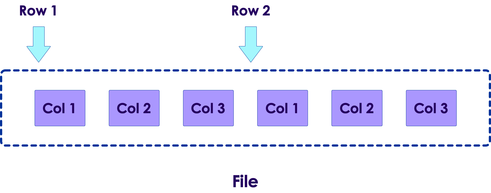
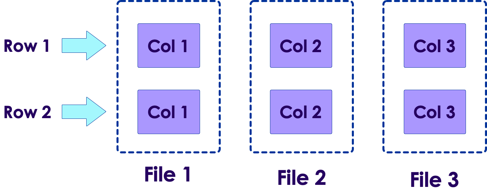

# Spark SQL

 <!-- {"left" : 6.75, "top" : 7.69, "height" : 2.13, "width" : 4} -->    

 
---

## Objectives

* Learn about Dataframes
* Using Spark SQL

---

## Spark SQL

<!-- {"left" : 7.84, "top" : 2.22, "height" : 3.78, "width" : 9.48} -->    

* Spark SQL package has some exciting components

* __SparkSession:__ The new Spark interface

* __Dataframes:__ High level data structures with excellent performance

* __Spark SQL:__ Support for SQL language queries

* __Catalyst Optimizer:__ Optimizes Dataframe queries

---

# DataFrames

---

## Spark API  Evolution

* RDD based APIs are the first interface to Spark

* As Spark being adopted widely, the following issues cropped up:
    - RDD API is too low level, requiring developers to write more code than necessary
    - Not very easy to use
    - Optimizations are left up to users

* DataFrames based API was introduced in 2013 to address the above issues

<!-- {"left" : 4.22, "top" : 6.02, "height" : 5.52, "width" : 9.05} -->    

---

## DataFrames

<!-- {"left" : 10.98, "top" : 1.58, "height" : 4.53, "width" : 6.39} -->    

* Spark DataFrames represent data as a table (rows and columns)
    - Very similar functionality to Pandas DataFrames

* Spark DataFrames are **distributed** and can contain **huge amount of data**
    - Data doesn't need to fit on to a single machine

* DataFrames will have rows and columns.  Columns have names and schema
    - Here we see 3 columns with different data types

| Row Number | Name (String) | Age (Int) | Weight (Float) |
|------------|---------------|-----------|----------------|
| 1          | John          | 34        | 168.4          |
| 2          | Jane          | 30        | 140.0          |
| 3          | Mark          | 5         | 30.3           |

<!-- {"left" : 2.13, "top" : 9.35, "height" : 2, "width" : 13.24} -->   


---

## DataFrame Features

* DataFrames offer **very high level, easy to use APIs** (compared to RDD API)

* DataFrames add schema support to data
    - RDDs represent data
    - DataFrames = data + schema

* DataFrames also support **SQL queries**

* Supported  languages : Java, Scala, Python, R and SQL

* __Catalyst Optimizer__ optimizes queries on DataFrames
    - One of the best optimizers around!

---

## DataFrame Architecture

* DataFrames and Catalyst Optimizer are part of Spark SQL package

* DataFrames API do not replace RDD API, they can be used together

<!-- {"left" : 3.35, "top" : 4.55, "height" : 6.57, "width" : 10.8} -->   


---

## DataFrames Performance

<!-- {"left" : 9.03, "top" : 2.28, "height" : 3.79, "width" : 8.08} -->   

* Here is an interesting benchmark highlighting DataFrame performance compared to RDD

* In native RDD API, Scala is the fastest (~ 4 secs), and Python is about twice as slower (~ 9 secs)

* The DataFrame API illustrates:
    - Consistant performance, no matter what language is used
    - And even faster than RDD Scala code!

* This performance is due to the optimizer

* [Source](https://databricks.com/blog/2015/02/17/introducing-dataframes-in-spark-for-large-scale-data-science.html)

---

## DataFrame Data Sources

* DataFrame can read / write to a wide variety of formats

<!-- {"left" : 0.92, "top" : 3.59, "height" : 5.22, "width" : 15.66} -->   

---

# DataFrame API

---

## DataFrame API (Scala)

* DataFrames work well with **structured data** (json, csv, parquet)

```json
{"name": "John", "age": 35, "gender" : "M", "weight": 200.5 }
{"name": "Jane", "age": 40, "gender" : "F", "weight": 150.2}
{"name": "Mike", "age": 18, "gender" : "M", "weight": 120}
{"name": "Sue",  "age": 19, "gender" : "F", "weight": 100}
```
<!-- {"left" : 0.8, "top" : 2.8, "height" : 1.87, "width" : 14.18} -->   


```scala
// scala api

val peopleDF = spark.read.json("people.json")

//   peopleDF: org.apache.spark.sql.DataFrame = [age: long, name: string, gender:string, weight:double]

peopleDF.printSchema

//   root
//    |-- age: long (nullable = true)
//    |-- gender: string (nullable = true)
//    |-- name: string (nullable = true)
//    |-- weight: double (nullable = true)

peopleDF.show

//   +---+------+----+------+
//   |age|gender|name|weight|
//   +---+------+----+------+
//   | 35|     M|John| 200.5|
//   | 40|     F|Jane| 150.2|
//   | 18|     M|Mike| 120.0|
//   | 19|     F| Sue| 100.0|
//   +---+------+----+------+
```
<!-- {"left" : 0.8, "top" : 4.98, "height" : 6.61, "width" : 16.29} -->   

---

## DataFrame API (Python)

* DataFrames work well with **structured data** (json, csv, parquet)

```json
{"name": "John", "age": 35, "gender" : "M", "weight": 200.5 }
{"name": "Jane", "age": 40, "gender" : "F", "weight": 150.2}
{"name": "Mike", "age": 18, "gender" : "M", "weight": 120}
{"name": "Sue",  "age": 19, "gender" : "F", "weight": 100}
```
<!-- {"left" : 0.8, "top" : 2.8, "height" : 1.87, "width" : 14.18} -->   


```python
# python api

peopleDF = spark.read.json("people.json")

#   peopleDF: org.apache.spark.sql.DataFrame = [age: long, name: string, gender:string, weight:double]

peopleDF.printSchema()

#   root
#    |-- age: long (nullable = true)
#    |-- gender: string (nullable = true)
#    |-- name: string (nullable = true)
#    |-- weight: double (nullable = true)

peopleDF.show()

#   +---+------+----+------+
#   |age|gender|name|weight|
#   +---+------+----+------+
#   | 35|     M|John| 200.5|
#   | 40|     F|Jane| 150.2|
#   | 18|     M|Mike| 120.0|
#   | 19|     F| Sue| 100.0|
#   +---+------+----+------+
```
<!-- {"left" : 0.8, "top" : 4.98, "height" : 6.61, "width" : 16.29} -->   

---

## Querying a DataFrame (Scala)

```json
{"name": "John", "age": 35, "gender" : "M", "weight": 200.5 }
{"name": "Jane", "age": 40, "gender" : "F", "weight": 150.2}
{"name": "Mike", "age": 18, "gender" : "M", "weight": 120}
{"name": "Sue",  "age": 19, "gender" : "F", "weight": 100}
```
<!-- {"left" : 0.8, "top" : 2.21, "height" : 1.56, "width" : 11.83} -->   

```scala
// scala api

val peopleDF = spark.read.json("people.json")

df.filter(df("name") === "John").show() // note equal is === 
df.filter("name == 'John'").show
df.filter($"name" === "John").show

//   +---+------+----+
//   |age|gender|name|
//   +---+------+----+
//   | 35|     M|John|
//   +---+------+----+

df.filter(df("age") >35).show() 
df.filter("age > 20").show
df.filter($"age" > 20).show

//   +---+------+----+
//   |age|gender|name|
//   +---+------+----+
//   | 35|     M|John|
//   | 40|     F|Jane|
//   +---+------+----+
```
<!-- {"left" : 0.8, "top" : 4.04, "height" : 7.67, "width" : 11.54} -->   

---

## Querying a DataFrame (Python)

```json
{"name": "John", "age": 35, "gender" : "M", "weight": 200.5 }
{"name": "Jane", "age": 40, "gender" : "F", "weight": 150.2}
{"name": "Mike", "age": 18, "gender" : "M", "weight": 120}
{"name": "Sue",  "age": 19, "gender" : "F", "weight": 100}
```
<!-- {"left" : 0.8, "top" : 2.21, "height" : 1.56, "width" : 11.83} -->   


```python
# python api

df = spark.read.json("people.json")

df.filter(df["name"] == "John").show()
df.filter("name == 'John'").show()

#   +---+------+----+
#   |age|gender|name|
#   +---+------+----+
#   | 35|     M|John|
#   +---+------+----+

df.filter(df["age"] > 20).show() 
df.filter("age > 20").show()

#   +---+------+----+
#   |age|gender|name|
#   +---+------+----+
#   | 35|     M|John|
#   | 40|     F|Jane|
#   +---+------+----+
```
<!-- {"left" : 0.8, "top" : 4.09, "height" : 7.42, "width" : 7.9} -->   


---

## DataFrame Types

| Type        | Description                                                                                   | Java/Scala           | Python          |
|-------------|-----------------------------------------------------------------------------------------------|----------------------|-----------------|
| ByteType    | 1-byte signed integer numbers. Range = -128 to 127                                            | Byte                 | Int or Long     |
| ShortType   | 2-byte signed integer numbers.   Range = -32768 to 32767                                      | Short                | Int or Long     |
| IntegerType | 4-byte (32 bit) signed integer numbers.  Range = -2,147,483,648 (-231) to 2,147,483,647 (231) | Integer              | Int or Long     |
| LongType    | 8-byte (64 bit) signed integer numbers Range = -263  to 263                                   | Long                 | Long            |
| FloatType   | 4-byte (32 bit) single-precision floating point numbers                                       | Float                | Float           |
| DoubleType  | 8-byte (64 bit) double-precision floating point numbers                                       | Double               | Float           |
| DecimalType | arbitrary-precision signed decimal numbers                                                    | java.math.BigDecimal | decimal.Decimal |
|             |                                                                                               |                      |                 |
| StringType  | String / text values                                                                          | String               | string          |
| BinaryType  | Binary / blob data                                                                            | Array[Byte]          | bytearray       |
| BooleanType | True / False                                                                                  | True / False         | bool            |

<!-- {"left" : 0.34, "top" : 1.77, "height" : 9.56, "width" : 16.82, "columnwidth" : [2.47, 8.69, 2.85, 2.82]} -->


---

## DataFrame Types

| Type          | Description                                                                                                        | Java/Scala               | Python                |
|---------------|--------------------------------------------------------------------------------------------------------------------|--------------------------|-----------------------|
| Date / Time   |                                                                                                                    |                          |                       |
| DateType      | Date with year, month, day.                                                                                        | java.sql.Date            | datetime.date         |
| TimestampType | Timestamp with year, month, day, hour, minute, and second                                                          | java.sql.Timestamp       | datetime.datetime     |
|               |                                                                                                                    |                          |                       |
| Complex Types |                                                                                                                    |                          |                       |
| ArrayType     | Sequence of elements                                                                                               | scala.collection.Seq     | list, tuple, or array |
| MapType       | Key / Value pairs                                                                                                  | scala.collection.Map     | dict                  |
| StructType    | Random structure with one or more fields  <br/>Address <br/>{street_number,    street_name,city,state,zip } | org.apache.spark.sql.Row | list or tuple         |

<!-- {"left" : 0.34, "top" : 1.77, "height" : 9.56, "width" : 16.82, "columnwidth" : [2.47, 8.69, 2.85, 2.82]} -->


---

## Catalyst Query Optimzizer

* Catalyst Optimizer can really boost performance
* DataFrames are lazily evaluated
    - Catalyst can optimize bunch of instructions together
    - It can combine / short-circuit / re-order operations
* Re-ordering operations
    - For example filter operations can be moved up if possible, this cuts down data flowing through stages
* Using schema information optimizer can perform additional optimization
    - For example comparing Integers is more efficient than comparing String
* Catalyst is a 'multi phase' optimizer

<!-- {"left" : 2.88, "top" : 8.33, "height" : 2.79, "width" : 11.73} -->   


---

## Predicate Pushdown Example

* Here we area reading data, and immediately filtering
    - So it makes sense to only read data that can pass the filter

```python
df1 = spark.read.csv("data.csv")
df2 = df1.filter ("age > 30")
```
<!-- {"left" : 0.8, "top" : 3.46, "height" : 1.27, "width" : 9.01} -->   


<!-- {"left" : 4.11, "top" : 5.35, "height" : 5.41, "width" : 9.28} -->   


---

## Predicate Pushdown Example

```python
df1 = spark.read.csv("...")
df2 = df1.filter ("age > 30")
df2.explain(extended=True)
```
<!-- {"left" : 0.8, "top" : 1.75, "height" : 1.29, "width" : 6.28} -->   

<pre>
== Parsed Logical Plan ==
'Filter ('age > 30)
+- Relation[age#7L,gender#8,name#9,weight#10] json

== Analyzed Logical Plan ==
age: bigint, gender: string, name: string, weight: double
Filter (age#7L > cast(30 as bigint))
+- Relation[age#7L,gender#8,name#9,weight#10] json

== Optimized Logical Plan ==
Filter (isnotnull(age#7L) AND (age#7L > 30))
+- Relation[age#7L,gender#8,name#9,weight#10] json

== Physical Plan ==
*(1) Project [age#7L, gender#8, name#9, weight#10]
+- *(1) Filter (isnotnull(age#7L) AND (age#7L > 30))
   +- FileScan json [age#7L,gender#8,name#9,weight#10] Batched: false, 
    DataFilters: [isnotnull(age#7L), (age#7L > 30)], Format: JSON, 
    Location: InMemoryFileIndex[file:/data/people/people.json], 
    PartitionFilters: [], 
    <mark>PushedFilters: [IsNotNull(age), GreaterThan(age,30)]</mark>, 
    ReadSchema: struct< age:bigint,gender:string,name:string,weight:double >
</pre>

---

## Optimizer Code Generation

* As a final step, Catalyst may generate code for execution plans

* This is done using [Janino compiler](http://janino-compiler.github.io/janino/)

* Codegen can really boost performance (sometimes 10x) for some queries!

<!-- {"left" : 2.93, "top" : 5.47, "height" : 2.77, "width" : 11.63} -->   


---

## Lab: Dataframes

<!-- {"left" : 12.67, "top" : 1.17, "height" : 5.75, "width" : 4.32} -->   

* **Overview:**
   - Work with Spark DataFrames

* **Approximate run time:**
   - 20-30 mins

* **Instructions:**
   - 4.1

Notes:

---

# Spark SQL

---

## Why SQL?

* Spark API (Scala, Java or Python) can  still be fairly complex
    - SQL has very simple syntax

* SQL is pretty popular with developers and analysts

* SQL queries can be optimized pretty well
    - SQL Engine technology  is mature and is very well field tested

* SQL is pretty much expected feature now (Hadoop, Cassandra and Spark)

---

## Spark SQL

* __Spark SQL__ module adds SQL capability to Spark (since Spark v2)

* Spark SQL is one of the most used feature of Spark

* Catalyst is pretty good at optimizing SQL queries

* From Spark v3, Spark SQL is  ANSI SQL compliant

<!-- {"left" : 3.6, "top" : 4.93, "height" : 6.27, "width" : 10.3} -->   


---

## Spark 3 SQL Improvements

<!-- {"left" : 13.76, "top" : 1.88, "height" : 4.6, "width" : 3.46} -->   

* Spark has one of the best SQL engines around

* Spark SQL received lot of updates in Spark v3

<!-- {"left" : 13.79, "top" : 8.37, "height" : 3.18, "width" : 3.41} -->   

* ANSI SQL support improved

* __Adaptive Query Execution (AQE):__
   - Can adjust execution plan at runtime (change number of reduces ..etc)
   - Can even observe **data skew** and make changes (This is a big deal, as it happens a lot in real life workloads)
   - Can do effective joins automatically

* [Source](https://youtu.be/OLJKIogf2nU)

---

## Spark SQL Example (Scala)

```json
{"name": "John", "age": 35, "gender" : "M", "weight": 200.5 }
{"name": "Jane", "age": 40, "gender" : "F" , "weight": 150.2}
{"name": "Mike", "age": 18, "gender" : "M" , "weight": 120}
{"name": "Sue",  "age": 19, "gender" : "F" , "weight": 100}
```
<!-- {"left" : 0.8, "top" : 2.12, "height" : 1.44, "width" : 10.94} -->   

```scala

// Step 1: read a DataFrame
val df = spark.read.json("people.json")

// Step 2: Register DF as temporary table
df.createOrReplaceTempView("people")

// Step 3: Query away
spark.sql("select * from people").show()

//   +---+------+----+
//   |age|gender|name|
//   +---+------+----+
//   | 35|     M|John|
//   | 40|     F|Jane|
//   | 18|     M|Mike|
//   | 19|     F| Sue|
//   +---+------+----+

spark.sql("select * from people where age > 30").show()

//   +---+------+----+
//   |age|gender|name|
//   +---+------+----+
//   | 35|     M|John|
//   | 40|     F|Jane|
//   +---+------+----+
```
<!-- {"left" : 0.8, "top" : 3.83, "height" : 7.86, "width" : 9.96} -->   

---

## Spark SQL Example (Python)

```json
{"name": "John", "age": 35, "gender" : "M", "weight": 200.5 }
{"name": "Jane", "age": 40, "gender" : "F" , "weight": 150.2}
{"name": "Mike", "age": 18, "gender" : "M" , "weight": 120}
{"name": "Sue",  "age": 19, "gender" : "F" , "weight": 100}
```
<!-- {"left" : 0.8, "top" : 2.12, "height" : 1.44, "width" : 10.94} -->   

```python

# Step 1: read a DataFrame
df = spark.read.json("people.json")

# Step 2: Register DF as temporary table
df.createOrReplaceTempView("people")

# Step 3: Query away
spark.sql("select * from people").show()

#   +---+------+----+
#   |age|gender|name|
#   +---+------+----+
#   | 35|     M|John|
#   | 40|     F|Jane|
#   | 18|     M|Mike|
#   | 19|     F| Sue|
#   +---+------+----+

spark.sql("select * from people where age > 30").show()

#   +---+------+----+
#   |age|gender|name|
#   +---+------+----+
#   | 35|     M|John|
#   | 40|     F|Jane|
#   +---+------+----+
```
<!-- {"left" : 0.8, "top" : 3.83, "height" : 7.86, "width" : 9.96} -->   


---

## Table Scope

* Temporary tables
    - Use **`createOrReplaceTempView`**
    - Table is only valid during the scope of current session
* Global Temporary View
    - Can outlast the session that created it
    - Until the end of Spark application
    - Use **`createGlobalTempView`**
* Persistent Table
    - Can be saved using Hive metastore
    - Use **`df.write.saveAsTable`** command
    - Tables are permanent and available for others

```python
# this is temp table
df.createGlobalTempView("people")

# Global temporary view is tied to a system preserved database 'global_temp'
spark.sql("SELECT * FROM global_temp.people").show()
spark.newSession().sql("SELECT * FROM global_temp.people").show()

# Save a persistent table
df.saveAsTable("hiveTable")
```
<!-- {"left" : 0.8, "top" : 8.44, "height" : 2.9, "width" : 13.44} -->   


---

## Lab: Spark SQL

<!-- {"left" : 12.53, "top" : 1.16, "height" : 5.89, "width" : 4.42} -->   

* **Overview:**
   - Work with Spark SQL

* **Approximate run time:**
   - 20-30 mins

* **Instructions:**
   - 4.2

Notes:

---

# Dataset

---

## Datasets

<!-- {"left" : 9.48, "top" : 1.06, "height" : 5.55, "width" : 7.85} -->   

<!-- {"left" : 9.48, "top" : 6.24, "height" : 4.79, "width" : 7.85} -->   

* Datasets unify both **typed** and **untyped** datamodels
    - Typed dataset is called **`Dataset`**
    - Untyped dataset is called **`DataFrame`** (yes the same DFs we have been using!)

* Typed dataset API is available only on Java,Scala
    - Because Java,Scala are strongly typed languages
    - Not available in Python as Python is a dynamic language (not strongly typed)

- Untyped dataset (DataFrame) is available on all languages

---

## Dataset API

```json
{"name": "John", "age": 35, "gender" : "M", "weight": 200.5 }
{"name": "Jane", "age": 40, "gender" : "F" , "weight": 150.2}
{"name": "Mike", "age": 18, "gender" : "M" , "weight": 120}
{"name": "Sue",  "age": 19, "gender" : "F" , "weight": 100}
```
<!-- {"left" : 0.8, "top" : 1.8, "height" : 1.57, "width" : 11.9} -->   

```scala
// define Person class
case class Person (
        name: String, 
        age: Integer, 
        gender: String, 
        weight: Double)

// people is of type 'Person'
val people = spark.read.json("...").as[Person]

people.printSchema
//   root
//    |-- age: Integer
//    |-- gender: String
//    |-- name: String
//    |-- weight: Double

// ageCol is Integer type
val ageCol = people("age")

// increases every one's age by 10
// We can do this, because 'age' is Integer
people("age") + 10
```
<!-- {"left" : 0.8, "top" : 3.58, "height" : 5.57, "width" : 6.72} -->   

<br/>
<br/>
<br/>


* See [Dataset Java API](https://spark.apache.org/docs/latest/api/java/index.html?org/apache/spark/sql/Dataset.html) ,  [Dataset Scala API](https://spark.apache.org/docs/latest/api/scala/org/apache/spark/sql/Dataset.html)

---

## Dataset API

```scala
// For implicit conversions like converting RDDs to DataFrames
import spark.implicits._

> val df1 = spark.read.json("people.json")
//  df1: org.apache.spark.sql.DataFrame = [age: bigint, gender: string ... 1 more field]

// read CSV directly, infer columns from header
> val df2 = spark.read.option("header", "true").csv("people2.csv")
//  df2: org.apache.spark.sql.DataFrame = [name: string, gender: string ... 1 more field]

// load a plain String RDD and query using functional programming
> val t = spark.read.textFile("twinkle.txt")
//  t: org.apache.spark.sql.Dataset[String] = [value: string]

> t.filter(_.contains("twinkle")).collect
//  Array[String] = Array(twinkle twinkle little star, twinkle twinkle little star)
```
<!-- {"left" : 0.8, "top" : 2.24, "height" : 5.2, "width" : 16.42} -->   

---

## Schema Infering

* Dataset can "infer" schema from common formats like JSON/Parquet/ORC

* This is convenient but may have performance overhead

* Parquet/ORC formats store schema alongside with data. Inferring is very quick!

* For JSON, Spark has to parse the data to figure out the schema
    - Can be expensive on large scale
    - There is an option to "sample" the data

```scala
// go through all records
> val df = spark.read
                .option("inferSchema", "true")
                .json("people.json")

// go through 30%  records
> val df = spark.read
                .option("inferSchema", "true")
                .option("samplingRatio", 0.3)
                .json("people.json")

> df.printSchema
//   Root
//   |-- age: long (nullable = true)
//   |-- gender: string (nullable = true)
//   |-- name: string (nullable = true)

```
<!-- {"left" : 0.8, "top" : 6.25, "height" : 4.94, "width" : 8.44} -->   

---

## Reading CSV Files

* If header is present, Spark will use it for column names

* Schema is inferred by through trough the data

```text
name,gender,age
John,M,35
Jane,F,40
Mike,M,18
Sue,F,19
```
<!-- {"left" : 0.8, "top" : 3.26, "height" : 2.53, "width" : 4.78} -->   


```scala
> val p = spark.read
            .option("header", "true")
            .option("samplingRatio", 0.3)
            .csv("people.csv")

> p.columns
//   Array[String] = Array(name, gender, age)

> p.printSchema
//   root
//   |-- name: string (nullable = true)
//   |-- gender: string (nullable = true)
//   |-- age: string (nullable = true)

```
<!-- {"left" : 0.8, "top" : 6.1, "height" : 5.55, "width" : 11.29} -->   

---

## Specifying Schema

* While inferring schema is great, it comes with a performance penalty

* For files like JSON and CSV, Spark has to parse the file to figure out the schema

* This can get expensive for large scale data (TBs of data)

* So for large scale data, we can specify schema
    - Spark will **apply** our schema during read time
    - Spark will not parse file to infer schema

* What if specified schema doesn't match actual data?
    - Spark will substitute NULL values

* References
    - [Spark schema – explained with examples](https://sparkbyexamples.com/spark/spark-schema-explained-with-examples/)

---

## Specifying Schema (Scala)

```scala

// This is used to implicitly convert an RDD to a DataFrame.import spark.implicits._
import org.apache.spark.sql._
import org.apache.spark.sql.types._

// specify schemas
val nameField = StructField("name", StringType)
val genderField = StructField("gender", StringType)
val ageField = StructField("age", IntegerType)

val peopleSchema = StructType(Array(nameField, genderField, ageField))

val peopleDF = spark.read.
             option("header", "true").
             schema(peopleSchema).
             csv("data/people2.csv")

peopleDF.printSchema

//   Root
//    |-- name: string (nullable = true)
//    |-- gender: string (nullable = true)
//    |-- age: integer (nullable = true)
```
<!-- {"left" : 0.8, "top" : 2.34, "height" : 7.46, "width" : 16.46} -->   

---

## Specifying Schema (Python)

```python
from pyspark.sql.types import StringType, IntegerType, StructField, StructType


peopleSchema = StructType([
		   StructField("name",   StringType(), True),
		   StructField("gender", StringType(), True),
		   StructField("age",    IntegerType(), True),
		])

peopleDF = (spark.read.
               option("header", "true").
               schema(peopleSchema). 
               csv("people2.csv"))

peopleDF.printSchema()

//   Root
//    |-- name: string (nullable = true)
//    |-- gender: string (nullable = true)
//    |-- age: integer (nullable = true)


```
<!-- {"left" : 0.8, "top" : 2.53, "height" : 7.07, "width" : 15.95} -->   


---

## Store and Load Schemas

* This is a cool technique, you can use when:
    - The schema is stable
    - And we have lots of columns, and we don't want to manually write the schema for 100s of columns

```python
import json

## first, infer the schema on a small sample file
data = spark.read.json('sample.json')
schema = data.schema()

## let's see the schema
# print(json.dumps(schema.jsonValue(), indent=2))
# {
#   "type": "struct",
#   "fields": [
#     {
#       "name": "Name",
#       "type": "string",
#       "nullable": true,
#       "metadata": {}
#     },
#     {
#       "name": "Age",
#       "type": "integer",
#       "nullable": true,
#       "metadata": {}
#     }
#     ...
#   ]
# }
```
<!-- {"left" : 0.8, "top" : 4.22, "height" : 7.33, "width" : 8.34} -->   


---

## Store and Load Schema

* Here, we are going to calculate the schema once and store it, so it can be retrieved later

* Infer schema from sample data and save the schema - one time action

```python
## first, infer the schema on a small sample file
data = spark.read.json('sample-data.json')
schema = data.schema()
schema_json = schema.json()
## Save 'schema_json' to a file named 'schema_json.txt'

```
<!-- {"left" : 0.8, "top" : 4.52, "height" : 2.07, "width" : 11.86} -->   

<br/>

* Now any time we read the data file, read the schema back and use it - again and again!

```python
import json 

## read back the schema file (small file, reading is very fast!)
schema_json = spark.read.text("schema_json.txt").first()[0]

## recreate schema from it
schema = StructType.fromJson(json.loads(schema_json))

## And supply the schema when reading data
data = spark.read.json('/data/json/', schema=schema)
```
<!-- {"left" : 0.8, "top" : 7.78, "height" : 3.51, "width" : 12.57} -->   


* References: [1](https://szczeles.github.io/Reading-JSON-CSV-and-XML-files-efficiently-in-Apache-Spark/)

---

## Conversion among RDD / DataFrame / Dataset

<!-- {"left" : 11.78, "top" : 1.89, "height" : 3.88, "width" : 5.49} -->   


```scala
// This is used to implicitly convert an RDD to a DataFrame.
import spark.implicits._
import org.apache.spark.sql._
import org.apache.spark.sql.types._

peopleRDD
//   peopleRDD: org.apache.spark.rdd.RDD[Person] = ...

// ==== convert RDD to Dataset
val peopleDS = peopleRDD.toDS
//   org.apache.spark.sql.Dataset[Person] = [name: string, ...]
// another approach
val peopleDS2 = spark.createDataset[Person](peopleRDD)

// === Access RDD in Dataset
peopleDS.rdd
//   org.apache.spark.rdd.RDD[Person] = MapPartitionsRDD[47]

// === convert Dataset to DataFrame
val df2 = peopleDS.toDF
//   df2: org.apache.spark.sql.DataFrame = [name: string, ...]

// === convert DataFrame to Dataset
val ds2 = df2.as[Person]
//   ds2: org.apache.spark.sql.Dataset[Person] = [name: string,  ...]

// DataFrame  & RDD
df2.rdd
//   org.apache.spark.rdd.RDD[org.apache.spark.sql.Row] =  ...
```
<!-- {"left" : 0.8, "top" : 2.22, "height" : 7.69, "width" : 10.81} -->   

---

## Lab: Datasets

<!-- {"left" : 13.12, "top" : 1.89, "height" : 5.46, "width" : 4.09} -->   


* **Overview:**
   - Work with Spark Datasets

* **Approximate run time:**
   - 20-30 mins

* **Instructions:**
   - 4.3

Notes:

---

## Lab: Caching in SQL

<!-- {"left" : 13.12, "top" : 1.89, "height" : 5.46, "width" : 4.09} -->   

* **Overview:**
   - Understanding caching of Spark SQL tables

* **Approximate run time:**
   - 20-30 mins

* **Instructions:**
   - 4.4

Notes:

---

# Spark and Hive

---

## Spark & Hadoop

* Hive is the data warehouse for Hadoop
    - Has table definitions

* Spark can query Hive to extract table definitions
    - No need to redefine table schema in Spark

* Spark can load data directly from HDFS 

<!-- {"left" : 0.85, "top" : 5.69, "height" : 4.8, "width" : 15.8} -->   

---

## Spark Catalog

* Spark Catalog keeps track of tables

```scala

> spark.catalog
//   org.apache.spark.sql.catalog.Catalog

> spark.catalog.[TAB]
//   cacheTable            dropGlobalTempView   getTable        listTables
//   ...

> spark.catalog.listDatabases.show(false)

//   +-------+---------------------+-------------------------+
//   |name   |description          |locationUri              |
//   +-------+---------------------+-------------------------+
//   |default|Default Hive database|file:/user/hive/warehouse|
//   +-------+---------------------+-------------------------+

> spark.catalog.listTables.show(false)

//   +--------+---------+-----------+-----------+-----------+
//   |name    |database |description|tableType  |isTemporary|
//   +--------+---------+-----------+-----------+-----------+
//   | people | null    |           | TEMPORARY |  true     |
//   | logs   | default |           | MANAGED   |  false    |
//   +--------+---------+-----------+-----------+-----------+

```
<!-- {"left" : 0.8, "top" : 2.78, "height" : 8.42, "width" : 15.8} -->   


---

## Reading from Hive Tables

```sql
// this is hive shell

hive> show tables;
//  clickstream
```
<!-- {"left" : 0.8, "top" : 2.51, "height" : 1.62, "width" : 4.79} -->   


```scala
// this is Spark shell

> spark.catalog.listTables.show
//   clickstream

> val t = spark.catalog.getTable("clickstream")
//   org.apache.spark.sql.catalog.Table

> spark.sql("select * from clickstream limit 10").show

//   +---+------+----+
//   |age|gender|name|
//   +---+------+----+
//   | 35|     M|John|
//   | 40|     F|Jane|
//   +---+------+----+

> spark.sql("select action, count(*) as total from clickstream group by action").show

```
<!-- {"left" : 0.8, "top" : 4.44, "height" : 5.89, "width" : 15.95} -->   


---

## Lab: Spark and Hive

<!-- {"left" : 13.12, "top" : 1.89, "height" : 5.46, "width" : 4.09} -->   

* **Overview:**
  - Query Hive tables from Spark
  - This lab only works on a Hadoop environment

* **Approximate run time:**
   - 20-30 mins

* **Instructions:**
   - 4.5

---

# Data Formats

---

## Row vs. Columnar Storage

* Here is an example of how a table data can be stored on disk in 2 different ways

<!-- {"left" : 4.78, "top" : 3.06, "height" : 8.47, "width" : 7.94} -->   

---

## Row vs Column Data Stores

* How data is stored has a big impact on query performance

* Row based formats are better for finding specific row data

```sql
select * from items where id = 123
```
<!-- {"left" : 0.8, "top" : 3.27, "height" : 0.57, "width" : 6.44} -->  
 
* Column based format is better for aggregate queries

```sql
select MAX(price) from items;
```
<!-- {"left" : 0.8, "top" : 4.45, "height" : 0.57, "width" : 5.61} -->   

* Doing column based queries on row-based format is not efficient:
    - lot of random access of data on disk
    - not high through put

<!-- {"left" : 0.91, "top" : 7.3, "height" : 3.41, "width" : 8.65} -->   <!-- {"left" : 9.99, "top" : 7.68, "height" : 2.64, "width" : 6.6} -->   


---

## Data Formats

* Most common data formats:
    - Text  
    - Avro
    - Parquet
    - ORC: Optimized Row Columnar

---

## Text Data Formats

* Example data formats : CSV, JSON

* CSV data

```text
name, gender, age
John,M,40
Jane,F,35
```
<!-- {"left" : 0.8, "top" : 3.62, "height" : 1.83, "width" : 5.73} -->   

<br/>

* JSON data

```json
{"name" : "John", "gender" : "M", "age": 40}
{"name" : "Jane", "gender" : "F", "age": 35}
```
<!-- {"left" : 0.8, "top" : 6.07, "height" : 0.75, "width" : 7.1} -->   

* Pros:
    - Human-readable
    - Compatible with tools (export/import from DB for example)

* Cons:
    - Not size-efficient to store
    - Not efficient to query
    - Does not support block compression

---

## AVRO Format

* AVRO is a popular serializing format

* Binary based

* Row-based

* Schema is stored as part of the data
    - Decoding is easy
    - No need for separate data-dictionaries

* Supports schema evolution or schema versioning
    - Version 1 has two attributes: name, email
    - Version 2 has an extra attribute: name, email, phone
    - They can co-exist

---

## Parquet Format

* Currently the 'goto' format

* Came out of Twitter + Cloudera

* Column-based storage

* Binary + compressed

* Schema stored with data

* Very efficient for column-based queries

---

## ORC Format

* Evolution of RCFile

* Hybrid row/columnar format

* Stores rows

* Within rows, data is stored in columnar format

* Can support basic stats (minimum/maximum, etc.) on columns

---

## Which Format to Choose?

* Depends on:
    - Workload
    - Other ETL/ingestion systems

* Is "human readability" a big deal?
    - Then use text: CSV, JSON

* For Speed go with Parquet/ORC

* Parquet/ORC is preferred format currently

* Spark natively supports JSON, Parquet, Avro

---

## Converting Between Formats

* In Spark, converting between formats is very easy

```scala
// loading json data
dfJson = spark.read.json("data.json")

// save as parquet (faster queries)
dfJson.write.parquet("data-parquet/")

// save as ORC (faster queries)
dfJson.write.orc("data-orc/")

```
<!-- {"left" : 0.8, "top" : 3.27, "height" : 4.3, "width" : 11.42} -->   

---

## Lab: Data Formats

<!-- {"left" : 12.87, "top" : 1.89, "height" : 5.46, "width" : 4.1} -->   

* **Overview:**
   - Benchmark various data formats

* **Approximate run time:**
   - 20-30 mins

* **Instructions:**
   - 4.6

Notes:

---

## Review and Q&A

<!-- {"left" : 12.88, "top" : 2.06, "height" : 2.68, "width" : 3.63} -->    

* Let's go over what we have covered so far

* Any questions?

<!-- {"left" : 4.58, "top" : 5.2, "height" : 5.56, "width" : 8.33} -->    
