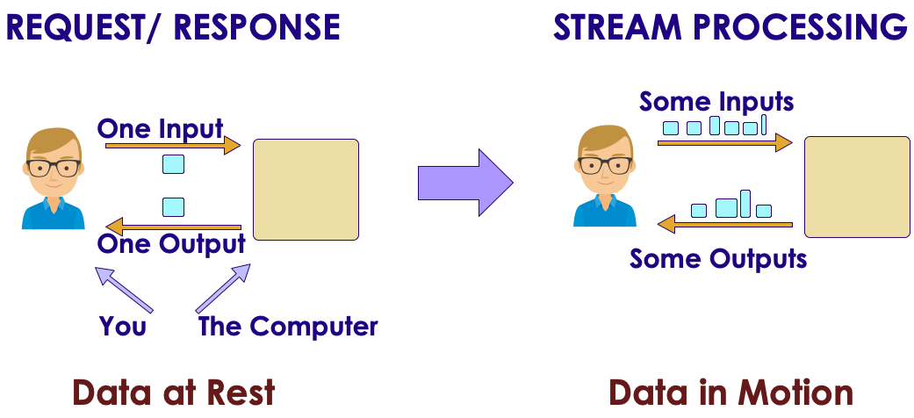
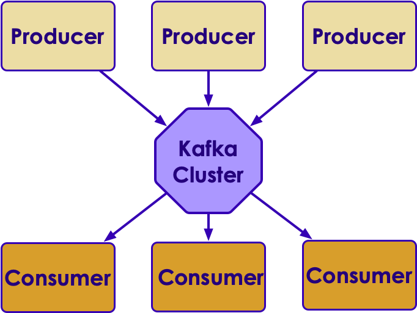

# Spark Streaming

  <!-- {"left" : 2.75, "top" : 6.35, "height" : 1.26, "width" : 2.38} -->

---

## Objectives

* Understand Spark streaming

---

## Streaming Use Cases

* Netflix Streaming
    - Streaming generates astounding amount of data!
    - 450 billion events/day  (5 million events / sec)

* Weather Company
    - Analyze weather sensor data
    - Billions of events/day
    - Multi-Petabyte (PB) traffic daily

* More use cases at [BigDataUseCases.info](www.BigDataUseCases.info)

<!-- {"left" : 2.12, "top" : 5.52, "height" : 1.47, "width" : 3.18} -->
  &nbsp;  &nbsp;
<!-- {"left" : 6.24, "top" : 5.52, "height" : 1.47, "width" : 1.89} -->

---

## Spark Components

<!-- {"left" : 2.53, "top" : 3.15, "height" : 7.42, "width" : 12.45} -->

Notes:

---

## Batch vs. Streaming

* Batch Processing
    - The dataset is finite / fixed.
    - If we run the same query again, we will get the same result

* Stream processing
    - Data keeps coming in real time
    - Needs to be processed in real time too
    - Spark can process events in **mini-batches** - every few seconds

<!-- TODO Shiva -->
<!-- {"left" : 2.53, "top" : 3.15, "height" : 7.42, "width" : 12.45} -->

---

## Evolution of Spark Streaming

* **Receiver based** - no longer recommended
    - This was the original design
    - It introduced 'mini batch' based processing in Spark
    - Older, and low level API
    - Prone to data loss in some crash scenarios
* **Direct streams approach**
    - Easier to use API
    - Fixes the loop holes from `receiver based` API
* **Structured Streaming** - Recommended!
    - High level API - treat streams like a growing table
    - Easy to use and takes care of crash scenarios
    - **Latency as small as 100 milliseconds**
* **Continuos streaming** - Available in Databricks runtime
    - Built on `Structured streaming`
    - Can do very small latencies of **milli-seconds**
    - Experimental feature

---

## Streaming Programming Model

* Imagine we are running a query on a table that is **continuously appended**

* Specify the query, similar to batch query

* Spark will execute the query **periodically**

<!-- TODO Shiva -->
<!-- {"left" : 2.53, "top" : 3.15, "height" : 7.42, "width" : 12.45} -->

---

## Streaming Architecture

* Data is read from **sources**.  Sources can be
    - Kafka
    - Network streams

* Data is send to **sinks**.  Sinks can be
    - HDFS
    - Databases

<!-- TODO Shiva -->
<!-- {"left" : 2.53, "top" : 3.15, "height" : 7.42, "width" : 12.45} -->

---


## Streaming Example - Word Count

* Here we see the word count query running periodically and updating the results

<!-- TODO Shiva -->
<!-- {"left" : 2.53, "top" : 3.15, "height" : 7.42, "width" : 12.45} -->

---

## Programming Model

<!-- TODO Shiva -->
<!-- {"left" : 2.53, "top" : 3.15, "height" : 7.42, "width" : 12.45} -->

* **Input table / Source** - continuously appended with new data

* **Trigger** - How often to run a query (1 sec, 10 secs, 30 secs ..etc)

* **Result table** - Every time query executes (at trigger interval) the result table will be updated

* **Sink** - When result table is updated, we would want to write the data to an output medium (console, database, dashboard ..etc)

---

## Sources and Sinks

```python
# reading from network socket
lines = spark.readStream \
           .format("socket") \
           .option("host", "localhost") \
           .option("port", 9999) \
           .load()

# reading from Kafka
data = spark.readStream \
           .format("kafka") \
           .option("kafka.bootstrap.servers", "localhost:9092") \
           .option("subscribe", "topic1") \
           .option("startingOffsets", "latest")
           .load()

# ~~~~~~~~~~~~~

# writing to console
stream.writeStream
      .format("console")
      .start() 

# write to HDFS
stream.writeStream
      .format("parquet")  # can be "orc", "json", "csv", etc.
      .option("path", "path/to/destination/dir")
      .start() 

# Write to kafka 
stream.writeStream
      .format("kafka")
      .option("kafka.bootstrap.servers", "host1:port1,host2:port2")
      .option("topic", "topic1")
      .start() 
```

---

## Output Modes

* The **`Output`** is defined as what gets written out to the external storage.  3 modes are supported

* **Append Mode** - Only the new rows appended in the Result Table since the last trigger will be written to the external storage. 
    - Good for inserts

* **Complete Mode** - The entire updated Result Table will be written to the external storage. 
    - Good for aggregates (e.g. total number of clicks)

* **Update Mode** - Only the rows that were updated in the Result Table since the last trigger will be written to the external storage (available since Spark 2.1.1). Note that this is different from the Complete Mode in that this mode only outputs the rows that have changed since the last trigger. 

* [See here for more discussion on output modes](https://spark.apache.org/docs/latest/structured-streaming-programming-guide.html#output-modes)

---

## Understanding Output Modes

* Consider this clickstream data

```text
# first batch
.... , facebook.com,  clicked
.... , youtube.com,   clicked
.... , linkedin.com,  viewed


# second batch
.... , facebook.com,  viewed
.... , linkedin.com,  viewed

```

<!-- TODO Shiva -->
<!-- {"left" : 2.53, "top" : 3.15, "height" : 7.42, "width" : 12.45} -->

* If we are saving the datastream to a file system or HDFS, we will use **append** mode
    - it will write individual records

* If we are counting views and clicks:
    - After batch-2, **complete** mode will write `views=3,  clicks=3`
    - After batch-2, **update** mode will only update `views=3`  (clicks did not change)


---

## Sinks and Output Modes

* Not all sinks support all output formats

<br />

| Sink        | Append | Update | Complete |
|-------------|--------|--------|----------|
| File / HDFS | yes    | no     | no       |
| Kafka       | yes    | yes    | yes      |
| Console     | yes    | yes    | yes      |
| Memory      | yes    | no     | yes      |

<br />

* [See here for sinks and supported output formats](https://spark.apache.org/docs/latest/structured-streaming-programming-guide.html#output-sinks)

---


## Structured Streaming

* Structured Streaming is a **scalable and fault-tolerant stream processing engine built on the Spark SQL engine**

* Write the streaming application using **Dataframes/Dataset** API

* SQL Engine will run the code **incrementally and continuously** as new data arrives

* Structured streaming can provide **end-to-end exactly-once fault-tolerance guarantees** through **checkpointing and Write-Ahead Logs**

* The streaming data is processed as **micro-batches**

* Typical batch interval is in seconds (1, 5, 10, 30 seconds).  Can achieve **latencies as low as 100 milliseconds**

<!-- TODO Shiva -->
<!-- {"left" : 2.53, "top" : 3.15, "height" : 7.42, "width" : 12.45} -->

---

# Streaming Example

---

## Streaming Wordcount

* Let's do a simple **wordcount** example

* We will use **netcat** utility to send some data over TCP socket stream

* And Spark streaming will process them in real time

* We will see both **Scala and Python** APIs

<!-- TODO Shiva -->
<!-- {"left" : 2.53, "top" : 3.15, "height" : 7.42, "width" : 12.45} -->

---

## Streaming Wordcount - Scala

```scala
import org.apache.spark.sql.functions._
import org.apache.spark.sql.SparkSession

val spark = SparkSession
  .builder
  .appName("StructuredNetworkWordCount")
  .getOrCreate()
  
import spark.implicits._

// Create DataFrame representing the stream of input lines from connection to localhost:9999
val lines = spark.readStream
  .format("socket")
  .option("host", "localhost")
  .option("port", 9999)
  .load()

// Split the lines into words
val words = lines.as[String].flatMap(_.split(" "))

// Generate running word count
val wordCounts = words.groupBy("value").count()

val query = wordCounts.writeStream
  .outputMode("complete")
  .format("console")
  .start()

query.awaitTermination()
spark.stop()
```

---

## Streaming Wordcount - Scala

* On Terminal-1 launch `netcat` to send some data

```bash
 $  ncat -l -k -p 10000
```

* On Terminal-2 launch Spark streaming wordcount program

```bash
$    $SPARK_HOME/bin/spark-shell -i word_count.scala 
```

* Type some data into netcat terminal-1

* Watch the output on Spark streaming terminal-2

<!-- TODO Shiva -->
<!-- {"left" : 2.53, "top" : 3.15, "height" : 7.42, "width" : 12.45} -->

---

## Streaming Wordcount - Python

```python
from pyspark.sql import SparkSession
from pyspark.sql.functions import explode
from pyspark.sql.functions import split

spark = SparkSession \
    .builder \
    .appName("StructuredNetworkWordCount") \
    .getOrCreate()

# Create DataFrame representing the stream of input lines from connection to localhost:9999
lines = spark \
    .readStream \
    .format("socket") \
    .option("host", "localhost") \
    .option("port", 9999) \
    .load()

# Split the lines into words
words = lines.select(
   explode(
       split(lines.value, " ")
   ).alias("word")
)

# Generate running word count
wordCounts = words.groupBy("word").count()

 # Start running the query that prints the running counts to the console
query = wordCounts \
    .writeStream \
    .outputMode("complete") \
    .format("console") \
    .start()

query.awaitTermination()
```

---

## Streaming Wordcount - Python

* On Terminal-1 launch `netcat` to send some data

```bash
 $  ncat -l -k -p 10000
```

* On Terminal-2 launch Spark streaming wordcount program

```bash
$    $SPARK_HOME/bin/spark-submit  word_count.python
```

* Type some data into netcat terminal-1

* Watch the output on Spark streaming terminal-2

<!-- TODO Shiva -->
<!-- {"left" : 2.53, "top" : 3.15, "height" : 7.42, "width" : 12.45} -->

---

## Writing to Sinks

```scala
// write to console
stream.writeStream
      .format("console")
      .start() 

// update in-memory table - great for debugging
stream.writeStream
      .format("memory")
      .queryName("tableName")
      .start()

// write to HDFS
stream.writeStream
      .format("parquet")  // can be "orc", "json", "csv", etc.
      .option("path", "path/to/destination/dir")
      .start() 

// Write to kafka 
stream.writeStream
      .format("kafka")
      .option("kafka.bootstrap.servers", "host1:port1,host2:port2")
      .option("topic", "topic1")
      .start() 
```

* [See here for sinks and supported output modes](https://spark.apache.org/docs/latest/structured-streaming-programming-guide.html#output-sinks)

---

## Lab: Structured Streaming Intro

<!-- {"left" : 6.76, "top" : 0.88, "height" : 4.37, "width" : 3.28} -->

* **Overview:**
  - Get started with Spark streaming

* **Approximate run time:**
  - 15-20 mins

* **Instructions:**
  - Complete **structured-1** lab

Notes:

---

## Lab: Structured Streaming Word Count

<!-- {"left" : 6.76, "top" : 0.88, "height" : 4.37, "width" : 3.28} -->

* **Overview:**
  - Streaming word count

* **Approximate run time:**
  - 20-30 mins

* **Instructions:**
  - Complete **structured-2** lab

Notes:

---

## Lab: Structured Streaming + SQL

<!-- {"left" : 6.76, "top" : 0.88, "height" : 4.37, "width" : 3.28} -->

* **Overview:**
  - Streaming  + SQL

* **Approximate run time:**
  - 20-30 mins

* **Instructions:**
  - Complete **structured-3** lab

Notes:

---

## Optional Lab: Structured Streaming - Window Operations

<!-- {"left" : 6.76, "top" : 0.88, "height" : 4.37, "width" : 3.28} -->

* **Overview:**
  - Apply window operations to streaming data

* **Approximate run time:**
  - 20-30 mins

* **Instructions:**
  - This is an optional lab, do it if time permits
  - Complete **structured-4** lab

Notes:

---

# Continuous Streaming

---

## Continuous Streaming

* Continuous Streaming is an experimental feature introduced in Spark 2.3
    - Supported in Databricks runtime

* Can achieve very low latency ( ~ 1ms) end-to-end latency
    - Micro batch processing averages in the order of ~100ms latency

* Supports at-least-once guarantee

* Supported sources:
    - Kafka

* Supported sinks:
    - Kafka
    - Memory: good for debugging
    - Console: good for debugging

---

## Continuous Streaming

```scala
import org.apache.spark.sql.streaming.Trigger

input = spark.readStream \
                .format("kafka") \
                .option("kafka.bootstrap.servers", "host1:port1,host2:port2") \
                .option("subscribe", "topic1") \
                .load() \
                .selectExpr("CAST(key AS STRING)", "CAST(value AS STRING)")

// do some processing 
// output = input....

output.writeStream \
      .format("kafka") \
      .option("kafka.bootstrap.servers", "host1:port1,host2:port2") \
      .option("topic", "topic2") \
      .trigger(Trigger.Continuous("1 second")) \
      .start()

// A checkpoint interval of 1 second means that the continuous processing 
// engine will records the progress of the query every second.
```

---

# Spark and Kafka

---

## Apache Kafka

<!-- {"left" : 7.84, "top" : 0.94, "height" : 2.59, "width" : 2.38} -->

* Apache Kafka is a distributed messaging system

* Came out of LinkedIn…Open-Sourced in 2011

* Distributed, built to tolerate hardware/software/network failures

* Built for high throughput and scale
    - LinkedIn: 220 billion messages per day
    - At peak: 3+ million messages per sec

---

## Kafka Architecture

* Kafka is designed as a  **Pub-Sub messaging system**

* **Producers**  publish messages

* **Consumers**  consume messages

<!-- {"left" : 2.51, "top" : 3.36, "height" : 3.93, "width" : 5.22} -->

---

## Kafka Producers and Consumers

* Here we see producers writing data

* And consumers are reading data

<!-- {"left" : 1.27, "top" : 1.97, "height" : 5.7, "width" : 7.71} -->

---

## Lambda Architecture

* This is a popular architecture  called **lambda architecture**

* Kafka is our ingest layer

* Spark is processing engine

* And we are persisting data both in HDFS and in NOSQL

<!-- {"left" : 0.72, "top" : 3.53, "height" : 2.01, "width" : 8.8} -->

---

## Spark and kafka

* Spark works really well with Kafka

* There are three ways of receiving data from Kafka

* Approach 1: **Receiver-based Approach** - obsolete
    - Data loss possible in some crash scenarios

* Approach 2: **Direct Approach** (no receivers)
    - This is a better, stronger end-to-end implementation
    - This is simplified over approach #1 
    - Achieves zero data loss

* Approach 3: **Structured Streaming**
    - 'new' high level approach
    - Easy API
    - Good performance!

---

## Structured Streaming with Kafka

```python

spark = SparkSession \
    .builder \
    .appName("KafkaStructuredStreaming") \
    .getOrCreate()

# option 1
df = spark.readStream \
    .format("kafka") \
    .option("kafka.bootstrap.servers", "localhost:9092") \
    .option("subscribe", topic) \
    .option("startingOffsets", "latest").load()


# option 2: specify schema
df = spark.readStream \
    .format("kafka") \
    .option("kafka.bootstrap.servers", "localhost:9092") \
    .option("subscribe", "topic1") \
    .option("startingOffsets", "latest") \
    .load() \
    .selectExpr("CAST(key AS STRING)", "CAST(value AS STRING)", "CAST(topic AS STRING)",
    "CAST(partition AS INTEGER)", "CAST(offset AS LONG)", "CAST(timestamp AS TIMESTAMP)")

query = df.writeStream \
    .outputMode("append") \
    .format("console") \
    .queryName("Read from Kafka") \
    .start()

# simple, wait for ever
query.awaitTermination()
```

---

## Lab: Structured Streaming with Kafka

<!-- {"left" : 6.76, "top" : 0.88, "height" : 4.37, "width" : 3.28} -->

* **Overview:**
  - Read data from Kafka

* **Approximate run time:**
  - 20-30 mins

* **Instructions:**
  - Complete **kafka-structured** lab

Notes:

---

## Review and Q&A

<!-- {"left" : 8.56, "top" : 1.21, "height" : 1.15, "width" : 1.55} -->
<!-- {"left" : 6.53, "top" : 2.66, "height" : 2.52, "width" : 3.79} -->

* Let's go over what we have covered so far

* Any questions?
