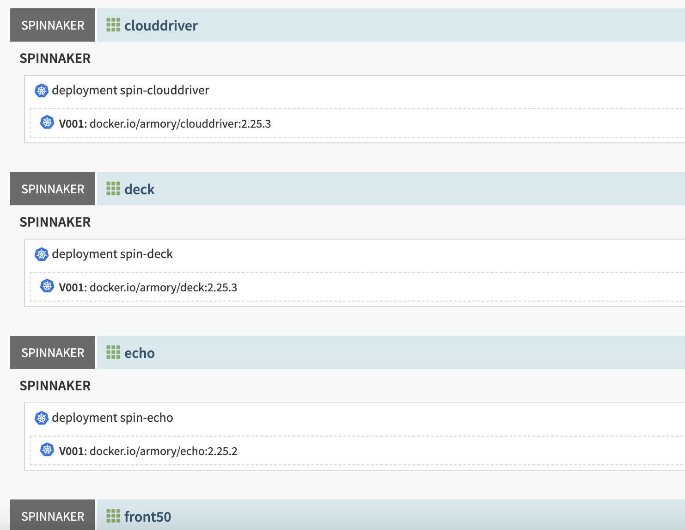
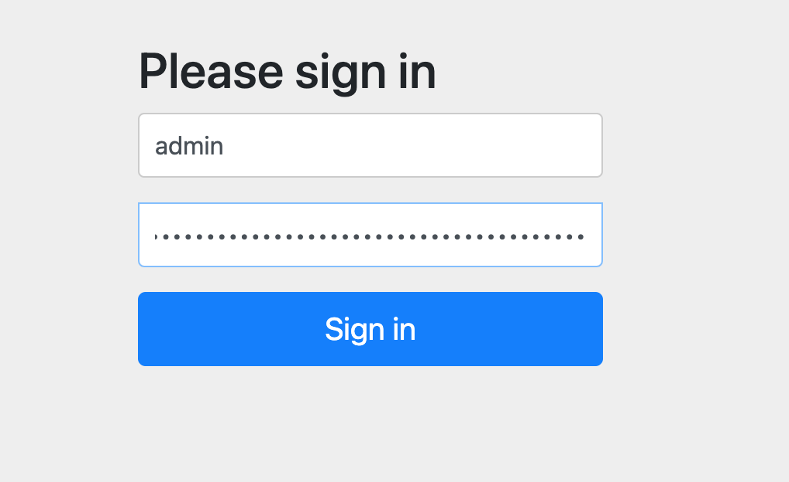
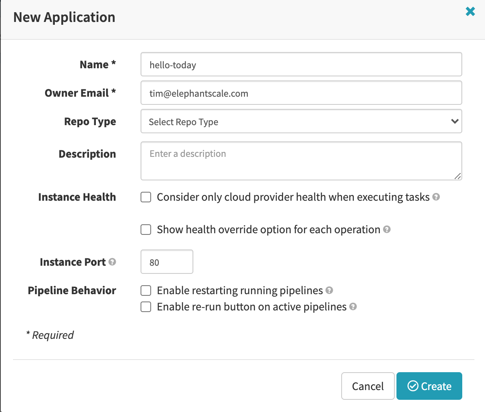

# Applications

---

## Application
 * An application is a service that you are going to deploy 
   - Typically a Microservice
 * In Spinnaker, we will define the application

---

## Application
 * Applications include the following:
 * Pipelines that process the service in deployment
 * Infrastructure
   - clusters
   - server groups
   - firewalls
   - load balacners
   - canary config

---

## System Applications
 * You might see "system" applications

---

## Create the Application

 * In Spinnaker, an "Application" is basically a grouping of pipelines and the resources deployed by those pipelines.  An Application can group any set of related resouces, and can group objects across multiple cloud targets (and cloud target types).  Common ways to organize services are:
* One application for each microservice
* One application for a set of microservices that make up a single cohesive business function
* One application for each team

---

## Log Into UI

. Log into the Spinnaker UI.

## Create Applicaiton

 * Click on "Applications"
 * Click on "Actions" and then "Create Application"
 * Call the application "hello-today" and put in your email address in the "Owner Email" field.

Important note about applications
When you first access a new instance of Spinnaker, you might notice that there are already several applications visible when you click the Applications tab. This happens if you install Spinnaker on an existing Kubernetes cluster, using the Kubernetes provider . These applications are derived from existing infrastructure.

Don’t delete any of them.

Also, don’t use any of them as applications in which to create pipelines or add further infrastructure. Instead, create new applications for your deployment pipelines.

What distinguishes one application from another?
By common practice, one application contains all of the above components for one microservice.

There is nothing in Spinnaker that enforces the level at which you divide up your services into applications, but it would be messy to put too much into one application, dealing not only with all the containers to bake, canary configs to manage, and so on, but also all the infrastructure.

For different reasons, you also don’t want to segregate different environments (dev, staging, prod) into different applications. In many cases you will have pipelines, which deploy into one environment, eventually trigger other pipelines that promote the same service into the next environment.

