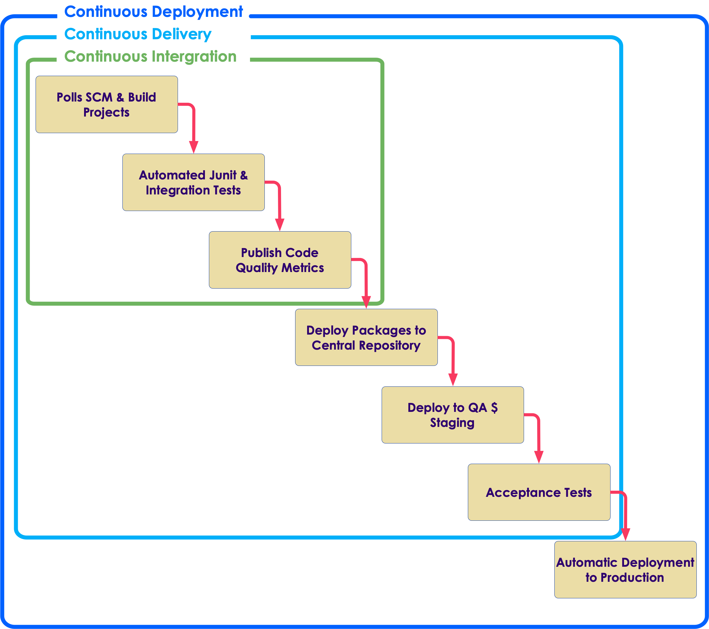

# Continuous Delivery With Spinnaker

---

## Topics in this Session

 *  **Agile Development** 

 * Continuous Integration versus 

 * Continuous Delivery versus 

 * Continuous Deployment

 * History of Spinnaker

 * State of the Spinnaker Community

Notes: 

---

## Agile Development

 * Agile development describes methodologies for incremental software development

     - **Empowers people** to collaborate and make team decisions for continuous planning, continuous testing and continuous integration and delivery

     - Scrum, XP, Kanban, Lean, FDD are some of the most popular Agile development methodologies

 * Manifesto for Agile Software Development

     - **Individuals and interactions** over processes and tools
     - **Working software** over comprehensive documentation
     - **Customer collaboration** over contract negotiation
     - **Responding to change** over following a plan

Notes: 

---

## Agile Development Process Overview

 <!-- {"left" : 2.44, "top" : 2.62, "height" : 8.46, "width" : 12.61} -->

Notes: 

---

## Agile Development Practices

 * Product Backlog and Spring Backlog
 * Sprints and Daily Sync
 * Burn down and velocity charts
 * Sprint review and retrospective
 * Simple design and Regular refactoring
 * Pair Programming
 * Test Driven Development
 * **Automation is the key**
 * **Continuous Integration (CI)**
 * **Continuous Delivery (CD)**
 * Definition of Done
 * Common "war-room" style work area

Notes: 

---

## CI and CD in Agile Development

 * Continuous Integration and Continuous Delivery become an essential ingredients for teams doing iterative and incremental software delivery in Agile Development

     - Developers share the common source code repository

     - Dedicated Continuous Integration environment

     - All code must pass unit tests

     - Integrate often

     - Regression tests run often

     - Code matrices are published

     - Every change to the system is releasable to production

     - **Automation is the key**

Notes: 

---

## Topics in this Session

 * Agile Development

 *  **Continuous Integration versus** 

 *  **Continuous Delivery versus** 

 *  **Continuous Deployment** 

 * History of Spinnaker

 * State of the Spinnaker Community

Notes: 

---

## Continuous Integration

 * Continuous Integration is a software development practice where members of a team **integrate their work frequently**, usually each person integrates at least daily - leading to **multiple integrations per day**. Each integration is verified by an automated build (including test) to detect integration errors as quickly as possible (Martin Fowler)

 * Goal is to merge and test the code **continuously** to catch issues early by **automating integration process**

     - Your project must have a reliable, repeatable, and automated build process involving no human intervention

 * Continuous Integration Server (aka Build Server Spinnaker) is responsible for performing the integration tasks

 * Concepts of unit testing, static analysis, failing fast and automated testing are core to Continuous Integration

Notes: 

---

## Continuous Integrations Practices

 * Have a single source repository for all developers

 * Automate the build

 * Every change to VCS should make a new build 

 * Keep the build fast and trackable

 * Make your build self-testing

 * Test the build in production-like environment

 * Keep all verified releases in artifacts repository and available to everyone

 * Publish coding metrics

Notes: 

---

## Continuous Delivery 

 * Continuous Delivery is a **natural extension** of Continuous Integration

     - Every change to the system has passed all the relevant automated tests and it s ready to deploy in production

     - Team can release any version at the push of a button

     - But the deployment to production is **not automatic**

 * The goal of CD is to put business owners are in the control of making the software releases

 * Continuous Delivery is an absolute requirements of **DevOps practices**

Notes: 

---

## Continuous Deployment

 * Continuous Development is adding **automatic deployment to end users** in the Continuous Delivery process

 * Continuous Deployment is the practice of automatically deploying every successful build directly into production

     - Deploying the code to production as soon it  passes the automated and UAT tests

 * Continuous Deployment is not appropriate for many business scenarios

     - Business Owners prefer more predictable release cycle and not making code release to production every week

Notes: 

---

## Continuous Integration, Delivery and Deployment

 

 <!-- {"left" : 4.11, "top" : 2.2, "height" : 9.31, "width" : 10.58} -->

Notes: 

---

## Benefits of Continuous Delivery
  * Removing the "ceremony" around software release
  * Benefits to this approach:
    - Innovation
    - Faster Feedback Loops
    - Increase Reliability and Availability
    - Developer Productivity and Efficiency

---

## Innovation
  * Quicker time to Market
    - New Features
    - Configuration Changes
    - Bug Fixes
  * Aggressive release cadence
    - Broken things fixed quickly
    - new featuress arrive sson

---

## Faster Feedback Loops
  * Small changes deployed frequently easier to troubleshoot
  * Automated Testing
    - Chaos Engineering
    - Automated Canary Analysis
  * Problems detected quickly
  * Fixed more effecively

---

## Increase reliability and availability
  * Incorporate tooling
  * Replace Manual Processes
  * Use Automated Worfklows
  * Continuous Delivery Pipelines
  * Safe Deployment Practices

---

## Developer Productivty and Efficiency
  * Reduces issues such as incompatible dependencies.
  * Issues are fresh in developers' minds
  * Less blame game
  * Greater Ownership

---

## Topics in this Session

 * Agile Development

 * Continuous Integration versus 

 * Continuous Delivery versus 

 * Continuous Deployment

 *  **Spinnaker and History of Spinnaker** 

 * State of the Spinnaker Community

Notes: 

---

## Spinnaker

 * **Continuous Delivery (CD) Server**

 * Open Source, Free and Written in Java/Javascript/Kotlin

 * Large and Dynamic community with growing adoption

 * Easy to Install in many different platforms

 * Easy to Use and friendly user interface

 * Lot of resources and tutorials available

 * Distributed Builds

 * Many more things...

Notes: 

---

## How Spinnaker Fits in CI and CD 

 <!-- {"left" : 2.52, "top" : 2.41, "height" : 8.89, "width" : 12.46} -->

Notes: 

---

## Spinnaker - History

 * Developed at Netflix

 * Spinnaker formerly known as **Asgard**

 * Extended by Google

 * Enabled to work with Google Cloud Platform / Google Kubernetes Engine

Notes: 

---

## Topics in this Session

 * Agile Development

 * Continuous Integration versus 

 * Continuous Delivery versus 

 * Continuous Deployment

 * History of Spinnaker

 *  **State of the Spinnaker Community** 

Notes: 

---

## State of the Spinnaker Community

 * Largest install base of any open source continuous integration and delivery platform

 * Over 1000+ public repositories on GitHub and strong commit activity

 * Quick feedback with addressing bugs and issues

 * Get answer on any questions from Spinnaker user mailing list and Stackoverflow

     - Chances are  other people have had your question and may have a solution

 * Learn more about Spinnaker at http://jenkins-ci.org/

Notes: 

---

## Total Spinnaker Installations

 * More stats can be found at - http://stats.jenkins-ci.org/jenkins-stats/svg/svgs.html

 * 04/2007-04/2017

 <!-- {"left" : 9.08, "top" : 2.68, "height" : 8.01, "width" : 7.88} -->

Notes: 

---

## InfoQ CI Survery 2014

 <!-- {"left" : 4.61, "top" : 2.07, "height" : 6.54, "width" : 8.27} -->

 *  **Ref: https://jenkins-ci.org/blog/2014/04/11/infoq-ci-survey-2014** 

Notes: 

---

## Continuous integration is elusive

 * As above, Spinnaker is king, however...

 * Survey says

     - 14% deploy on an hourly basis

     - 34% deploy once a day

     - 21% deploy weekly and 31% deploy less often than weekly

 * (See https://www.infoq.com/news/2017/03/agile-king-ci-ilusive-goal)

Notes: 

---

## Spinnaker Very Active GitHub Repository 

 <!-- {"left" : 2.5, "top" : 2.68, "height" : 8.34, "width" : 12.5} -->

Notes: 

---

