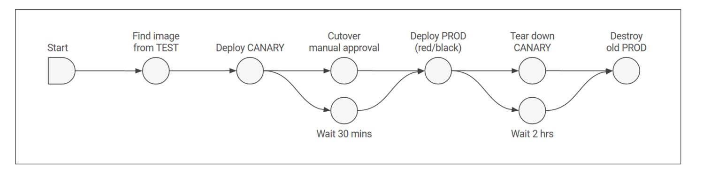

# Pipeline

---

## Pipelines 
 * In Spinnaker, pipelines are the key workflow construct used for deployments. 
 * Each pipeline has a configuration, defining things like:
   -  triggers, 
   - notifications, 
   - and a sequence of stages. 
 * When a new execution of a pipeline is started, each stage is run and actions are taken.
 * Pipeline executions are represented as JSON:
   - ontains all the information about the pipeline execution. 
   - JSON Variables Variables like time started, parameters, stage status, and server group names all appear in this JSON, which is used to render the UI.

---

## Stages
 * Pipelines subdivided into Stages
 * Stages chained together  Stages are chained together to define the overall work done as part of the continuous delivery process. Each type of stage performs a specific opera‐ tion or series of operations.
 * Infrastructure stages operate on the underlying cloud infrastructure by creating, updating, or deleting resources.
 * These stages are implemented for every cloud provider where applicable. This means that if your organization leverages multiple clouds, you can deploy to each of them in a consistent way, reducing cognitive load for your engineers.

---

## Stage Examples
 * Bake (create an AMI or Docker image)
 * Tag Image
 * Find Image/Container from a Cluster/Tag
 * Deploy
 * Disable/Enable/Resize/Shrink/Clone/Rollback a Cluster/Server Group
 * Run Job (run a container in Kubernetes)

---

## Baking
 * Bake takes an artifact and bakes into an immutalbe artifact. Examples:
   - Docker Image
   - AMI (Amazon Machine Image
 * If you do not need to bake an image, then 
Tag Image stages apply a tag to the previously baked images for categorization. Find Image stages locate a previously deployed version of your immutable infra‐ structure so that you can refer to that same version in later stages.
The rest of the infrastructure stages operate on your clusters/server groups in some way. These stages do the bulk of the work in your deployment pipelines.

--- 

## Triggers

 * Most pipelines are triggered based on some event
 * We need to define the triggers to do our pipeline
 * Two types of Triggers:
   - Time Basd Triggers
   - Event based Triggers

---

## Time Based Triggers
 * Manual
   - ad-hoc run triggers
 * Cron
   - Run as a scheduled cron job

---

## Event-based triggers
  * Git
  * Continuous Integration
  * Docker
  * Pipeline
  * Pub/Sub

---

## Example Pipeline
 * Example Pipeline

---

## About pipelines

 * Pipelines are your way of managing deployments in a consistent, repeatable and safe way. 
 * A pipeline is a sequence of stages provided by Spinnaker:
    - functions that manipulate infrastructure (deploy, resize, disable)
    -  utility scaffolding functions (manual judgment, wait, run Jenkins job) that 
    - together precisely define your runbook for managing your deployments.

---

## Edit Pipeline

---

## Stages

* Define your sequence of stages at the top. Spinnaker supports parallel paths of stages, as well as the ability to specify whether multiple instances of a pipeline can be run at once.

* Specify details for a given stage in the sections below.

* You can view pipeline execution history, which serves as a means to introspect details of each deployment operation, as well as an effective audit log of enforced processes/policies on how you make changes to your deployed applications landscape.

--- 

## Pipelines

---

### Pipelines

 * Automation does not end with orchestrating only the high-level steps of your release process. 
 * Each of these operational steps often corresponds to a sequence of calls to the cloud platform, 
 * each of which needs to be remediated in failure scenarios. 
 * The red/black Deploy stage is an example of how Spinnaker fully supports this notion:

---

## Red Black

---

## Deployment

* The Red/Black Deploy stage in Spinnaker actually entails a sequence of steps

* Each given step is actually a set of tasks that need polling, remediation to ensure requisite state is reached prior to proceeding

* A given task often entails multiple API calls to the specific cloud platform, cognizant of expected response codes and remediating actions in failure

---

## Pipeline templates

* Managed pipeline templates are a way to scalably manage pipelines across different teams.

* Pipeline templates have two main components:

* Template

  - A pipeline template defines a parameterized pipeline, with the set of
  variables for which your users will provide values.

* Configuration

   - A concrete implementation of a template. Configurations can inject new stages
  into the final pipeline graph and inherit or override, or both, triggers,
  notifications, and parameters.

---

### Terminology

  * Pipeline Template

    -  parameterized pipeline, minus the pipeline configuration found on a pipeline
instance. This template helps developers create pipelines that follow a pattern
that you establish.

  * Pipeline configuration

  * Pipeline template variable

  * A variable defined in a pipeline template, whose value is deteremined when a
pipeline is instantiated based on the template. Contrast with pipeline
variables, which vary per execution of the pipeline.

---

## Pipeline Lab

 * Creating Load Balancers
 * Creating the load balancers (service and ingress) for our application (one for each environment) through the UI.
 * Creating a single-stage pipeline that deploys our application to the `dev` environment, and running it.
 * Running the pipeline with a different parameter
 * Adding on additional stages that perform a manual judgment and then deploy to the `test` environment.  And running the pipeline.
 * Adding on additional stages that perform another manual judgment and a wait and then deploy to the `prod` environment with a blue/green deployment.  And running the pipeline.
 * Adding a parameter to indicate the number of instances for the prod environment.
 * Adding an option to skip the test environment, using a parameter.
 * Adding a webhook trigger to our application, and triggering it manually
 * Triggering a pipeline without a webhook trigger, using a webhook

