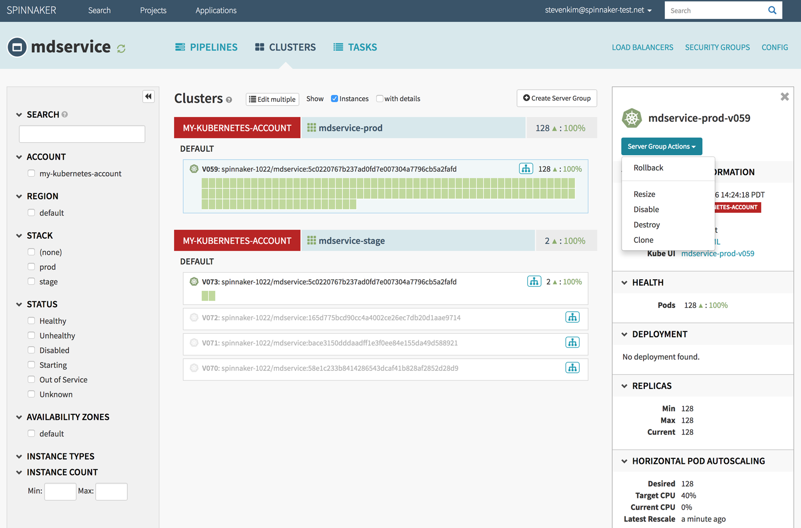

# Continuous Delivery With Spinnaker

---

## Spinnaker

 * **Continuous Delivery (CD) Server**

 * Open Source, Free and Written in Java/Javascript/Kotlin

 * Large and Dynamic community with growing adoption

 * Easy to Install in many different platforms

 * Easy to Use and friendly user interface

 * Lot of resources and tutorials available

 * Many more things...

Notes: 

---

## Spinnaker - History

 * Developed at Netflix

 * Spinnaker formerly known as **Asgard**

 * Extended by Google

 * Enabled to work with Google Cloud Platform / Google Kubernetes Engine

Notes: 

---

---

## State of the Spinnaker Community

 * Largest install base of any open source continuous integration and delivery platform

 * Over 1000+ public repositories on GitHub and strong commit activity

 * Quick feedback with addressing bugs and issues

 * Get answer on any questions from Spinnaker user mailing list and Stackoverflow

     - Chances are  other people have had your question and may have a solution

Notes: 

---

# Success Stories
 * Success stories from around the web tell of enterprises moving from brittle deployments to continuous delivery with Spinnaker:

 * Airbnb uses Spinnaker to migrate from monolith to service-oriented architecture.
 * SAP leverages Spinnaker on its mission to run the world better.
 * Pinterest boosts productivity with Spinnaker as it pioneers visual discovery.
 * Mercari champions Spinnaker as a safeguard against deployment fear while releasing new services.
 * Salesforce adopted Spinnaker to bake images for both Kubernetes and VMs, to support its complex delivery requirements.

## Total Spinnaker Installations

 * More stats can be found at - http://stats.jenkins-ci.org/jenkins-stats/svg/svgs.html

 * 04/2007-04/2017

 <!-- {"left" : 9.08, "top" : 2.68, "height" : 8.01, "width" : 7.88} -->

Notes: 

---

---

## Continuous integration is elusive

 * As above, Spinnaker is king, however...

 * Survey says

     - 14% deploy on an hourly basis

     - 34% deploy once a day

     - 21% deploy weekly and 31% deploy less often than weekly

 * (See https://www.infoq.com/news/2017/03/agile-king-ci-ilusive-goal)

Notes: 

---

## Spinnaker Very Active GitHub Repository 

 <!-- {"left" : 2.5, "top" : 2.68, "height" : 8.34, "width" : 12.5} -->

Notes: 

---

## Concepts
 * "Spinnaker is an open-source, multi-cloud continuous delivery platform that helps you release software changes with high velocity and confidence."
 * Spinnaker provides two core sets of features:
   - Application management
   - Application deployment
 * In addition, Spinnaker provides a higher-level experience that builds on top of the above features via Managed delivery .

---

## Application management
 * Spinnaker’s application management features to view and manage your cloud resources.

 * Modern tech organizations operate collections of services—sometimes referred to as “applications” or “microservices.” A Spinnaker application models this concept.

 * Services Key Concepts:
   - Applications
   - Clusters
   - Server Groups
 
 * how your services are exposed to Users:
   - Load Balacners
   - Firewalls
  
---

## Application Management

 

---

## Application
 * An application in Spinnaker is a collection of clusters, which in turn are collections of server groups. The application also includes firewalls and load balancers.

 * An application represents the service which you are going to deploy using Spinnaker, all configuration for that service, and all the infrastructure on which it will run.

 * You will typically create a different application for each service, though Spinnaker does not enforce that.

## Cluster
 * logical groupings of Server Groups in Spinnaker.

 * Note: cluster, here, does not map to a Kubernetes cluster. 
 * It’s merely a collection of Server Groups, 
 * irrespective of any Kubernetes clusters that might be included in your underlying architecture.

---

## Server Group
 * the Server Group, identifies the following:
    - deployable artifact (VM image, Docker image, source location) and 
    - basic configuration settings such as number of instances, autoscaling policies, metadata, etc. 
 * This resource is optionally associated with a Load Balancer and a Firewall. 
 * When deployed, a Server Group is a collection of instances of the running software (VM instances, Kubernetes pods).

---

## Load Balancer
 * A Load Balancer is associated with an ingress protocol and port range. It balances traffic among instances in its Server Groups. Optionally, you can enable health checks for a load balancer, with flexibility to define health criteria and specify the health check endpoint.

--- 

## Firewall
 * A Firewall defines network traffic access. 
 * It is effectively a set of firewall rules defined by an IP range (CIDR) along with a communication protocol (e.g., TCP) and port range.

---

## Pipelinee

---

## Pipeline

 * The pipeline is the key deployment management construct in Spinnaker. It consists of a sequence of actions, known as stages. You can pass parameters from stage to stage along the pipeline.

 * You can start a pipeline manually, or you can configure it to be automatically triggered by an event, such as a Jenkins job completing, a new Docker image appearing in your registry, a CRON schedule, or a stage in another pipeline.

 * You can configure the pipeline to emit notifications, by email, Slack, or SMS, to interested parties at various points during pipeline execution (such as on pipeline start/complete/fail).

--- 

## Stage
 * A Stage in Spinnaker is a collection of sequential Tasks and composed Stages that describe a higher-level action 
 * Pipeline will perform either linearly or in parallel. 
 * You can sequence stages in a Pipeline in any order, though some stage sequences may be more common than others. 
 * Spinnaker provides a number of stages such as Deploy, Resize, Disable, Manual Judgment, and many more. You can see the full list of stages and read about implementation details for each provider in the Reference section.

---

# Deployment strategies

![](../../assets/images/

