# Streaming Primer

---

## Lesson Objectives

* Understand streaming use cases

* Learn about streaming concepts

* Gain insight on streaming architectures

Notes:

---

# Why Streaming?

---

## Big Data Evolution: Version 1

* Decision times: batch ( hours / days)

* Use cases:
    - Modeling
    - ETL
    - Reporting

<!-- {"left" : 1.46, "top" : 3.21, "height" : 3.71, "width" : 7.33} -->

Notes:

---

## Moving Towards Fast Data: Version2

<!-- {"left" : 6.62, "top" : 1.23, "height" : 3.24, "width" : 3.27} -->

  * Decision time: (near) real time
    - Seconds (or milliseconds)
  * Use Cases
    - Alerts (medical/security)
    - Fraud detection
  * Streaming is becoming more prevalent
    - Connected Devices
    - Internet of Things
  * Beyond Batch
    - We need faster processing and analytics

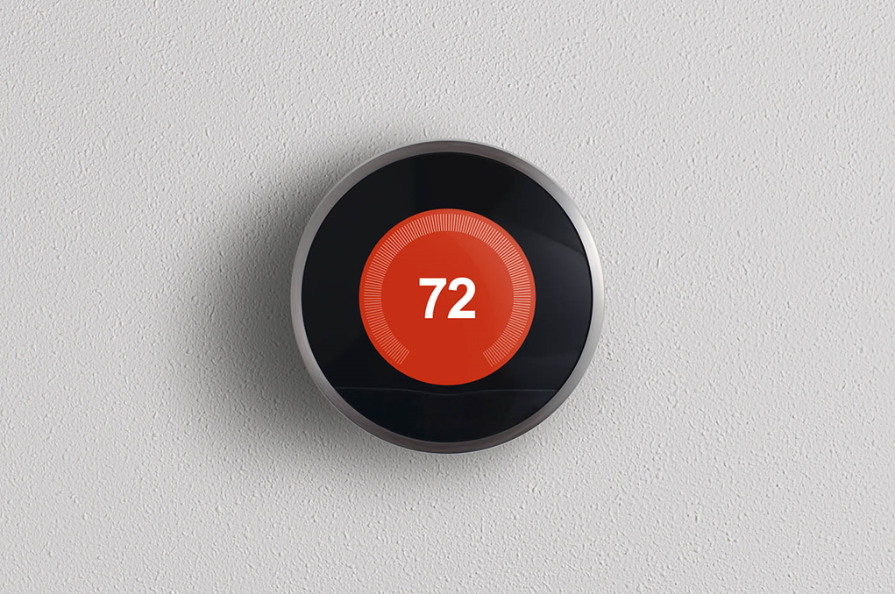<!-- {"left" : 2.58, "top" : 6.9, "height" : 1.81, "width" : 2.63} --> &nbsp; <!-- {"left" : 5.24, "top" : 6.9, "height" : 1.81, "width" : 2.43} -->

Notes:

---

## Streaming Volumes: Texas Utilities Smart Meter Data

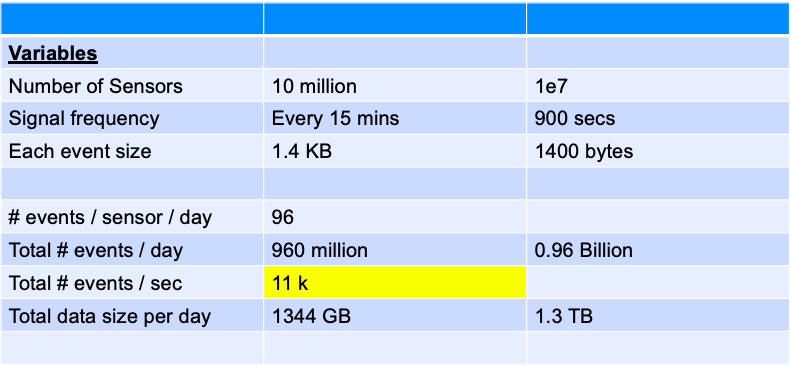<!-- {"left" : 0.94, "top" : 1.81, "height" : 3.88, "width" : 8.37} -->

Notes:

---

## Streaming Use Cases

  * Netflix
    - Recommendations
    - 450 billion events/day

  * Weather Company
    - Analyze weather sensor data
    - Billions of events/day
    - Multi-Petabyte (PB) traffic daily

  * More use cases at [BigDataUseCases.info](www.BigDataUseCases.info)

<!-- {"left" : 2.12, "top" : 5.52, "height" : 1.47, "width" : 3.18} -->
  &nbsp;  &nbsp;
<!-- {"left" : 6.24, "top" : 5.52, "height" : 1.47, "width" : 1.89} -->

Notes:

---

# Streaming Concepts

---

## Real Time / Near Real Time

* The 'real' real time is in milliseconds order
    - DB query returns in 2 ms

* 'near real time' is seconds
    - We can process an event within 3 seconds of its generation time

| Name                              | Time                                                | Example                       |
|------------------------------------|-----------------------------------------------------|-------------------------------|
| Hard real time                     | Single order ms,sub milli seconds   1 ms,0.5 ms | Space shuttle control systems |
| Credit card transaction processing | 50 ms, 300 ms                                       | Db queries                    |
| Sending Emails                     | 2 secs +                                            | Stream processing latency     |
|                                    | 1 min +                                             | Mini batch queries            |

Notes:

---
## Streaming Concepts

  * Processing model
    - Event based or micro batch based
  * Processing guarantees
    - At least once
    - At most once
    - Exactly once
  * State management
  * Event time vs. Arrival time
  * Window Operations
  * Back-pressure adjustment

Notes:

---

## Streaming Processing Model

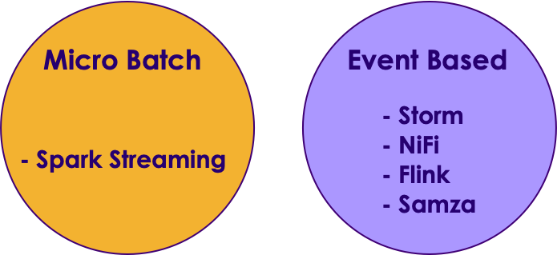<!-- {"left" : 2.44, "top" : 6.32, "height" : 2.46, "width" : 5.38} -->

  * Two major modes:
    - Event based , Micro Batch

  * Event Based:
    - Events are processed, individually,  as they come in
    - Usually low latency
    - Frameworks: Storm, Flink, Nifi, Samza

  * Micro-Batch
    - Events arrived during a particular time frame (5 secs) are processed as a batch
    - Slightly higher latency (due to batching)
    - Frameworks: Spark Streaming

Notes:

---
## Event Based Vs. Batch

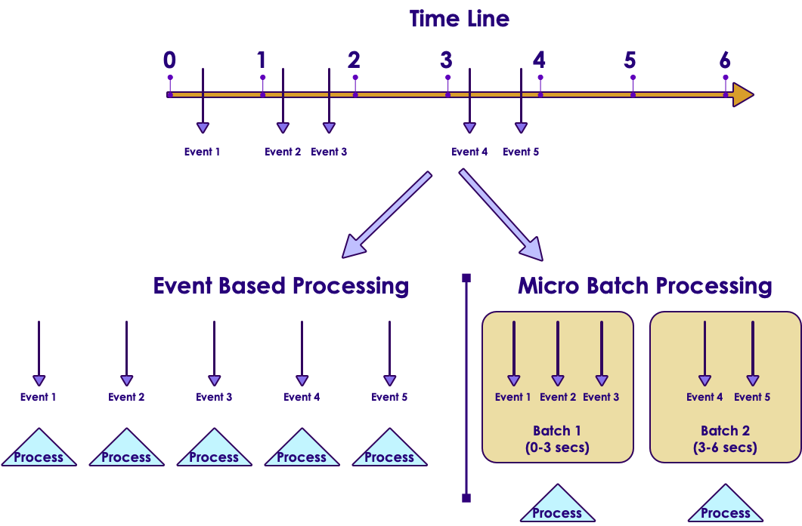<!-- {"left" : 1.17, "top" : 1.94, "height" : 5.19, "width" : 7.91} -->

Notes:

---

## Processing Guarantees

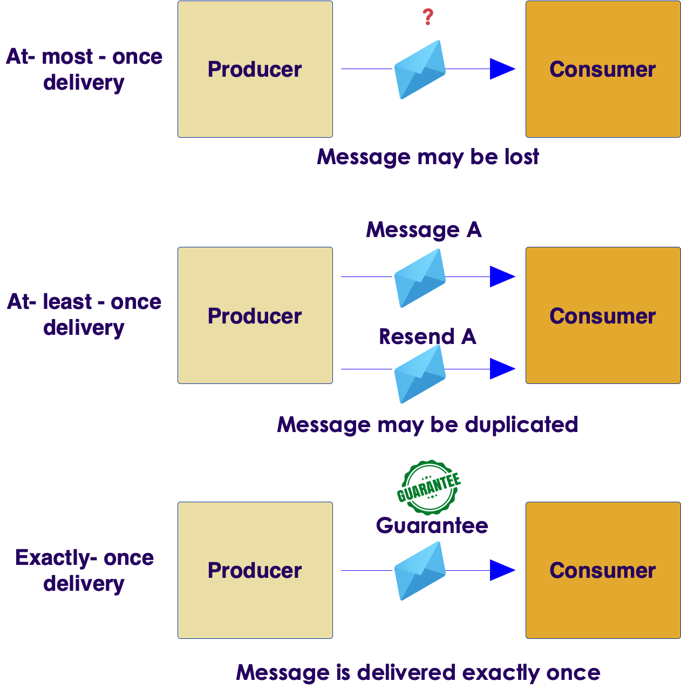<!-- {"left" : 6.76, "top" : 0.88, "height" : 4.37, "width" : 3.28} -->

* At Least Once

* At Most Once

* Exactly Once

* In the order of effort required:
    - At-most-once <  At-least-once  < exactly-once

---

## At Most Once

<!-- {"left" : 6.76, "top" : 0.88, "height" : 4.37, "width" : 3.28} -->

* **Event is sent only once**

* **No duplicate processing**

* Events **can be dropped** due to crashes or heavy load

* E.g.  Web requests (if the web server is busy, requests are dropped)

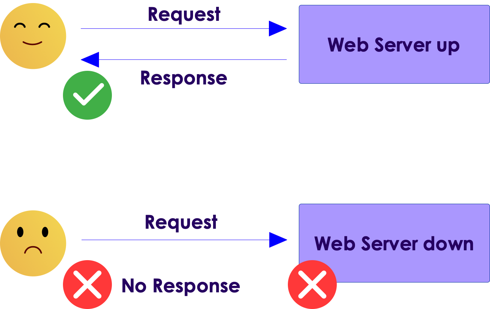<!-- {"left" : 6.76, "top" : 0.88, "height" : 4.37, "width" : 3.28} -->

---

## At Least Once

<!-- {"left" : 6.76, "top" : 0.88, "height" : 4.37, "width" : 3.28} -->

- All events are **guaranteed to be processed (no dropped events)**

- How ever, **events can be processed more than once**

- In case of failure recovery, events can be re-sent  and processed again.

- **Most common** implementation

- Frameworks: All (Storm, Spark, NiFi, Samza, Flink)

---

## Handling Duplicate Events

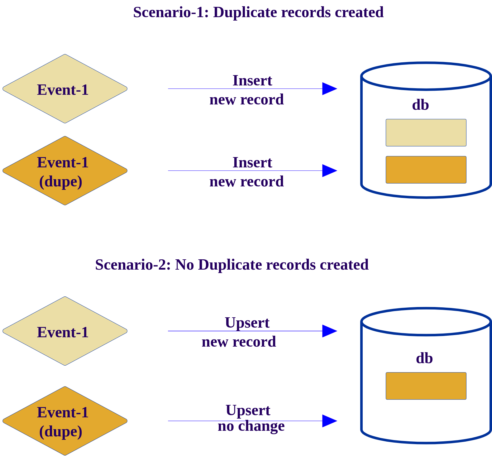<!-- {"left" : 6.76, "top" : 0.88, "height" : 4.37, "width" : 3.28} -->

* A resilient streaming system, has to be ready to handle duplicate events

* Here we have 2 scenarios:

* First one, we are inserting a new record for each event received.  This will result in **duplicate records in the database**

* Second one, we are checking to see if the event is processed already, only if not, then a new record is inserted

* Second approach is more resilient, can deal with duplicate events
    - This is called **idempotent processing** (no side effects for duplicate events)

Notes:

---

## Exactly Once

<!-- {"left" : 6.76, "top" : 0.88, "height" : 4.37, "width" : 3.28} -->

* Events are guaranteed to be processed **once and only once**

* **No dropped events**

* **No duplicate processing**

* Frameworks: Storm (with Trident), Flink, Spark, Samza

* Sample applications
    - Credit card processing

Notes:

---

## Exactly Once

---

## Processing Guarantees Summary

| Application                        | Processing                                                                                                                                          |
|------------------------------------|-----------------------------------------------------------------------------------------------------------------------------------------------------|
| GPS routing app                    | -At most once. We can skip past events to catch up to latest events ('next turn' is more important than past data)  -At least once can work too |
| Credit card transaction processing | -Exactly once we don't want to charge credit cards twice due to duplicate processing                                                                |
| Sending Emails                     | -At least once We don't want drop any emails.,Duplicate processing is OK (we might send duplicate emails)                                           |

<!-- {"left" : 0.25, "top" : 1.48, "height" : 3.73, "width" : 9.75} -->

Notes:

---

## State Management

  * Can the framework remember state associated with events?

  * Per event processing (filter , transformation) don't need state
    - Filter #hashtags from tweets

  * However, complex operations like joining, grouping, aggregating (counts) require state
    - What is the max temperature reported in last one hour

  * SQL analogy
    - Select,  and where clauses don't need state.
    - JOIN / Group BY usually require state

  * Support varies according framework

Notes:

---

## State Management Strategies

<!-- {"left" : 0.43, "top" : 1.59, "height" : 1.85, "width" : 4.9} -->
  &nbsp; 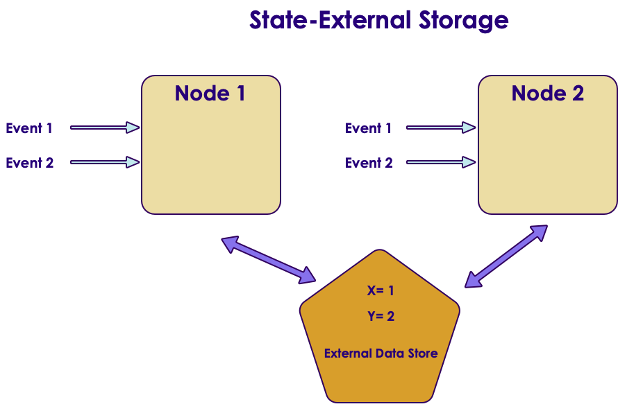 &nbsp; <!-- {"left" : 5.6, "top" : 1.83, "height" : 2.88, "width" : 4.23} -->

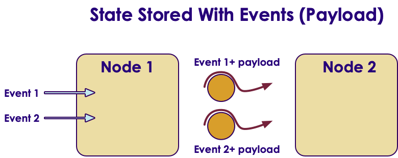<!-- {"left" : 1.89, "top" : 5.35, "height" : 2.57, "width" : 6.47} -->

Notes:

---

## State Management

* Store state in memory:
    - Lost if node crashes
    - All types of events have to go to a particular node to compare state

* Store state in an external store (DB)
    - State can be maintained across nodes
    - Queries can increase latencies and become bottle neck and limit speed of processing

* Store state along with the event (piggy packing)
    - Event has 'complete payload' with state
    - Efficient, no need for external storage
    - Increases event size (need high throughput IO)

Notes:

---

## Window Operations

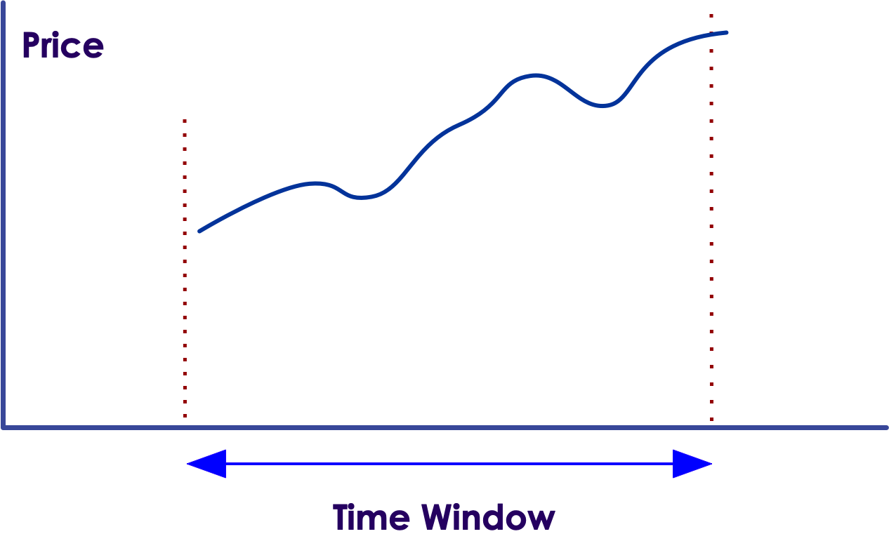<!-- {"left" : 6.76, "top" : 0.88, "height" : 4.37, "width" : 3.28} -->

* To answer some queries, we need to process events in a certain time frame.
    - E.g.  How much AAPL  stock has gone up in last 10 minutes?

* **Window based operations** allow us group a bunch of messages by time and process them

* Some frameworks support window operations natively:  Spark, Flink

Notes:

---

## Event Time and Arrival Time

* **Event Time**: When the event occurred / generated

* **Arrival Time**: When event arrives for processing

* Event Time < Arrival Time

* Some times events may arrive 'out of order' (due to network lag, outtage ..etc)

<!-- {"left" : 2.12, "top" : 5.02, "height" : 3.42, "width" : 6.01} -->

Notes:

---

## Event Time vs. Arrival Time 

<!-- {"left" : 0.61, "top" : 1.92, "height" : 4.13, "width" : 9.03} -->

Notes:

---

## Back Pressure

<!-- {"left" : 6.91, "top" : 1.55, "height" : 1.76, "width" : 2.98} -->

* Some times processing lags behind
    - Processing system is too busy
    - Temporary spike in input data (Twitter stream exploding after an election results is announced)

* Events pile up
    - May lead to events being dropped.
      -> un-acceptable in most of the situations

* Solutions
    - signal 'upstream' processors to slow down?
    - Leave events in the persistent buffer longer

Notes:

---

## Back Pressure

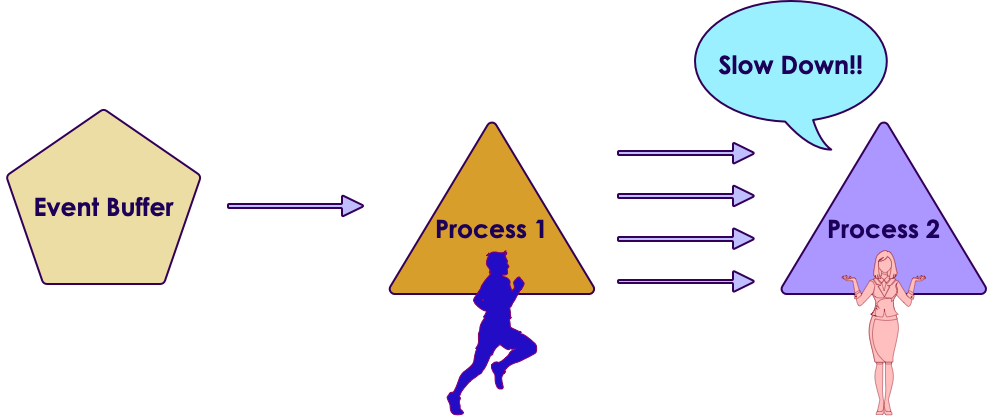<!-- {"left" : 1.86, "top" : 1.95, "height" : 2.74, "width" : 6.54} -->

<!-- {"left" : 2, "top" : 4.95, "height" : 2.74, "width" : 6.25} -->

Notes:

---

# Streaming Architecture

---

## 3 Tier Streaming Architecture

* Here is a simplified streaming architecture

* We see 3 distinct stages

* **Ingest** stage captures data

* **Processing** handles the data

* And the processed data is stored in **Storage** layer

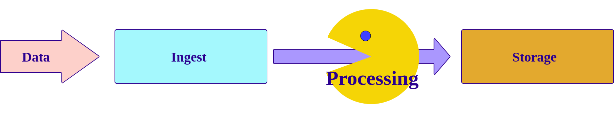<!-- {"left" : 0.56, "top" : 3.04, "height" : 3.56, "width" : 9.13} -->

Notes:

---

## Ingest / Capture

* This layer:
    - Captures incoming data
    - Acts as a 'buffer' - smoothes out bursts
    - So even if our processing offline, we won't loose data

* Choices
    - **Kafka**
    - Queues (MQ, JMS ..etc)
    - Cloud based queues like Amazon Kinesis

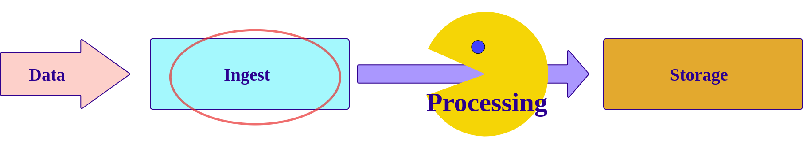<!-- {"left" : 5.88, "top" : 3.48, "height" : 1.89, "width" : 4.21} -->

Notes:

---

## Processing

* We need to process events with low latency  (milliseconds to  seconds)
* There are many **stream/event processing frameworks** available
    - [Storm](https://storm.apache.org/)
    - [Spark](https://spark.apache.org/)
    - [NiFi](https://nifi.apache.org/)
    - [Samza](http://samza.apache.org/)
    - [Flink](https://flink.apache.org/)
    - [Beam](https://beam.apache.org/)
* References:
    - [Evaluating Streaming Frameworks for Large-Scale Event Streaming](https://medium.com/adobetech/evaluating-streaming-frameworks-for-large-scale-event-streaming-7209938373c8)
    - [7 Popular Stream Processing Frameworks Compared](https://www.upsolver.com/blog/popular-stream-processing-frameworks-compared)

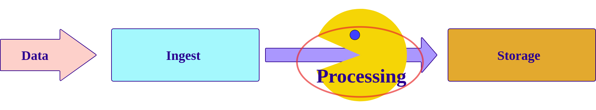<!-- {"left" : 4.84, "top" : 1.78, "height" : 2.41, "width" : 5.15} -->
Notes:

---

## Streaming Frameworks

| Feature              | Storm                                             | Spark Streaming | Flink                            | NiFi        |
|----------------------|---------------------------------------------------|-----------------|----------------------------------|-------------|
| Processing Model     | Event-based by default,(Micro Batch using Trident | Micro Batch     | Event-based,+,Micro Batch- based | Event-based |
| Windowing operations | Supported by Trident                              | Yes             | Yes                                | ?           |
| Latency              | Milliseconds                                      | Seconds         | Milliseconds                     |             |
|                      |                                                   |                 |                                  |             |
| At-least-once        | YES                                               | YES             | YES                              | YES         |
| At-most-once         |                                                   |                 |                                  |             |
| Exactly-once         |                                                   |                 |                                  |            &nbsp; |

<!-- {"left" : 0.25, "top" : 1.71, "height" : 5.15, "width" : 9.75} -->

Notes:

---

## Storage

* After events are processed, they are stored for later retrieval
* Two choices:
    - Real time store
    - 'Forever' store
* Real Time Store
    - Need to absorb data in real time
    - Usually a NoSQL storage (HBase, Cassandra ...etc)
    - May contain subset of data (last 1 year ..etc)
* 'Forever store'
    - Needs to store massive amounts of data
    - Support analytics (usually batch)
    - Hadoop / HDFS

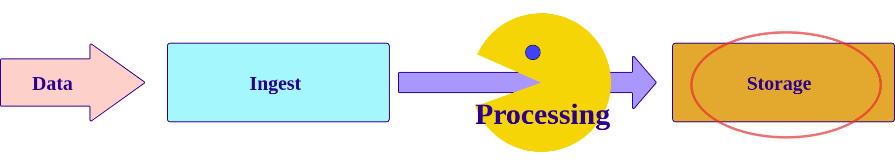<!-- {"left" : 5.95, "top" : 1.41, "height" : 2.02, "width" : 4.15} -->

Notes:

---

## Lambda Architecture

<!-- {"left" : 1.02, "top" : 2.44, "height" : 4.76, "width" : 8.21} -->

Notes:

---

## Lambda Architecture

<!-- {"left" : 1.02, "top" : 2.44, "height" : 4.76, "width" : 8.21} -->

  * All new data is sent to **both batch layer and  speed layer**
  * **Batch layer**
    - Holds master data set (immutable , append-only)
    - Answers batch queries
  * **Serving layer**
    - updates batch views so they can be queried adhoc
  * **Speed Layer**
    - Handles new data
    - Facilitates fast / real-time queries
  * **Query layer**
    - Answers queries using batch & real-time views

Notes:

---

## Lambda Architecture Example

* Kafka is our ingest layer

* Spark is processing engine

* And we are persisting data both in HDFS and in NOSQL

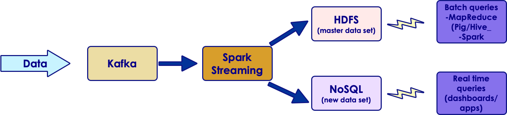<!-- {"left" : 0.72, "top" : 3.53, "height" : 2.01, "width" : 8.8} -->

Notes:

---

## Streaming Stack - Summary

* Here are some popular choices for streaming stack

* Each tier, you can plugin a technology -- think of it like legos!

<!-- {"left" : 0.41, "top" : 2.4, "height" : 4.26, "width" : 9.43} -->

Notes:

---

## Review and Q&A

<!-- {"left" : 8.56, "top" : 1.21, "height" : 1.15, "width" : 1.55} -->
<!-- {"left" : 6.53, "top" : 2.66, "height" : 2.52, "width" : 3.79} -->

* Let's go over what we have covered so far

* **What are your streaming uses cases ?**

* Any questions?

---

# Appendix: Streaming Frameworks

---

## Streaming Frameworks

  * Storm
  * Spark Streaming  
  * NiFi
  * Flink
  * Samza

Notes:

---

## Storm

* 'Original' stream processing platform
* Open sourced by Twitter around 2010
* Integrates with multiple systems: MQ, Kafka
* Trident is a high level framework on top of Storm

| Feature                         | Storm                  | Storm + Trident     |
|---------------------------------|------------------------|---------------------|
| Processing Model                | Event batch            | Event + micro batch |
| Processing guarantee            | At-least-once          | Exactly-once        |
| State                           | Yes starting with 1.0  |                     |
| Supports window based functions | Yes starting with 1.0  | Yes                 |
| Latency                         | Sub seconds to seconds | Yes                 |
| Caching                         | no                     |                     |
| Supported languages             | Java, Python           |             &nbsp;         |

<!-- {"left" : 0.25, "top" : 3.93, "height" : 4.19, "width" : 9.75} -->

Notes:

---
## Spark Streaming

  * Based on popular Spark framework

  | Feature                         | NiFi                         |
  |---------------------------------|------------------------------|
  | Processing Model                | Micro batch                  |
  | Processing guarantee            | At-least-once,  exactly-once |
  | Supports window based functions | yes                          |
  | Latency                         | seconds                      |
  | Caching                         | yes                          |
  | Supported languages             | Java, Scala, Python          |

<!-- {"left" : 0.25, "top" : 2.07, "height" : 3.5, "width" : 9.75} -->

Notes:

---
## Flink

  * A new framework, that is gaining momentum
  * Developed by consortium of German universities

  | Feature                         | NiFi                        |
  |---------------------------------|-----------------------------|
  | Processing Model                | Event based & batch based   |
  | Processing guarantee            | At-least-once, exactly-once |
  | Supports window based functions | ?                           |
  | Latency                         | Sub seconds to seconds      |
  | Caching                         | ?                           |
  | Supported languages             | Java, Scala, Python         |

<!-- {"left" : 0.25, "top" : 2.78, "height" : 3.5, "width" : 9.75} -->

Notes:

---
## NiFi

  * Event flow and processing system
  * Open sourced by National Security Agency (NSA)
  * A startup (Onviya) was acquired by Horton Works
  * Hortonworks'  'data flow' product

| Feature                         | NiFi                   |
|---------------------------------|------------------------|
| Processing Model                | Event based            |
| Processing guarantee            | At-least-once,?        |
| Supports window based functions | ?                      |
| Latency                         | Sub seconds to seconds |
| Caching                         | ?                      |
| Supported languages             | Java, Scala, Python    |

<!-- {"left" : 0.25, "top" : 3.82, "height" : 3.5, "width" : 9.75} -->

Notes:

---

## Samza

  * Another new framework
  * Developed by LinkedIn
  * Tight integration with Kafka (also developed at LinkedIn)

| Feature                         | Samza                  |
|---------------------------------|------------------------|
| Processing Model                | Event based            |
| Processing guarantee            | At-least-once          |
| Supports window based functions | ?                      |
| State                           | Yes                    |
| Latency                         | Sub seconds to seconds |
| Caching                         | ?                      |
| Supported languages             | Java, Scala, Python    |

<!-- {"left" : 0.25, "top" : 3.82, "height" : 3.5, "width" : 9.75} -->

Notes:

---

## Streaming Frameworks At A Glance

| Feature                  | Storm                                                  | Spark Streaming | Flink                                    | NiFi            | Samza       |
|--------------------------|--------------------------------------------------------|-----------------|------------------------------------------|-----------------|-------------|
| **Processing Model**     | Event based by default (micro batch using Trident) | Micro Batch     | Event based, +  MicroBatch based | Event Based (?) | Event based |
| **Windowing operations** | Yes (from 1.0)                                         | Yes             | Yes                                      | ?               | ?           |
| **State**                | Yes (from 1.0)                                         | Yes             | Yes                                      | Yes             | Yes         |
| **Latency**              | Sub seconds                                            | Seconds         | Sub seconds                              | Sub seconds     | Sub seconds |
| **Back Pressure**        | Yes                                                    |                 | Yes                                      |                 |             |
| **At-least-once**        | YES                                                    | YES             | YES                                      | YES             | YES         |
| **At-most-once**         |                                                        |                 |                                          |                 |             |
| **Exactly-once**         |                                                        |                 |                                          |                 |             &nbsp;|

<!-- {"left" : 0.25, "top" : 1.13, "height" : 7.39, "width" : 9.75} -->

Notes:

