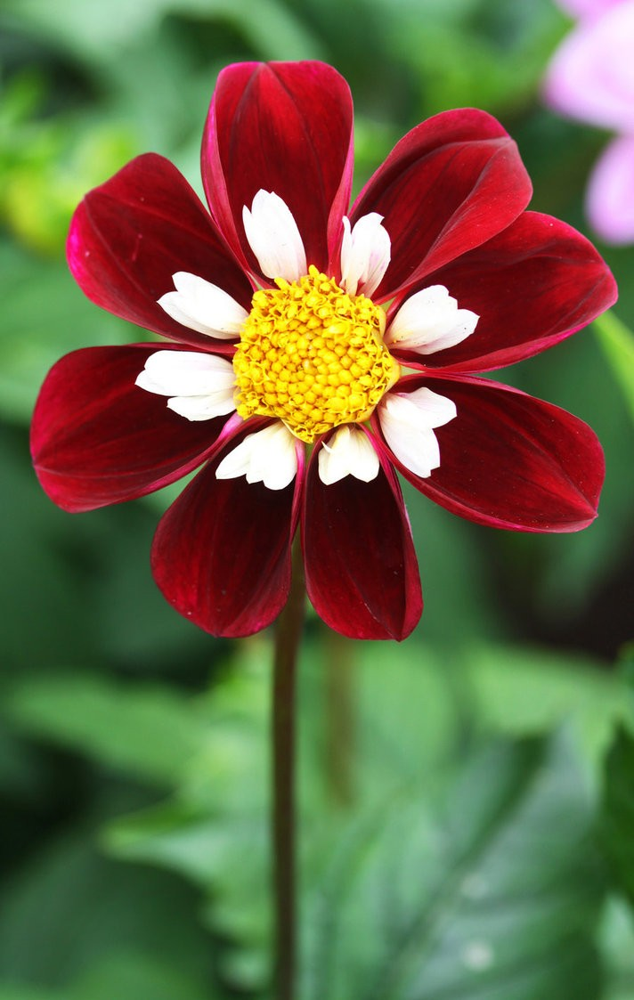

# Title : Template Slide

---

## Bullets compact

- bullet 1
- bullet 2
   - sub bullet

md

```md
- bullet 1
- bullet 2
   - sub bullet
```

---

## Bullets spaced

- bullet 1

- bullet 2
   - sub bullet

md
```md
- bullet 1

- bullet 2
   - sub bullet
```
---

## Headings

### 3 hash heading

#### 4 hash heading

md
```md
### 3 hash heading

#### 4 hash heading
```

---

## Quotes


> "One small step for man, One giant leap for mankind"  
>  Neal Armstrong


md
```md
> "One small step for man, One giant leap for mankind"  
>     - Neal Armstrong

```

---

## Bold / Italic

- **bold** text
- *italic* text
- _italic_ text
- **_bold and italic_** text

md
```md
- **bold** text
- *italic* text
- _italic_ text
- **_bold and italic_** text

```
---

## Code

```python
print("hello world")
```

```
some random code snippet
```

---
## Links

[ElephantScale.com](https://elephantscale.com)

md
```md
[ElephantScale.com](https://elephantscale.com)
```

---
## Tables

Use [Markdown table generator](https://www.tablesgenerator.com/markdown_tables)

|               | Sujee        | Mark        |
|---------------|--------------|-------------|
| Lives         | Milpitas, CA | Houston, TX |
| Favorite Food | Thai         | Pizza       |
---

## Images - Simple Layout

- Here is a sunflower


md
```md

```

---

## Images - Align to right


- Here is a sunflower
- aligned right using `float:right`

<br clear="all"/>
md
```md


- Here is a sunflower
- isn't this pretty?
```
---

## Images - side by side




md
```md


```
---

## Images - Right aligned and stacked


- here we have two flower images
- they are right alighned
- also stacked
- we used `float:right` and `clear:both` tags

<br clear="all"/>

md
```md


```

---

## Include Other md
[sample-include.md](sample-include.md)
