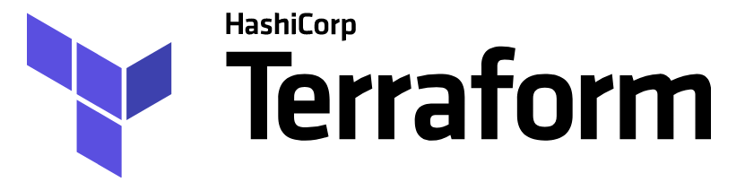
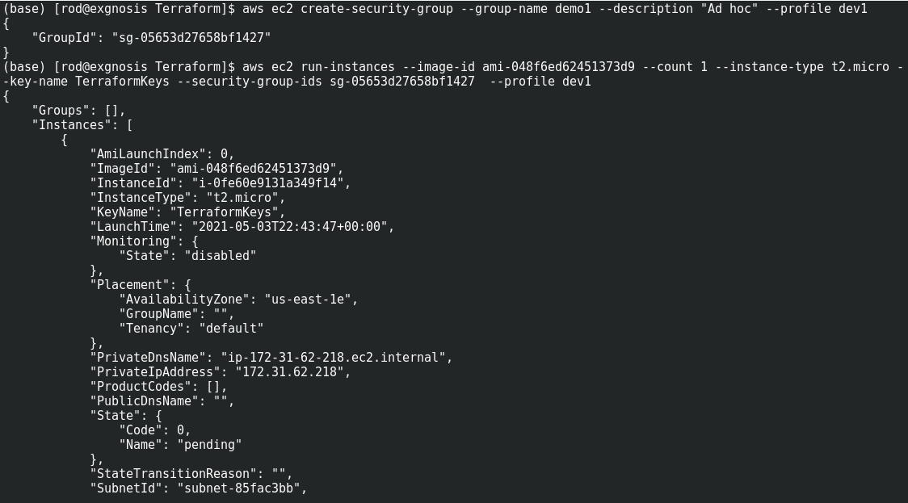
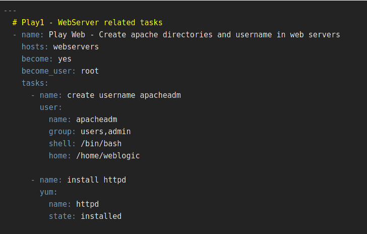
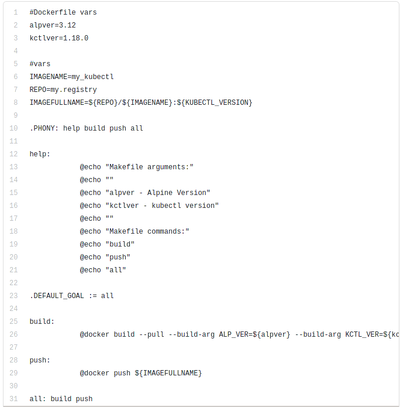
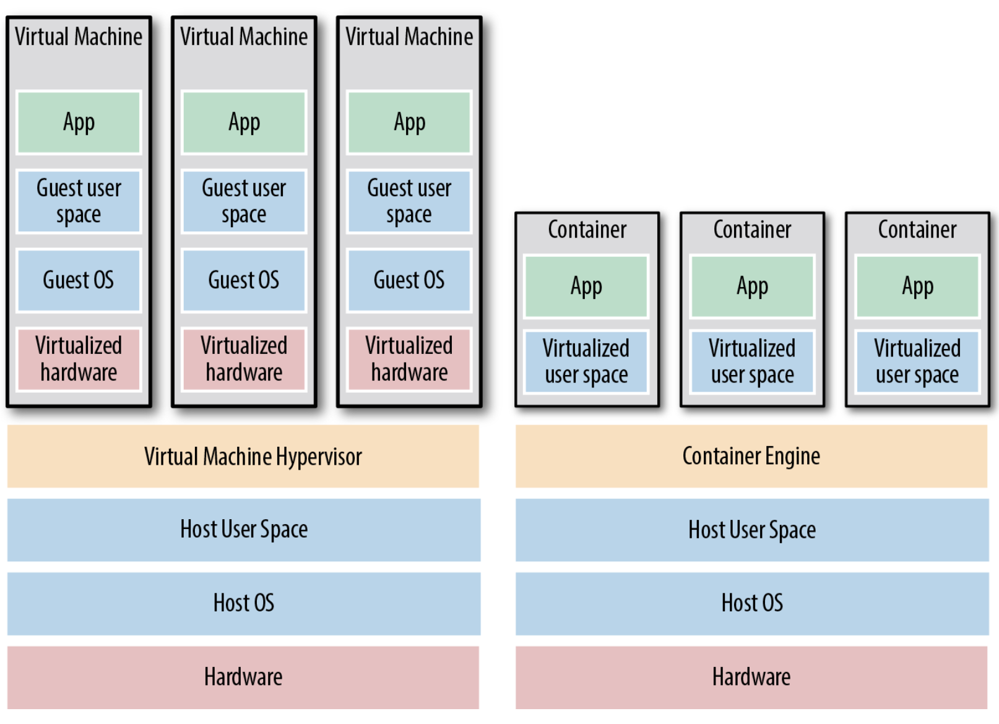
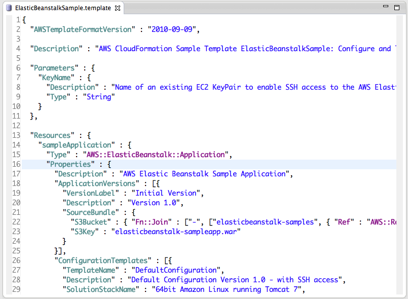
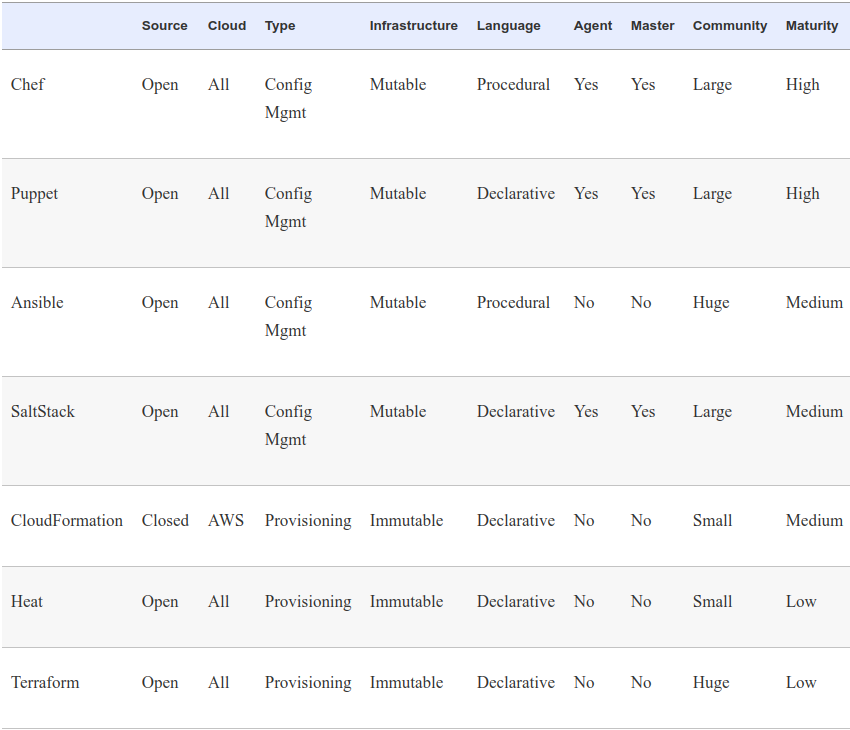

# Introduction to Terraform

---

## Why Terraform?

* Terraform is an open source Infrastructure as Code (IaC) developed by Hashicorp to automate the provisioning of resources across cloud providers
   
* All cloud providers have some form of IaC available
  - AWS has CloudFormation
  - Azure has Azure Resource Manager (ARM), etc.
* Terraform works across _all_ cloud providers (AWS, Azure, Google, AliBaba, etc/)
  - It provides a common vendor agnostic syntax and application structure for all cloud vendors
  - Most organizations nowadays are working with multiple cloud vendors
  - Having a common tool and in-house expertise in the tool is highly cost-efficient and operationally effective

Notes:

An important point to explain the rise of popularity of Terraform is this fact that most organizations do use Multiple cloud vendors.
Having to support in-house skill sets for all the different vendor provisioning tools is pain point that Terraform addresses

---

## What We Will Discuss

* How we got to where we are: the rise of virtualization, the cloud and IaC
* What exactly _Infrastructure as Code_ is
* The benefits of IaC and how it relates to DevOps
* What Terraform does and how it works
* How Terraform compares to other IaC tools like Ansible and Puppet

---

## On Premises Physical Infrastructure

* On premises (on-prem) physical infrastructure refers to:
  - Physical computers, servers and other devices
  - All associated hardware: cables, routers, switches, disks, etc.
  - Often organized into computer centers or server farms
* Servers are provisioned with the software needed by the users
  - Hardware and installed software collectively is _infrastructure_  
* The _Dev_ team works with software, the _Ops_ team with infrastructure
  - The two groups have different tools, cultures and processes
  
  

---

## The Rise of DevOps   

* Virtualization was a game changer 
  - On-prem physical servers can be replaced by _Virtual Machines_
  - This still requires physical hosts (for example VMWare)
  - Some organizations use a mix of physical hosts and virtual hosts
* Cloud computing eliminates the need for any on-prem physical hardware
  - All the infrastructure is virtual
  - The cloud provider handles all the hardware
* DevOps is the merging of the roles of Dev and Ops
  * Developers write code, Ops now writ code
  * DevOps integrates the two roles through common tools
  * Enables _continuous integration_ & _continuous deployment_ (CICD)

Notes:

The image is a creative commons license
https://upload.wikimedia.org/wikipedia/commons/thumb/0/05/Devops-toolchain.svg/1200px-Devops-toolchain.svg.png
---

## With DevOps

* Nordstrom
  - number of features it delivered per month +100%
  - reduce defects by 50%
  - reduce lead times by 60%

* HP’s LaserJet Firmware
  - time its developers spent on developing new features went from 5% to 40%
  - overall development costs were reduced by 40%

* Four core values in the DevOps movement   
  - culture, automation, measurement, and sharing (CAMS)
    
* DevOps is now a **lifestyle**

* In research - ResearchOps in next 
    
---

## ResearchOps

* IBM paper
    * "ResearchOps: The case for DevOps in scientific applications"
    * Real-life projects at the IBM Research Brazil Lab
    * May just as well apply to other research institutions
    * [Paper link](https://www.researchgate.net/publication/283757158_ResearchOps_The_case_for_DevOps_in_scientific_applications)
    
---
    
## Defining Infrastructure as Code?

* In a cloud or virtual environment, infrastructure _is_ code
  - Code is run to create virtual resources
  - IaaS refers to virtual networks of virtual devices
* The code we write to create and manage this virtual infrastructure __is__ source code
  - Therefore, it can be managed using the tools developers use for managing source code
  - IaC code can be developed using the same types of methods programmers use for their source code
  
---

## Types of IaC Tools
* There are five broad categories of IAC tools:
    - Ad hoc scripts - tools to manage infrastructure on the fly
    - Configuration management tools - install and maintain software on physical and virtual hosts
    - Server templating tools and containerization tools
    - Orchestration tools
    - Provisioning tools

---

## Ad Hoc Scripts
* Procedural code written to manage a virtual resource
* Example: AWS CLI commands to create a security group and EC2 instance.

Notes:

Changed this slide since I think that the CLI code is a more appropriate example of an ad hoc script

---

## Configuration Management Tools
* CM tools manage software installation and configuration on both virtual and physical hosts
  * Most popular tools:  Chef, Puppet, Ansible, and SaltStack
* Example of an Ansible script (called a playbook)

Notes:

Source:  https://www.middlewareinventory.com/blog/ansible-playbook-example/

---

## Server Templating Tools
* Tools to handle packaging, configuration and deployment of VMs and containers
  * Examples: Docker, Packer, and Vagrant.

    
Notes:

Image credit: https://dev.to/flpslv/using-makefiles-to-build-and-publish-docker-containers-7c8

---

## Images and Containers

---

### Virtual Machines vs Containers 

* Virtual machines
  - A virtual machine (VM) emulates an entire computer system, including the hardware. You run a hypervisor, such as VMWare, VirtualBox, or Parallels, to virtualize (i.e., simulate) the underlying CPU, memory, hard drive, and networking.
  - Benefit: complete isolation
  - Drawback: waste of resources
  - You can define VM images as code using tools such as Packer and Vagrant.
* Containers
  - A container emulates the user space of an OS. You run a container engine, such as Docker, CoreOS rkt, or cri-o, to create isolated processes, memory, mount points, and networking.    
  - Benefit: you run on top of the container engine can see only its own user space
  - Benefit: of the containers running on a single server share, milliseconds boot time

---
## Orchestration Tools
* Designed run and coordinate multiple tasks (usually containers) running on multiple hosts
  - Need to keep the overall distributed processing synchronized and robust
  - These are often thought of as "swarms" of hosts/containers that need to be orchestrated
* Example: Kubernetes
  
    
Notes:
Image source: https://software.danielwatrous.com/wp-content/uploads/2017/02/kubernetes-overview.png

---

## Provisioning Tools
* Refers to creating virtual resources from some form of text template, usually JSon
* The CloudFormation API is the AWS native provisioning tool

  
Notes:

Image Source: https://aws.amazon.com/blogs/developer/working-with-aws-cloudformation-in-eclipse/

---

## Why Infrastructure as Code?

* Speed and simplicity
  - Entire deployments can be set up or torn down by running a script
* Configuration consistency
  - Identical copies of configurations can be created for testing or development
* Minimization of risk
  - Reduces human procedural errors
  - Allows for testing, reviews and other quality measures
* Increased efficiency in software development
  - Infrastructure is not a bottleneck
  - Resources are available as needed
* Cost savings
  - Grunt work is automated so people can do the important stuff

---

## The Benefits of Infrastructure as Code

* Self-service
  - Infrastructure deployment with scripts does not rely on an administrator
* Speed and safety
  - Infrastructure is deployment and updated faster and with fewer errors
* Documentation
    * The IaC source files _are_ infrastructure documentation
* Version control
    * Previous deployments can be maintained in source control for regression or audit need, or to satisfy regulatory requirements

* Validation
    * For every single change, code reviews and dynamic testing can be performed

* Reuse
    * New infrastructure deployments can be derived quickly from previous deployments

---

## How Terraform Works

* Terraform is an open source tool created by HashiCorp
  - Written in the Go programming language
* A single utility called`terraform` is downloaded to a local machine 
*  The local `terraform` utility 
  - Identifies the plug-ins needed to interact with a cloud provider
  - Downloads and installs the required plugins
* The `terraform` utility and the plug-ins make API calls on your behalf to one or more providers
    - AWS
    - Azure
    - Google Cloud
    - DigitalOcean
    - OpenStack, and more
      

---
## Terraform and Other Tools

Notes:

Source: The book
---                                       
