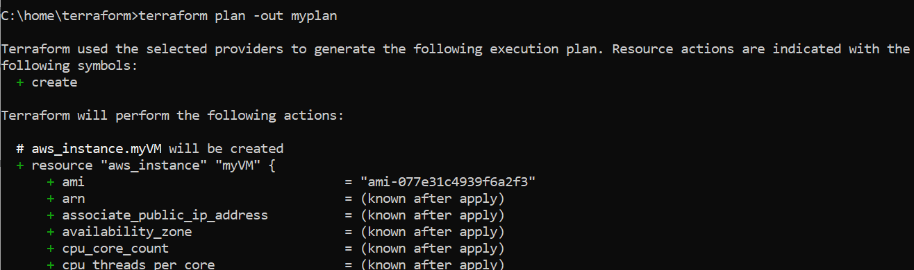
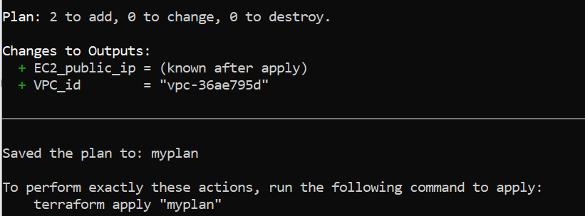

# Terraform Basics

---
## In this Module

* Getting started with terraform
  * Structure of a terraform application
  * Terraform providers and configuration  
  * Terraform workflow: init, validate, plan, apply and destroy 
  * Basic Hashicorp Configuration Language (HCL) syntax
    * Resources, data sources, variables and outputs
  * Introduction to terraform state
  * Working with resource arguments and attributes
  * Querying AWS data sources

---

## Structure of a Terraform Application

* A terraform application is made up of modules
  - A module is a directory that contains terraform source files
  - Any text file with a `.tf` extension is a terraform source file
* The main module we run the `terraform` utility from is called the __root__ module
  - Every terraform application has a root module
  - The terraform state file is by default in the root module directory  
  - Additional modules are optional (covered later in the course)

---

## Terraform Source Files

* Terraform merges the contents of all the *.tf files in a directory before doing anything
  - This means that you can name your *.tf files whatever you want
  - You can have as many *.tf files as you want in the module
* There can be an optional file `terraform.tfvars`
  - This sets the values of variables when terrform executes
  - This file must be named `terraform.tfvars`
* Terraform ignores all other files in the module that do not have *.tf extension  

---
## Canonical File Names

* The terraform community has a file naming convention that is generally adhered to
  - This makes reading terraform source code easier for other developers
* The file are:
  - _variables.tf_: contains variable definitions
  - _outputs.tf_: contains the return value (output) definitions
  - _providers.tf_: contains the provider, versioning and backend configurations
  - _main.tf_: contains the core code - resource definitions,etc.
* If the `main.tf` starts to become too difficult to read, it is often broken down into subfiles
  - For example, all S3 bucket code might be in _buckets.tf_
    
---

## Canonical Module

* A typical terraform module looks like the screenshot below
* It is considered a professional best practice to use this structure for all terraform work
  - Additional files, like `buckets.tf` are added when they improve the readability of the code
  

---

## Non-Canonical Modules

* The screenshot below shows a non-canonical module structure
  - This will still work, terraform does not care what we name the files
* Note: we cannot rename `terraform.tfvars` or terraform will ignore it

---

## The Five Basic Terraform Constructs

1. Configuration Directives: these include `provider` and `terraform`
2. _resource_: specifies an AWS resource managed by terraform
3. _data_ : specifics a resource in the AWS environment that we want to query
4. _variable_: defines an input to a terraform module
5. _output_: defines a return value or output from the module

---
## The `providers.tf` File

---

## The `terraform` Directive

* Specifies the plugins needed to communicate with the cloud vendor(s)
  - Defines the location of the plugins and versions
  - Defines location of the terraform backend (covered later)
* This directive can be omitted 
  - Then defaults values will be used
  - Some defaults are inferred from the `provider` directive
  
---
## The `provider` Directive

* The provider directive contains configuration information specific to a provider
  - AWS needs different configuration information (like a region) than does Azure or Google Cloud
* There can be more than one provider
  - Different providers are identified by aliases
  - The provider without an alias is the default provider
  - Multiple providers are demonstrated later
  
---

## The `main.tf` File

* Two resources are defined in the file that are going to be managed by terraform
  - An EC2 instance and an S3 bucket
* The default VPC, not managed by terraform, is identified as a data source

---

## The `resource` Directive - Arguments

* Always start with the keyword `resource` 
* Followed by a string ("aws_instance") which identifies the type of resource
* Followed by a string ("myVM") which is how the resource is referred to in the terraform code
* Followed by a list of arguments used to create the resource
  - Some arguments are mandatory, like the `ami` and `instance_type` for an EC2 instance
  - Some arguments are mandatory but have defaults, like `versioning` on S3 buckets 
  - Some arguments are optional, like defined tags
* For each resource, there is a documentation page describing all the attributes associated with a specific resource
  - `https://registry.terraform.io/providers/hashicorp/aws/latest/docs/resources/instance`
  - The documentation also provides examples of how to define the resource
  
---

## The `resource` Directive - Attributes

* Some properties of a resource are assigned by AWS
  - These are referred to as _attribtues_
  - Like public_ip of an EC2 instance or the arn of a bucket for example
  - These are defined by AWS but can be accessed by us after the resource is created
* Syntax for accessing the public IP of `myVM` for example:
  - `aws_instance.myVM.public_ip`
* Once created, all the arguments we provided are also accessible as attributes
  - The documentation page for the resource also lists all the attributes available

--- 

## The `data` Directive

* References a type of resource that is not under terraform control
  - We supply attributes that are used to identify the specific resource
* In the `main.tf` file we look for a "aws_vpc" where the attribute `default` has the value `true`
    - We need to provide enough information to uniquely identify the resource we are looking for
    - For example, there may be many VPCs in a region, but only one default VPC  
* Later we will look at ways of searching for specific resources
  
 

 ---

## The `output` Directive

* Returns a value, usually an attribute of AWS resource
  - In the root module, the value is returned to the command line where it is printed out
  - We can also specify an output file where the returned values will be stored
* Including a `description` is considered to be a best practice
* The `value` parameter is what the defined output returns

---
## The Terraform Workflow

* Terraform is a declarative language
  - The *.tf source files only describe the final state the AWS environment should be in
  - How to implement the requested state is figured out by terraform
- The basic flow is:
  1. Model the desired state of the AWS environment by reading the terraform source code files
  2. Fetch a description of the actual AWS environment state
  3. Compare the actual and desired states
  4. Compute a plan for changing the existing environment so that it conforms to the desired state
  5. Create a series of actions to be executed to implement the plan
  6. Apply the actions
  
---

## The Terraform Workflow

* The workflow is implemented through a series of terraform commands
1. `init` - scans the source files and updates the local providers
2. `validate` - checks for syntax errors in the *.tf files
3. `plan` - creates an implementation plan
4. `apply` - implements the implementation plan
5. `destroy` - removes all AWS resources defined in this module

---

## The Terraform Workflow

* The `apply` command automatically runs `validate` and then `plan`
  - `apply` can also apply a saved plan
* The `plan` command automatically runs `validate`
    - `plan` can also save the plan to a file for later application
* Running `validate` on its own is a lot faster for quick syntax checks

---

## Example - Init Output

---

## Example - Plan Output

---

## Example - Plan Output

---

## Example - Apply Output

---

## Example - Apply Output

Notes:

Do example 02-01 as a lead in to lab02-01

---

## Lab 02-01

* Please do Lab02-01
---

## Terraform Variables

* Variables are used to replace hardcode values, like the instance type, in terraform code
* Variables are of a particular data type, but default to string
* Variables can have an optional default value
* If a value for a variable is not provided, then the use is prompted to supply the value at the command line when `terraform plan` is run
* Variables are reference by using the syntax:
  - `var.<variable-name>` 
  - An older deprecated syntax is `${var.<variable-name>}
  
---
## Defining Variables

* In the `variables.tf` file, two variable are defined
  - There is a default defined for the `ami_type`
  - The default is used _only_ if the variable is not assigned a value anywhere
* The value for the `inst_type` variable is assigned in the `terraform.tfvars` file

--
## Using Variables

* The hardcoded values for the arguments can now be replaced with variables

---

## Output Return Values

* The outputs now validate that the actual attributes of the EC2 were set by the variables

---

## String Interpolation

* Any attribute or value can be embedded in a string by using `string interpolation`
  - The interpolation syntax is ${value} to insert "value" into string
 - Non-string values are converted to strings for interpolation

Notes: 

Modifying the output to use string interpolation is demo 3

---
## Local Variables

* Just like in a programming language, we can define local variables that can be used within a module
  - Local variables cannot be referenced outside the module
  - Local variables are defined in a `locals` block
  - Local variable definitions can be split across more than one `locals` block
  - Local variables are referenced with the syntax `local.<name>`
  

---
## Primitive Data Types

* Variables and locals are typed data
* There are three primitive data types
  - _string_: A Unicode string
  - _numeric_: Used for both integral and non-integral values (434 and 1.34)
  - _boolean_: `true` and `false`
* There are also complex data types like lists and maps which will be covered in a later module.

---

## Reading Files

* Local variables _must_ be initialized when defined
  - We cannot set their value with a `terraform.tfvars` entry
* The alternative to hardcoding a local variable is to read its value from a file
  - This is generally done when the variable is used to provide some metadata like the ID of the person running the code
  - Or when the variable contains text like a start-up script
* We use the `file` command to read in the contents of a text file

--

  
