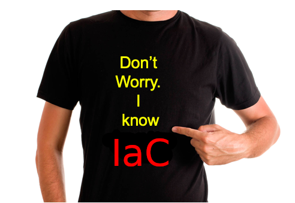

# Terraform
---
## Terraform Class Outline


| Day | Agenda                                                                          |
|-----|---------------------------------------------------------------------------------|
| 1   | Terraform Basics, Architecture, Infrastructure as Code, HCL Basic Programming            |
| 2   | Managing Deployments and States, Multiple Terraform Configurations, More HCL Programming    |
| 3   | Terraform Testing, Vault, Consul, Packer, Professional Terraform Best Practices          |

<!-- {"left" : 0.25, "top" : 1.4, "height" : 3.36, "width" : 9.75} -->

Notes:

---

## Prerequisites & Expectations

* Familiarity with a programming or scripting language
* Basic understanding of Linux, Mac or Windows including:
  - Command line navigation 
  - Editing files (e.g. using VI, Visual Studio Code or other editor)
* Basic understanding of AWS concepts like EC2 instances, IaaS, PaaS, etc.
* This is an **AWS Infrastructure as Code (IaC) with Terraform** class 
  - You may be missing some pre-requisites, that’s OK
  - You should be willing to work hard, that is a must


Notes:

Updated the requirements to be more in keeping with the actual skills needed for class.

---

## Our Teaching Philosophy

* Emphasis on concepts & fundamentals
* No need to learn APIs by heart
* Highly interactive (questions, discussions, etc. are welcome)
* Hands-on (learn by doing)
* Build solid fundamentals of understanding and design


Notes:

---

## Analogy: Learning to Fly...

 <!-- {"left" : 0.26, "top" : 1.45, "height" : 6.17, "width" : 9.74} -->


Notes:

---

## Instruction

 <!-- {"left" : 0.26, "top" : 1.45, "height" : 6.17, "width" : 9.74} -->


Notes:

---

## + Flight Time

 <!-- {"left" : 0.26, "top" : 1.45, "height" : 6.17, "width" : 9.74} -->


Notes:

---

## After the Class...

<!-- {"left" : 1.29, "top" : 1.89, "height" : 5.28, "width" : 7.67} -->


Notes:

---


## About You and Me

* About your instructor
* About you
   - Your Name
   - Your background (developer, admin, manager, ...)
   - Technologies you are familiar with
   - Familiarity with Terraform or IaC (scale of 1 - 4 ;  1 - new,   4 - expert)
   - Something non-technical about you!(favorite ice cream flavor, hobby, etc.)
   - Something non-technical about you!(favorite ice cream flavor, hobby, etc.)

 &nbsp; <!-- {"left" : 1.55, "top" : 6.43, "height" : 1.76, "width" : 1.99} --> &nbsp; <!-- {"left" : 3.56, "top" : 6.45, "height" : 1.7, "width" : 3.13} --> &nbsp; <!-- {"left" : 6.71, "top" : 6.43, "height" : 1.76, "width" : 1.99} -->


Notes:

---

## Class Logistics

* Instructor’s contact information
* Slides
  - For each session, slides will be emailed out or delivered via virtual classroom 
* AWS and Terraform
  - Students need to have an AWS account
  - If you don't have one, we will walk through the process of getting a free AWS account
  - Students will be using a local copy of Terraform on their own computers
  - We will walk through the process of installing Terraform locally
* Labs
  - Provided in the cloud via GitHub
  - Will also be delivered in a ZIP file for your future reference


Notes:

---

## Typographic Conventions

* Software code in the text uses a fixed-width code font: 
  - catalog: `Catalog = new CatalogImpl`
  - Code fragments are the same, e.g., catalog.speakTruth
  - We use **bold/color** text for emphasis
  - Filenames are in italics, e.g., `Catalog.scala`
  - Longer code examples appear in a separate code box:

```text
object TestApp {  // Basic Spark App (Scala)
  def main(args: Array[String]) {
		val sc = new SparkContext(
      new SparkConf().setMaster("local").setAppName(”TestApp")
		val totalWords = sc.textFile(“file”)
               .flatMap(l => l.split(" ")).count()
		println (“# lines : “ + totalWords)
	}
}


```
<!-- {"left" : 0, "top" : 3.99, "height" : 2.68, "width" : 10.25} -->


Notes:

---
## Questions?

* Any questions? 


Notes:


