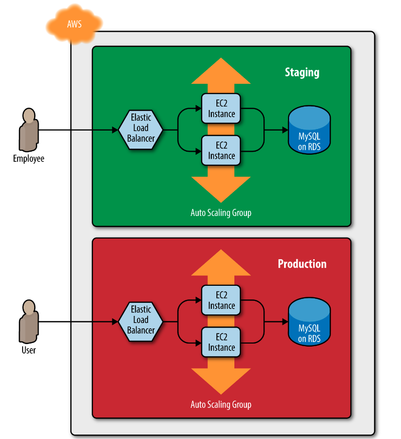
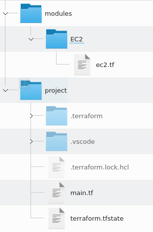
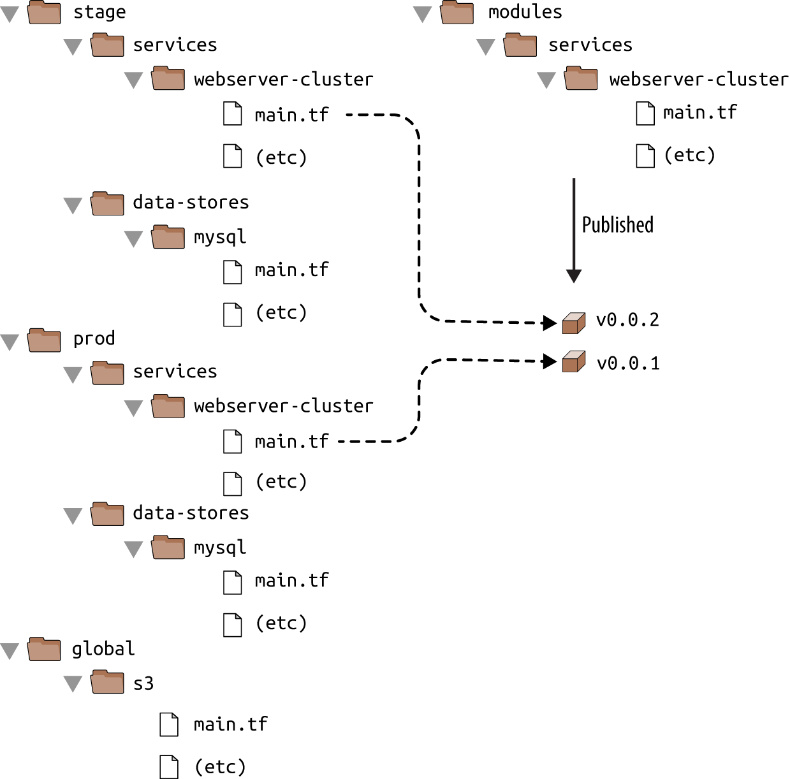

# Reusable Infrastructure with Modules
---

## The Plan

* Module basics
  
* Module inputs

* Module locals

* Module outputs

* Module gotchas

* Module versioning
---
## Multiple Environments
* Cloud advantage: create multiple copies of the same environment
  * Production, Development, Test
  * Environments need to be similar if not identical
* We don't want to be able to re-use Terraform code across environments
  * DRY Principle: "Do not repeat yourself"
  * Modules allow us to reuse Terraform code


---
## Module Basics

* Any folder containing Terraform files is a module
    * There are no special declarations or syntax required
    * Modules are containers for multiple resources that are used together
    * Modules are the primary strategy used to package and reuse Terraform resources

* Every Terraform configuration has at least one module
    * It is referred to as the "root" module
    * It consists of the Terraform files in the main working directory

* Modules (usually the root) may import other or "call" other modules
    * Modules that are being called are called "child" modules 

---

## Calling Modules Example

* If we are creating the same resource in multiple configurations, we can put it into a module
    * In this example, the demo project uses a module in the `modules/EC2` folder to create an EC2 instance
    * The folder structure looks like this:



---
## Calling Modules Example

* The EC2 Module code is familiar
  
  ```
  resource "aws_instance" "alpha" {
    ami = "ami-047a51fa27710816e"
    instance_type = "t2.micro"
    tags = {
        source = "EC2 Module"
    }
    ```
* Calling it as a module is straightforward
  ```
  module "EC2Defs" {
    source = "../modules/EC2"
  }
  ```
* The problem is that this module is not easily reusable because the `ami` and `instance type` are hard-coded into the module code
    * We need to parameterize the module to  make it reusable

---

## Module Inputs

* Following the example of calling functions in a programming language, we want to be able to pass values to a module as parameters

* In the webserver example, we want to parameterize the code by adding three variables:

  ```
  variable "cluster_name" {
    description = "The name to use for all the cluster resources"
  type        = string
  }

  variable "db_remote_state_bucket" {
  description = "The name of the S3 bucket for the database's remote state"
  type        = string
  }

  variable "db_remote_state_key" {
  description = "The path for the database's remote state in S3"
  type        = string
  }
  ```
---
## Module Parameters

* Now these variables can be used in the actual code instead of the hard-coded values

  ```
  resource "aws_security_group" "alb" {
  name = "${var.cluster_name}-alb"

   ingress {
    from_port   = 80
    to_port     = 80
    protocol    = "tcp"
    cidr_blocks = ["0.0.0.0/0"]
    }

   egress {
    from_port   = 0
    to_port     = 0
    protocol    = "-1"
    cidr_blocks = ["0.0.0.0/0"]
    }
  }

  ```
---

## Remote Backend

* We can update the `terraform_remote_state` data source to use the `db_remote_state_bucket` and `db_remote_state_key` as its bucket and key parameter, respectively, to ensure we are reading the state file from the right environment:

  ```
  data "terraform_remote_state" "db" {
   backend = "s3"

    config = {
     bucket = var.db_remote_state_bucket
     key    = var.db_remote_state_key
      region = "us-east-2"
    }
  }
  ```
---
## Staging Environment

* We can now pass arguments to these parameters in the call to the module `webserver_cluster`

  ```
  module "webserver_cluster" {
    source = "../../../modules/services/webserver-cluster"

    cluster_name           = "webservers-stage"
    db_remote_state_bucket = "(YOUR_BUCKET_NAME)"
    db_remote_state_key    = "stage/data-stores/mysql/terraform.tfstate"
  }
  ```
* This module call can be made identically from 
    * `stage/services/webserver-cluster/main` and
    * `prod/services/webserver-cluster/main.tf`

---

## Module API

* This syntax for using input variables for a module by using the same syntax as setting arguments for a resource

* The input variables are the API of the module
    * Depending on the input variable arguments, each call to a module will result is a unique configuration

* Any place there is a hard-coded value in a module, we can replace it with a parameter
    * We want to choose the values to parameterize to produce maximum flexibility but balanced with ease of use

---
## Parameterize the EC2 Cluster

* We start by defining the variable that will act as parameters

  ```
  variable "instance_type" {
  description = "The type of EC2 Instances to run (e.g. t2.micro)"
  type        = string
  }

  variable "min_size" {
  description = "The minimum number of EC2 Instances in the ASG"
  type        = number
  }

  variable "max_size" {
  description = "The maximum number of EC2 Instances in the ASG"
  type        = number
  }
  ```
---

## Parameterize the Module Code

* Replace the hard-coded values with variable references

    ```
    resource "aws_launch_configuration" "example" {
      image_id        = "ami-0c55b159cbfafe1f0"
      instance_type   = var.instance_type
      security_groups = [aws_security_group.instance.id]
      user_data       = data.template_file.user_data.rendered

      // Required when using a launch configuration with an auto scaling group.
     // https://www.terraform.io/docs/providers/aws/r/launch_configuration.html

      lifecycle {
        create_before_destroy = true
      }
  }
  ```
---
## Parameterize the ASG

* The ASG code can now be parameterized

  ```
  resource "aws_autoscaling_group" "example" {
    launch_configuration = aws_launch_configuration.example.name
    vpc_zone_identifier  = data.aws_subnet_ids.default.ids
    target_group_arns    = [aws_lb_target_group.asg.arn]
    health_check_type    = "ELB"

    min_size = var.min_size
    max_size = var.max_size

    tag {
      key                 = "Name"
      value               = var.cluster_name
      propagate_at_launch = true
    }
  }
  ```
---
## Calling the Module - Revisited

* The `web_server` module can now be called with more parameters

  ```
  module "webserver_cluster" {
    source = "../../../modules/services/webserver-cluster"

    cluster_name           = "webservers-stage"
    db_remote_state_bucket = "(YOUR_BUCKET_NAME)"
    db_remote_state_key    = "stage/data-stores/mysql/terraform.tfstate"

    instance_type = "t2.micro"
    min_size      = 2
    max_size      = 2
  }
  ```
---
## Module Reuse

* We can call the same module but with different parameters when we use it in a different situation

  ```
  module "webserver_cluster" {
    source = "../../../modules/services/webserver-cluster"

    cluster_name           = "webservers-prod"
    db_remote_state_bucket = "(YOUR_BUCKET_NAME)"
    db_remote_state_key    = "prod/data-stores/mysql/terraform.tfstate"

    instance_type = "m4.large"
    min_size      = 2
    max_size      = 10
  }
  ```
---
## Module Locals

* There may exist hard-coded values that we want to convert to variables, to implement DRY for example
    * But when the module is called, the calling code should not be able to set the values of these variables

* Example, setting standard values that get repeated in code

  ```
  resource "aws_lb_listener" "http" {
    load_balancer_arn = aws_lb.example.arn
    port              = 80
    protocol          = "HTTP"

  (...)
  }

  resource "aws_security_group" "alb" {
    name = "${var.cluster_name}-alb"

    ingress {
      from_port   = 80
      to_port     = 80
    (...)
    }

  (...)
  }
  ```
---

## Locals

* Local values can be defined in a `locals` block.
    * Work like variables 
    * But they cannot referenced or seen outside the module
    * Specifically, they are invisible to the calling code
  
  ```
  locals {
    http_port    = 80
    any_port     = 0
    any_protocol = "-1"
    tcp_protocol = "tcp"
    all_ips      = ["0.0.0.0/0"]
  }
  ```
* And are referenced as `local`

  ```
    resource "aws_lb_listener" "http" {
      load_balancer_arn = aws_lb.example.arn
      port              = local.http_port
      protocol          = "HTTP"
    (...)
  }
  ```
---

## Module Outputs

* Modules can return values just like functions in programming languages

* This is done be defining `output` variables in the module 

* For example, we can define the output variable `asg_name` in the `outputs.tf` file in the web-server cluster module
  
  ```
  output "asg_name" {
    value       = aws_autoscaling_group.example.name
    description = "The name of the Auto Scaling Group"
  }
  ```
* We can then reference the value with the following syntax.
    * Reminder that the module name is the value we create when we *call* the module.

  ```
  module.< MODULE_NAME >.< OUTPUT_NAME >

  module.frontend.asg_name 
  ```
---

## Using Output Variables

* We can use the output variables from a module like any other variable
    * In the example, the name of the ASG is used to set an argument of another resource.

  ```
  resource "aws_autoscaling_schedule" "scale_out_during_business_hours" {
    scheduled_action_name = "scale-out-during-business-hours"
    min_size              = 2
    max_size              = 10
    desired_capacity      = 10
    recurrence            = "0 9 * * *"

    autoscaling_group_name = module.webserver_cluster.asg_name
  }

  resource "aws_autoscaling_schedule" "scale_in_at_night" {
    scheduled_action_name = "scale-in-at-night"
    min_size              = 2
    max_size              = 10
    desired_capacity      = 2
    recurrence            = "0 17 * * *"

    autoscaling_group_name = module.webserver_cluster.asg_name
  }
  ```
---

## Variable Passthroughs

* One output variable can be "passed through" or used in a different output variable
* In the following example, the `dns_name` variable is defined in the `/modules/services/webserver-cluster/outputs.tf` file:

  ```
  output "alb_dns_name" {
  value       = aws_lb.example.dns_name
  description = "The domain name of the load balancer"
  }

  ```
* This can be then "passed through" in the file `prod/services/webserver-cluster/outputs.tf`

  ```
  output "alb_dns_name" {
  value       = module.webserver_cluster.alb_dns_name
  description = "The domain name of the load balancer"
  }
  ```
* Remember that all the dependencies between variables are resolved at planning time, not at apply time
---

## Module Gotchas - Paths

* The hard-coded file paths are interpreted as relative to the current working directory
    * The problem is that this will not work if we are working with a module in a different directory

* To solve this issue, you can use an expression known as a path reference, which is of the form path.<TYPE>. Terraform supports the following types of path references:
    * `path.module`: Returns the file system path of the module where the expression is defined
    * `path.root`: Returns the file system path of the root module
    * `path.cwd`: Returns the file system path of the current working directory, usually the same as path.root
---
## Module Path

* In this example, the template file is located with a path relative to the module, but if we hard-code the path, it will be interpreted as relative to the current working directory
    * By using the `path.module` construct, we ensure the file reference remains relative to the module

  ```
  data "template_file" "user_data" {
    template = file("${path.module}/user-data.sh")

    vars = {
      server_port = var.server_port
      db_address  = data.terraform_remote_state.db.outputs.address
      db_port     = data.terraform_remote_state.db.outputs.port
    }
  }
  ```
---

## Module Gotcha - Inline Blocks

* The configuration for some Terraform resources can be defined either as inline blocks or as separate resources
    * When creating a module, you should always prefer using a separate resource

* Inline block example

  ```
  resource "aws_security_group" "alb" {
    name = "${var.cluster_name}-alb"

    ingress {
      from_port   = local.http_port
      to_port     = local.http_port
      protocol    = local.tcp_protocol
      cidr_blocks = local.all_ips
    }

    egress {
      from_port   = local.any_port
      to_port     = local.any_port
      protocol    = local.any_protocol
      cidr_blocks = local.all_ips
    }
  }
  ```
---

## Separate Resource

* You should change this module to define the exact same ingress and egress rules by using separate aws_security_group_rule resources

  ```
  resource "aws_security_group" "alb" {
  name = "${var.cluster_name}-alb"
  }

  resource "aws_security_group_rule" "allow_http_inbound" {
    type              = "ingress"
    security_group_id = aws_security_group.alb.id

    from_port   = local.http_port
    to_port     = local.http_port
    protocol    = local.tcp_protocol
    cidr_blocks = local.all_ips
  }

  resource "aws_security_group_rule" "allow_all_outbound" {
    type              = "egress"
    security_group_id = aws_security_group.alb.id

    from_port   = local.any_port
    to_port     = local.any_port
    protocol    = local.any_protocol
    cidr_blocks = local.all_ips
  }
  ```
---

## Inline Blocks

* Using a mix of inline blocks and separate resources may cause errors where routing rules conflict and overwrite one another
    * Use one or the other
    * When creating a module, you should always try to use a separate resource instead of the inline block
    * This allows for more flexible modules

* For example, changing a security group rule to allow a testing port is easier to do with a separate resource than having to edit inline blocks

  ```
  resource "aws_security_group_rule" "allow_testing_inbound" {
    type              = "ingress"
    security_group_id = module.webserver_cluster.alb_security_group_id

    from_port   = 12345
    to_port     = 12345
    protocol    = "tcp"
    cidr_blocks = ["0.0.0.0/0"]
  }
  ```
---
## Module Versioning

* If the staging and production environment point to the same module folder, any change in that folder will affect both environments on the very next deployment
    * This creates a coupling between environments and modules that can cause problems

* To solve this problem, we use a standard build management technique of using versions
    * As changes are made to a module, releases or versions of that module are published
    * Part of the configuration of any Terraform configuration plan is identification of which version of a module to include

---

## Module Versioning Layout

 

---
## Module Versioning

* An effective strategy is to use a repository tool like git and GitHub to publish releases of a module
    * Then the appropriate "release" of a module can be used

  ```
  module "webserver_cluster" {
  source = "github.com/foo/modules//webserver-cluster?ref=v0.0.1"

  cluster_name           = "webservers-stage"
  db_remote_state_bucket = "(YOUR_BUCKET_NAME)"
  db_remote_state_key    = "stage/data-stores/mysql/terraform.tfstate"

  instance_type = "t2.micro"
  min_size      = 2
  max_size      = 2
  }
  ```
---

## Semantic Versioning

* A common versioning scheme is "semantic versioning"
    * The format is MAJOR.MINOR.PATCH (e.g., 1.0.4) 
    * There are specific rules on when you should increment each part of the version number
  
* MAJOR version increments when you make incompatible API changes
  
* MINOR version increments when you add functionality in a backward-compatible manner

* PATCH version increments when you make backward-compatible bug fixes
  
---