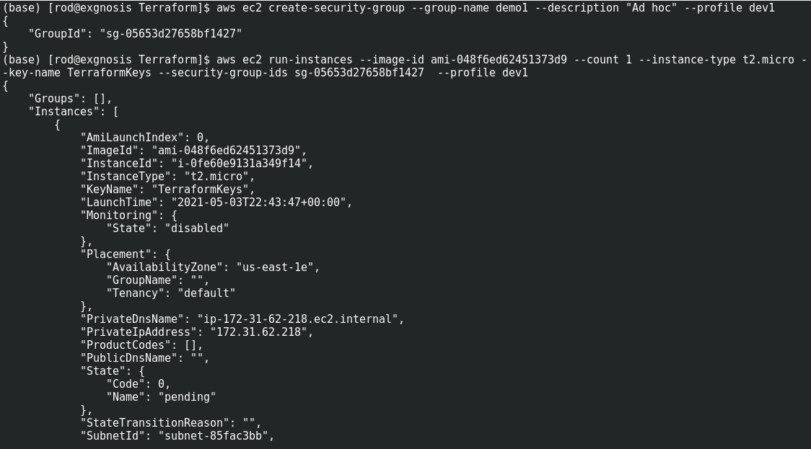
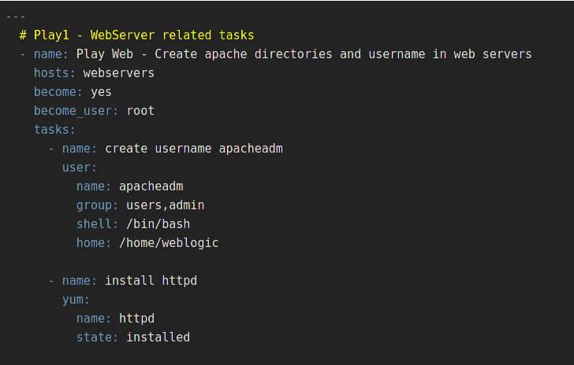

# Terraform - Introduction
---

## Why Terraform?

* __IaC__ (Infrastructure as Code) is one of the most important developments in application
deployment in many years
   
* All cloud providers have some form of IaC available
  - AWS has CloudFormation
  - Azure has Azure Resource Manager (ARM), etc.

* Terraform is a third-party vendor agnostic tool that has become 
became more popular than cloud vendor specific IaC implementations

* Terraform is __open source__ and can be used with any cloud provider,
such as Amazon Web Services, IBM Cloud, Google Cloud Platform, Microsoft Azure, etc.

* Terraform is __declarative__ and __idempotent__. These are good design principles,
and many competitors have also implemented their versions of the Terraform design, making Terraform
a de facto standard
  

<!--- img src = "../artwork/terraform-logo.png"/> <!--{"left" : 0.77, "top" : 6.51, "height" : 1.18, "width" : 4.83} -->

---

## What We Will Discuss

* How Virtualization, the Cloud and DevOps changed infrastructure management
* What exactly we mean by _infrastructure as code_?
* The benefits of infrastructure as code
* How Terraform works
* How Terraform compares to other infrastructure as code tools

---

## OnPrem Physical Infrastructure

* Computing resources were physical devices that needed to be acquired and maintained
* Data centres and computer rooms filled with racks of servers and other hardware
* Servers are provisioned with the necessary software
* Together the physical hardware and installed software is "_infrastructure_"  
* The _Dev_ team worked with software, the _Ops_ team with infrastructure
* Typically two solitudes: different tools, cultures and processes
  
  
  <!---img src = "../artwork/computer-rack-pexels-photo-442150.jpeg"  style="width:75%;"/> <!-- {"left" : 0.77, "top" : 4.34, "height" : 2.42, "width" : 3.63} -->
---

## The Rise of DevOps   

* Virtualization: OnPrem physical servers can be replaced by _Virtual Machines_
  - This still required physical hosts (for example VMWare)
* Cloud computing eliminates the need for any onPrem physical hardware
  - All the infrastructure is virtual, cloud provider handles the hardware
* DevOps is the merging of the "two solitudes":
  * Developers write code, Ops writes code, no one touches hardware
  * DevOps integrates these two worlds through a common set of interconnected software tools
  * Enables _continuous integration_ and _continuous deployment_ (CICD)

Notes:

The image is a creative commons license
https://upload.wikimedia.org/wikipedia/commons/thumb/0/05/Devops-toolchain.svg/1200px-Devops-toolchain.svg.png
---

## With DevOps

* Nordstrom
    - number of features it delivered per month +100%
    - reduce defects by 50%
    - reduce lead times by 60%

* HP’s LaserJet Firmware
    - time its developers spent on developing new features went from 5% to 40%
    - overall development costs were reduced by 40%

* Four core values in the DevOps movement   
    - culture, automation, measurement, and sharing (CAMS)
    
* DevOps is now a **lifestyle**

* In research - ResearchOps in next 
    
---

## ResearchOps

* IBM paper
    * "ResearchOps: The case for DevOps in scientific applications"
    * Real-life projects at the IBM Research Brazil Lab
    * May just as well apply to other research institutions
    * [Paper link](https://www.researchgate.net/publication/283757158_ResearchOps_The_case_for_DevOps_in_scientific_applications)
    
---
    
## What Is Infrastructure as Code?
* There are five broad categories of IAC tools:

    - Ad hoc scripts - tools to manage infrastructure on the fly
    - Configuration management tools - install and maintain software 
    - Server templating tools - 
    - Orchestration tools
    - Provisioning tools

---

## Ad Hoc Scripts
* These are usually some sort of procedural code written to manage a virtual resource
* Example: AWS CLI commands to create a security group and EC2 instance.

Notes:

Changed this slide since I think that the CLI code is a more appropriate example of an ad hoc script

---

## Configuration Management Tools
* These are tools that manage software installation and configuration on both virtual and physical hosts
  * Most popular tools:  Chef, Puppet, Ansible, and SaltStack
* Example of Ansible script

Notes:

Source:  https://www.middlewareinventory.com/blog/ansible-playbook-example/

---

## Server Templating Tools
* Tools to handle packaging, configuration and deployment of VMs and containers
  * Examples: Docker, Packer, and Vagrant.

---

## Images and Containers

---

### Virtual Machines vs Containers 

* Virtual machines
    - A virtual machine (VM) emulates an entire computer system, including the hardware. You run a hypervisor, such as VMWare, VirtualBox, or Parallels, to virtualize (i.e., simulate) the underlying CPU, memory, hard drive, and networking.
    - Benefit: complete isolation
    - Drawback: waste of resources
    - You can define VM images as code using tools such as Packer and Vagrant.
* Containers
    - A container emulates the user space of an OS. You run a container engine, such as Docker, CoreOS rkt, or cri-o, to create isolated processes, memory, mount points, and networking.    
    - Benefit: you run on top of the container engine can see only its own user space
    - Benefit: of the containers running on a single server share, milliseconds boot time

---
## Orchestration Tools
* Orchestration tools are designed run multiple tasks on multiple hosts, often containers, and keep the overall processing synchronized and robust
* These are often thought of as "swarms" of hosts that need to be orchestrated 
  * Example: Kubernetes
  
    
Notes:
Image source: https://software.danielwatrous.com/wp-content/uploads/2017/02/kubernetes-overview.png

---

## Happiness with IaC

* Happiness
    * Deploying code and managing infrastructure manually is repetitive and tedious
    * No one will take notice—until that one day when you mess it up
    * That creates a stressful and unpleasant environment
    * Here is a painting of a happy man (see notes)

 

Notes:

* Painting: Democritus by Hendrick ter Brugghen, 1628.

* Some philosophers consider happiness the goal of people's life
    * Democritus
        * Democritus (c. 460 – c. 370 BC) is known as the 'laughing philosopher' because of his emphasis on the value of 'cheerfulness'.
* Plato
    * Sees a type of happiness stemming from social justice through fulfilling one's social function
* Aristotle
    * described eudaimonia (Greek: εὐδαιμονία) as the goal of human thought and action. Eudaimonia is often translated to mean happiness
* Cynicism (Antisthenes)
    * rejected any conventional notions of happiness involving money, power, and fame, to lead entirely virtuous, and thus happy, lives

---

## Provisioning Tools
* Generally refers to creating virtual resources from some form of template, often in JSon
* AWS provides this via their CloudFormation API

  
Notes:

Image Source: https://aws.amazon.com/blogs/developer/working-with-aws-cloudformation-in-eclipse/

---

## Why Infrastructure as Code?

* Q: With all the different flavors of IaC why bother learning Terraform?
    - Why learn a bunch of new languages and tools and encumber yourself with yet more code to manage?
* A: Code is powerful
    - you get dramatic improvements in your ability to deliver software
    - organizations that use DevOps practices, such as IaC:
        - deploy 200 times more frequently
        - recover from failures 24 times faster
        - have lead times that are 2,555 times lower.
* D: Discuss
    - How much does this apply to your use cases?
    - Say you are a researcher who seldom uses dev and prod environment. Do you still see the benefits of IaC? Where?
    - Again, [ResearchOps paper](https://www.researchgate.net/publication/283757158_ResearchOps_The_case_for_DevOps_in_scientific_applications)
Notes:

Source: 2016 State of DevOps Report

---

## The Benefits of Infrastructure as Code

* Self-service
  * Infrastructure deployment with the scripts, not your admin  

* Speed and safety
    * The computer will do a deployment faster and with less errors

* Documentation
    * You can represent the state of your infrastructure in source files

* Version control
    * You can store your IaC source files in version control

* Validation
    * For every single change, you can perform a code review

* Reuse
    * You can build on top of known, documented pieces

---
## How Terraform Works

* Terraform is an open source tool created by HashiCorp and written in the Go programming language
* The Go code compiles down into a single binary called `terraform`
* You can use this binary to deploy infrastructure from your laptop or a build server
    *  You don’t need to run any extra infrastructure to make that happen
* The `terraform` binary makes API calls on your behalf to one or more providers
    * AWS
    * Azure
    * Google Cloud
    * DigitalOcean
    * OpenStack, and more

---
## Terraform and Other Tools

Notes:

Source: The book
---                                       
