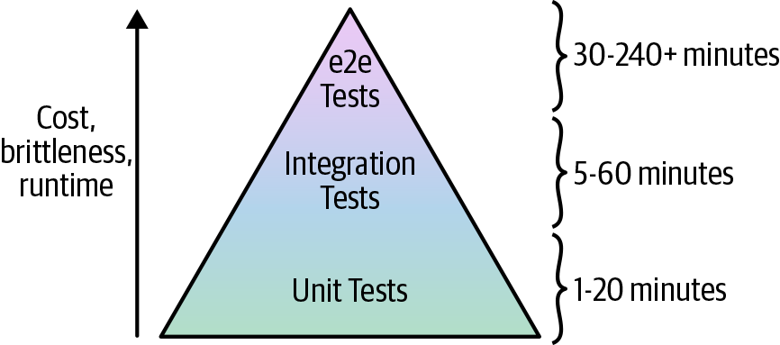

# How to Test Terraform Code
---
## DevOps World is Full of Fear
 

---
## The Plan

* Manual tests
    * Manual testing basics
    * Cleaning up after tests

* Automated tests
    * Unit tests
    * Integration tests
    * End-to-end tests
    * Other testing approaches
---

## Manual Tests

* What does manual testing mean in Terraform?
    * How much is it like manual testing in a programming language?
  
* When testing Terraform code, there is no `localhost`
    * True of most IaC tools
    * You have to deploy to a real environment
    * But *not* a production environment

* This is why it is essential to have examples which can be manually tested in an real environment
---
## Validation Clients

* When we run tests, we normally are using some appropriate client to validate the result of the test
    * For web apps, we use 'curl' or some other tool to check the output at a specific address or URL
    * For databases, we would use a client to run queries on the db so that we can validate the results

* Best practice is to set up a test sandbox
    * There will be a lot a building and tearing down of code
    * Each developer should have their own sandbox
    * The Gold standard would be separate AWS accounts
---
## Cleaning Up After Testing

* Regularly clean up your sandbox environments
    * Running deployments cost money
    * It's easy to overlook infrastructure so that it sort of just hangs around

* At a minimum, use `terraform destroy` before stopping your tests
    * Also consider a regular "scrubbing" of the workspace using a cron job

* Use tools to help line
    * **cloud-nuke**: An open source tool that can delete all the resources in your cloud environment
    * **Janitor Monkey**: An open source tool that cleans up AWS resources on a configurable schedule
    * **aws-nuke**: An open source tool dedicated to deleting everything in an AWS account
---
## Automated Testing

* There are three kinds of automated tests:

* Unit tests
    * Unit tests verify the functionality of a single, small unit of code
    * External dependencies are replaced with test mocks 

* Integration tests
    * Integration tests verify that multiple units work together correctly
    * We generally mock out other parts of the system we are not testing

* End to end testing
    * End-to-end tests involve running your entire architecture from the end-user’s perspective
    * Typically use real systems everywhere, without any mocks, in an architecture that mirrors production

---

## Unit Testing

* The first step is to identify what a “unit” is in the Terraform world
    * A unit would be a single generic module such as the alb module
    * We can't do pure unit testing in the sense of a programming language in Terraform
    * Most unit testing is designed to work with procedural languages, not declarative ones

* Because we are deploying the module into a real environment, we are essentially doing an integration test
    * But controlling the environment is a lot like mocking it out

---
## Unit Testing Strategy

* This means that the basic strategy for writing unit tests for Terraform is:

  1. Create a generic, standalone module

  2. Create an easy-to-deploy example for that module

  3. Run terraform apply to deploy the example into a real environment

  4.  Validate that what you just deployed works as expected

  5. Run terraform destroy at the end of the test to clean up.

* For automated testing, first write the manual test, then automate
    * Remember to try the automated tests on code that has no errors to ensure the tests are being automated correctly
---
 ## TerraTest

* This is an automated test tool written in Go (the same language Terraform is written in)

* Installation steps
    1. Install Go: https://golang.org/doc/install
    2. Configure the GOPATH environment variable: https://golang.org/doc/code.html#GOPATH
    3. Add $GOPATH/bin to your PATH environment variable.
    4. Install Dep, a dependency manager for Go: https://golang.github.io/dep/docs/installation.html
    5. Create a folder within your GOPATH for your test code: e.g., the default GOPATH is $HOME/go, so you could create $HOME/go/src/terraform-up-and-running
    6. Run dep init in the folder you just created. This should create Gopkg.toml, Gopkg.lock, and an empty vendors folder
   
---

## Test Installation

* Use the following Go code

    ```
    package test

    import (
	    "fmt"
	    "testing"
    )

    func TestGoIsWorking(t *testing.T)  {
	    fmt.Println()
	    fmt.Println("If you see this text, it's working!")
	    fmt.Println()
    }
    ```
* Run this test using the go test command and make sure you see the following output:
  
    ```
    $ go test -v

    If you see this text, it's working!

    PASS
    ok  	terraform-up-and-running	0.004s
    ```
---
## Creating a `alb` Unit Test

* Set up the test skeleton and set the options parameter to the `alb` sample directory

    ```
    package test

    import (
	    "github.com/gruntwork-io/terratest/modules/terraform"
	    "testing"
    )

    func TestAlbExample(t *testing.T)  {
	    opts := &terraform.Options{
	    	// You should update this relative path to point at your alb
	    	// example directory!
	    	TerraformDir: "../examples/alb",
    	}
    }
    ```
* Make sure the dependencies are installed by running
    ```
    $ dep ensure -add github.com/gruntwork-io/terratest/modules/terraform@v0.15.9
    ```

---
##  Add code for `init` and `apply`

* We add the code to run the Terraform 'init' and 'apply' commands

    ```
    unc TestAlbExample(t *testing.T)  {
	opts := &terraform.Options{
		// You should update this relative path to point at your alb
		// example directory!
		TerraformDir: "../examples/alb",
	}

	terraform.Init(t, opts)
	terraform.Apply(t, opts)
    // or
    // terraform.InitAndApply(t, opts)
    }
    ```
---

## Testing Output Variables

* There is a testable output from here 
  
    ```
    output "alb_dns_name" {
        value       = module.alb.alb_dns_name
        description = "The domain name of the load balancer"
    }
    ```
* Which we can test with starting with this code:
  
    ```
    func TestAlbExample(t *testing.T)  {
	opts := &terraform.Options{
		// You should update this relative path to point at your alb
		// example directory!
		TerraformDir: "../examples/alb",
	}

	// Deploy the example
	terraform.InitAndApply(t, opts)

	// Get the URL of the ALB
	albDnsName := terraform.OutputRequired(t, opts, "alb_dns_name")
	url := fmt.Sprintf("http://%s", albDnsName)
    }
    ```
---

## The Expected Values

* A critical part of every test is the expected values that we use to compare our actual results to
  
* We can add those in the test code along with a method that will make an HTTP request
  
    ```
    func TestAlbExample(t *testing.T)  {
	(...)
	terraform.InitAndApply(t, opts)

	// Get the URL of the ALB
	albDnsName := terraform.OutputRequired(t, opts, "alb_dns_name")
	url := fmt.Sprintf("http://%s", albDnsName)

	// Test that the ALB's default action is working and returns a 404

	expectedStatus := 404
	expectedBody := "404: page not found"

	http_helper.HttpGetWithValidation(t, url, expectedStatus, expectedBody)
    }
    ```
---
## Timing Issues

* Because of timing issues, our tests may fail because they are run before the app is fully ready
    * We can set some parameters to retry the request a number of times
  
    ```
    func TestAlbExample(t *testing.T)  {
	    (...)
	    expectedStatus := 404
	    expectedBody := "404: page not found"

	    maxRetries := 10
	    timeBetweenRetries := 10 * time.Second

	    http_helper.HttpGetWithRetry(
		    t,
		    url,
		    expectedStatus,
		    expectedBody,
		    maxRetries,
		    timeBetweenRetries,
	    )
    }
    ```
---
## The Test Framework

* Go has a built-in test system which is keeping track of the test being run (the *testing.T struct) and will report the results

* We also have to clean up and call `terrraform destroy`

    ```
	func TestAlbExample(t *testing.T)  {
        (...)

	// Clean up everything at the end of the test
	defer terraform.Destroy(t, opts)

	// Deploy the example
	terraform.InitAndApply(t, opts)

	// Get the URL of the ALB
	(...)
	
    }
    ```
---

## Automated Testing Pointers

*  Manual testing should be done in a sandbox account
    * For automated testing, this is even more important
    * A totally separate account is recommended. 
    * As your automated test suite grows, you might be spinning up hundreds or thousands of resources in every test suite, so keeping them isolated from everything else is essential
    * Teams should consider a completely separate environment  just for automated testing
    * This is separate even from the sandbox environments you use for manual testing.

* Go test can be run with a time limit (10 minutes by default) which it kills the the test environment
    * At this point all the tests fail but the environment is not destroyed

    ```
    go test -v -timeout 30m
    ```
---
## Recap - Key Parts of the Test

1.  Running terraform init

2.  Running terraform apply
   
3.  Reading output variables using terraform output
   
4.  Repeatedly making HTTP requests to the ALB
   
5.  Running terraform destroy
---

## Integration Tests

* We have been treating modules as our basic units in Terraform

* An integration test would deploy several modules and see that they work correctly
    * If the modules should not have anything in them hardcoded for the staging environment

* We never do any integration tests unless all of the modules have been thoroughly unit tested

* To do an integration test of the webserver and the database backend:
    * First deploy the `mysql` server
    * Then deploy the `hello-world-app`
    * Run the test
    * Undeploy the `hello-world-app`
    * Undeploy `mysql`
---

## Running the Integration Test

* The test code to run the integration test would look something like this:

    ```
    // Replace these with the proper paths to your modules
    const dbDirStage = "../live/stage/data-stores/mysql"
    const appDirStage = "../live/stage/services/hello-world-app"

    func TestHelloWorldAppStage(t *testing.T)  {
	    t.Parallel()

	    // Deploy the MySQL DB
	    dbOpts := createDbOpts(t, dbDirStage)
	    defer terraform.Destroy(t, dbOpts)
	    terraform.InitAndApply(t, dbOpts)

	    // Deploy the hello-world-app
	    helloOpts := createHelloOpts(dbOpts, appDirStage)
	    defer terraform.Destroy(t, helloOpts)
	    terraform.InitAndApply(t, helloOpts)

	    // Validate the hello-world-app works
	    validateHelloApp(t, helloOpts)
    }
    ```
* One issue that has to be dealt with is where each component is storing their state
    * We don't want the testing to overwrite the actual state file
---
## Faster Integration Testing

* Running the stages mentioned earlier may be unnecessary if all we are doing is making changes to the `hello-world-app`

* In this case we can eliminate overhead by doing:
    1. Run `terraform apply` on the `mysql` module
    2. Run `terraform apply` on the `hello-world-app` module
    3. Work on the module
       1. Make changes to `hello-world-app`
       2. Run `terraform apply` on the `hello-world-app` module to implement updates
       3. Validate
       4. If it all works go to step 4, else go back to step 3
    4. Run `terraform destroy` on the `hello-world-app` module
    5. Run `terraform destroy` on the `mysql` module
---
## Terratest Support

* Terratest supports this natively with the test_structure package
    * Each stage of your test in a function with a name
    * Terratest can skip some of those names by setting environment variables
    * Each test stage stores test data on disk so that it can be read back from disk on subsequent test runs
    ```
    func TestHelloWorldAppStageWithStages(t *testing.T) {
	    t.Parallel()

	    // Store the function in a short variable name solely to make the
	    // code examples fit better in the book.
	    stage := test_structure.RunTestStage

	    // Deploy the MySQL DB
	    defer stage(t, "teardown_db", func() { teardownDb(t, dbDirStage) })
	    stage(t, "deploy_db", func() { deployDb(t, dbDirStage) })

	    // Deploy the hello-world-app
	    defer stage(t, "teardown_app", func() { teardownApp(t, appDirStage) })
	    stage(t, "deploy_app", func() { deployApp(t, dbDirStage, appDirStage) })

	    // Validate the hello-world-app works
	    stage(t, "validate_app", func() { validateApp(t, appDirStage) })
    }
    ```
---
## Test Stages

* The `RunTestStage` method takes three arguments:
    * `t`: the built-in test structure that manages the state of the test - for example, calling `t.Fail()` causes the test to fail
    * `Stage name`: the name for this test stage
    * `Code to execute`: Any function to execute
  
* The code to implement `deployDB` qnd `teardownDb` would be
  
    ```
    func deployDb(t *testing.T, dbDir string) {
	dbOpts := createDbOpts(t, dbDir)

	    // Save data to disk so that other test stages executed at a later
	    // time can read the data back in
	    test_structure.SaveTerraformOptions(t, dbDir, dbOpts)

	    terraform.InitAndApply(t, dbOpts)
    }
    ```
    ```
    func teardownDb(t *testing.T, dbDir string) {
	    dbOpts := test_structure.LoadTerraformOptions(t, dbDir)
	    defer terraform.Destroy(t, dbOpts)
    }
    ```

---

## Selective Test Stages

* Staging allows for selective skipping of stages
  
    ```
    $   SKIP_teardown_db=true \
        SKIP_teardown_app=true \
        go test -timeout 30m -run 'TestHelloWorldAppStageWithStages'

        (...)

        The 'SKIP_deploy_db' environment variable is not set,
        so executing stage 'deploy_db'.

        (...)
        The 'teardown_app' environment variable is set, 
        so skipping stage 'deploy_db'.
    ```
---
## Retries

* Tests can fail for various transient reasons that are random and unpredictable
    * A common way of dealing with false positives is retrying the test on a failure

* Terratest supports automatic retries by setting "retry" options

    ```
    func createHelloOpts(
	dbOpts *terraform.Options,
	terraformDir string) *terraform.Options {

	    return &terraform.Options{
		    TerraformDir: terraformDir,

		    Vars: map[string]interface{}{
			    "db_remote_state_bucket": dbOpts.BackendConfig["bucket"],
		    	"db_remote_state_key": dbOpts.BackendConfig["key"],
			    "environment": dbOpts.Vars["db_name"],
		    },

		    // Retry up to 3 times, with 5 seconds between retries,
		    // on known errors
		    MaxRetries: 3,
		    TimeBetweenRetries: 5 * time.Second,
		    RetryableTerraformErrors: map[string]string{
			    "RequestError: send request failed": "Throttling issue?",
		    },
	    }
    }
    ```
---

## End to End Tests

* As our tests include more and more code, they become longer to execute and more costly to set up and run
* We should plan for a large number of unit tests, smaller number of integration tests and and even smaller number of end-to-end tests



---
## End to End Setup

* With larger and more complicated infrastructure, setting up a stable infrastructure (test environments, namespaces et) this only becomes more difficult  
  * Therefore, you want to do as much of your testing as low in the pyramid as you can because the bottom of the pyramid offers the fastest, most reliable feedback loop
* Deploying a complicated architecture from scratch is untenable for several reasons
* Too slow:
    * The more complex the infrastructure, longer it takes to set up
    * Limits the amount of testing that can be done which means slow feedback
* Too brittle:
    * Constantly redeploying a complex setup increases the likelihood of transient errors
    * This means constant retries which inhibit the whole testing effort
---
## End to End Strategy

* A common end-to-end strategy is:
  1. A persistent, production-like environment called “test” is deployed which is left running
  2. Every time a change is made to the infrastructure, the end-to-end test does the following:
    - Applies the infrastructure change to the test environment
    - Runs validations against the test environment (e.g., use Selenium to test your code from the end-user’s perspective) to make sure everything is working
* More closely mimics how you’ll be deploying those changes in production
    * Also confirms the deployment process also works - for example, the change can be made with zero downtime
---
## Static Analysis

* Static analysis involves running tools that examine the structure of the code without executing it
* Common tools are:
    * `terraform validate`: a command built into Terraform that you can use to check your Terraform syntax and types
    * `tflint`:  A “lint” tool for Terraform that can scan Terraform code and catch common errors and potential bugs based on a set of built-in rules
    * `HashiCorp Sentinel`:  A “policy as code” framework that allows you to enforce rules across various HashiCorp tools
---
## Property Testing

* These are testing tools like `rspec-terraform` that use Domain Specific Languages to confirm that the infrastructure conforms to a specification
  
* For example:
  
    ```
    describe file('/etc/myapp.conf') do
        it { should exist }
        its('mode') { should cmp 0644 }
    end

    describe apache_conf do
        its('Listen') { should cmp 8080 }
    end

    describe port(8080) do
        it { should be_listening }
    end
    ```
---
## Key Takeaways


* When testing Terraform code, there is no localhost
  * All manual testing is done by deploying real resources into one or more isolated sandbox environments
* Regularly clean up your sandbox environments
  * Otherwise, the environments will become unmanageable, and costs will spiral out of control
* You cannot do pure unit testing for Terraform code
  * Therefore, all automated testing is done by writing code that deploys real resources into one or more isolated sandbox environments
* You must namespace all of your resources
  * This ensures that multiple tests running in parallel do not conflict with one another
* Smaller modules are easier and faster to test
  * Smaller modules are easier to create, maintain, use, and test.
---