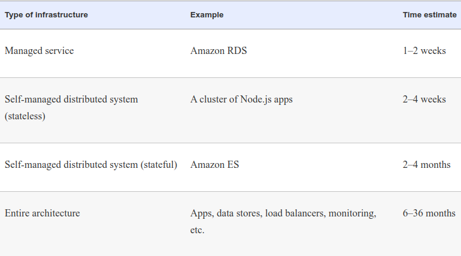
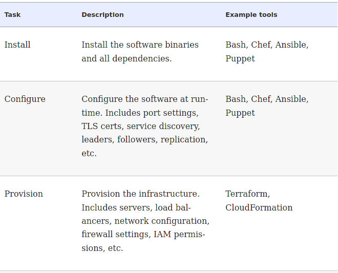
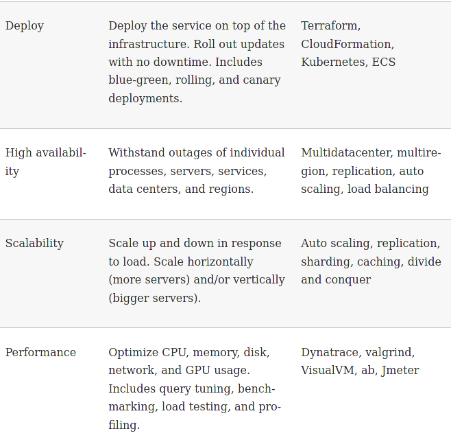
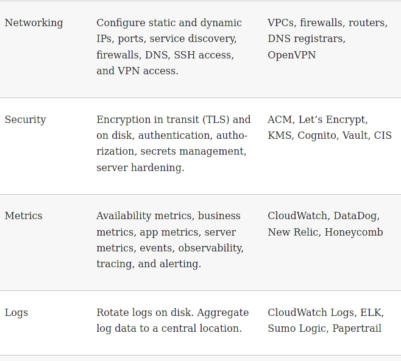
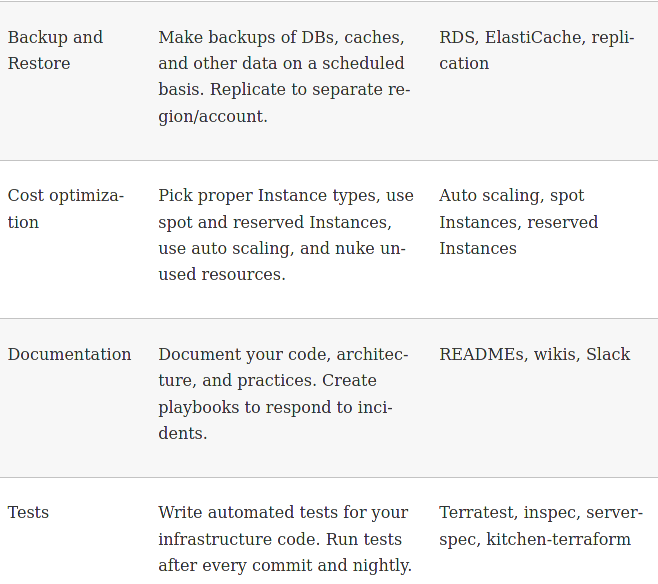
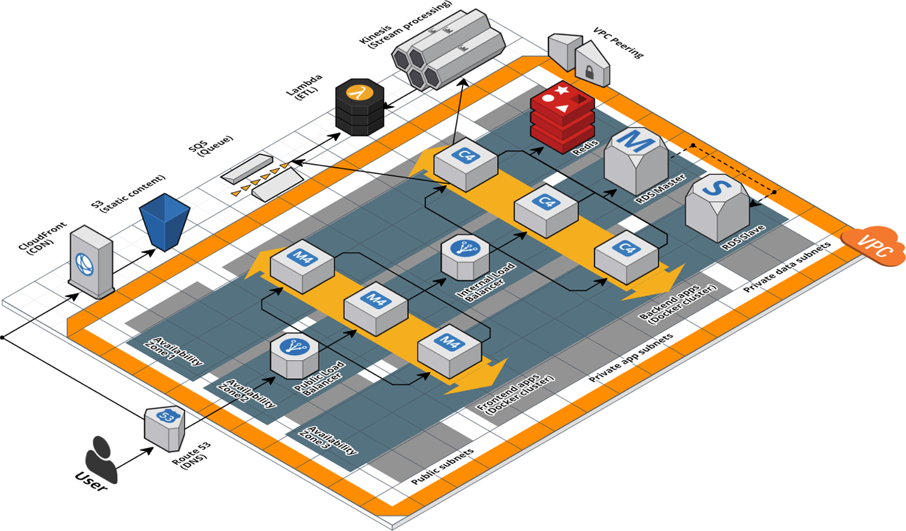
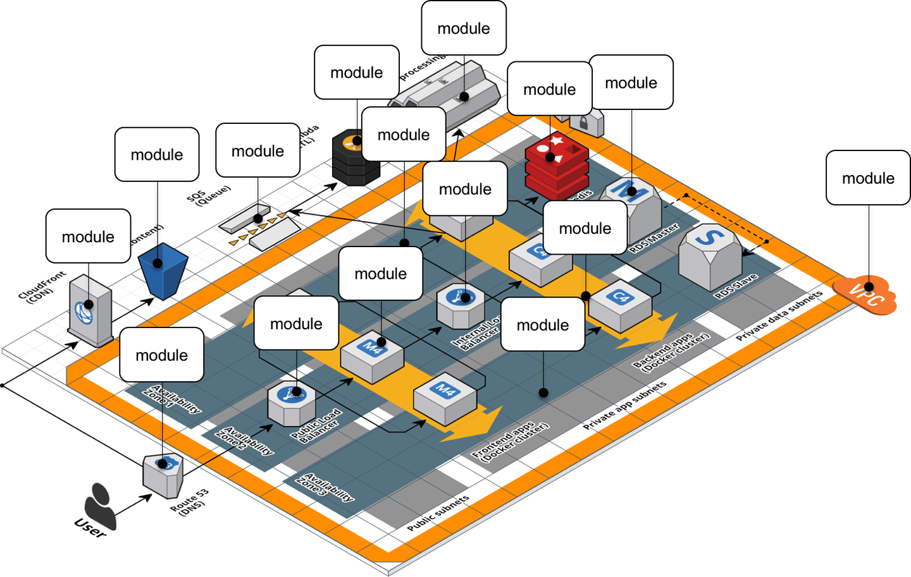

# Production-Grade Terraform Code
---

## Production Infrastructure is Hard

---
## What's Involved?

* Servers
* Data stores
* Load balancers
* Security functionalityterraform/slides/reusable-infrastructure-with-modules.mdk
* Monitoring and alerting tools
* Building pipelines
* All the other pieces of your technology that are necessary to run a business
---
## Goals

* Your infrastructure won't fall over if traffic goes up
* Not lose your data if there's an outage
* Not allow that data to be compromised when hackers try to break in
* If that is not achieved
    * Your company can go out of business.
---
## Estimates
* Deploy a service fully managed by a third party
    * Such as running MySQL using the AWS Relational Database Service (RDS)
    * __One to two weeks__ to get that service ready for production
* Your own stateless distributed app
    * Such as a cluster of Node.js apps 
    * They store all their data in RDS
    * On top of an AWS Auto Scaling Group (ASG)
    * About __two to four weeks__ to get ready for production      
---

## Bigger Estimates
* Your own stateful distributed app
    * Such as an Amazon Elasticsearch (Amazon ES) cluster
    * On top of an ASG and stores data on local disks
    * __Two to four months__ to get ready for production
* build out your entire architecture including
    * All of your apps
    * Data stores
    * Load balancers
    * Monitoring
    * Alerting
    * Security
    * About __6 to 36 months__ of work
        * Companies typically closer to six months
        * Larger companies typically taking several years
---
## Estimate Summary
 

---

## Production Grade Infrastructure

* Why does it take so long to build production-grade infrastructure?

* The production-grade infrastructure checklist

* Production-grade infrastructure modules

    * Small modules

    * Composable modules

    * Testable modules

    * Releasable modules

    * Beyond Terraform modules
---

## Why it Takes a Long Time

* Software estimates are notoriously inaccurate.
    * Even worse for DevOps
    * Unforeseen problems occur that disrupt the process
  
* The industry is in its infancy
    * Cloud computing, DevOps and tools like Terraform are all recent innovations
    * Still changing rapidly and innovating - not stable yet
    * Most people do not have a depth of experience with them

* The process is prone to disruption
    * The integration of all the details into a smooth process is still not stable
    * Diagnostic methods to solve problems are still maturing
    * There does not yet exist a body of experience and knowledge that covers a wide range of situations

---
 ## The Complexity Problem

* Scaling up from simple environments where everything works easily to complex environments is always problematic
    * Complexity is a major cause of software failure
  
* **Essential complexity** is when we are working with a complex problem - like building a whole corporate IT infrastructure

* **Accidental complexity** arises from the problems involved in using a specific set of tools and processes.

* **Environmental complexity** comes from disorganized work environments such as when there is a lack of processes or leadership
  
* Not being able to manage complexity effectively can often impact a project's timelines and costs as developers are overwhelmed by a flood of details

---
## Infrastructure Checklist

* A major challenge is that different groups in a company have only a partial view of "going to production" based on their own focus of activity
  
* Infrastructure Checklist
  
  

---
## Infrastructure Checklist

  
  

---
## Infrastructure Checklist

  
  

---
## Infrastructure Checklist

  
  

---
## Production Grade Modules

* Properties of production grade Terraform modules:
    * Small modules
    * Composable modules
    * Testable modules
    * Releasable modules
    * Beyond Terraform modules

---
## Small Modules

* Known anti-pattern "the Kitchen Sink Module"
    * All code gets dumped into a single module
    * It just sort of "grows"
    * Often the root module

* Large modules ( > several hundred lines of code) have downsides - they are:
    * **Slow** - the plan phase takes a long time to execute
    * **Insecure** - fine-grained permissions on resources becomes almost impossible
    * **Risky** - a single error can propagate across the infrastructure
    * **Difficult to understand** - they are a wall of (usually disorganized) text
    * **Difficult to review** - not just to read but the plan output is overwhelming to read
    * **Difficult to test** - testing is hard enough already
---
## General Design Principles

* In engineering, there are three basic design principles:
  
    * **Modularity**: systems are organized in self contained packages or modules
  
    * **Cohesion**: each module should provide one service and be the only module that provides that service
  
    * **Coupling**: The connections between modules are only through defined interfaces

* These ideas should be implemented in Terraform production modules.
  
---

## Architecture Example

* Given the following complex AWS architecture:



---
## Architecture Example

* This suggests a module structure like this:



---
## Analysis of ALB Example

* The webserver cluster file manages three resources
    * Auto Scaling Group (ASG)
    * Application Load Balancer (ALB)
    * Hello, World app

* Refactoring is the process of changing the structure or organization of software without altering its functionality - like these smaller, cohesive modules
    * *modules/cluster/asg-rolling-deploy* - A generic, reusable, standalone module for deploying an ASG that can do a zero-downtime, rolling deployment
    * *modules/networking/alb* - A generic, reusable, standalone module for deploying an ALB
    * *modules/services/hello-world-app* -
    A module specifically for deploying the "Hello, World" app
  
---
## Composable Modules 

* Coupling requires we pass information between modules through interfaces
    * In Terraform, we do this by passing data through variables
  
* The core idea is to minimize side effects
    * Modules should avoid reading state information directly from the environment
    * Instead, state information is passed via input parameters
    * Essentially, there are "slots" in the module which are filled in with the information in the input variables
  
---
## Refactoring - Defining Variables

* We create four new input variables

```
variable "subnet_ids" {
  description = "The subnet IDs to deploy to"
  type        = list(string)
}
 
variable "target_group_arns" {
  description = "The ARNs of ELB target groups in which to register Instances"
  type        = list(string)
  default     = []
}

variable "health_check_type" {
  description = "The type of health check to perform. Must be one of: EC2, ELB."
  type        = string
  default     = "EC2"
}

variable "user_data" {
  description = "The User Data script to run in each Instance at boot"
  type        = string
  default     = null
}
```
---
## Understanding the Variables

* `subnet_ids`: The original code had hard coded the default VPC and subnets, but by using this variable instead, the code can be used with any VPC or subnets
  
* `target_group_arns`: configures how the auto-scaling group integrates with load balancers
  
* `health_check_type`: also configures how the auto-scaling group integrates with load balancers

* Instead of the code just implementing as single fixed configuration, the variables allows you to use the ASG with a wide variety of use cases; e.g., no load balancer, one ALB, multiple NLBs, and so on
  
---

## Modifying the Code

```
resource "aws_autoscaling_group" "example" {
  # Explicitly depend on the launch configuration's name so each time
  # it's replaced, this ASG is also replaced
  name = "${var.cluster_name}-${aws_launch_configuration.example.name}"

  launch_configuration = aws_launch_configuration.example.name
  vpc_zone_identifier  = var.subnet_ids

  # Configure integrations with a load balancer
  target_group_arns    = var.target_group_arns
  health_check_type    = var.health_check_type

  min_size = var.min_size
  max_size = var.max_size

  # Wait for at least this many instances to pass health checks before
  # considering the ASG deployment complete
  min_elb_capacity = var.min_size

  # (...)
}
```
---
## The User Script

* The fourth variable, `user_data`, is for passing in a User Data script

* This allows us to deploy any application across a ALB
  
    ```
    resource "aws_launch_configuration" "example" {
    image_id        = var.ami
    instance_type   = var.instance_type
    security_groups = [aws_security_group.instance.id]
    user_data       = var.user_data

    # Required when using a launch configuration with an auto scaling group.
    # https://www.terraform.io/docs/providers/aws/r/launch_configuration.html
    lifecycle {
        create_before_destroy = true
     }
    }
    ```
---
## Output Variables

* You'll also want to add a couple of useful output variables to modules/cluster/asg-rolling-deploy/outputs.tf:

    ```
    output "asg_name" {
      value       = aws_autoscaling_group.example.name
    description = "The name of the Auto Scaling Group"
    }

    output "instance_security_group_id" {
    value       = aws_security_group.instance.id
    description = "The ID of the EC2 Instance Security Group"
    }
    ```
* Outputting this data makes the asg-rolling-deploy module even more reusable
  * Users of the module can add new behaviors, such as attaching custom rules to the security group.
---

## Output Variables

* For similar reasons, several output variables can be added to `modules/networking/alb/outputs.tf`:

    ```
    output "alb_dns_name" {
    value       = aws_lb.example.dns_name
    description = "The domain name of the load balancer"
    }

    output "alb_http_listener_arn" {
     value       = aws_lb_listener.http.arn
    description = "The ARN of the HTTP listener"
    }

    output "alb_security_group_id" {
    value       = aws_security_group.alb.id
    description = "The ALB Security Group ID"
    }
    ```
* We have defined return values that provide the name, arn and security group id that were created when the resources were instantiated

---
## Creating the "Hello World" App

* The last step is to convert the `webserver-cluster` module into a hello-world-app module that can deploy a "Hello, World" app using the `asg-rolling-deploy` and `alb` modules

* The resources left in `module/services/hello-world-app/main.tf` are:
    * `template_file` (for User Data)
    * `aws_lb_target_group`
    * `aws_lb_listener_rule`
    * `terraform_remote_state` (for the DB)
    * `aws_vpc`
    * `aws_subnet_ids`

* Add the following variable to `modules/services/hello-world-app/variables.tf`:
    ```
    variable "environment" {
        description = "The name of the environment we're deploying to"
        type        = string
    }
    ```
---
## Adding the `asg-rolling-deploy` Module

* Now, add the asg-rolling-deploy module that you created earlier to the hello-world-app module to deploy an ASG:
  
    ```
    module "asg" {
        source = "../../cluster/asg-rolling-deploy"

        cluster_name  = "hello-world-${var.environment}"
         ami           = var.ami
         user_data     = data.template_file.user_data.rendered
        instance_type = var.instance_type

        min_size           = var.min_size
        max_size           = var.max_size
        enable_autoscaling = var.enable_autoscaling

        subnet_ids        = data.aws_subnet_ids.default.ids
         target_group_arns = [aws_lb_target_group.asg.arn]
        health_check_type = "ELB"

        custom_tags = var.custom_tags
    }
    ```
---
## Adding the `alb` Module

* Use of the the input variable environment to enforce a naming convention, so all of your resources will be namespaced based on the environment (e.g., hello-world-stage, hello-world-prod)
  
    ```
    module "alb" {
        source = "../../networking/alb"

         alb_name   = "hello-world-${var.environment}"
        subnet_ids = data.aws_subnet_ids.default.ids
    }
    ```
---
## Configure the ALB Target Group

* Configure the ALB target group and listener rule for this app
* Update the aws_lb_target_group resource in `modules/services/hello-world-app/main.tf` to use environment in its name:
  
    ```
    resource "aws_lb_target_group" "asg" {
        name     = "hello-world-${var.environment}"
         port     = var.server_port
        protocol = "HTTP"
         vpc_id   = data.aws_vpc.default.id

        health_check {
            path                = "/"
            protocol            = "HTTP"
            matcher             = "200"
            interval            = 15
            timeout             = 3
            healthy_threshold   = 2
            unhealthy_threshold = 2
        }
    }  
    ```
---
## Update Listener

* Update the listener_arn parameter of the aws_lb_listener_rule resource to point at the alb_http_listener_arn output of the ALB module:
  
    ```
    resource "aws_lb_listener_rule" "asg" {
        listener_arn = module.alb.alb_http_listener_arn
        priority     = 100

        condition {
            path_pattern {
            values = ["*"]
            }
         }

        action {
            type             = "forward"
            target_group_arn = aws_lb_target_group.asg.arn
        }
    }
    ```
---
## Passthrough Values

* Pass through the important outputs from the `asg-rolling-deploy` and `alb` modules as outputs of the hello-world-app module:
  
    ```
    output "alb_dns_name" {
        value       = module.alb.alb_dns_name
        description = "The domain name of the load balancer"
    }

    output "asg_name" {
        value       = module.asg.asg_name
        description = "The name of the Auto Scaling Group"
    }

    output "instance_security_group_id" {
        value       = module.asg.instance_security_group_id
        description = "The ID of the EC2 Instance Security Group"
    }
    ```
---
## Module Composition

* Composition us building up more complicated behavior for the "Hello, World" app from simpler parts (ASG and ALB modules)  
  
* A fairly common pattern in Terraform is that an configuration will have at least two types of modules:
  
* **Generic modules**: the basic building blocks of Terraform code, reusable across a wide variety of use cases
  
* **Use-case-specific modules**: Combines multiple generic modules with some specific "glue" code to serve one specific use case such as deploying the "Hello, World" app

---
## Testable Modules

* There is a lot of code in three modules:
    * `asg-rolling-deploy`
    * `alb` 
    * `hello-world-app` 
  
* The next step is to check that your code actually works.
    * These are not root modules so we have to provide the infrastructure needed to run them
    * For example: backend configuration, provider, etc

* To do this, we use an "examples" folder that provides examples on how to use the module
---
## Sample Example

* The code below is an example file to deploy an ASG of size 1

    ```
    provider "aws" {
        region = "us-east-2"
    }

    module "asg" {
        source = "../../modules/cluster/asg-rolling-deploy"

        cluster_name  = var.cluster_name
        ami           = "ami-0c55b159cbfafe1f0"
        instance_type = "t2.micro"

        min_size           = 1
         max_size           = 1
         enable_autoscaling = false

        subnet_ids        = data.aws_subnet_ids.default.ids
    }

    data "aws_vpc" "default" {
        default = true
    }

    data "aws_subnet_ids" "default" {
        vpc_id = data.aws_vpc.default.id
    }
    ```
---
## Test Assets

* The code on the previous slide provides:

* A manual test harness: you can use this example code to repeatedly deploy and undeploy manually to check that it works as you expect

* An automated test harness: The example code is also creates a framework for using automated testing tools

* Executable documentation: If you commit an example (including README.md) into version control then:
  * Other team members can use it to understand how the module works
  * They can try out the module without writing a line of code. 
  
* Every module should have a corresponding example in the examples folder
    * There may be multiple examples showing different configurations and permutations of how that module can be used
---
## Folder Structure
```
modules
 └ examples
   └ alb
   └ asg-rolling-deploy
     └ one-instance
     └ auto-scaling
     └ with-load-balancer
     └ custom-tags
   └ hello-world-app
   └ mysql
 └ modules
   └ alb
   └ asg-rolling-deploy
   └ hello-world-app
   └ mysql
 └ test
   └ alb
   └ asg-rolling-deploy
   └ hello-world-app
   └ mysql
```
---
## Version Pinning

*  You should pin all of your Terraform modules to a specific version of Terraform using the required_version argument
   *  You want to avoid breaking a configuration because of a change in Terraform itself
   *  At a bare minimum, you should require a specific major version of Terraform:

    ```
    terraform {
    # Require any 0.12.x version of Terraform
     required_version = ">= 0.12, < 0.13"
    }
    ```
* For production-grade code, it is recommend pinning the version even more strictly:
  
    ```
    terraform {
        # Require Terraform at exactly version 0.12.0
     required_version = "= 0.12.0"
    }  
    ```
---

## Releasable Modules

* Modules should be made available for use only after they have been "released"
    * This is what we saw in the Modules section

* Another option for releasing modules is to publish them in the Terraform Registry
    * The Public Terraform Registry resides at https://registry.terraform.io/ 
    * It includes hundreds of reusable, community-maintained, open source modules for AWS, Google Cloud, Azure, and many other providers

---
## Publishing Requirements

* There are a few requirements to publish a module to the Public Terraform Registry
  * The module must live in a public GitHub repo
  * The repo must be named terraform-< PROVIDER >-< NAME >, where PROVIDER is the provider the module is targeting (e.g., aws) and NAME is the name of the module
  * The module must follow a specific file structure, including defining Terraform code in the root of the repo, providing a README.md, and using the convention of main.tf, variables.tf, and outputs.tf as filenames
  * The repo must use Git tags with semantic versioning (x.y.z) for releases
---
## Using the Registry

* Terraform even supports a special syntax for consuming modules from the Terraform Registry
    * You can use a special shorter registry URL in the source argument and specify the version via a separate version argument using the following syntax:  
    
    ```
    module "< NAME >" {
        source  = "< OWNER >/< REPO >/< PROVIDER >"
        version = "< VERSION >"

        # (...)
    }
    ```
* For example
    ```
    module "vault" {
        source  = "hashicorp/vault/aws"
        version = "0.12.2"

        # (...)
    }
    ```
---
## Beyond Modules

* Sometimes non Terraform code has to be run from a Terraform module or integrate with other tools or systems

* Sometime we have to work around a limitation of Terraform, like trying implement complicated logic

* Some Terraform "escape hatches" are:
  * Provisioners
  * Provisioners with `null_resource`
  * External Data Source
  
---
## Provisioners

* Provisioners are used to execute scripts either on the local machine or a remote machine, typically to do the work of bootstrapping, configuration management, or cleanup
  
* There are several different kinds of provisioners
    * `local-exec`: execute a script on the local machine
    * `remote-exec`: execute a script on a remote resource
    * `chef`: run Chef client on a remote resource
    * `file`: copy files to a remote resource
---
## Provisioner Block
* Provisioners are added using the a `provisioner block`

    ```
    resource "aws_instance" "example" {
        ami           = "ami-0c55b159cbfafe1f0"
         instance_type = "t2.micro"

        provisioner "local-exec" {
         command = "echo \"Hello, World from $(uname -smp)\""
        }
    }
    ```
* Running `terraform apply` produces:
  
    ```
    terraform apply

    (...)

    aws_instance.example (local-exec): Hello, World from Darwin x86_64 i386

    (...)

    Apply complete! Resources: 1 added, 0 changed, 0 destroyed.
    ```
---
## Remote Provisioning

* Assume we want to provision an EC2 instance, we thave to connect to the instance and authenticate to it
    * In this example we will use SSH

* We need a security group to allow SSH access:
  
    ```
    resource "aws_security_group" "instance" {
        ingress {
            from_port = 22
            to_port   = 22
            protocol  = "tcp"

            # To make this example easy to try out, we allow all SSH connections.
             # In real world usage, you should lock this down to solely trusted IPs.
            cidr_blocks = ["0.0.0.0/0"]
             }
    }
    ```
---
## Generate SSH Keys

* This stores the key in the state which we would not want to do in a production environment and upload to aws using the `aws_key_pair` resource

    ```
    # To make this example easy to try out, we generate a private key in Terraform.
    # In real-world usage, you should manage SSH keys outside of Terraform.
    resource "tls_private_key" "example" {
        algorithm = "RSA"
        rsa_bits  = 4096
    }   
    ```
    ```
    resource "aws_key_pair" "generated_key" {
        public_key = tls_private_key.example.public_key_openssh
    }
    ```
* And creating the instance that uses this key
  
    ```
    resource "aws_instance" "example" {
        ami                    = "ami-0c55b159cbfafe1f0"
        instance_type          = "t2.micro"
        vpc_security_group_ids = [aws_security_group.instance.id]
        key_name               = aws_key_pair.generated_key.key_name

        provisioner "remote-exec" {
            inline = ["echo \"Hello, World from $(uname -smp)\""]
        }
    }
    ```
---
## Connecting to the Instance

* The inline argument to pass a list of commands to execute, instead of a single command argument

* But we also have to configure the EC2 instance to use ssh
    * The `self` keyword is a work-around for provisioners to avoid circular dependencies. 

    ```
    resource "aws_instance" "example" {
        ami                    = "ami-0c55b159cbfafe1f0"
        instance_type          = "t2.micro"
        vpc_security_group_ids = [aws_security_group.instance.id]
        key_name               = aws_key_pair.generated_key.key_name

         provisioner "remote-exec" {
            inline = ["echo \"Hello, World from $(uname -smp)\""]
          }

        connection {
            type        = "ssh"
            host        = self.public_ip
            user        = "ubuntu"
            private_key = tls_private_key.example.private_key_pem
        }
    }
    ```
---
## Data Scripts versus Provisioners

* Advantages to using a provisioner
    * Data scripts are limited to a length of 16KB, while provisioner scripts can be arbitrarily long
    * The Chef and other provisioners install, configure, and run on clients, which makes it easier to use configuration management tools

* The advantages to User Data scripts are:
    * You can use User Data scripts with ASGs, but Provisioners take effect only while Terraform is running and don't work with ASGs at all
    * The User Data script can be seen in the EC2 Console and you can find its execution log on the EC2 Instance itself, both of which are useful for debugging,neither of which is available with provisioners
---

## Provisioners with `null_resource`

* Sometimes, you want to execute a provisioner without tying it to a specific resource
* we can use a `null_resource` whichacts just like a normal Terraform resource, except that it doesn't create anything
    ```
    resource "null_resource" "example" {
         provisioner "local-exec" {
        command = "echo \"Hello, World from $(uname -smp)\""
        }
    }
    ```
---
## `null_resource` Triggers

* The `null_resource` has an argument called triggers, which takes in a map of keys and values
    * Whenever the values change, the null_resource will be recreated
    * This forces any provisioners within it to be reexecuted
    * For example, the uuid() built-in function, which returns a new, randomly generated UUID each time it's called, within the triggers argument
  
    ```
    resource "null_resource" "example" {
        # Use UUID to force this null_resource to be recreated on every
        # call to 'terraform apply'
        triggers = {
            uuid = uuid()
        }

        provisioner "local-exec" {
            command = "echo \"Hello, World from $(uname -smp)\""
        }
    }
    ```
---
## Output from `null_resource`

* Every time you call terraform apply, the local-exec provisioner will execute:
* The output from the previous example is:
  
    ```
    $ terraform apply

    (...)

    null_resource.example (local-exec): Hello, World from Darwin x86_64 i386

    $ terraform apply

    null_resource.example (local-exec): Hello, World from Darwin x86_64 i386
    ```
---

## External Data Source

* For situations where  we want to execute a script to fetch some data and make that data available within the Terraform code itself
    * External data source allows an external command that implements a specific protocol to act as a data source

* The protocol is:
    * Data passes Terraform to the external program using the query argument of the external data source
    * The external program can read in these arguments as JSON from stdin
    * The external program can pass data back to Terraform by writing JSON to stdout
    * Terraform code can then pull data out of this JSON by using the result output attribute of the external data source
  

---
## External Example

* This example uses the external data source to execute a Bash script that echoes back to stdout any data it receives on stdin

    ```
    data "external" "echo" {
        program = ["bash", "-c", "cat /dev/stdin"]
        query = {
            foo = "bar"
        }
    }

    output "echo" {
        value = data.external.echo.result
    }

    output "echo_foo" {
        value = data.external.echo.result.foo
    }
    ```
---
## External Example

* The output of the example on the previous slide is:
  
    ```
    $ terraform apply

    (...)

    Apply complete! Resources: 0 added, 0 changed, 0 destroyed.

    Outputs:

    echo = {
        "foo" = "bar"
    }
    echo_foo = bar
    ```


