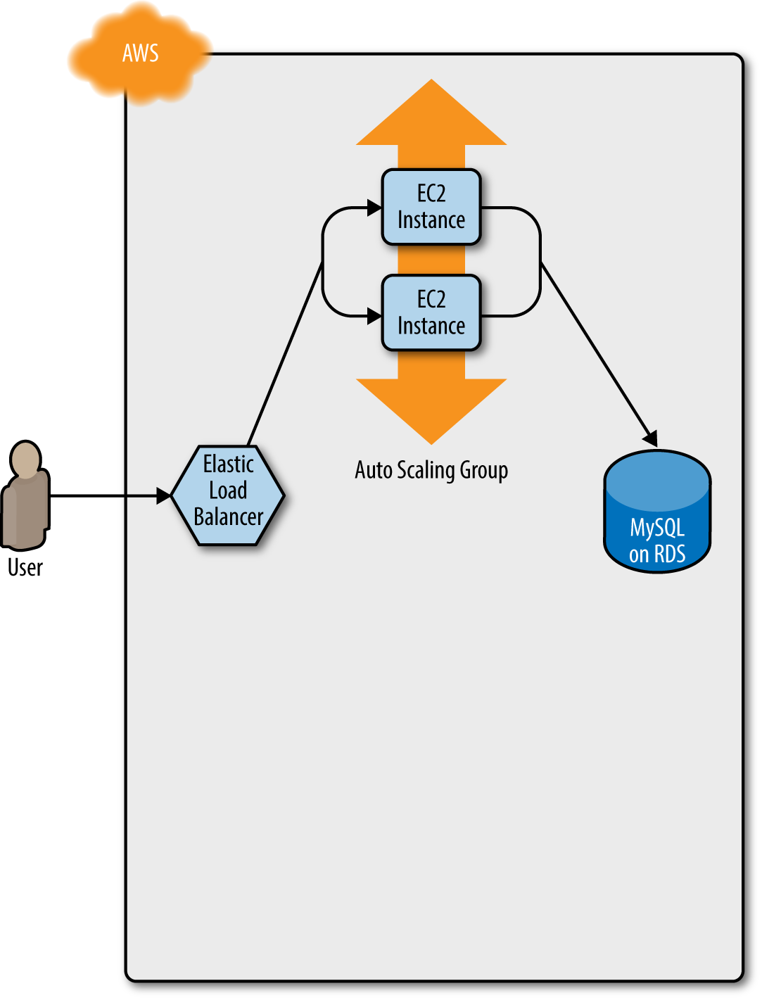
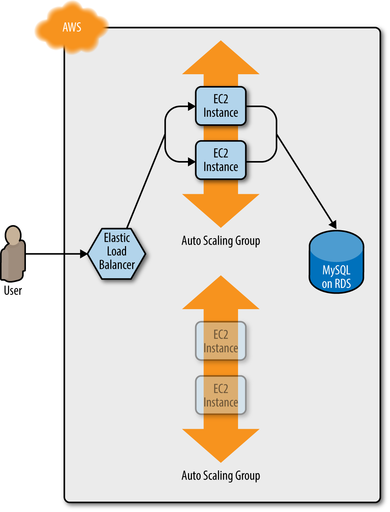
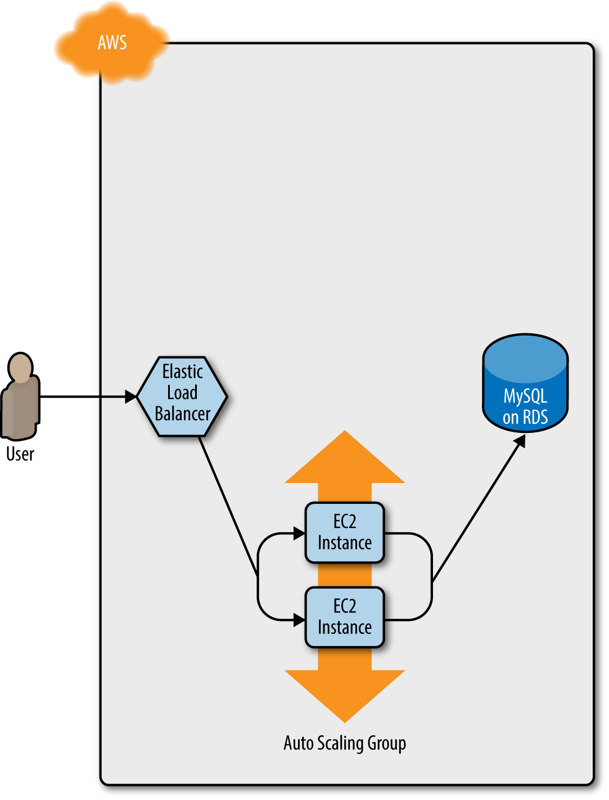

# Terraform Language Elements
---
## Plan

* Loops
* If-Statements
* Deployment
* Gotchas
* Other language elements


 

---
## Declarative Languages

* Declarative languages, like Terraform, normally do not have typical programming constructs like loops
  
* The challenge is expressing scenarios that require the conditional configuration of resources
    * For example, creating a module that creates resources only for certain users and not others

* Terraform primitives allow certain kinds of operations to allow dynamic and conditional configuration to be done
    * These do not look like standard constructs in programming languages that have the same functionality 

---
## Loops

* Terraform has several loop constructs to provide looping functionality in different scenarios

  * `count` parameter: to loop over resources
  * `for_each` expressions: to loop over resources and inline blocks within a functionality
  * `for` expressions: to loop over lists and maps
  * `for` string directive: to loop over lists and maps withing a string

---
##  Loops with `count`

* The looping procedural code is implied and generated under the hood by Terraform
  
* We specify the number of iterations with the count, which usually would represent the number of copies of a resource
  * The following code creates three users with the names `neo.0`,`neo.1` and `neo.2`

```
resource "aws_iam_user" "example" {
  count = 3
  name  = "neo.${count.index}"
}
```
* Under the hood something like this is conceptually happening:

```

resource "aws_iam_user" "example" {
  count = 3
  # for index = 0 to count
  name  = "neo.${count.index}"
}
```
---
## Array Lookups

* We can supply list of value in arrays
  
  ```
  variable "user_names" {
  description = "Create IAM users with these names"
  type        = list(string)
  default     = ["neo", "trinity", "morpheus"]
  }
  ```
  * Array elements can be reference with array notation
  * The length of the array (also strings and maps) returned from the built-in function `length()`
  
    ```
    resource "aws_iam_user" "example" {
    count = length(var.user_names)
    name  = var.user_names[count.index]
    }
   ```
---
 ## Arrays of Resources

 * Using `count` on a resource creates an array of resources rather than just one resource
    * The lookup syntax is:
    * `<PROVIDER>_<TYPE>.<NAME>[INDEX].ATTRIBUTE`
  
  ```
  output "neo_arn" {
  value       = aws_iam_user.example[0].arn
  description = "The ARN for user Neo"
  }
  ```
  * To get all the users, a "splat" expression is used
  ```
  output "all_arns" {
  value       = aws_iam_user.example[*].arn
  description = "The ARNs for all users"
  }
  ```
---
 ## Arrays of Resources

 * Running `terrafrm apply` will output the full arrray of resources

```
  $ terraform apply

  (...)

  Apply complete! Resources: 3 added, 0 changed, 0 destroyed.

  Outputs:

  neo_arn = arn:aws:iam::123456789012:user/neo
  all_arns = [
    "arn:aws:iam::123456789012:user/neo",
    "arn:aws:iam::123456789012:user/trinity",
    "arn:aws:iam::123456789012:user/morpheus",
  ]
```
---
## Limitations of Count

* `count` can loop over resources but not inline blocks

* For example, we cannot iterate over the inline block for `tag` to generate multiple tag blockd dynamically

  ```
  resource "aws_autoscaling_group" "example" {
  launch_configuration = aws_launch_configuration.example.name
  vpc_zone_identifier  = data.aws_subnet_ids.default.ids
  target_group_arns    = [aws_lb_target_group.asg.arn]
  health_check_type    = "ELB"

  min_size = var.min_size
  max_size = var.max_size

  tag {
    key                 = "Name"
    value               = var.cluster_name
    propagate_at_launch = true
    }
  }
  ```
---

## Limitations of Count

* Changing the values in a list modifies the created infrastructure

* If we create the infrastructure with this list:

  ```
  variable "user_names" {
  description = "Create IAM users with these names"
  type        = list(string)
  default     = ["neo", "trinity", "morpheus"]
  }
  ```
  * If `trinity` is removed then the correspondence between the array of resources and the list of names no loger is valid
  
  * Terraform restores the mapping by recreating the resources
---

## Limitations of Count

* Using
  ```
  variable "user_names" {
  (...)
  default     = ["neo",  "morpheus"]
  }
  ```
* T hen `terraform plan` produces the following output

  ```
  Terraform will perform the following actions:

  # aws_iam_user.example[1] will be updated in-place
  ~ resource "aws_iam_user" "example" {
        id            = "trinity"
      ~ name          = "trinity" -> "morpheus"
  }

  # aws_iam_user.example[2] will be destroyed
  - resource "aws_iam_user" "example" {
      - id            = "morpheus" -> null
      - name          = "morpheus" -> null
   }

  Plan: 0 to add, 1 to change, 1 to destroy.
  ```

---
## Loops with `for_each` Expressions

* The `for_each` expression allows looping over lists, sets, and maps to create either:
    * multiple copies of an entire resource, or
    * multiple copies of an inline block within a resource

* The syntax is:
  ```
  resource "< PROVIDER >_< TYPE >" "< NAME >" {
  for_each = < COLLECTION >

  [CONFIG ...]
  }
  ```
* The previous example is now:
```
  variable "user_names" {
  description = "Create IAM users with these names"
  type        = list(string)
  default     = ["neo", "trinity", "morpheus"]
  }

  resource "aws_iam_user" "example" {
  for_each = toset(var.user_names)
  name     = each.value
  }
  ```
---
## Use of `for_each`

* The function `toset()` converts the var.user_names list into a set
    * `for_each` supports sets and maps only when used on a resource

* When for_each loops each user name is made available in the `each` value
    * The user name will also be available in `each.key`, but this is usually used only with maps of key/value pair.

* Once `for_each` is used on a resource, it creates a map of resources rather than array of resources
    * This is why we can't use a list with possible duplicates 
    * This would lead to duplicate keys
---
## `for_each` Example

* Using the variable
  ```
  output "all_users" {
  value = aws_iam_user.example
  }
  ```
  * `terraform apply` produces

  ```
  Apply complete! Resources: 0 added, 0 changed, 0 destroyed.
    ...
  Outputs:

  all_arns = [
    "arn:aws:iam::123456789012:user/morpheus",
    "arn:aws:iam::123456789012:user/neo",
    "arn:aws:iam::123456789012:user/trinity",
  ]
  ```
---
## Map Advantages

* Maps do not rely on position like lists do
    * Allows us to  to remove items from the middle of a collection safely

* Going back to the problem of deleting "trinity" with a map of resources we get:

  ```
  terraform plan

  Terraform will perform the following actions:

  # aws_iam_user.example["trinity"] will be destroyed
  - resource "aws_iam_user" "example" {
      - arn           = "arn:aws:iam::123456789012:user/trinity" -> null
      - name          = "trinity" -> null
    }

  Plan: 0 to add, 0 to change, 1 to destroy.
  ```
---
## Inline Blocks with `for_each`
  
* Setting some custom tags

  ```
  variable "custom_tags" {
  description = "Custom tags to set on the Instances in the ASG"
  type        = map(string)
  default     = {}
  }
  ```
  * The values are supplied when the module is called

  ```
  module "webserver_cluster" {
  source = "../../../../modules/services/webserver-cluster"
      ...
  cluster_name           = "webservers-prod"
  db_remote_state_bucket = "(YOUR_BUCKET_NAME)"
  db_remote_state_key    = "prod/data-stores/mysql/terraform.tfstate"    
  instance_type        = "m4.large"
  min_size             = 2
  max_size             = 10
      ...
  custom_tags = {
    Owner      = "team-foo"
    DeployedBy = "terraform"
      }
  }
  ```
---
## Dynamic Inline Blocks

* To use a for_each to create a dynamic inline block, we use the following syntax and give an example of its use

```
  dynamic "< VAR_NAME >" {
  for_each = < COLLECTION >

  content {
    [CONFIG...]
      }
  }
```
  ```
  resource "aws_autoscaling_group" "example" {
    launch_configuration = aws_launch_configuration.example.name
   ...

    tag {
      key                 = "Name"
     value               = var.cluster_name
      propagate_at_launch = true
   }

   dynamic "tag" {
     for_each = var.custom_tags 

      content {
        key                 = tag.key
        value               = tag.value
        propagate_at_launch = true
     }
    }
  }
  ```
---
## `terraform apply` output

  ```
  Terraform will perform the following actions:

   # aws_autoscaling_group.example will be updated in-place
    ~ resource "aws_autoscaling_group" "example" {
          (...)

          tag {
              key                 = "Name"
              propagate_at_launch = true
              value               = "webservers-prod"
         }
        + tag {
            + key                 = "Owner"
            + propagate_at_launch = true
            + value               = "team-foo"
          }
        + tag {
            + key                 = "DeployedBy"
            + propagate_at_launch = true
            + value               = "terraform"
          }
      }

  Plan: 0 to add, 1 to change, 0 to destroy.
  ```
---

## Looping with Expressions

* Terraform allows operations on the data similar to operations in a programming language

* Syntax is:
  ```
  [for < ITEM > in < LIST > : < OUTPUT >]
  ```
* Demonstrated in this code
  ```
    variable "names" {
    description = "A list of names"
    type        = list(string)
    default     = ["neo", "trinity", "morpheus"]
    }

    output "upper_names" {
      value = [for name in var.names : upper(name)]
    } 

    output "short_upper_names" {
    value = [for name in var.names : upper(name) if length(name) < 5]
    }
  ```
* Note that this resembles a "map" operation in a functional programming language
---
## Working with Map Inputs

* The for expression can loop over a map as well
  ```
  [for < KEY >, < VALUE > in < MAP > : < OUTPUT >]
  ```
* Example of use:
  ```
  variable "hero_thousand_faces" {
    description = "map"
    type        = map(string)
    default     = {
      neo      = "hero"
      trinity  = "love interest"
      morpheus = "mentor"
     }
  }

  output "bios" {
    value = [for name, role in var.hero_thousand_faces : "${name} is the ${role}"]
  }
  ```
  ```
  // output produced by terraform apply
  bios = [
   "morpheus is the mentor",
   "neo is the hero",
    "trinity is the love interest",
  ]
  ```
---

### Outputing a Map

* Looping over a list or map can output a map using the syntax:
```
// Loop over a list and output a map
{for < ITEM > in < LIST > : < OUTPUT_KEY > => < OUTPUT_VALUE >}
```
```
// Loop over a map and output a map
{for < KEY >, < VALUE > in < MAP > : < OUTPUT_KEY > => < OUTPUT_VALUE >}
```
* Revisting the example
  ```
  variable "hero_thousand_faces" {
   description = "map"
   type        = map(string)
   default     = {
      neo      = "hero"
      trinity  = "love interest"
      morpheus = "mentor"
     }
  }
  ```
  ```
  output "upper_roles" {
    value = {for name, role in var.hero_thousand_faces : upper(name) => upper(role)}
  }
  ```
```
upper_roles = {
  "MORPHEUS" = "MENTOR"
  "NEO" = "HERO"
  "TRINITY" = "LOVE INTEREST"
}
```
---
## Loops with the `for` String Directive

* String directives allow for-loops and if-statements in strings using a syntax similar to string interpolations
  but instead of a dollar sign and curly braces (${…}), it uses a percent sign and curly braces (%{…})
    * Terraform supports two types of string directives:
    for-loops and conditionals

* For loop syntax (collection is a list or map)
  ```
  %{ for < ITEM > in < COLLECTION > }< BODY >%{ endfor }
  ```
---

## String for loop Example

  ```
  variable "names" {
    description = "Names to render"
    type        = list(string)
    default     = ["neo", "trinity", "morpheus"]
  }
  ```


  ```
  output "for_directive" {
    
    value = <<EOF
  %{ for name in var.names }
    ${name}
  %{ endfor }
  EOF
  }
  ```

  ```
  terraform apply

  Apply complete! Resources: 0 added, 0 changed, 0 destroyed.

  Outputs:

  for_directive =
    neo

    trinity

    morpheus
  ```
---
## Trimming Whitespace

* A strip marker (~) in your string directive consumes all of the whitespace (spaces and newlines) either before the string directive (if the marker appears at the beginning of the string

  ```
  output "for_directive_strip_marker" {
  value = <<EOF
  %{~ for name in var.names }
  ${name}
  %{~ endfor }
  EOF
  }
  ```
* Which produces:
  ```
  for_directive_strip_marker =
  neo
  trinity
  morpheus
  ```
---
## Conditionals

* There are also several different ways to do conditionals, each intended to be used in a slightly different scenario:

    * *count parameter*: Used for conditional resources

    * *for_each and for expressions*: Used for conditional resources and inline blocks within a resource

    * *if string directive*: Used for conditionals within a string

---
## Conditionals with `count`

* We can define a Boolean variable as our test condition:

  ```
  variable "enable_autoscaling" {
  description = "If set to true, enable auto scaling"
  type        = bool
  }
  ```
* We can set the count on a resource to "0" which means that resource is not created

* Terraform allows ternary conditionals of the form:
  ```
  < CONDITION > ? < TRUE_VAL > : < FALSE_VAL >
  ```
* This allows for conditional creation of resources:
  ```
  resource "aws_autoscaling_schedule" "scale_out_during_business_hours" {
  count = var.enable_autoscaling ? 1 : 0
  ...
  }
  ```
---
## Conditional Count

* This Boolean can then be set when creating a `webserver_cluster`
  ```
  module "webserver_cluster" {
  source = "../../../../modules/services/webserver-cluster"

  cluster_name           = "webservers-stage"
  db_remote_state_bucket = "(YOUR_BUCKET_NAME)"
  db_remote_state_key    = "stage/data-stores/mysql/terraform.tfstate"

  instance_type        = "t2.micro"
  min_size             = 2
  max_size             = 2
  enable_autoscaling   = false
  }
  ```
---
  
## Working with Non-boolean 

* The previous example worked because we could define a boolean variable
    * However, we may have to decode information in a string to make a decision

* Example: We want to set a cloud-watch alarm that triggers when CPU credits are low
    * However, CPUcredits only "txxx" instances
    * Larger instance like m4.large do not return a CPU credit metric and will always appear to be in an INSUFFICIENT_DATA state
    * We want the metric to apply to only txxx instance but we don't want to create a special Boolean


---
## Working with Non-boolean 

* The solution is to utilize the fact that first letter of the instance type should be a "t"

  ```
  resource "aws_cloudwatch_metric_alarm" "low_cpu_credit_balance" {
  count = format("%.1s", var.instance_type) == "t" ? 1 : 0

  alarm_name = "${var.cluster_name}-low-cpu-credit-balance"
  namespace   = "AWS/EC2"
  metric_name = "CPUCreditBalance"
  ...
  }
  ```
* The format function to extract just the first character from var.instance_type. 
    * If that character is a “t” (e.g., t2.micro), it sets the count to 1; 
    * otherwise, it sets the count to 0
    * This way, the alarm is created only for instance types that actually have a CPUCreditBalance metric.

---
## If-else Conditions

* There is no specific if-else construct but it can be emulated

* In the following example, webserver-cluster module pulls in the user-data.sh script via a template_file data source

  ```
  data "template_file" "user_data" {
  template = file("${path.module}/user-data.sh")

  vars = {
    server_port = var.server_port
    db_address  = data.terraform_remote_state.db.outputs.address
    db_port     = data.terraform_remote_state.db.outputs.port
      }
  }
  ```
  ```
  #!/bin/bash

  cat > index.html <<EOF
  <h1>Hello, World</h1>
  <p>DB address: ${db_address}</p>
  <p>DB port: ${db_port}</p>
  EOF
  ```
---
## If-else Conditions

* If we want to roll out a different version as well:
  ```
  data "template_file" "user_data_new" {
  template = file("${path.module}/user-data-new.sh")

  vars = {
    server_port = var.server_port
    }
  }
  ```
  ```
  #!/bin/bash

  echo "Hello, World, v2" > index.html
  nohup busybox httpd -f -p ${server_port} &
  ```
* We can define a Boolean:
  ```
  variable "enable_new_user_data" {
    description = "If set to true, use the new User Data script"
    type        = bool
  }
  ```
---
 ## Emulation if-else

* We can use the count parameter and a conditional expression to emulate an if-else condition

  ```
  resource "aws_iam_user_policy_attachment" "neo_cloudwatch_full_access" {
    count = var.give_neo_cloudwatch_full_access ? 1 : 0

    user       = aws_iam_user.example[0].name
    policy_arn = aws_iam_policy.cloudwatch_full_access.arn
  } 

  resource "aws_iam_user_policy_attachment" "neo_cloudwatch_read_only" {
    count = var.give_neo_cloudwatch_full_access ? 0 : 1

    user       = aws_iam_user.example[0].name
    policy_arn = aws_iam_policy.cloudwatch_read_only.arn  
  }
  ```

---
## Accessing Output

* The problem: we conditionally create a resource but need to access   some output attribute on the resource
  *  Example: what if you wanted to offer two different User Data scripts in the webserver-cluster module and allow users to pick which one is executed? 
  * Currently, the webserver-cluster module pulls in the user-data.sh script via a template_file data source:

  ```
  data "template_file" "user_data" {
    template = file("${path.module}/user-data.sh")

    vars = {
      server_port = var.server_port
      db_address  = data.terraform_remote_state.db.outputs.address
      db_port     = data.terraform_remote_state.db.outputs.port
    }
  }
  ```
---
## Accessing Output
* The current `user-data.sh` script looks like this:
  ```
  #!/bin/bash
  cat > index.html <<  EOF
  <h1>Hello, World</h1>
  <p>DB address: ${db_address}</p>
  <p>DB port: ${db_port}</p>
  EOF
  nohup busybox httpd -f -p ${server_port} &
  ```
* We want to allow some server clusters to use this alternative ascreipt called `user-data-new.sh`:
  ```
  #!/bin/bash
  echo "Hello, World, v2" > index.html
  nohup busybox httpd -f -p ${server_port} &
  ```
* To use this script, you need a new template_file data source:
  ```
  data "template_file" "user_data_new" {
    template = file("${path.module}/user-data-new.sh")

   vars = {
      server_port = var.server_port
    }
  }
  ```
---
## Making Choices

* Add a new Boolean input variable in` modules/services/webserver-cluster/variables.tf`:
  ```
  variable "enable_new_user_data" {
      description = "If set to true, use the new User Data script"
      type        = bool
  }
  ```
* Use the if-else-statement trick to ensure that only one of the template_file data sources is created:
  ```
  data "template_file" "user_data" {
    count = var.enable_new_user_data ? 0 : 1

    template = file("${path.module}/user-data.sh")
    ...
  }

  data "template_file" "user_data_new" {
  count = var.enable_new_user_data ? 1 : 0

  template = file("${path.module}/user-data-new.sh")
  ...
  }
  ```
---
## Making Choices

* Set the user_data parameter of the `aws_launch_configuration` resource to the template_file that actually exists
  * The conditional checks to see if the old file actually exists by checking the length of the old file array - if the file exists, it will have a non-zero length
  * Because of lazy evalution, the 0th index of only the actually existing list will be evaluated 
  ```
  resource "aws_launch_configuration" "example" {
    image_id        = "ami-0c55b159cbfafe1f0"
    instance_type   = var.instance_type
    security_groups = [aws_security_group.instance.id]

      user_data = (
        length(data.template_file.user_data[*]) > 0
          ? data.template_file.user_data[0].rendered
          : data.template_file.user_data_new[0].rendered
      )
    ...
  }
  ```
---
## Conditional Use Case

* The new User Data script can be used in the staging environment by setting the enable_new_user_data parameter to true in `live/stage/services/webserver-cluster/main.tf`:
  ```
  module "webserver_cluster" {
    source = "../../../../modules/services/webserver-cluster"

    cluster_name           = "webservers-stage"
    db_remote_state_bucket = "(YOUR_BUCKET_NAME)"
    db_remote_state_key    = "stage/data-stores/mysql/terraform.tfstate"

    instance_type        = "t2.micro"
    min_size             = 2
    max_size             = 2
    enable_autoscaling   = false
    enable_new_user_data = true
  }
  ```
---
## Conditional Use Case

* The old version of the script by setting enable_new_user_data to false in `live/prod/services/webserver-cluster/main.tf`:
    ```
    module "webserver_cluster" {
      source = "../../../../modules/services/webserver-cluster"

      cluster_name           = "webservers-prod"
      db_remote_state_bucket = "(YOUR_BUCKET_NAME)"
      db_remote_state_key    = "prod/data-stores/mysql/terraform.tfstate"

      instance_type        = "m4.large"
      min_size             = 2
      max_size             = 10
      enable_autoscaling   = true
      enable_new_user_data = false
      custom_tags = {
        Owner      = "team-foo"
        DeployedBy = "terraform"
        }
      }
    ```
---
## Conditionals with for_each and for 

* If you pass a for_each expression an empty collection, it will produce 0 resources or 0 inline blocks
* if you pass it a nonempty collection, it will create one or more resources or inline blocks
* The only question is how can you conditionally decide if the collection should be empty or not?
    * The answer is to combine the for_each expression with the for expression
* Consider the example if setting dynamic tags
    ```
    dynamic "tag" {
      for_each = var.custom_tags

      content {
        key                 = tag.key
        value               = tag.value
        propagate_at_launch = true
      }
    }
    ```
---
## Conditionals with for_each and for 

* The nested `for` expression loops over `var.custom_tags`
  * Cnverts each value to uppercase
  * Then uses a conditional in the for expression to filter out any key set to Name because the module already sets its own Name tag
    ```
      dynamic "tag" {
        for_each = {
          for key, value in var.custom_tags:
            key => upper(value)
            if key != "Name"
        }

      content {
        key                 = tag.key
        value               = tag.value
        propagate_at_launch = true
      } 
    }
    ```
---
## Conditionals with the if String Directive

* The string conditional directive has the form
  ```
  %{ if < CONDITION > }< TRUEVAL >%{ endif }
  ```
* For example
  ```
  variable "name" {
    description = "A name to render"
    type        = string
  }

  output "if_else_directive" {
    value = "Hello, %{ if var.name != "" }${var.name}%{ else }(unnamed)%{ endif }"
  }
  ```

---
## Zero-Downtime Deployment

* The challenge is to update a cluster without causing downtime for users
    * How do you deploy a new Amazon Machine Image (AMI) across the cluster?

* If we are deploying a new version of our app, we don't want there to be downtime as we switch over

* We full test and deploy our app in a test are to ensure it is working before we make the transition

* We then deploy the application into a new launch configuration which will be the target of the auto-scaling group

* However the challenge is switching launch configurations, if destroy the old one, then we have downtime while the new one is being created

---
## Zero-Downtime Deployment

* The way to accomplish that is to create the replacement ASG first and then destroy the original one

* Configure the name parameter of the ASG to depend directly on the name of the launch configuration
    *Each time the launch configuration changes (which it will when you update the AMI or User Data), its name changes, and therefore the ASG's name will change, which forces Terraform to replace the ASG
* Set the create_before_destroy parameter of the ASG to true, so that each time Terraform tries to replace it, it will create the replacement ASG before destroying the original
* Set the min_elb_capacity parameter of the ASG to the min_size of the cluster so that Terraform will wait for at least that many servers from the new ASG to pass health checks in the ALB before it will begin destroying the original ASG

---
## Zero-Downtime Deployment 1

* Initially, you have the original ASG running v1 of your code


---
## Zero-Downtime Deployment 2

* Terraform begins deploying the new ASG with v2 of your code


---
## Zero-Downtime Deployment 3

* The servers in the new ASG boot up, connect to the DB, register in the ALB, and begin serving traffic


---
## Zero-Downtime Deployment 4

* The servers in the old ASG begin to shut down


---
## Zero-Downtime Deployment 5

* Now, only the new ASG remains, which is running v2 of your code


---

## Terraform Gotchas

* We now take a step back and point out a few gotchas

* count and for_each have limitations
    * You cannot reference any resource outputs in count or for_each
    * You cannot use count or for_each within a module configuration

* Zero-downtime deployment has limitations
    * it doesn't work with auto scaling policies
    * it resets your ASG size back to its min_size after each deployment

* Valid plans can fail
    * Terraform only looks at resources in the state file and doesn't take into account other resources
    * Plans that look good may fail because of resource conflicts
    * Ideally infrastructure should only rely on Terraform
    * Import existing infrastructure
---
## Terraform Gotchas

* Refactoring can be tricky
    * Changes can have major effects
    * Changing the name parameter of certain resources will delete the old version of the resource and create a new version to replace it (immutable infrastructure)

* Refactoring points:
    * Always use the plan command
    * Create before destroy
    * Keep in mind that changing identifiers requires changing state
    * Some parameters are immutable so changing them requires replacing the resource

---

## Terraform Gotchas

* Eventual consistency is consistent…  eventually

* APIs for some cloud providers, such as AWS, are asynchronous and eventually consistent
    * Asynchronous means that the API might send a response immediately, without waiting for the requested action to complete
    * Eventually consistent means that it takes time for a change to propagate throughout the entire system
    * For some period of time, you might get inconsistent responses depending on which data store replica happens to respond to your API calls

* Generally, re-running `terraform apply` solves the problem
---
