# Terraform Setup

---

## You may not need to set up anything
* If you are in the right environment

 <!-- {"left" : 4.46, "top" : 4.61, "height" : 3.7, "width" : 8.57} -->

---

## The Setup Process

* This slide deck demonstrates the process in lab01-01
* Not all of the setup steps will apply to your configuration
* The steps of the setup process are:
  - Getting your AWS account or ID created or configured
  - Setting up an AWS IAM user for the class work
  - Installing the AWS CLI (command line interface)
  - Configuring your AWS credentials on your local machine
  - Downloading and installing terraform
  - Running the "Hello World" terraform test script
  
---

## Your AWS Account

* You need access to an AWS account for this class
* This setup document will cover the following three cases:
  1. You are creating a new AWS account for this class
  2. You are going to be using your own AWS account for the class
  3. You will be using a class provided AWS ID
  
---

## Step One: New Account 

* If you already have an AWS account or an ID, you can skip to step two
* You can create a new free-tier AWS account by going to:
  `https://aws.amazon.com/`
* Selecting the `Create and AWS Account` button will walk you through the process of setting up and AWS account
  - You will need a credit or debit card to set up the account
  - You will also need to use an email address that has not been used to set up an AWS account
  
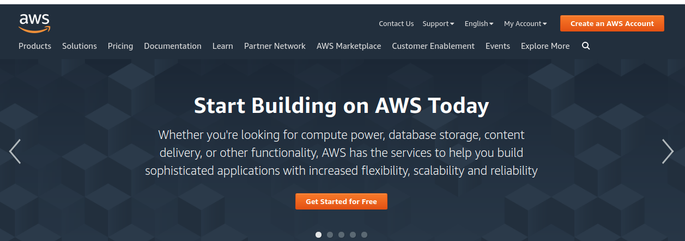 <!-- {"left" : 10.25, "top" : 2.75, "height" : 2.4, "width" : 6.81} -->

---

## Step One: Free Tier Accounts

* Your account is not "Free" but allows you to access some AWS products and services for free
* _If you are new to AWS, read the details of the Free Tier Account_
  - If you use AWS resources that are _not_ in the free tier, you could incur charges
  - __Keeping your resource usage within the limits of the free tier is YOUR responsibility__
  
 <!-- {"left" : 8.72, "top" : 2.11, "height" : 4.66, "width" : 8.21} -->

---

## Step One: Free Tier Usage Rates

* You are allowed a certain amount of free AWS resource usage
* __It is your responsibility to ensure you do not exceed these limits__
  - The instructor will provide pointers on how to ensure your AWS resources in class are cleaned up
  

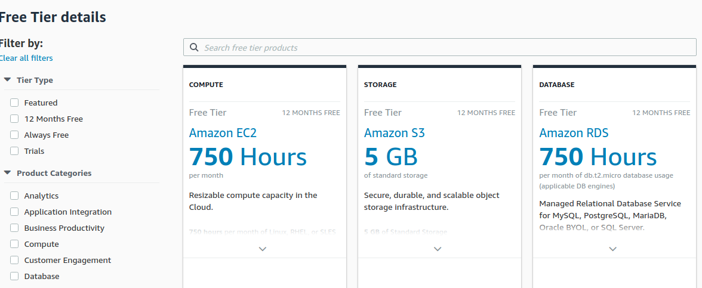 <!-- {"left" : 3.77, "top" : 6.65, "height" : 4.09, "width" : 9.95} -->

---

## Step Two: Administrative User

* This does not apply to those who are using a class provided AWS ID
  - If you are using your own account, you may have already done this
* When you are logging in with your email, you are the root user
  - You should never use this account for day to day operations
  - It should be only used for billing related work
* Instead, AWS recommends setting up an administrative IAM user

 <!-- {"left" : 12.33, "top" : 1.57, "height" : 7.18, "width" : 4.44} -->

---

## Step Two: Creating the User

* Go to the IAM service and create a new user
* Ensure the user has both console and programmatic access
* Set the password to what you want
* Disable the "Require Password Reset" option
* Select "Next"

  <!-- {"left" : 8.78, "top" : 1.99, "height" : 6.34, "width" : 8.06} -->

---
## Step Two: Adding Permissions

* Select the option to `attach existing policies directly`
* Select the `AdministratorAccess` policy
  - You may have to search for it
  
  <!-- {"left" : 4.6, "top" : 5.15, "height" : 5.52, "width" : 8.29} -->

---
## Step Two: Review the User

* Press "Next" until you get to the `Review` screen and ensure your user configuration looks like the screenshot
  - If not, go back and make the necessary changes
  - If it matches, press "Create User"

 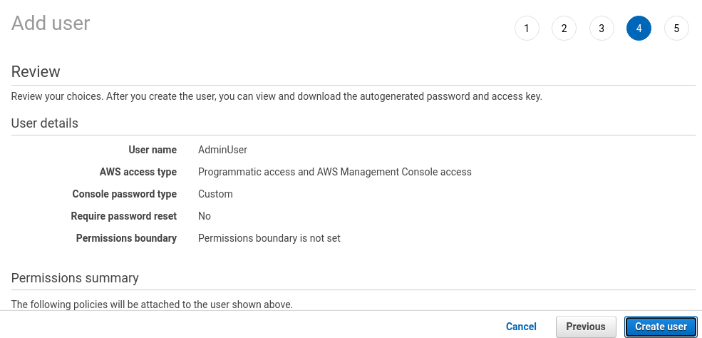 <!-- {"left" : 3.69, "top" : 5.8, "height" : 4.87, "width" : 10.11} -->

---

## Step Two: Success Screen

* Once the user has been created, you should see screen below
  - Bookmark the URL for AWS Management Console access
  - YoHu don't need to download the .csv file, just click on "Close"
  
 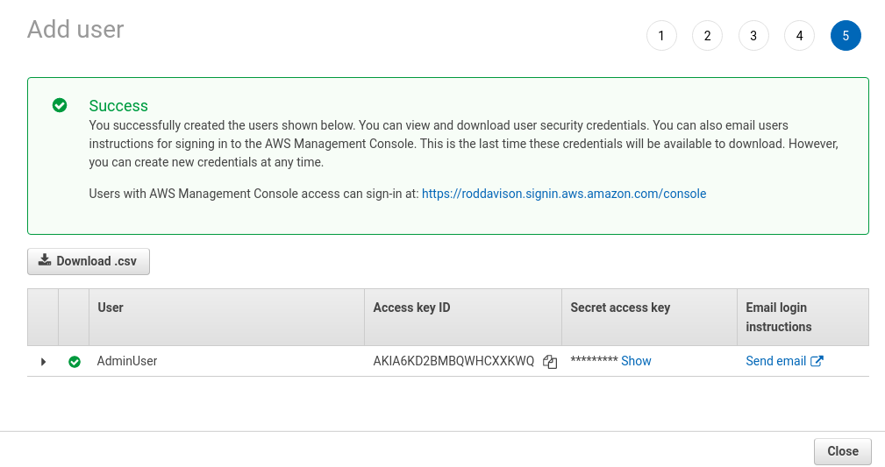 <!-- {"left" : 3.6, "top" : 5.47, "height" : 5.44, "width" : 10.3} -->

---

## Step Two: Login as the Adminstrative User

* Log out as the root user and login with the new Admin account ID
  - Use the URL you bookmarked
  - Your AWS account will show nine digits, the screenshots show my account with an alias I've set up

  <!-- {"left" : 3.97, "top" : 5.93, "height" : 5.05, "width" : 9.56} -->

---

## Step Two: Create a Developer User

* For classwork, we will create a developer account which will not have full administrative access
  - This follows AWS recommendations for best account management practices
* The first few steps are the same as for creating the AdminUser account
  - Ensure that the user has both console and programmatic access
  - Programmatic access is needed to run terraform code
  - Console access allow visual confirmation of the results of running the Terraform code
* I have called this user "Dev"
  - You can either give `Dev` the same administration permissions as your AdminUser 
  - Or you can give the AWS permissions shown on the next slide
  - You can always change this later
---

## Step Two: Restrictive Permissions for Dev

  <!-- {"left" : 2.29, "top" : 2.82, "height" : 8.1, "width" : 12.91} -->

---

## Step Two: Download Access Keys

* You will need to download the .csv files since we need the AWS access keys to set up terraform access to AWS
* Alternatively, you can just copy them from the display and store them yourself in a text file
* Logout of the AdminUser account

 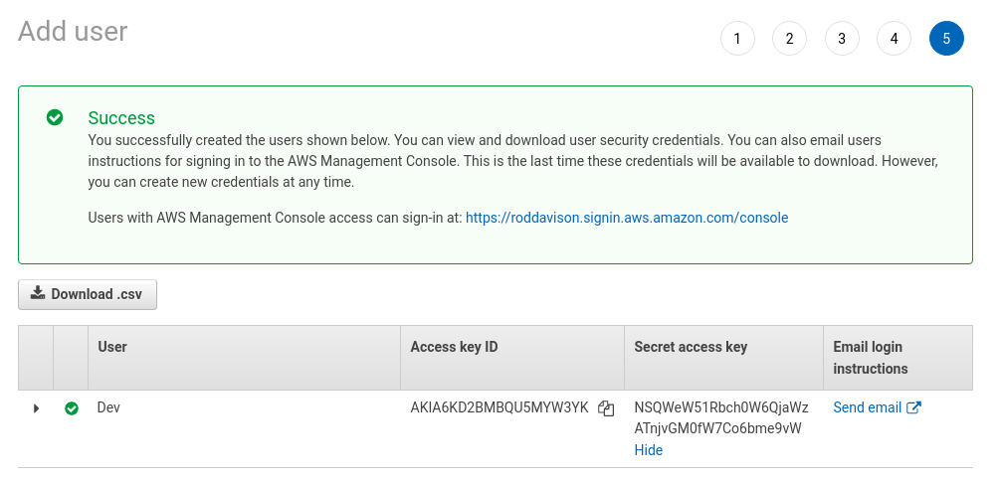 <!-- {"left" : 3.45, "top" : 6.16, "height" : 5.12, "width" : 10.6} -->

---

## Step Three: Download and Install the AWS CLI

* If you don't already have it installed on your local machine, download the appropriate installer from:
  - [cli-download] (https://https://docs.aws.amazon.com/cli/latest/userguide/install-cliv2.html)
  
 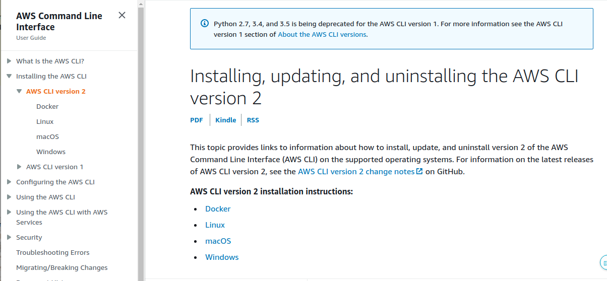 <!-- {"left" : 3.35, "top" : 6.1, "height" : 5, "width" : 10.79} -->

---

## Step Three: Confirm the Installation

* Confirm the installation by using the `AWS --version` command
* If your AWS CLI is installed correctly, then you should see something like this:

  <!-- {"left" : 3.07, "top" : 6.54, "height" : 2.86, "width" : 11.37} -->

---

## Step Four: Setting up the AWS CLI profile

* This step requires that you have the keys you downloaded in the .csv file
  - If you don't have them, or are using a supplied AWS ID, you will need to create new credentials
  - Creating credentials is covered in the next step
* Using the credentials, set up your profile using the `AWS configure --profile <name>`
  - You can leave the default region and output type set to [NONE]
  
 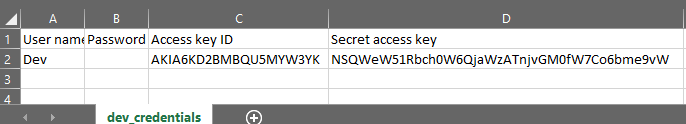 <!-- {"left" : 8.93, "top" : 2.18, "height" : 1.45, "width" : 8.01} -->

  <!-- {"left" : 8.93, "top" : 3.99, "height" : 1.49, "width" : 8.01} -->

---

## Step Four: Verify Credentials

* To ensure you set up your profile correctly, run a command to query your IAM profile
  - Use the command `aws iam get-user --user-name <name> --profile <profile-name>`
  - Use the IAM name for the developer account you created for `<name>`
  - Use the profile name you created locally for `<profile-name>`

  <!-- {"left" : 4.14, "top" : 6.86, "height" : 4.22, "width" : 9.21} -->

---
## Step Five: OH NO! I LOST MY CREDENTIALS

* Your CLI credentials can be replaced at any time
  - This requires console access and IAM permissions
  - You can do this either as the developer user or the admin user
* You should change your credentials if you suspect they are no longer secret

  <!-- {"left" : 10.33, "top" : 1.74, "height" : 6.59, "width" : 6.59} -->

---

## Step Five: Find the Credentials

* Login to the console
* Go to the IAM service and select the user whose credentials are to be changed
* Open up the "Security credentials" tab

 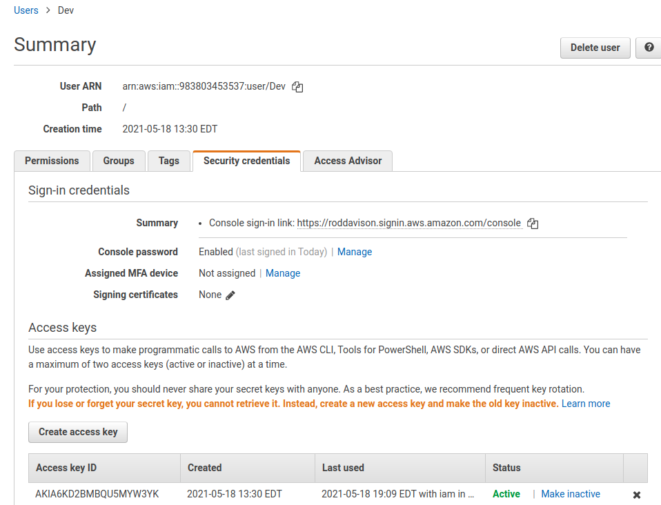 <!-- {"left" : 9.22, "top" : 1.86, "height" : 5.83, "width" : 7.63} -->

---
## Step Five: Invalidate Credentials

* In the access key section, select the "Make inactive" option

 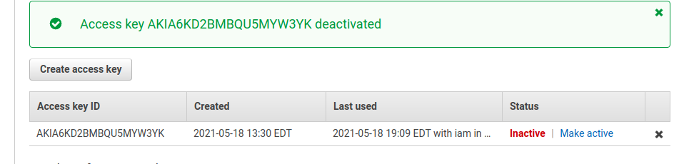 <!-- {"left" : 1.99, "top" : 5.08, "height" : 3.25, "width" : 13.53} -->

---

## Step Five: Delete the Keys

* Click on the black x to delete the deactivated keys

  <!-- {"left" : 1.96, "top" : 4.53, "height" : 3.33, "width" : 13.57} -->

---

## Step Five: Generate New Keys

* Click on the "Create access key" button
* Download the *.csv file and go back and use these to set your AWS CLI credentials

 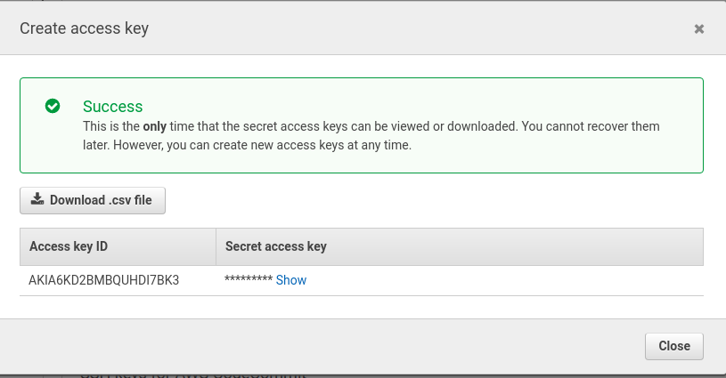 <!-- {"left" : 3.79, "top" : 4.85, "height" : 5.17, "width" : 9.91} -->

---

## Step Six: Install Terraform

* Go to the terraform download site
  - `https://www.terraform.io/downloads.html`
  - Download the correct binary archive for your local system
  - Extract the archive and place the binary on your local path
  

  <!-- {"left" : 9.42, "top" : 1.54, "height" : 5.39, "width" : 7.61} -->

---

## Step Six: Test the Installation

* Run the command `terraform version` to ensure terraform is installed correctly

 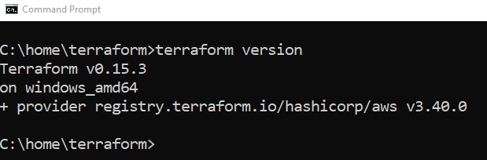 <!-- {"left" : 3.69, "top" : 4.54, "height" : 3.33, "width" : 10.12} -->

---

## Setup Complete

* You are now able to work with terraform and AWS

