# Terraform Language Elements
---
## Plan

* Loops
* If-Statements
* Deployment
* Gotchas
* Other language elements


---
## Declarative Languages

* Declarative languages, like Terraform, normally do not have typical programming constructs like loops

* The challenge is expressing scenarios that require the conditional configuration of resources
  * For example, creating a module that creates resources only for certain users and not others

* Terraform primitives allow certain kinds of operations to allow dynamic and conditional configuration to be done
  * These do not look like standard constructs in programming languages that have the same functionality

--- 
## Loops

* Terraform has several loop constructs to provide looping functionality in different scenarios

  * _count_ parameter: to loop over resources
  * _for_each_ expressions: to loop over resources and inline blocks within a functionality
  * _for_ expressions: to loop over lists and maps
  * _for_ string directive: to loop over lists and maps withing a string

---
##  Loops with "count"

* The looping procedural code is implied and generated under the hood by terraform

* We specify the number of iterations with the count, which often represents the number of copies of a resource
  * The following code creates three instances with the names _VM-0_ , _VM-1_ and _VM-2_

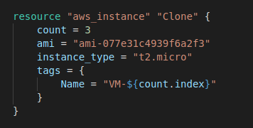

---
## What Count is doing

* Under the hood something like this is conceptually happening:

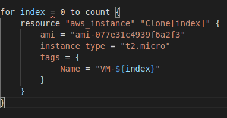  

Notes:

This code is in example 4-1

---
## Array Lookups

* We can supply list of value in arrays
  * Array elements can be reference with array notation
  * The length of the array (also strings and maps) returned from the built-in function _length()_

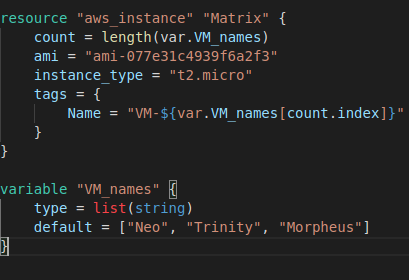

Notes:

This is example 4-2

---
## Arrays of Resources

* Using _count_ on a resource creates an array of resources rather than just one resource
* To get all the users, a "splat" expression is used

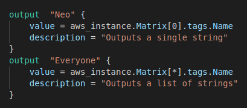

---
## Limitations of Count

* _count_ can loop over resources but not inline blocks

* For example, we cannot iterate over the inline block for `tag` to generate multiple tag blocks dynamically

* Changing the values in a list modifies the created infrastructure

* If we create the infrastructure with this list and iff trinity is removed then the correspondence between the array of resources and the list of names no longer is valid

  * Terraform restores the mapping by recreating the resources
  
Notes: 

This can be demo-ed as part of example 4-2

---

## Limitations of Count

* Using

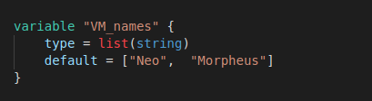

* Then _terraform plan_ produces the following output
  - Trinity is not destroyed, Morpheus is, then Trinity is renamed to Morpheus

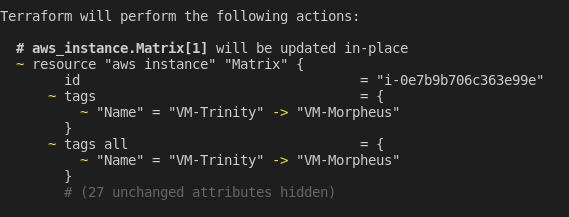  


---
## Lab 4-1

* Please do lab 4-1

---

## Loops with "for_each" Expressions

* The for_each expression allows looping over lists, sets, and maps to create either:
  * multiple copies of an entire resource, or
  * multiple copies of an inline block within a resource
  
* The previous example is now:

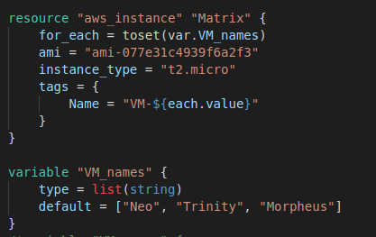


Notes:

This is example 4-3

---
## Use of "for_each"

* The function _toset()_ converts the var.user_names list into a set
  * _for_each_ supports sets and maps only when used on a resource

* When for_each loops each name in the list is made available in the _each_ value
  * The user name will also be available in _each.key_, but this is usually used only with maps of key/value pair.

* Once _for_each_ is used on a resource, it creates a map of resources rather than array of resources
  * This is why we can't use a list with possible duplicates
  * This would lead to duplicate keys
---
## Map Advantages

* Maps do not rely on position like lists do
  * Allows us to remove items from the middle of a collection safely

* Going back to the problem of deleting "trinity" with a map of resources we get:

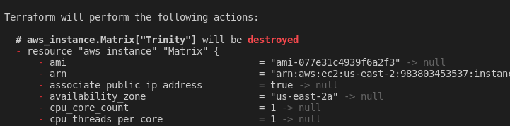

---

## Lab 4-1

* Please do Lab 4-2

---

## Inline Blocks with "for_each"

* We may want to configure, for example, multiple sets of ingress rules from a standard set of configurations like:

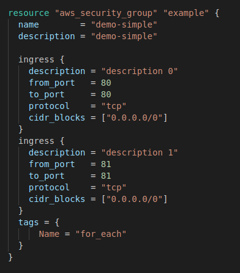

Notes:

This is example 4-4

---
## Reusable Ingress Rules 

* We can define reusable ingress rules, here with local variable which is a list of ingress rule terraform objects

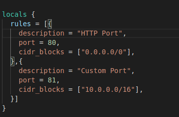

* Implemented as a dynamic block

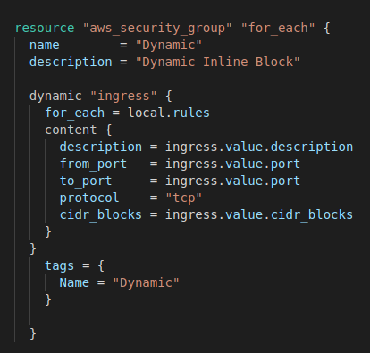

Notes:

This is example 4-5

---

## Lab 4-3

* Please do Lab 4-3

---

## Looping with Expressions

* Terraform allows operations on the data similar to operations in a programming language

* Syntax is:
  ```
  [for < ITEM > in < LIST > : < OUTPUT >]
  ```
* Demonstrated in this code:
  
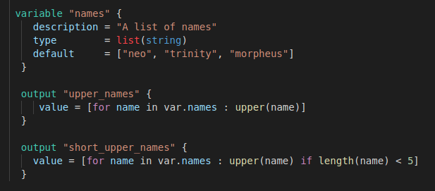
  
* Note that this resembles a "map" operation in a functional programming language

Notes:

This is example 4-6


---
## Working with Map Inputs

* The for expression can loop over a map as well
  ```
  [for < KEY >, < VALUE > in < MAP > : < OUTPUT >]
  ```
* Example of use:

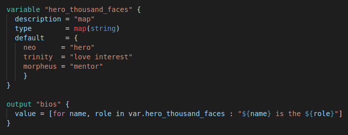

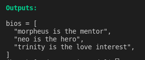
  
Notes:

This is example 4-7

---

### Outputing a Map

* Looping over a list or map can output a map using the syntax:

```
// Loop over a map and output a map
{for < KEY >, < VALUE > in < MAP > : < OUTPUT_KEY > => < OUTPUT_VALUE >}
```

* Revisting the example
  
  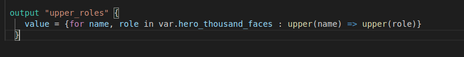
  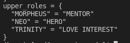
---
## Loops with the "for" String Directive

* String directives allow for-loops and if-statements in strings using a syntax similar to string interpolations
  but instead of a dollar sign and curly braces (${…}), it uses a percent sign and curly braces (%{…})
  * Terraform supports two types of string directives:
    for-loops and conditionals

* For loop syntax (collection is a list or map)
  ```
  %{ for < ITEM > in < COLLECTION > }< BODY >%{ endfor }
  ```
---

## String for loop Example

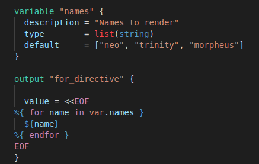  

Notes:

This is example 4-8

---
## Trimming Whitespace

* A strip marker (~) in your string directive consumes all of the whitespace (spaces and newlines) either before the string directive (if the marker appears at the beginning of the string
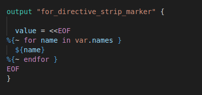
  .png)
---
## Conditionals

* There are also several different ways to do conditionals, each intended to be used in a slightly different scenario:

  * *count parameter*: Used for conditional resources

  * *for_each and for expressions*: Used for conditional resources and inline blocks within a resource

  * *if string directive*: Used for conditionals within a string

---
## Conditionals with "count"

* We can define a Boolean variable as our test condition "enable_autoscaling"
* We can set the count on a resource to "0" which means that resource is not created
* Terraform allows ternary conditionals of the form:
  ```
  < CONDITION > ? < TRUE_VAL > : < FALSE_VAL >
  ```
* This allows for conditional creation of resources:
  
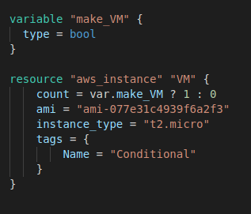
  
Notes:

This is example 4-9

---

## Working with Non-boolean

* The previous example worked because we could define a boolean variable
  * However, we may have to decode information in a string to make a decision

* Example: We want to set a cloud-watch alarm that triggers when CPU credits are low
  * However, CPUcredits only "txxx" instances
  * Larger instance like m4.large do not return a CPU credit metric and will always appear to be in an INSUFFICIENT_DATA state
  * We want the metric to apply to only txxx instance but we don't want to create a special Boolean


---
## Working with Non-boolean

* The solution is to utilize the fact that first letter of the instance type should be a "t"


* The format function to extract just the first character from var.instance_type.
  * If that character is a "t" (e.g., t2.micro), it sets the count to 1;
  * otherwise, it sets the count to 0
  * This way, the alarm is created only for instance types that actually have a CPUCreditBalance metric.

---
## Zero-Downtime Deployment

* The challenge is to update a cluster without causing downtime for users
  * How do you deploy a new Amazon Machine Image (AMI) across the cluster?

* If we are deploying a new version of our app, we don't want there to be downtime as we switch over

* We full test and deploy our app in a test are to ensure it is working before we make the transition

* We then deploy the application into a new launch configuration which will be the target of the auto-scaling group

* However the challenge is switching launch configurations, if destroy the old one, then we have downtime while the new one is being created

---
## Zero-Downtime Deployment

* The way to accomplish that is to create the replacement ASG first and then destroy the original one

* Configure the name parameter of the ASG to depend directly on the name of the launch configuration
* Each time the launch configuration changes (which it will when you update the AMI or User Data), its name changes, and therefore the ASG's name will change, which forces Terraform to replace the ASG
* Set the create_before_destroy parameter of the ASG to true, so that each time Terraform tries to replace it, it will create the replacement ASG before destroying the original
* Set the min_elb_capacity parameter of the ASG to the min_size of the cluster so that Terraform will wait for at least that many servers from the new ASG to pass health checks in the ALB before it will begin destroying the original ASG

---
## Zero-Downtime Deployment 1

* Initially, you have the original ASG running v1 of your code
  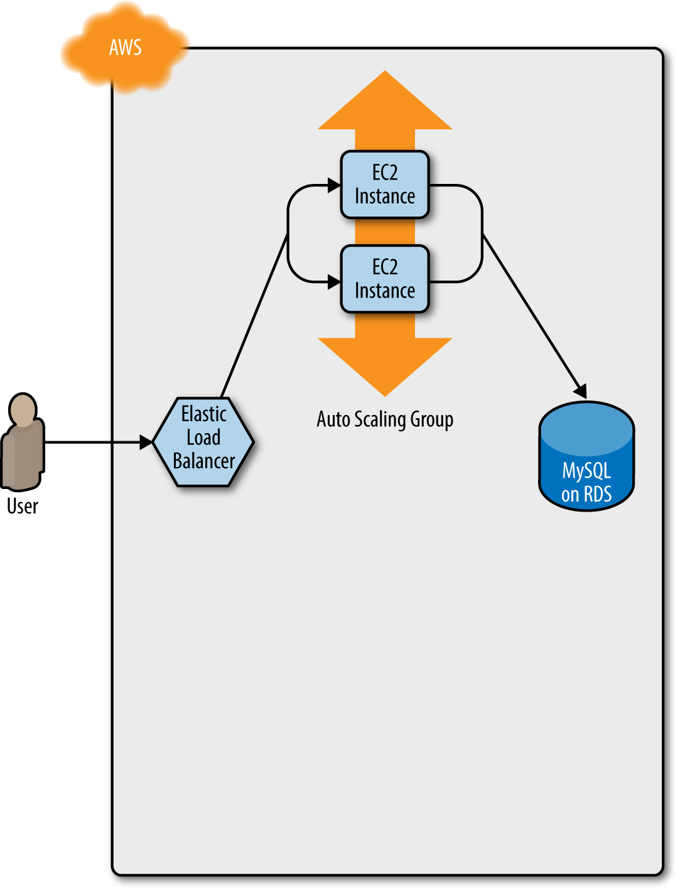

---
## Zero-Downtime Deployment 2

* Terraform begins deploying the new ASG with v2 of your code
  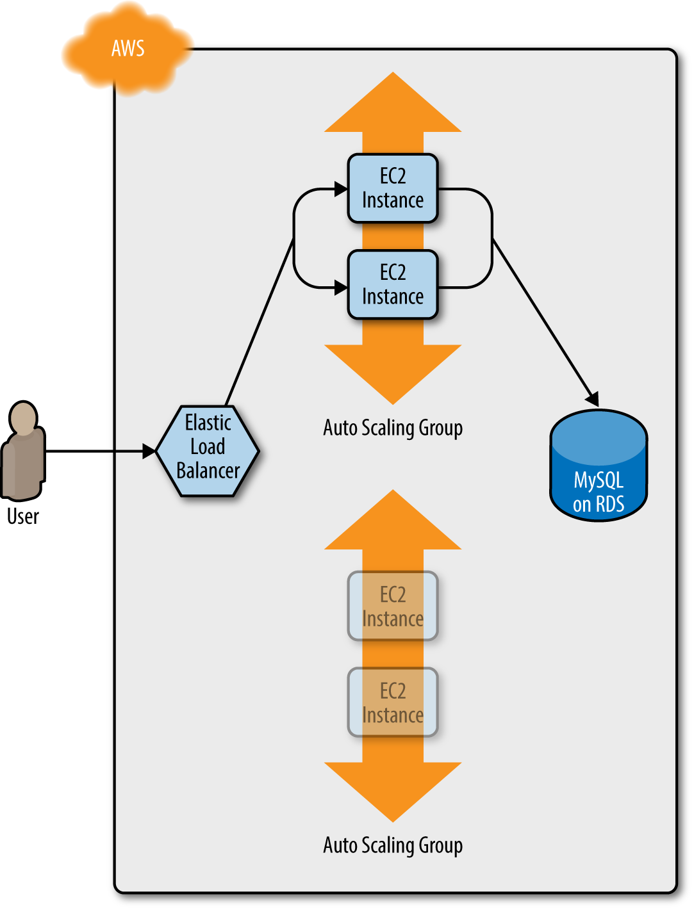

---
## Zero-Downtime Deployment 3

* The servers in the new ASG boot up, connect to the DB, register in the ALB, and begin serving traffic
  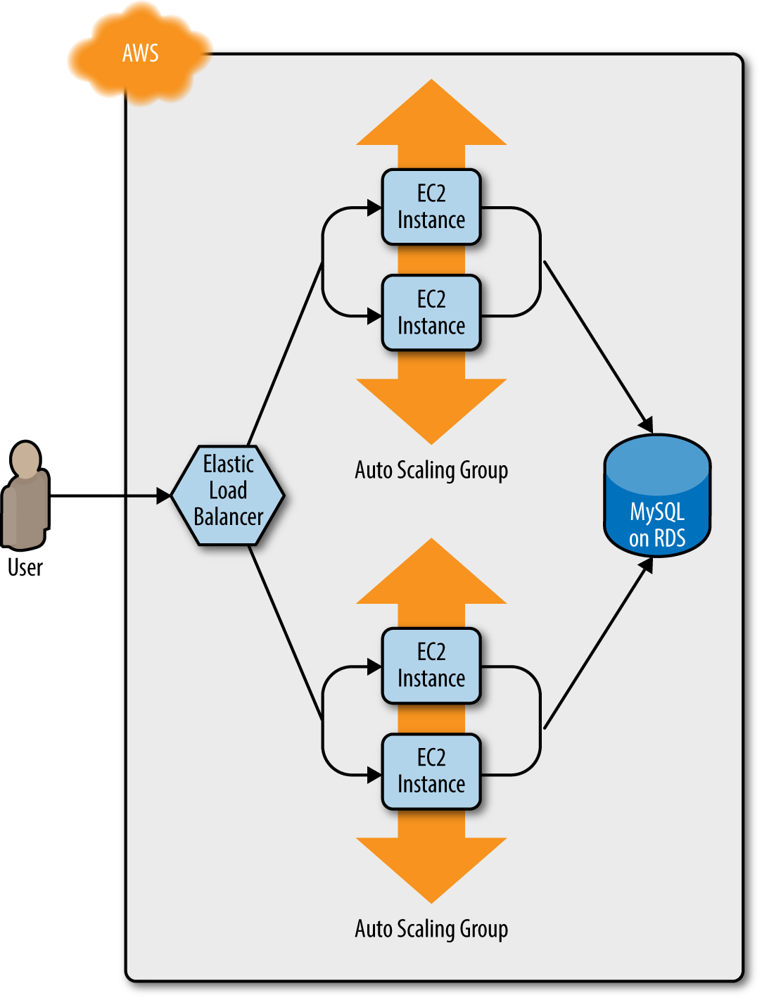

---
## Zero-Downtime Deployment 4

* The servers in the old ASG begin to shut down
  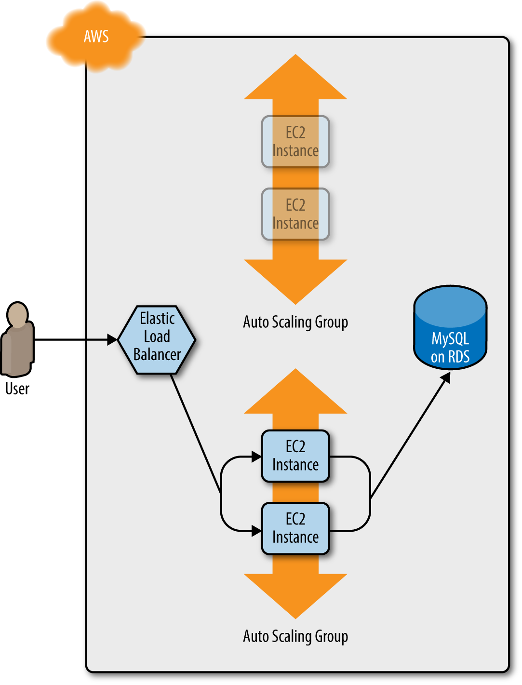

---
## Zero-Downtime Deployment 5

* Now, only the new ASG remains, which is running v2 of your code
  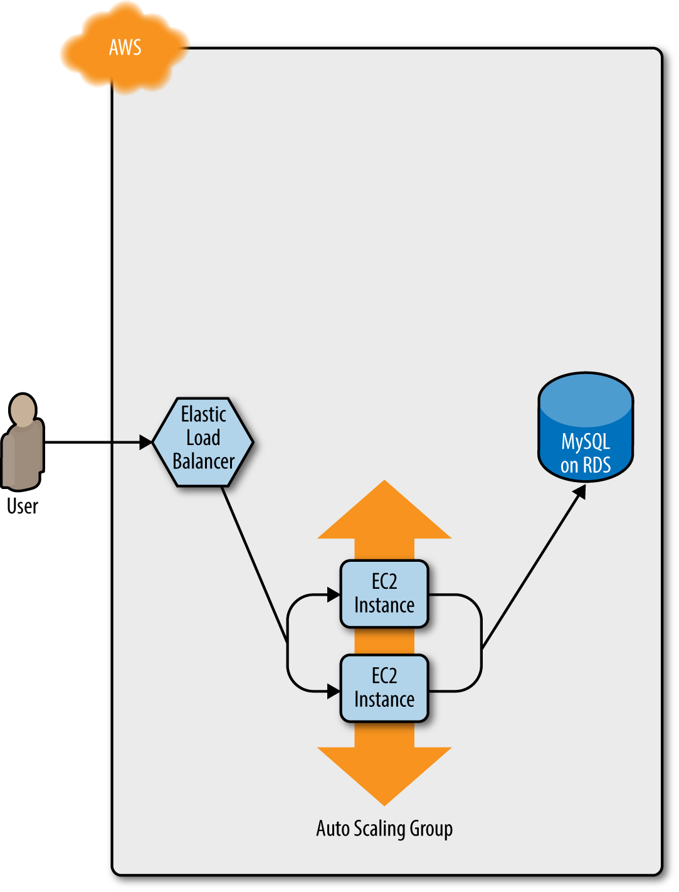

---

## Terraform Gotchas

* We now take a step back and point out a few gotchas

* count and for_each have limitations
  * You cannot reference any resource outputs in count or for_each
  * You cannot use count or for_each within a module configuration

* Zero-downtime deployment has limitations
  * it doesn't work with auto scaling policies
  * it resets your ASG size back to its min_size after each deployment

* Valid plans can fail
  * Terraform only looks at resources in the state file and doesn't take into account other resources
  * Plans that look good may fail because of resource conflicts
  * Ideally infrastructure should only rely on Terraform
  * Import existing infrastructure
---
## Terraform Gotchas

* Refactoring can be tricky
  * Changes can have major effects
  * Changing the name parameter of certain resources will delete the old version of the resource and create a new version to replace it (immutable infrastructure)

* Refactoring points:
  * Always use the plan command
  * Create before destroy
  * Keep in mind that changing identifiers requires changing state
  * Some parameters are immutable so changing them requires replacing the resource

---

## Terraform Gotchas

* Eventual consistency is consistent…  eventually

* APIs for some cloud providers, such as AWS, are asynchronous and eventually consistent
  * Asynchronous means that the API might send a response immediately, without waiting for the requested action to complete
  * Eventually consistent means that it takes time for a change to propagate throughout the entire system
  * For some period of time, you might get inconsistent responses depending on which data store replica happens to respond to your API calls

* Generally, re-running _terraform apply_ solves the problem
---


