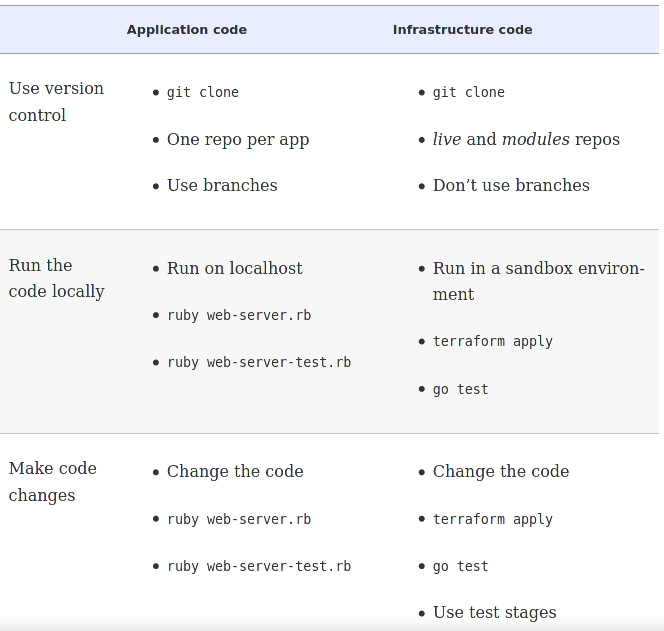
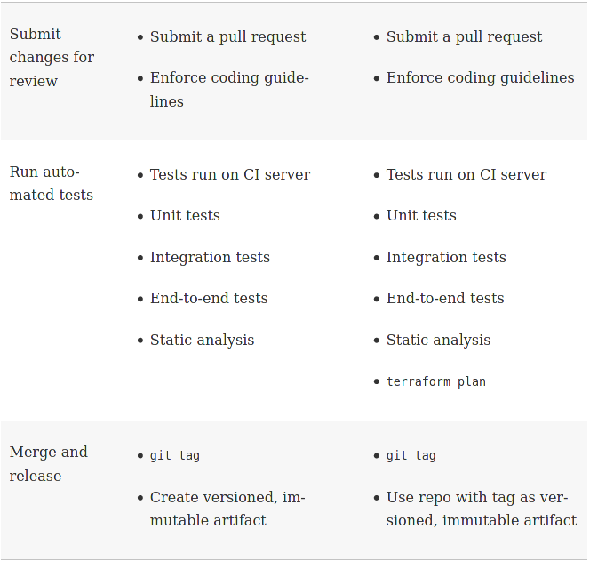
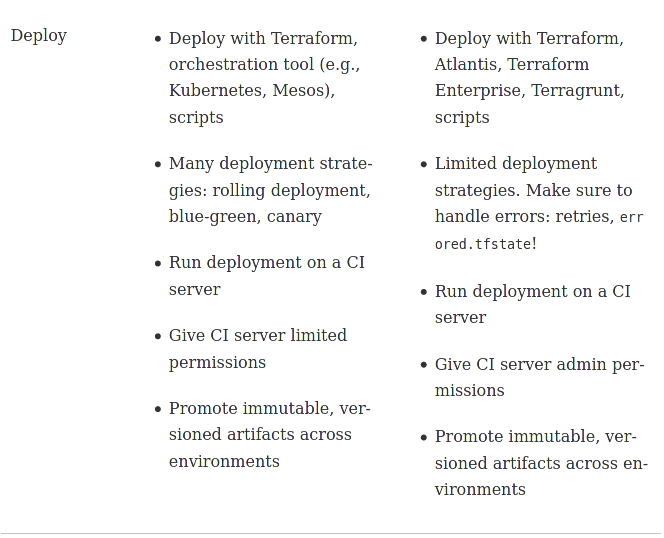

# Using Terraform as a Team
---

## Our Plan

* Adopting infrastructure as code in a team environment

* A workflow for deploying application code

* A workflow for deploying infrastructure code

* Putting it all together

---

## Adopting IaC in a Team

* Moving to IaC is not just about using IaC tools
* Requires an organizational cultural shift
  * Changing "how we do things around here"
* Provisioning and deployment are often:
  * Tied to physical infrastructure needs
  * Standardized process that accommodate the physical environment's needs
* This creates a mindset that is usually not portable to IaC
  * Net result is that many of the benefits of IaC are never realized

*A fool with a tool is still a fool - Grady Booch*

---
## IbH (infrastructure by Hand) to IaC

* IbH to IaC requires changing the culture and processes of the team

* This can be very difficult in large organizations
  * Often there are governance issues and compliance issues
  * Users of IaC may need to interact with legacy processes designed to support IbH
  * May have to deal with other stakeholders, eg. security teams, that only know how to work with IbH

* Everyone is different - no "one size fits all" - every team has different challenges

* Some common basic steps
  * Convince the boss (management)
  * Work incrementally
  * Give the team time to learn
---
## Convince The Boss

* Management perspective is a cost/benefits analysis, for example:

* **Skills gap**: Team has to learn and master new skills - production code should not be a learning environment
* **New Tools**: Operational environment has to transition without "glitches" - does a new tool introduce risks?
* **Change in mindset**: We would have to replace what is working now and what people know how to do - "It ain't broke so it doesn't need fixing"
* **Opportunity cost**: What do we have to stop working on to transition to IaC?
* **Future Implications**: Will this be a viable long term strategy?

---
## Opportunity Costs

* The concern is that implementing IaC diverts resources from high priority projects with no downstream benefits

* The case has to be made that short term opportunity costs are an investment

  * Can eliminate current pain-points in IbH in current projects
  * Can reduce recurring issues that impact projects
  * Can improve project metrics (time, cost, agility)

* For example: pain point is recurring manual errors in deployment and resulting delays for debugging
  * Identify how IaC can eliminate that pain point and the resulting cost and time savings that would result
---
## Work Incrementally

* Trying to implement IaC in an all or nothing approach never ends well
  * The same is true when implementing any new process or technology (eg. DevOps)

* Changes to new tech is done incrementally
  * Each increment is a small manageable transition
  * Often focused on a single component
  * Each increment must provide value or measurable benefits
    * Eg. Automating one step in the deployment

* A transition to IaC is done in small steps that build on each other
  * The whole process is planned
  * Lessons learned at each step are used to guide future steps
---
## False Incrementalism

* Occurs when a huge project is broken up into small steps

* No return on investment until the last step is completed

* Often results in a "big bang" last step where serious issues become apparent

* The increments themselves are often to specialized to be reused

*A complex system that works in invariably found to have evolved from a simple system that works… A complex system designed from scratch never works and cannot be patched up to make it work. You have to start over, beginning with a working simple system. - Gall*

---
## Chose your Target

* A good starting strategy is to target a single concrete problem

* Fixing a specific pain point caused by a deployment issue builds momentum and credibility

* Each solved problem shows tangible benefits that speak right to the cost/benefits analysis

* Don't just fix the problem, demonstrate the benefits to management
  * You are making a business case argument for IaC

---
## Time for Team to Learn

* Team members need time to develop IaC skills and knowledge

* Unless the whole team develops skills together:
  * IaC expertise is concentrated in a few "Gurus"
  * Everything works and everyone is happy until a failure occurs
  * The people tasked with fixing the failure may not be gurus
  * They tend to give up on Terraform and go back IbH because that is something they know how to use to fix the issue
  * They can't diagnose Terraform problems or develop a fix for IaC
  * Manual configuration now conflicts with IaC so IaC is now avoided

* Eventually IaC just fades away and the team goes back to IbH
  * Every time this cycle repeats, the organization moves further away from IaC
---
## Learning Strategies

* People learn in different ways
  * The team has to provide learning resources

* A practice learning environment is critical
  * production environments are not for "trying stuff out"

* Using Terraform effectively may require skills with other tools. Eg:
  * Cloud skills: AWS, Azure etc.
  * Configuration tools: Ansible, Chef, etc.
  * Repository tools: git, etc.
  * Development tools: command line skills, IDE tools, utilities like diff, grep and others

* Feedback is necessary - assessment tests and evaluations

* Group sessions - some people learn best when learning with others

---
## The Application Deployment Workflow

* Generic DevOps type workflow for deploying applications:
  * Use version control
  * Run the code locally
  * Make code changes
  * Submit changes for review
  * Run automated tests
  * Merge and release
  * Deploy

* There exist variations on this flow, but they tend to be similar to this general model

---
## The Application Deployment Workflow

* Version control
  * An essential best practice
  * **Everything** is placed in version control
  * Branching and isolation policies are supported

* Run code locally
  * We think "functionality first"
  * Local often means an isolated development environment
  * Unit testing is ubiquitous

* Make code changes
  * Code is refactored
  * All changes are continuously tested
---
## The Application Deployment Workflow

* Submit changes for review
  * Can be automated (eg. SonarQube)
  * Gets "other eyes" on the code
  * Code reviews, walk-throughs, "what if" exploration
  * Conformance to code standards and style

* Run automated tests
  * These are generally integration tests
  * Run after build using fully unit tested code
  * Often called "acceptance tests"
  * Usually run automatically by a "continuous integration" tool like Jenkins
  * May include performance testing
---
## The Application Deployment Workflow

* Merge and Release
  * Often involves moving it to a staging environment or deployment environment or repository
  * May also require acceptance review

* Deployment
  * Can involve deployment tools (like Terraform!)
  * Containerization with Docker and other tools
---

## Deployment Strategies

* There are a number of deployment strategies in use:
  * Rolling deployment with replacement
  * Rolling deployment without replacement
  * Blue-green deployment
  * Canary deployment

* Deployments are automated
  * All deployments are run consistently
  * Permissions and restrictions are enforced
  * Avoid manual labor and errors
---
## Deploying Infrastructure Workflow

* The infrastructure code workflow superficially looks very much like the App workflow:
  * Use version control
  * Run the code locally
  * Make code changes
  * Submit changes for review
  * Run automated tests
  * Merge and release
  * Deploy

* The differences are:
  * Infrastructure deployment is more complicated
  * The techniques are not as well understood.
---

## Use Version Control

* All infrastructure should be in version control

* Extra Requirements:
  * Separate **live** and **modules** repositories
  * Golden rule of Terraform
  * Additional caution with using branches
---
## Library Team Development Pattern

* Designated team specializes in creating reusable, robust, production-grade modules.
  * Builds a library of modules that are fully compliant to requirements, documented, tested and reusable
  * Similar to micro-service pattern

* Ops teams can create infrastructure quickly by using the common company modules
  * Supports maintainability since deployments have common components
  * Ops can focus on architectural issues instead of low level configurations
---
## Golden Rule of Terraform

* Sanity Check:
  * Go into *live* repositories and run _terraform plan_ on random folders
  * It should report up to date infrastructure

* Small changes can be corrected, usually because someone "tweaked" something

* Major differences are an indicator that things could get very bad, very fast

* The golden rule:
  * *The master branch of the live repository should be a 1:1 representation of what's actually deployed in production*

---
## The Trouble with Branches

* Terraform backends ensure that different executions of _terraform apply_ do not create race conditions

* Changes on different branches of the source repository can cause race conditions
  * Deploying from a _test_ branch may conflict with a configuration being deployed from a _dev_ branch

* Always have a single designated deployment branch.
  * Changes have to be merged into the deployment branch before running a deployment
  * Deployments can be made from other branches only into isolated sandbox environments

---
## Run Code Locally

* To test code during development
  * Isolated sandbox environments are needed
  * These should be isolated from each other and other environments

* In AWS, some ways to do this:
  * Have an separate AWS account for developers
  * Have designated VPCs for development
  * Utilize IAM policies to control who has access to what infrastructure

* Plan out the local dev environment before starting work

---

## Make Code Changes

* Deploy frequently, fail early

* Ensure each change is not just deployed but also tested
  * Infrastructure tests typically take longer

* Plan out how to shorten the test cycle
  * For example, don't destroy resources at the end of a test that are not going to change
  * Especially important when some assets take a long time to spin up
---

## Submit Changes for Review

* There should exist a standard on what constitutes a deliverable for each item under development

* This will usually cover:
  * Documentation required
  * A suite of automated tests
  * A conformant file layout
  * A style guide

* This standard will evolve as needed
  * To paraphrase Martin Fowler:
  * *Average IaC developers can write Terraform configurations that `terraform apply` can read, but great Terraform developers write configurations that other developers can read and easily understand.*

---

## Documentation

* Terraform HCL is designed to be self-documenting, but we also need to know:
  * Why certain design choices were made
  * Why specific resources were chosen
  * Guidelines for making changes (*don't change this or everything will break*)

* A useful __README__ file should:
  * Explain what the code does
  * Why it exists
  * How to use it
  * How to modify it
  * Who is responsible for it
  * Where to look for more information

---
## Other Documentation

* In the Terraform code:
  * Liberal use of comments
  * Use _description_ parameters in variables

* Example code to show how the module is intended to be used

* Tutorials, design documents etc.

* Think in terms of
  * "What would someone new need to know in order to start supporting, modifying and maintaining this infrastructure code."

---

## File Layout

* As covered in earlier modules, a well-designed and consistently used file layout has a number of advantages
  * It supports modularity and isolation
  * It creates cohesive code chunks that can be modified with reduced chance of having side effects on other code
  * It creates a logical partitioning of code into "swappable" segments

* Standardized layouts allow make a configuration easy to understand
  * Makes for improved ease of support
  * Easier to on-board new team members and get them up to speed on the code base

---
##  Automated Testing

* Covered in another module

* CI servers should ensure tests are run on every significant change

* Terraform practices
  * Always run _terraform plan_ before running _terraform apply_
  * Resolve *any* unexpected results from running _plan_
  * Diff output from the _plan_ command can be saved for analysis
  * Remember that saved plan files may contain secrets and need to be stored securely

---
## Merge and Release

* Once all the reviews and tests have been signed off, the code is moved to the release branch

* The release code version is tagged so that the release configuration can be recreated at any time in the future
  * This allows copies of the release environment to be spun up for testing
  * It allows creation copy of the current environment as a baseline starting point for enhancements

* The tagged release can be archived
  * To document regulatory compliance
  * To provide disaster recovery
---
## Deployment Strategies

* There do not exist the range of options that we have with application rollouts
  * We cannot do automatic rollbacks

* There are Terraform errors that can affect our rollout
  * Transient errors that can be resolved with retries
  * Terraform state errors - for example, a network failure during a _terraform apply_
  * Crashes can also leave locks in an invalid state
---
## CI Security Practices

* If a CI server like Jenkins is being used:
  * Do not allow access to the server from the public Internet
  * Lock the server down with server hardening practices
  * Do not give the server admin credentials but require a human to authorize temporary credentials (AWS IAM role for example)
---

## Putting it All Together

---
## Putting it All Together

---
## Putting it All Together

---