# Reusable Infrastructure with Modules
---

## The Plan

* Module basics

* Module inputs

* Module locals

* Module outputs

* Module gotchas

* Module versioning
---
## Multiple Environments
* Cloud advantage: create multiple copies of the same environment
  * Production, Development, Test
  * Environments need to be similar if not identical
* We don't want to be able to re-use Terraform code across environments
  * DRY Principle: "Do not repeat yourself"
  * Modules allow us to reuse Terraform code
    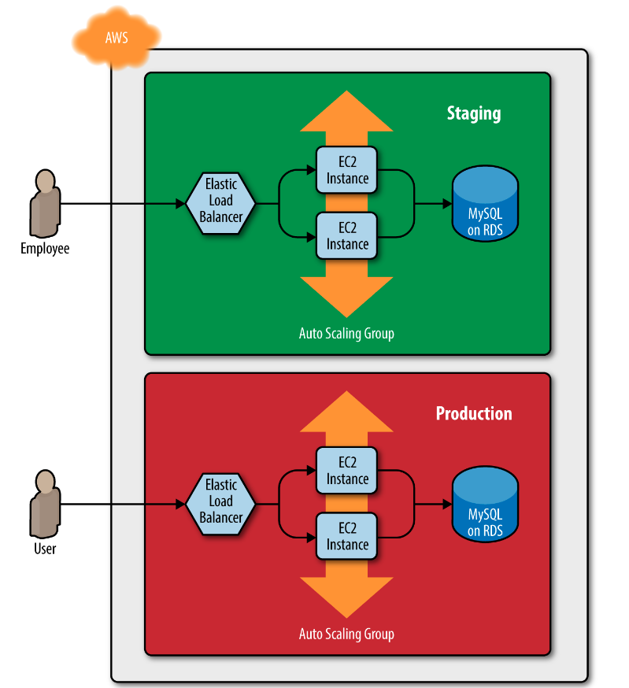

---
## Module Basics

* Any folder containing terraform files is a module
  * There are no special declarations or syntax required
  * Modules are containers for multiple resources that are used together
  * Modules are the primary strategy used to package and reuse terraform resources

* Every terraform configuration has at least one module
  * It is referred to as the "root" module
  * It consists of the terraform files in the main working directory

* Modules (usually the root) may import other or "call" other modules
  * Modules that are being called are called "child" modules

---

## Calling Modules Example

* If we are creating the same resource in multiple configurations, we can put it into a module
  * In this example, the demo project uses a module in the _modules/EC2_ folder to create an EC2 instance to function like a webserver
  * The folder structure looks like this:


Notes:

This is example 5-1

---
## Calling Modules Example

* The EC2 Module code is familiar

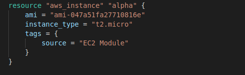


* Calling it as a module is straightforward

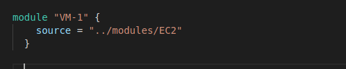  

* The problem is that this module is not easily reusable because the _ami_ and _instance type_ are hard-coded into the module code
  * We need to parameterize the module to make it reusable
  
---
## Module Inputs

* Following the example of calling functions in a programming language, we want to be able to pass values to a module as parameters

* In the webserver example, we want to parameterize the module code by adding three variables:

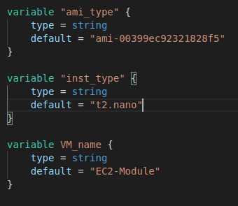


Notes:

This is example 5-2

---

## Inside the EC2 Module

* We can parameterize the EC2 definitions

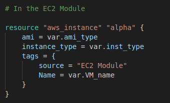

---

## Passing Parameters

* We can pass the values to the variables when the EC2 module is called

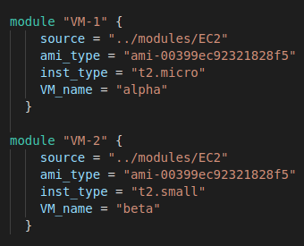

Notes:

This is example 5-3

---

## Variable Passthroughs

* We don't want to have to hardcode the parameters so we can use root module variables to pass the values through

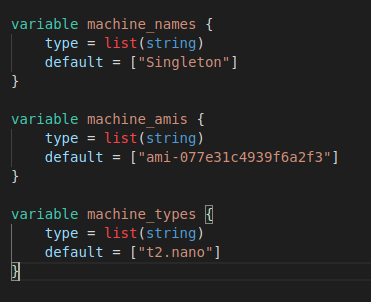

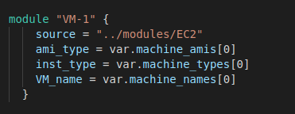

---

## Using "count" with Modules

* We can create multiple copies of modules with count

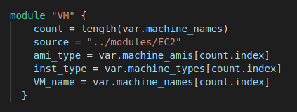

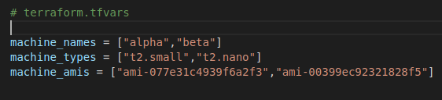

Notes:

This is example 5-4

---

## Combining Modules

* Generally, we need to use more than one module because we need more than one type of resource
* In addition to the Ec2 instance module, we define a security group module

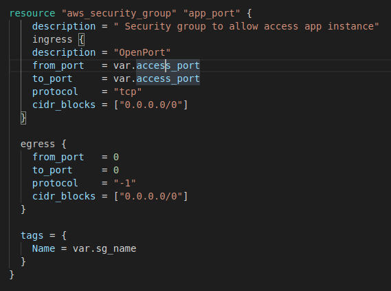

Notes:
This is example 5-6

---

## Combining Modules

* The security group has its own variables and called just like the EC2 module

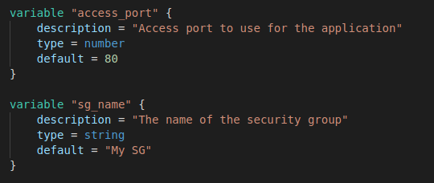

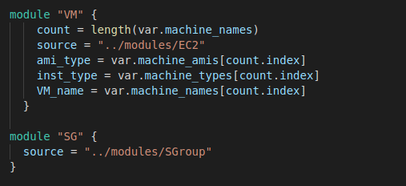

---

## Module Return Value

* To use the security group created by the SG module, we need to be able to reference it
* An output variable is passed back to the calling module with the id of the security group

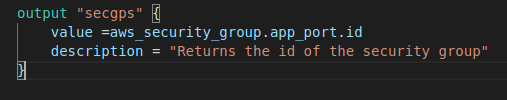

* And an input variable for the EC2 module so it can be passed the security group reference

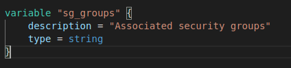

* And add the reference to the resource definition

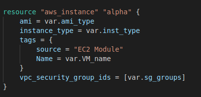


Notes:

This is example 5-7

---

## Module Return Value

* We can reference the value returned by the module with the following syntax
  - Reminder that the module name is the value we create when we *call* the module

  ```
  module.< MODULE_NAME >.< OUTPUT_NAME >
  ```

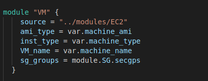

---

## Module Gotchas - Paths

* The hard-coded file paths are interpreted as relative to the current working directory
  * The problem is that this will not work if we are working with a module in a different directory

* To solve this issue, you can use an expression known as a path reference, which is of the form path.<TYPE>. Terraform supports the following types of path references:
  * `path.module`: Returns the file system path of the module where the expression is defined
  * `path.root`: Returns the file system path of the root module
  * `path.cwd`: Returns the file system path of the current working directory, usually the same as path.root
---
## Module Path

* In this example, the template file is located with a path relative to the module, but if we hard-code the path, it will be interpreted as relative to the current working directory
  * By using the `path.module` construct, we ensure the file reference remains relative to the module

  ```
  data "template_file" "user_data" {
    template = file("${path.module}/user-data.sh")

    vars = {
      server_port = var.server_port
      db_address  = data.terraform_remote_state.db.outputs.address
      db_port     = data.terraform_remote_state.db.outputs.port
    }
  }
  ```
---

## Module Gotcha - Inline Blocks

* The configuration for some Terraform resources can be defined either as inline blocks or as separate resources
  * When creating a module, you should always prefer using a separate resource

* Inline block example

  ```
  resource "aws_security_group" "alb" {
    name = "${var.cluster_name}-alb"

    ingress {
      from_port   = local.http_port
      to_port     = local.http_port
      protocol    = local.tcp_protocol
      cidr_blocks = local.all_ips
    }

    egress {
      from_port   = local.any_port
      to_port     = local.any_port
      protocol    = local.any_protocol
      cidr_blocks = local.all_ips
    }
  }
  ```
---

## Separate Resource

* You should change this module to define the exact same ingress and egress rules by using separate aws_security_group_rule resources

  ```
  resource "aws_security_group" "alb" {
  name = "${var.cluster_name}-alb"
  }

  resource "aws_security_group_rule" "allow_http_inbound" {
    type              = "ingress"
    security_group_id = aws_security_group.alb.id

    from_port   = local.http_port
    to_port     = local.http_port
    protocol    = local.tcp_protocol
    cidr_blocks = local.all_ips
  }

  resource "aws_security_group_rule" "allow_all_outbound" {
    type              = "egress"
    security_group_id = aws_security_group.alb.id

    from_port   = local.any_port
    to_port     = local.any_port
    protocol    = local.any_protocol
    cidr_blocks = local.all_ips
  }
  ```
---

## Inline Blocks

* Using a mix of inline blocks and separate resources may cause errors where routing rules conflict and overwrite one another
  * Use one or the other
  * When creating a module, you should always try to use a separate resource instead of the inline block
  * This allows for more flexible modules

* For example, changing a security group rule to allow a testing port is easier to do with a separate resource than having to edit inline blocks

  ```
  resource "aws_security_group_rule" "allow_testing_inbound" {
    type              = "ingress"
    security_group_id = module.webserver_cluster.alb_security_group_id

    from_port   = 12345
    to_port     = 12345
    protocol    = "tcp"
    cidr_blocks = ["0.0.0.0/0"]
  }
  ```
---
## Module Versioning

* If the staging and production environment point to the same module folder, any change in that folder will affect both environments on the very next deployment
  * This creates a coupling between environments and modules that can cause problems

* To solve this problem, we use a standard build management technique of using versions
  * As changes are made to a module, releases or versions of that module are published
  * Part of the configuration of any Terraform configuration plan is identification of which version of a module to include

---

## Module Versioning Layout

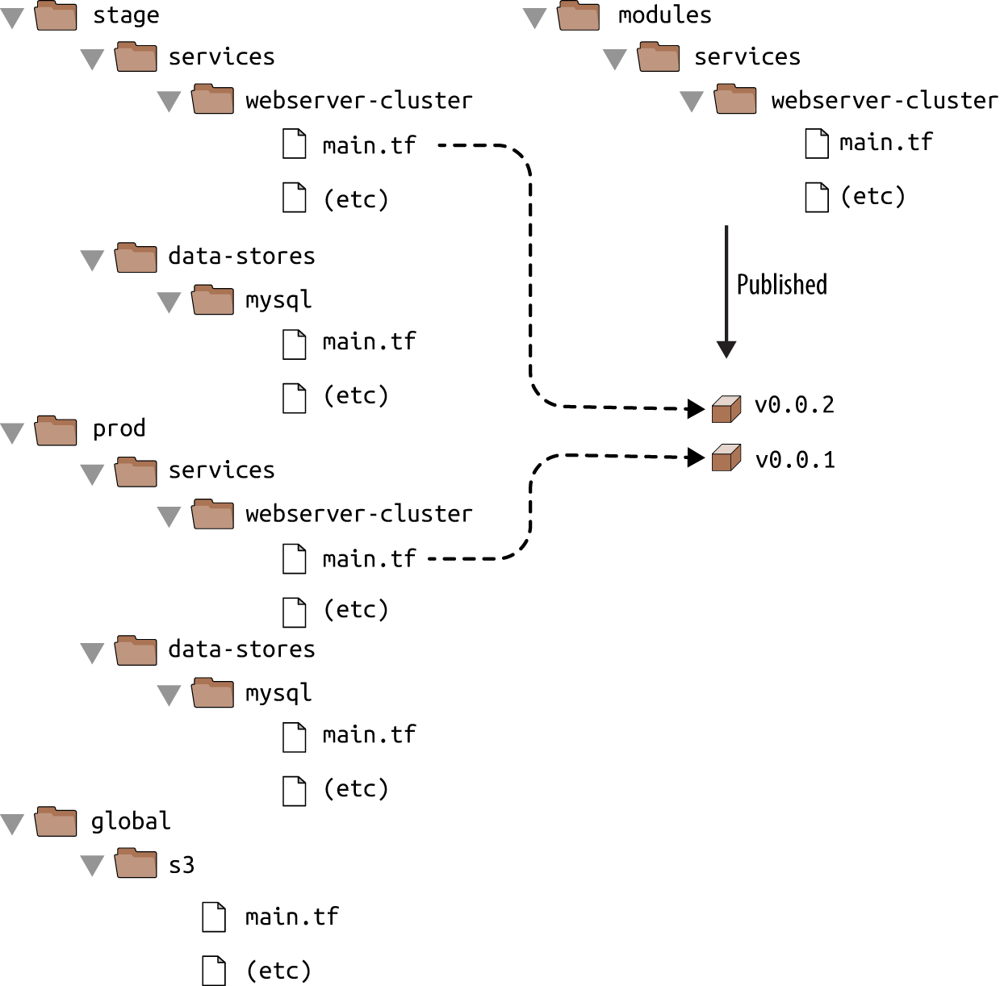

---
## Module Versioning

* An effective strategy is to use a repository tool like git and GitHub to publish releases of a module
  * Then the appropriate "release" of a module can be used

  ```
  module "webserver_cluster" {
  source = "github.com/foo/modules//webserver-cluster?ref=v0.0.1"

  cluster_name           = "webservers-stage"
  db_remote_state_bucket = "(YOUR_BUCKET_NAME)"
  db_remote_state_key    = "stage/data-stores/mysql/terraform.tfstate"

  instance_type = "t2.micro"
  min_size      = 2
  max_size      = 2
  }
  ```
---

## Semantic Versioning

* A common versioning scheme is "semantic versioning"
  * The format is MAJOR.MINOR.PATCH (e.g., 1.0.4)
  * There are specific rules on when you should increment each part of the version number

* MAJOR version increments when you make incompatible API changes

* MINOR version increments when you add functionality in a backward-compatible manner

* PATCH version increments when you make backward-compatible bug fixes

---
