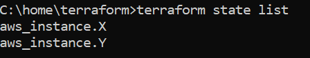
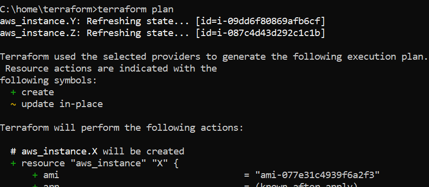

# Terraform State

---

## Module Topics

* Understanding terraform state
* Managing state with terraform state commands
* Local state backend risks
* Using workspaces to multiple configurations
* Remote backends - using AWS S3
* Migrating state backends

---
## What Is Terraform State?

* Terraform state refers to the record terraform keeps of the resources it has created
* The state file:
  * Creates a mapping between what was specified in the *tf files and deployed AWS resources
  * Stores metadata and configuration information
* When _terraform plan_ is run, it does the following
  * Reads all of the *.tf files in a directory
  * Updates the state information to record modifications from the *.tf files
  * Queries AWS to get a description the current state of the deployed resources
  * Creates a plan to modify the AWS resources to conform to the state descriptions
* Terraform cannot see or modify AWS resources that are not in its state file

---
## Terraform Planning

* When _terraform plan_ is run
  * All files in the current directory with the .tf extension are read and their contents merged
  * Terraform develops a plan for implementing the specified configuration
* A directed acyclic graph of operations is created to ensure that all dependencies are resolved
  * The resources may need to be created in a specific order
* Thus means we can sort organize our code anyway we want
* However, there is usually a standard way to do this - i.e. the canonical form introduced in the last module

---
## Terraform is Declarative

* Declarative means that you only describe the final state that you want your AWS resources to be in
* After you run _terraform apply_ you will see the output in _terraform.tfstate_

---

## Meaning of the "terraform.tfstate" on Previous Slide

* Resource with _type aws_instance_ and _name example_ corresponds to an EC2 Instance in the AWS account with ID i-00d689a0acc43af0f

* Every time you run Terraform
  * it can fetch the latest status of this EC2 Instance from AWS
  * compare that to what's in your Terraform configurations
  * determine what changes need to be applied

* Thus, the output of the _terraform plan_ command is a diff
  * between the code on your computer and
  * the infrastructure deployed in the real world, as discovered via IDs in the state file

Notes:

* THE STATE FILE IS A PRIVATE API
* The state file format is a private API that changes with every release and is meant only for internal use within Terraform. You should never edit the Terraform state files by hand or write code that reads them directly.

* If for some reason you need to manipulate the state file—which should be a relatively rare occurrence—use the terraform import or terraform state commands
---
## Example - Understanding State

* In this example, we have defined two EC2 instances "x" and "y" in our main.tf file
  * Since terraform plan hasn't been run, there is no terraform state
  * Note there is already a running EC2 instance in our AWS account

---
## Example - Understanding State - The code

* This screenshot shows the code being used for this example 

Notes:

Once you have the example 3-1 code, the sequence of actions in the slides is easy enough to do as a demo

---

## Example: The Plan Operation

* After running _terraform plan_ there are two resources without corresponding AWS instances
  * Terraform writes an action plan that will bring the AWS environment into alignment with the terraform state
  * If actions must be done in a particular order, terraform will determine the correct sequence

---
## Example: After Apply Operation

* The required modifications are made to AWS and the results stored in the state file

---
## Example: Planning the Destroy Operation

* The only resources that will be destroyed are the ones that are actually in the terraform state file
  * Terraform plans the actions to terminate the resources it is managing
  * A with apply, terraform will determine the correct sequence for removing resources

---

## Example: After the Destroy Operation

* Any resources not listed in the terraform state are left untouched

---

## Modifying a Resource

* Changes to the *tf files are translated into actions by _terraform apply_
  * Removing a resource from the file causes its deletion from AWS and the state file
  * Adding a resource to the file causes it be created
  * Changing parameters of a resource causes it to be modified
  * __If a resource cannot be modified (eg. changing the ami) then the existing resource is destroyed and new resource created__

---

## Lab 3-1

* Please do Lab 3-1

---

## The "state" Command

* The state command has multiple options (not all are listed)
  * _terraform state list_: lists the resources being managed
  * _terraform state show <resource>_: displays state data for a resource
  * _terraform state rm <resource>_: stops managing the AWS object linked to _<resource>_
  * _terraform state mv_: renames a resource in the state file

* cls_terraform import <resource> <AWS ID>_: links the Terraform resource with a terraform resource

Notes:

The code for example 3-1 is used in the following demo steps

---

## State Command Example

* The following is the environment defined for the example:

---

## The "state list" Command

* The _state list_ command lists all the resources being managed by the state file

---
## The "state show" command

* The _state show <id>_ displays the state file JSon data for that resource

---

## The "state rm" Command

* The rm command removes a specific resource from the state file
* In our example, we can remove the instance "X" from the state file
  * This means that the AWS resource is now no longer managed by terraform

* If _terraform apply_ is run again, a new version of aws_instance.X will be created because terraform can no longer 'see' the AWS instance it previously created

---

## The "terraform import" Command

* This is the converse of the "state rm" command by moving an existing AWS resource into a state file
* There must be a terraform resource specification with parameters that match the properties of the existing AWS resource
* In this example, we add back aws_instance.X that we just removed

---

## The "state mv" Command

* This command allows us to link an existing AWS resource to a different terraform specification
  * For example, if we want to rename our EC2 instance from aws_instance.X to aws_instance.Z
 

---

## The "state mv" Command

* Executing the " terraform state mv" command breaks the association between aws_instance.X and the AWS resource and then re-associates it with aws_instance.Z

---

## The "state mv" Command

* Running the "terraform plan" shows that two actions now have to be taken to update the AWS environment
  * The new instance "Z" has to be updated to change the tag from "Resource X" to "Resource Z"
  * Since there is no longer an AWS instance associated with aws_instance.Z, a new AWS instance will have to be created

---

## Tainting and Untainting

* Occasionally, an AWS resource is created but is degraded or damaged, often because of a transient AWS problem
  * Although the resource is created, it is in a suspicious state and is marked by terraform as being tainted
  * A tainted resource will be recreated the next time _terraform apply_ is run
* You can also manually taint a resource by running the _terraform taint_ command if you feel the resource should be recreated
* Any tainted resource can be untainted by running the _terraform untaint_ command

---

## Lab 3-2

* Please do lab 3-2

---
## Separate Environments

* We often need multiple copies of a deployment for different purposes
* Common environments are: development, test, stage and production

---

## Terraform Workspaces

* Terraform supports a separate configuration for each deployment
  * Each deployment is called a workspace
  * There is always a _default_ workspace

* We can create additional workspaces as we need them
  * For example, we could have defined dev and test workspaces

* For local state files, each new workspace's state file is in its own folder
  

Notes:

Example 3-2 demonstrates the use of workspaces

---

## The "workspace" Command

* _terraform workspace_ has several options:

  * _list_: lists all workspaces marking the current one with "*"

  * _show_: lists the currently active workspace

  * _new <name>_: creates and switches to the newly created workspace

  * _select <name>_: switches to the named workspace

  * _delete <name>_: deletes the named workspace
    * The "default" workspace can never be deleted
    * Deleting a workspace does **not** destroy the resources, it just leaves them unmanaged
---
## Managing State versus Managing IaC Code

* Workspaces manage the state information of different but related deployments
  - Often useful for a quick "what-if" type of analysis
* However, state information is __not__ IaC code 
* In order to support separate environments, there are two issues that must be managed
  - The states of the deployments - terraform does that for us
  - The organization of the IaC source code in the *tf files
* We have to manage the terraform source files exactly like we manage source code in standard development projects
  - For example, we can use a git-gitHub model and DevOps continuous integration
  
Notes:

Example 3-3 demonstrates the use of git to solve this problem

---

## Local Backends and Workspaces

* The location of the terraform state files is called the "backend"
* When the state file is kept in the same directory as the *.tf files, then we are using what is called a local backend
  * This is the default for terraform "out of the box"
* Each workspace manages its own copy of the AWS resources, but they all use the same *tf files
  * The amount of "isolation" between our different workspaces or teams is quite low
  * For example, the `dev` group might make changes that break the `prod` configuration
* We often use workspaces when we want to spin up a copy of an environment without interfering with an existing deploymen

---

## Versioning Configurations

* A basic principle of IaC is that we treat our configuration files as code
* We can version our configuration by putting the *tf files in git or other vcs
  * We do **not** put the state files in version control
  * Unless we want to store snapshots of the state files
* If we make changes and break a configuration, we can roll back to a working version
* If we want make changes in workspaces:
  * Commit the *tf files to a git repository
  * For each workspace used, create a corresponding git branch
  * As you switch workspaces, switch branches
* This still does not fix the problems with the state files
  * _"Oops, I forgot to check out the dev branch and destroyed the production configuration"_
---

## Problem with Local Backends

* Shared storage for state files
  * Files need to be in common shared area so everyone on the team can access them
  * Without file locking, race conditions when concurrent updates to the state files take place
  * This can lead to conflicts, data loss, and state file corruption
  * Even if we use versioning, branches and workspaces

* Isolation
  * It's difficult to isolate the code used in different environments
  * Lack of isolation makes it easy to accidentally overwrite environments
  * The problem that we cannot address locally is that the state file is a shared resource
  * Even if the *tf source files are isolated from each other

* Secrets
  * Confidential information is stored in the clear (i.e. AWS Keys)

---  

## Remote Backends

* Each Terraform configuration has a location where the state files are kept
  * This is called the "backend"
  * The default is to use files in the local directory
  * Even using git or another system does not address the problems mentioned

* Terraform can also support "remote" backends
  * For example, we can keep state files in an S3 bucket on AWS
  * Not all providers can host remote back ends
  
Notes:

Remote Backends are covered in example 3-4

---

## Remote AWS Backend

* Using S3 as a backend resolves many of these issues
  * S3 manages the updating and access independently, and supports versions
  * S3 supports encryption
  * S3 supports locking for multiple access
  * S3 allows a common repository we can control access to

* S3 is also managed so that we don't have to manage it
  * S3 has high levels of availability and durability
  * S3 also means we have reduced the risk of "loosing" configurations

---
## Setting up the S3 Bucket

!
    
---

## Setting up the Locking Table

* Next, a DynamoDB table to use for locking
  * DynamoDB is Amazon's distributed key–value store
  * It supports strongly consistent reads and conditional writes

---

## The Backend for the Remote Backend

* When we set up the remote backend, we create a state file that describes the configuration of the remote backend
* **The remote backend state file is not kept in the remote backend**
  * We keep the remote backend state file separate and secure
  * Locked down and accessible only to the configuration manager
* We can have multiple S3 back ends for different projects
  * The state files for each S3 backend are kept in a master S3 backend
  * But, the state of the master S3 backend is stored securely somewhere else

---
## Setting Up the Backend

* We have to tell Terraform the backend in now remote
  * We do this in the _terraform_ directive
  * The key creates a unique folder in the S3 bucket for this state file
  

    

---

## Moving State File Locations

* To move local state to a remote backend
  * Create the remote backend resources and define the backend configuration
  * Run _terraform init_ and the local config is copied to the remote backend

* To move from remote backend to a local backend
  * Remove the backend configuration
  * Run _terraform init_ and the remote config is copied to the local backend
---

## Moving Backends Summary

* To make this work, you need to use a two-step process:
  * Create the S3 bucket and DynamoDB table and deploy that code with a local backend
  * Add a remote backend configuration to it to use the S3 bucket and DynamoDB table
  * Run terraform init to copy your local state to S3

* To revert to a local state backend
  * Remove the backend configuration
  * Rerun terraform init to copy the Terraform state to the local disk
  * Run terraform destroy to delete the S3 bucket and DynamoDB table
---
## Remote Backend Advantage

* A single S3 bucket and DynamoDB table can be shared across all your Terraform code

* You'll probably only need to do it once per AWS account

* After the S3 bucket exists, in the rest of your Terraform code, you can specify the backend configuration right from the start without any extra steps
---
## Backend Limitation

* Variables and references cannot be used in the `backend` block

* The following will **not** work
   

---
## File Isolation

* Most secure approach is to have a folder for each configuration
  * Each folder can maintain its own version control for the *tf files
  * Or a common repository can be used
  * Remember that the *tf files are _source code_

* Each deployment has its own backend, local or remote.
  * This allows for isolation of all files
  * Allows for different access and authentication mechanisms
  * Eg. Different S3 buckets used as backends can have different policies
---
## File Isolation Example

---
## Workspaces Use Case

* If you already have a Terraform module deployed
  * you want to do some experiments with it
  * but you don't want your experiments to affect the state of the already deployed infrastructure

* Run _terraform workspace new_ to deploy a new copy of the exact same infrastructure, but storing the state in a separate file
---
## Workspace Specific Configurations

* You can even change how that module behaves based on the workspace you're in by reading the workspace name using the expression `terraform.workspace`

 

* Workspaces allow a fast and easy way o quickly spin up and tear down different versions of your code
---
## Workspace Drawbacks

* All workspace state files are stored in the same backend
  * They share same authentication and access controls which means they are not good for isolating

* Workspaces are not visible in the code or on the terminal unless you run terraform workspace commands
  * A module in one workspace looks exactly the same as a module deployed in 10 workspaces
  * This makes maintenance more difficult, because you don't have a good picture of your infrastructure

* Workspaces can be fairly error prone
  * The lack of visibility makes it easy to forget what workspace you're in and accidentally make changes in the wrong one

---

## Isolation via File Layout

* To achieve full isolation between environments:
  * Put the Terraform configuration files for each environment into a separate folder
  * For example, all of the configurations for the staging environment can be in a folder called stage
  * All the configurations for the production environment can be in a folder called prod

* Configure a different backend for each environment, using different authentication mechanisms and access controls
  * Each environment could live in a separate AWS account with a separate S3 bucket as a backend
---
## Typical Project File Layout

---
## Isolation via File Layout

* At the top level, there are separate folders for each “environment
  * **stage**: An environment for preproduction workloads (testing)
  * **prod**: An environment for production workloads (user facing apps)
  * **mgmt**: An environment for DevOps tooling (Jenkins etc.)
  * **global**: Resources that are used across all environments (S3, IAM)

* Within each environment, there are separate folders for each “component":
  * **vpc**: Network topology for this environment
  * **services**: Apps or microservices to run in this environment - each app could have its own folder to isolate it
  * **data-storage**: The data stores to run in this environment, such as MySQL or Redis
---
## Isolation via File Layout

* Within each component are the actual Terraform configuration files with the following naming conventions:
  * **variables.tf**: Input variables
  * **outputs.tf**: Output variables
  * **main.tf**: The resources

* Terraform looks for files in the current directory with the .tf extension
  * Using a consistent, predictable naming convention makes code easier to browse
  * Then you always know where to look to find a variable, output, or resource. If individual Terraform files are

---
## Rarranged Sample Code

---
## The "terraform_remote_state" Data Source

* Assume that the web server cluster needs to communicate with a MySQL database

---
## Deployment Consideration

* The MySQL database should probably be managed with a different set of configuration files as the web server cluster
  * Updates will probably be deployed to the web server cluster frequently
  * Wnat to avoid accidentally breaking the database when doing an update
---
## Deployment Consideration

* Isolate the MySql configurations in a data-stores folder

---

## Keeping Secrets I

* One of the parameters that you must pass to the `aws_db_instance` resource is the master password to use for the database
  * This should not be in the code in plain text
  * There are two other options

* Read the secret from a secret store - there are multiple secrets managers
  * AWS Secrets Manager and the aws_secretsmanager_secret_version data source (shown in the example code)
  * AWS Systems Manager Parameter Store and the aws_ssm_parameter data source
  * AWS Key Management Service (AWS KMS) and the aws_kms_secrets data source
  * Google Cloud KMS and the google_kms_secret data source
  * Azure Key Vault and the azurerm_key_vault_secret data source
  * HashiCorp Vault and the vault_generic_secret data source

---
## Using AWS Secrets Manager

    
---

## Keeping Secrets II

* Other option is to manage them completely outside of Terraform
  * Then pass the secret into Terraform via an environment variable.
  * In the code below, there is no default since it's a secret

* A known weakness of Terraform:
  * The secret will be stored in the Terraform state file in plain text
  * The only solution is to lock down and ecrypt the state files
---

## Final Notes

* Correct isolation, locking and state must be a priority
  * Bugs in a program only break a part of an app
  * Bugs in infrastructure can have catastrophic effects and result in whole systems crashing and becoming unworkable

* Infrastructure has to be planned and incrementally tested
  * We never code infrastructure "on the fly"

* We never experiment with infrastructure in a production environment
  * Always work in a sandbox
  * With IaaS, this is easily done
---

## Lab 3-3

* Please do Lab 3-3
---