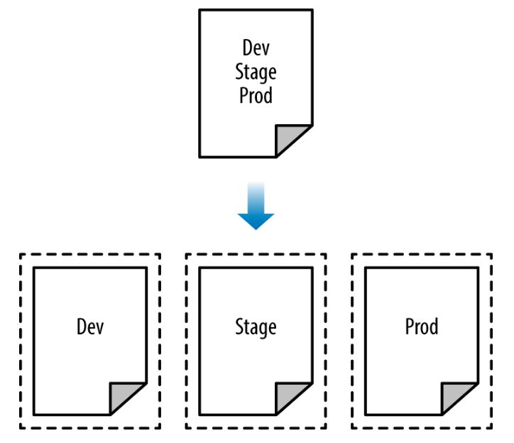

# Managing Terraform State

## The Plan

* What is Terraform state?

* Shared storage for state files

* Limitations with Terraform’s backends

* Isolating state files

    * Isolation via workspaces

    * Isolation via file layout

* The `terraform_remote_state` data source

---
## What Is Terraform State?

* Every time you run Terraform, it records information about what infrastructure it created in a Terraform state file
* By default, when you run Terraform in the folder /foo/bar, Terraform creates the file /foo/bar/terraform.tfstate.
* Say, your Terraform configuration shows below
* After you run `terraform apply` you will see the output in `terraform.tfstate`

```shell script
resource "aws_instance" "example" {
  ami           = "ami-0c55b159cbfafe1f0"
  instance_type = "t2.micro"
}
```
---

## Example of "terraform.tfstate"

 
 
--- 
## Meaning of "terraform.tfstate"

* Resource with type aws_instance and name example corresponds to an EC2 Instance in your AWS account with ID i-00d689a0acc43af0f
* Every time you run Terraform
    * it can fetch the latest status of this EC2 Instance from AWS
    * compare that to what’s in your Terraform configurations
    * determine what changes need to be applied
* Thus, the output of the `terraform plan` command is a diff 
    * between the code on your computer and 
    * the infrastructure deployed in the real world, as discovered via IDs in the state file
    
Notes:

* THE STATE FILE IS A PRIVATE API
* The state file format is a private API that changes with every release and is meant only for internal use within Terraform. You should never edit the Terraform state files by hand or write code that reads them directly.

* If for some reason you need to manipulate the state file—which should be a relatively rare occurrence—use the terraform import or terraform state commands     
---

## Shared "state" Files

* Shared storage for state files
  
    * To be able to use Terraform to update your infrastructure, each of your team members needs access to the same Terraform state files. That means you need to store those files in a shared location
  
* Locking state files
     * As soon as data is shared, you run into a new problem: locking
     * Without locking, if two team members are running Terraform at the same time, you can run into race conditions as multiple Terraform processes make concurrent updates to the state files
     * This can lead to conflicts, data loss, and state file corruption
  
* Isolating state files
    * When making changes to your infrastructure, it’s a best practice to isolate different environments
    * When making a change in a testing or staging environment
        * be sure that there is no way you can accidentally break production

--- 
## Separate Environments

 
    
---    