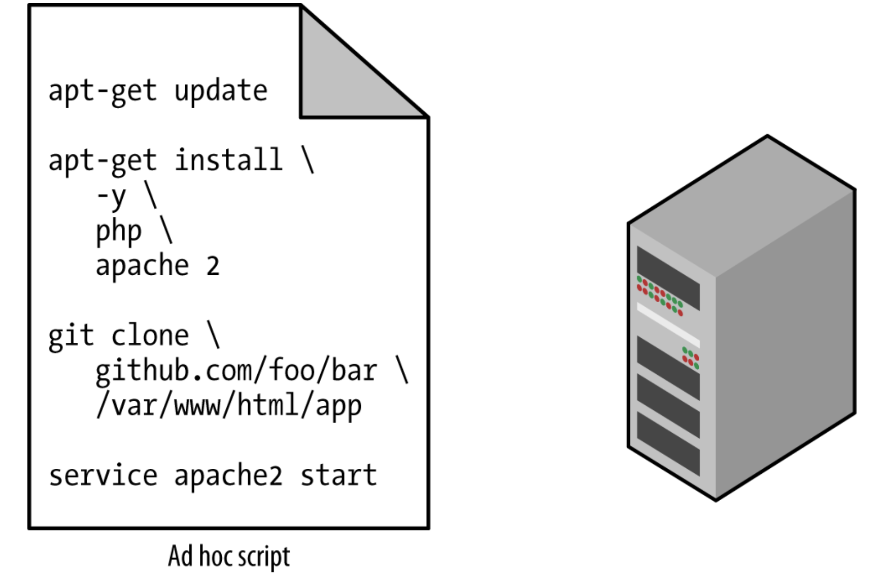
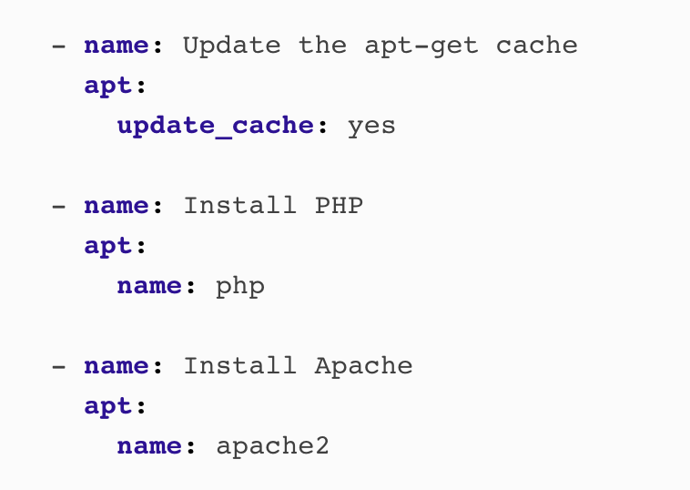
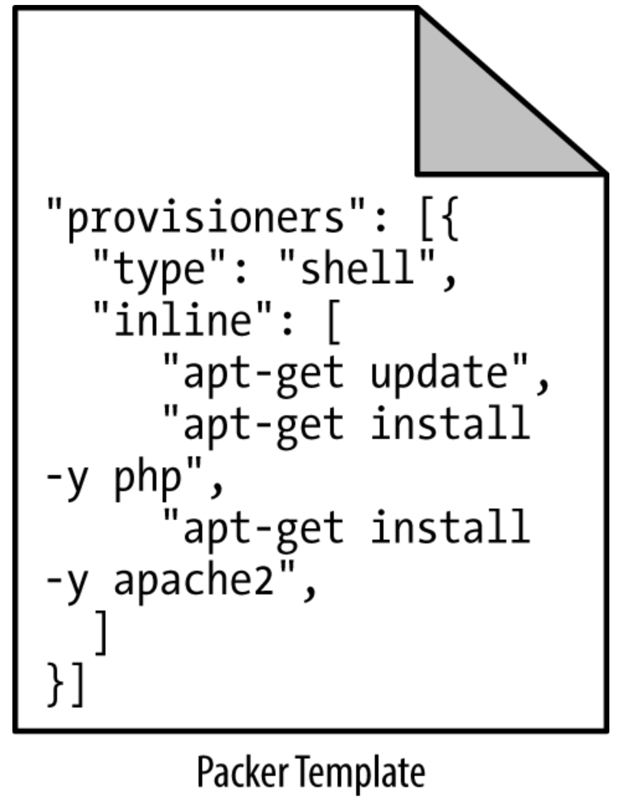
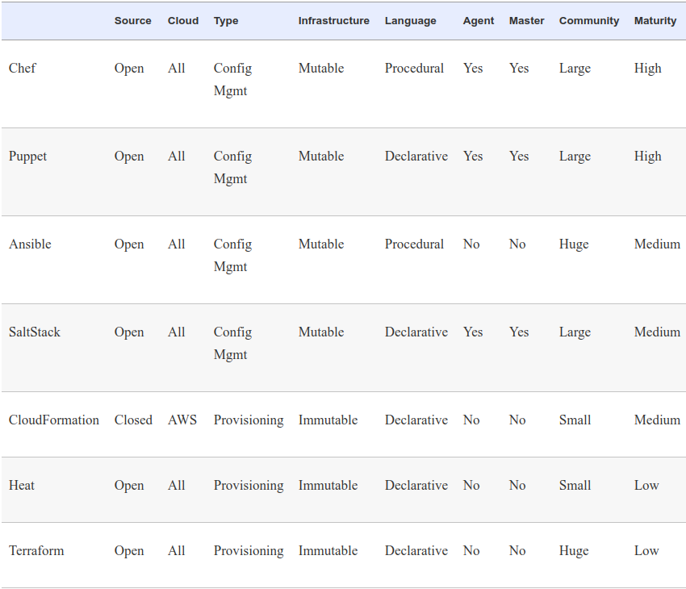

# Terraform - intro
---

## Why Terraform?

1. __IaC__ (Infrastructure as Code) is one of the most important developments in application
deployment in many years.

1. Terraform is a __maverick__ who appeared on the scene a few years ago and
became more popular than all other IaC implementations

1. Terraform is __open source__ and can be used with any cloud provider,
such as Amazon Web Services, IBM Cloud, Google Cloud Platform, Microsoft Azure, etc.

1. Terraform is __declarative__ and __idempotent__. These are good design principles,
and many competitors have also implemented Terraform ideas, making Terraform
a de facto standard

 <!--{"left" : 0.77, "top" : 6.51, "height" : 1.18, "width" : 4.83} -->

---

## Terraform - Bird's Eye View

* What is Terraform?
* How does it compare to other similar tools?
* What is its place in the IaC ecosystem
    - IaC = Infrastructure as Code

---

## What We Will Discuss

* The rise of DevOps
* What is infrastructure as code?
* The benefits of infrastructure as code
* How Terraform works
* How Terraform compares to other infrastructure as code tools

---

## The Rise of DevOps - Before

* To build a software company
* set up cabinets and racks
* load them up with servers, etc.
* Set up "Devs" team, set up "Ops" team
* Let them duke it out
   <!-- {"left" : 0.77, "top" : 4.34, "height" : 2.42, "width" : 3.63} -->

## The Rise of DevOps - Now    

* There are AWS, Azure, GCP, etc.
* There are Chef, Puppet, Terraform, and Docker
    * Sysadmins write code
    * Devs write code
    * Ops write code - so DevOps is born    
    * The goal of DevOps is to make software delivery vastly more efficient
* What if I do not have teams of admins, devs, ops? 
* Say, my team is a multi-skilled group at a university?
    * DevOps as a movement is popular here as well, if not more
    * Borrowing on the ideas from the enterprise folks

---

## With DevOps

* Nordstrom
    - number of features it delivered per month +100%
    - reduce defects by 50%
    - reduce lead times by 60%

* HP’s LaserJet Firmware
    - time its developers spent on developing new features went from 5% to 40%
    - overall development costs were reduced by 40%

* Four core values in the DevOps movement   
    - culture, automation, measurement, and sharing (CAMS)
    
* DevOps is now a **lifestyle**

* In research - ResearchOps in next 
    
---

## ResearchOps

* IBM paper
    * "ResearchOps: The case for DevOps in scientific applications"
    * Real-life projects at the IBM Research Brazil Lab
    * May just as well apply to other research institutions
    * [Paper link](https://www.researchgate.net/publication/283757158_ResearchOps_The_case_for_DevOps_in_scientific_applications)
    
---
    
## What Is Infrastructure as Code?
* There are five broad categories of IAC tools:

    - Ad hoc scripts
    - Configuration management tools
    - Server templating tools
    - Orchestration tools
    - Provisioning tools

---

## Ad Hoc Scripts

---

## Configuration Management Tools

* Chef, Puppet, Ansible, and SaltStack
* Example of Ansible script

---

## Server Templating Tools
*  Docker, Packer, and Vagrant.

---

## Images and Containers

---

### Virtual Machines vs Containers

* Virtual machines
    - A virtual machine (VM) emulates an entire computer system, including the hardware. You run a hypervisor, such as VMWare, VirtualBox, or Parallels, to virtualize (i.e., simulate) the underlying CPU, memory, hard drive, and networking.
    - Benefit: complete isolation
    - Drawback: waste of resources
    - You can define VM images as code using tools such as Packer and Vagrant.
* Containers
    - A container emulates the user space of an OS.2 You run a container engine, such as Docker, CoreOS rkt, or cri-o, to create isolated processes, memory, mount points, and networking.    
    - Benefit: you run on top of the container engine can see only its own user space
    - Benefit: of the containers running on a single server share, milliseconds boot time

---

## Happiness with IaC

* Happiness
    * Deploying code and managing infrastructure manually is repetitive and tedious
    * No one will take notice—until that one day when you mess it up
    * That creates a stressful and unpleasant environment
    * Here is a painting of a happy man (see notes)

Notes:

* Painting: Democritus by Hendrick ter Brugghen, 1628.

* Some philosophers consider happiness the goal of people's life
    * Democritus
        * Democritus (c. 460 – c. 370 BC) is known as the 'laughing philosopher' because of his emphasis on the value of 'cheerfulness'.
* Plato
    * Sees a type of happiness stemming from social justice through fulfilling one's social function
* Aristotle
    * described eudaimonia (Greek: εὐδαιμονία) as the goal of human thought and action. Eudaimonia is often translated to mean happiness
* Cynicism (Antisthenes)
    * rejected any conventional notions of happiness involving money, power, and fame, to lead entirely virtuous, and thus happy, lives

---

## Why Infrastructure as Code?

* Q:
* With all the different flavors of IaC why bother IaC (i.e. Terraform)?
    - Why learn a bunch of new languages and tools and encumber yourself with yet more code to manage?
* A:
    - code is powerful
    - you get dramatic improvements in your ability to deliver software
    - organizations that use DevOps practices, such as IaC
        - deploy 200 times more frequently
        - recover from failures 24 times faster
        - have lead times that are 2,555 times lower.

* D: Discuss
    - How much does this apply to your use cases?
    - Say you are a researcher who seldom uses dev and prod environment. Do you still see the benefits of IaC? Where?
    - Again, [ResearchOps paper](https://www.researchgate.net/publication/283757158_ResearchOps_The_case_for_DevOps_in_scientific_applications)
Notes:

Source: 2016 State of DevOps Report

---

## The Benefits of Infrastructure as Code

* Self-service

  * Infrastructure deployment with the scripts, not your admin  

* Speed and safety
    * The computer will do a deployment faster and with less errors

* Documentation
    * You can represent the state of your infrastructure in source files

* Version control
    * You can store your IaC source files in version control

* Validation
    * For every single change, you can perform a code review

* Reuse
    * You can build on top of known, documented pieces

---

## How Terraform Works

* Terraform is an open source tool created by HashiCorp and written in the Go programming language
* The Go code compiles down into a single binary called `terraform`
* You can use this binary to deploy infrastructure from your laptop or a build server
    *  you don’t need to run any extra infrastructure to make that happen
* The `terraform` binary makes API calls on your behalf to one or more providers
    * AWS
    * Azure
    * Google Cloud
    * DigitalOcean
    * OpenStack, and more

---     
## Terraform and Other Tools

Notes:

Source: The book
---                                       
