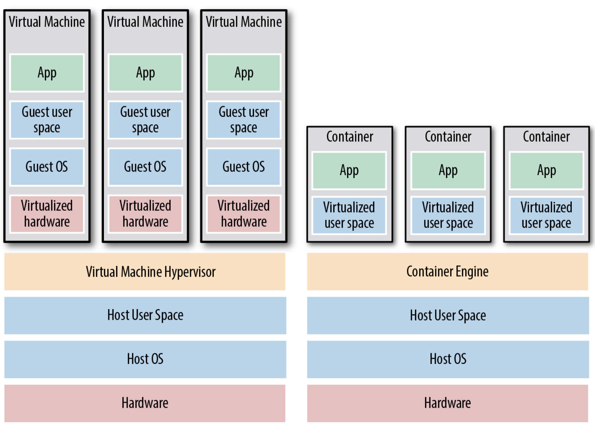

# Terraform - intro

## Terraform - Bird's Eye View

* What is Terraform?
* How does it compare to other similar tools?
* What is its place in the IaC ecosystem
    - IaC = Infrastructure as Code
    
---

## What We Will Discuss

* The rise of DevOps
* What is infrastructure as code?
* The benefits of infrastructure as code
* How Terraform works
* How Terraform compares to other infrastructure as code tools

---

## The Rise of DevOps

* Before 
    - To build a software company
    - set up cabinets and racks
    - load them up with servers, etc.
    - Set up "Devs" team, set up "Ops" team
    - Let them duke it out
* Now
    - There are AWS, Azure, GCP, etc.
    - There are Chef, Puppet, Terraform, and Docker
    - Sysadmins write code
    - Devs and Ops write code, so DevOps is born    

* The goal of DevOps is to make software delivery vastly more efficient

---

## With DevOps

* Nordstrom
    - number of features it delivered per month +100%
    - reduce defects by 50%
    - reduce lead times by 60%

* HP’s LaserJet Firmware
    - time its developers spent on developing new features went from 5% to 40%
    - overall development costs were reduced by 40%
    
* Four core values in the DevOps movement   
    - culture, automation, measurement, and sharing (CAMS) 
---

## What Is Infrastructure as Code?
* There are five broad categories of IAC tools:

    - Ad hoc scripts
    - Configuration management tools
    - Server templating tools
    - Orchestration tools
    - Provisioning tools

--- 

## Ad Hoc Scripts

---

## Configuration Management Tools

* Chef, Puppet, Ansible, and SaltStack
* Example of Ansible script

---

## Server Templating Tools
*  Docker, Packer, and Vagrant.

---

## Images and Containers

---

### Virtual Machines vs Containers

* Virtual machines
    - A virtual machine (VM) emulates an entire computer system, including the hardware. You run a hypervisor, such as VMWare, VirtualBox, or Parallels, to virtualize (i.e., simulate) the underlying CPU, memory, hard drive, and networking.
    - Benefit: complete isolation
    - Drawback: waste of resources
    - You can define VM images as code using tools such as Packer and Vagrant. 
* Containers
    - A container emulates the user space of an OS.2 You run a container engine, such as Docker, CoreOS rkt, or cri-o, to create isolated processes, memory, mount points, and networking.    
    - Benefit: you run on top of the container engine can see only its own user space
    - Drawback: of the containers running on a single server share, milliseconds boot time
    
---
### The Benefits of Infrastructure as Code

* Q:
* With all the different flavors of IaC why bother IaC (i.e. Terraform)? 
    - Why learn a bunch of new languages and tools and encumber yourself with yet more code to manage?
* A:
    - code is powerful
    - you get dramatic improvements in your ability to deliver software
    - organizations that use DevOps practices, such as IaC
        - deploy 200 times more frequently
        - recover from failures 24 times faster
        - have lead times that are 2,555 times lower.
        
Notes:

Source: 2016 State of DevOps Report

---                