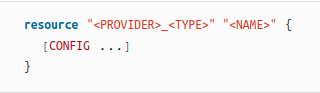
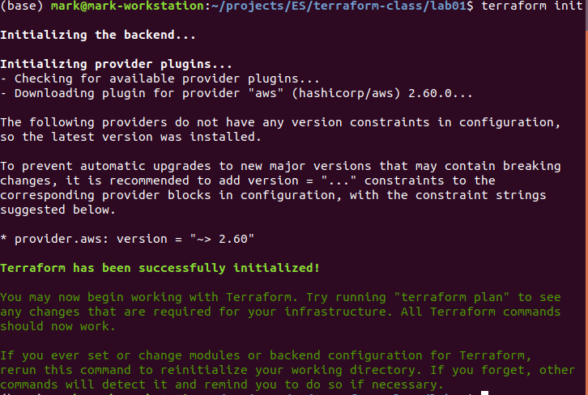
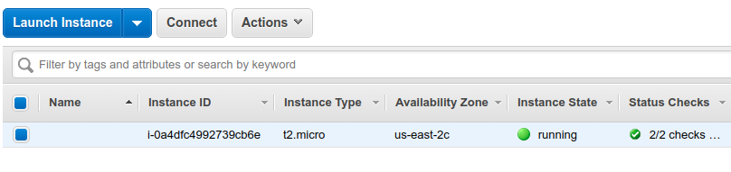
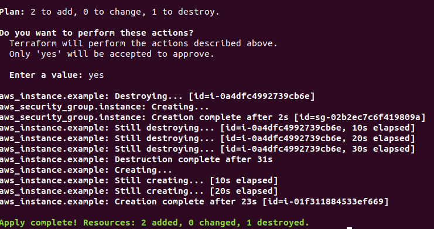
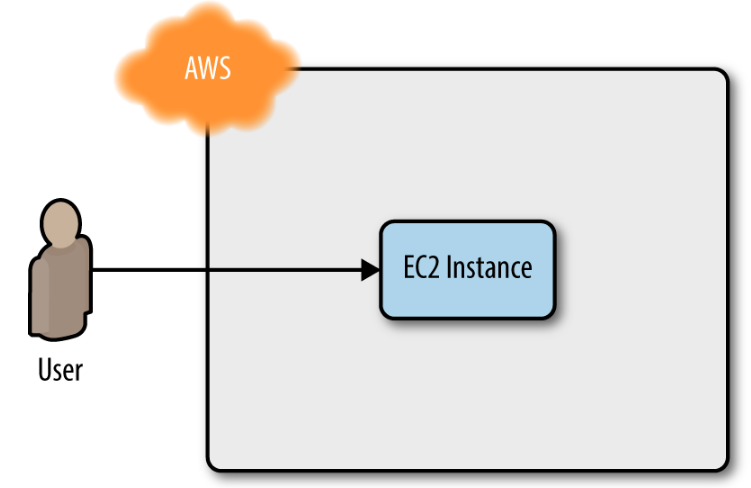
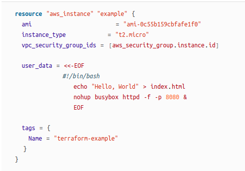
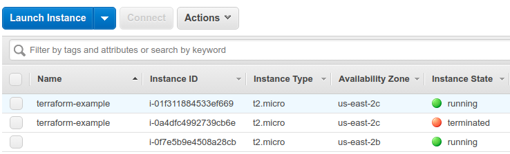
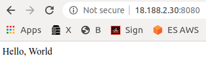

# Terraform Walk-Through

## The Plan

* Setting up your AWS account

* Installing Terraform

* Deploying a single server

* Deploying a single web server

* Deploying a configurable web server

* Deploying a cluster of web servers

* Deploying a load balancer

* Cleaning up

---

## We Will Use AWS
* The most popular cloud infrastructure provider, by far. It has a 45% share in the cloud infrastructure market, which is more than the next three biggest competitors (Microsoft, Google, and IBM)
* Provides a huge range of reliable and scalable cloud-hosting services
* Generous Free Tier for the first year
    * Or use <myname+1@gmail.com> kind of address
    * If you already used up your free tier credits, the examples in the labs should still cost you no more than a few dollars.

---
    
## Setting Up Your AWS Account
* If you don’t already have an AWS account, head over to https://aws.amazon.com and sign up
* The _only_ thing you should use the root user for is to create other user accounts with more-limited permissions, and then switch to one of those accounts immediately
* Here are the permissions you will need (for some labs)
    * AmazonEC2FullAccess

    * AmazonS3FullAcces

    * AmazonDynamoDBFullAccess

    * AmazonRDSFullAccess

    * CloudWatchFullAccess

    * IAMFullAccess

* If you are using an existing AWS account, it must have a Default VPC in it. 
* If the instructor provided a student account, you can use that    
Notes:

---         
## Install Terraform

* Download the `terraform` executable from the [Terraform home page](https://www.terraform.io/)
* Depending on your OS, you may also install a native package
* For Mac
    * `brew install terraform`
* You may use a cloud server if provided by the instructor    
* You may use Terraform cloud account


---
## Verify `terraform` Version

* Ubuntu example

 
    Terraform v0.12.20
    
    Your version of Terraform is out of date! The latest version
    is 0.12.24. You can update by downloading from 
    https://www.terraform.io/downloads.html

* OK... Update [here](https://www.howtoforge.com/how-to-install-terraform-on-ubuntu-1804/)


## Now What?


## Connect to AWS

* Set up AWS credentials

```
$ export AWS_ACCESS_KEY_ID=(your access key id)
$ export AWS_SECRET_ACCESS_KEY=(your secret access key)
```

*
* This will only give you the setup for this shell
* To make it work after reboot, put it into `.bashrc`

```
    vi .bashrc 
```

* Terraform supports the same authentication mechanisms as all AWS CLI and SDK tools
* Therefore, it’ll also be able to use credentials in $HOME/.aws/credentials
    * These are automatically generated if you run the `configure` command on the AWS CLI, or IAM

---

## Prepare to Deploy a Server

* Create an empty folder
* Put in a file called `main.tf`
* Put in there (it means what it says)

      provider "aws" {
        region = "us-east-2"
      }
      
* Now added resources      



---

## Server Resource

     resource "aws_instance" "example" {
       ami           = "ami-0c55b159cbfafe1f0"
       instance_type = "t2.micro"
     }
     
* ami
    * The Amazon Machine Image (AMI) to run on the EC2 Instance. 
    * You can find free and paid AMIs in the AWS Marketplace 
    * or create your own using tools such as Packer
    * This ami parameter to the ID of an Ubuntu 18.04 AMI in us-east-2. This AMI is free to use

* instance_type
    * The type of EC2 Instance to run
    * Each type of EC2 Instance provides a different amount of CPU, memory, disk space, and networking capacity. The EC2 Instance Types page lists all the available options 
    * t2.micro, which has one virtual CPU, 1 GB of memory, and is part of the AWS free tier

---
## Do Not Try to Remember by Heart

* Terraform supports dozens of providers
* Each of which supports dozens of resources
* Each resource has dozens of arguments
* We recommend using the documentation. 
    * Here is an [example for ami](https://www.terraform.io/docs/providers/aws/r/instance.html)
    
* Now run `terraform init`

---
## Result of `terraform init`



---
## Result of "terraform plan"

```
$ terraform planRefreshing 
Terraform state in-memory prior to plan...
The refreshed state will be used to calculate this plan, but will not be
persisted to local or remote state storage.
------------------------------------------------------------------------
An execution plan has been generated and is shown below.
Resource actions are indicated with the following symbols:
  + create

Terraform will perform the following actions:

  # aws_instance.example will be created
  + resource "aws_instance" "example" {
      + ami                          = "ami-0c55b159cbfafe1f0"
Plan: 1 to add, 0 to change, 0 to destroy.

------------------------------------------------------------------------

Note: You didn't specify an "-out" parameter to save this plan, so Terraform
can't guarantee that exactly these actions will be performed if
"terraform apply" is subsequently run.
```     

---
## Result of "terraform apply"

```

An execution plan has been generated and is shown below.
Resource actions are indicated with the following symbols:
  + create

Terraform will perform the following actions:

  # aws_instance.example will be created
  + resource "aws_instance" "example" {
      + ami                          = "ami-0c55b159cbfafe1f0"
...
}

Plan: 1 to add, 0 to change, 0 to destroy.

Do you want to perform these actions?
  Terraform will perform the actions described above.
  Only 'yes' will be accepted to approve.

  Enter a value: yes

aws_instance.example: Creating...
aws_instance.example: Still creating... [10s elapsed]
aws_instance.example: Still creating... [20s elapsed]
aws_instance.example: Creation complete after 24s [id=i-0a4dfc4992739cb6e]

Apply complete! Resources: 1 added, 0 changed, 0 destroyed.
 
```
---
## Verify the Deployment Result

* Go to AWS dashboard
* Verify that the server was created



---

## Let Us Give Our Server a Name

* Add to your `main.tf`
    * (remove the previous server definition)

```
resource "aws_instance" "example" {
  ami           = "ami-0c55b159cbfafe1f0"
  instance_type = "t2.micro"

  tags = {
    Name = "terraform-example"
  }
}
```

* Run `terraform apply`
* Verify that we gave our server a name


---

## Deploy a Single Web Server



---
## Make a Web Server
* In the real world, you would build a real web server such as Flask
* We will, instead, do a one-command

```
#!/bin/bash
echo "Hello, World" > index.html
nohup busybox httpd -f -p 8080 &
```

* However, how should we put it into our instance?
* We will add it to the aws_instance, as _User Data_ configuration

## Adding a Script to the Instance

*  You pass a shell script to User Data by setting the user_data argument in your Terraform code as follows:
```shell script
  user_data = <<-EOF
              #!/bin/bash
              echo "Hello, World" > index.html
              nohup busybox httpd -f -p 8080 &
              EOF
```
* The `<<-EOF` and `EOF` are Terraform’s `heredoc` syntax, which allows you to create multiline strings without having to insert newline characters all over the place

---

## Wait! One More Thing

* By default, AWS does not allow any incoming or outgoing traffic from an EC2 Instance. 
* To allow the EC2 Instance to receive traffic on port 8080, you need to create a security group:

```shell script
resource "aws_security_group" "instance" {
  name = "terraform-example-instance"

  ingress {
    from_port   = 8080
    to_port     = 8080
    protocol    = "tcp"
    cidr_blocks = ["0.0.0.0/0"]
  }
}
```
* Creates a new resource called `aws_security_group`

## CIDR Blocks

* The `ingress' above specifies that this group allows incoming TCP requests
    * on port 8080 from the CIDR block 0.0.0.0/0
* CIDR blocks are a concise way to specify IP address ranges
* For example, a CIDR block of 10.0.0.0/24 
    * represents all IP addresses between 10.0.0.0 and 10.0.0.255
* The CIDR block 0.0.0.0/0 is an IP address range that includes all possible IP addresses, so this security group allows incoming requests on port 8080 from any IP

---

## Passing the Security Group ID

* You also need to tell the EC2 instance to actually use the security group by passing the group's ID
* It goes into the `vpc_security_group_ids` argument of the `aws_instance resource`.
* This is done with Terraform expressions

---

## Terraform "expressions"

* An expression in Terraform is anything that returns a value
* The simplest type of expressions are literals
    * strings: "ami-0c55b159cbfafe1f0"
    * numbers: 7
* Here we need an expression which is a reference

```shell script
<PROVIDER>_<TYPE>.<NAME>.<ATTRIBUTE>

In our case

aws_security_group.instance.id
```
    
## Altogether



## New Result of "terraform plan"

```shell script

Refreshing Terraform state in-memory prior to plan...
The refreshed state will be used to calculate this plan, but will not be
persisted to local or remote state storage.

aws_instance.example: Refreshing state... [id=i-0a4dfc4992739cb6e]
...
  # aws_security_group.instance will be created
  + resource "aws_security_group" "instance" {
...
Plan: 2 to add, 0 to change, 1 to destroy.
```
---

## New Result of "terraform apply"


---
## Et Voila!



---
## Test the Deployment

```shell script
$ curl http://<EC2_INSTANCE_PUBLIC_IP>:8080
Hello, World
```
* In my example

```shell script
$ curl http://18.188.2.30:8080
Hello, World
```


* Celebrate!
---
