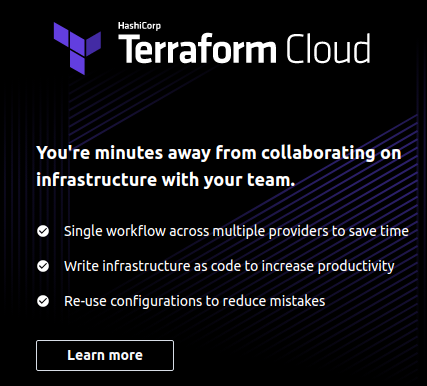
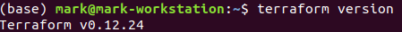
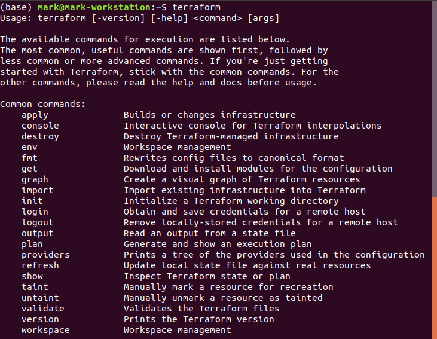

# Terraform Walk-Through

## The plan

* Setting up your AWS account

* Installing Terraform

* Deploying a single server

* Deploying a single web server

* Deploying a configurable web server

* Deploying a cluster of web servers

* Deploying a load balancer

* Cleaning up

---

## We will use AWS
* The most popular cloud infrastructure provider, by far. It has a 45% share in the cloud infrastructure market, which is more than the next three biggest competitors (Microsoft, Google, and IBM)
* Provides a huge range of reliable and scalable cloud-hosting services
* Generous Free Tier for the first year
    * Or use <myname+1@gmail.com> kind of address
    * If you already used up your free tier credits, the examples in the labs should still cost you no more than a few dollars.

---
    
## Setting Up Your AWS Account
* If you don’t already have an AWS account, head over to https://aws.amazon.com and sign up
* The _only_ thing you should use the root user for is to create other user accounts with more-limited permissions, and then switch to one of those accounts immediately
* Here are the permissions you will need (for some labs)
    * AmazonEC2FullAccess

    * AmazonS3FullAcces

    * AmazonDynamoDBFullAccess

    * AmazonRDSFullAccess

    * CloudWatchFullAccess

    * IAMFullAccess

* If you are using an existing AWS account, it must have a Default VPC in it. 
* If the instructor provided a student account, you can use that    
Notes:

---         
## Install Terraform

* Download the `terraform` executable from the [Terraform home page](https://www.terraform.io/)
* Depending on your OS, you may also install a native package
* For Mac
    * `brew install terraform`
* You may use a cloud server if provided by the instructor    
* You may use Terraform cloud account


---
## Verify `terraform` version

* Ubuntu example

 
    Terraform v0.12.20
    
    Your version of Terraform is out of date! The latest version
    is 0.12.24. You can update by downloading from 
    https://www.terraform.io/downloads.html

* OK... Update [here](https://www.howtoforge.com/how-to-install-terraform-on-ubuntu-1804/)



## Now what?



## Connect to AWS

* Set up AWS credentials

```
$ export AWS_ACCESS_KEY_ID=(your access key id)
$ export AWS_SECRET_ACCESS_KEY=(your secret access key)
```

* This will only give you the setup for this shell
* To make it work after reboot, put it into `.bashrc`

```
    vi .bashrc 
```

* Terraform supports the same authentication mechanisms as all AWS CLI and SDK tools
* Therefore, it’ll also be able to use credentials in $HOME/.aws/credentials
    * These are automatically generated if you run the `configure` command on the AWS CLI, or IAM

---

## Prepare to Deploy a Server

