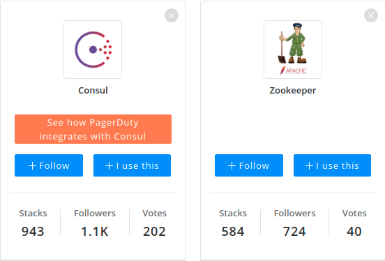
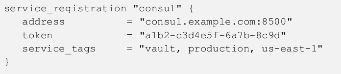

# Consul

# Consul for Service Discovery

## Why service discovery?

* Applications are running on dynamic infrastructure
* Need to determine services are running and how they can be accessed
* HashiCorp provides a solution, and it is Consul
* How?
  * applications and services register with Consul
  * service registry is populated
  * connect to critical services throughout the organization

Notes:

In a fast-moving business where applications are running on dynamic infrastructure,
determining where services are running and how they can be accessed may become a
challenge to manage. Fortunately, HashiCorp provides a solution to this dilemma with its
Consul product. By instructing applications and services to register with Consul, a service
registry can be populated, and applications can query the registry to discover and connect
to critical services throughout the organization.

---

## Consul vs Zookeeper



---

## Consul is from HashiCorp 

* Consul is a solution provided by HashiCorp
* tight integration with Consul to simplifies access to Vault
* Users and applications can query Consul using either DNS or the API
* Consul responds to the query with the information needed to establish communication with the active Vault node
* Faster and smarter than a load balancer

Notes:

Since Consul is a solution provided by HashiCorp, it should come as no surprise that
HashiCorp Vault includes tight integration with Consul to simplify access to Vault. Users and
applications can query Consul using either DNS or the API when communication to Vault is
required. Consul responds to the query with the information needed to establish
communication with the active Vault node. If the Vault environment changes, Consul is
immediately aware of those changes and begins directing subsequent requests to the now-
active Vault environment. This strategy can help organizations reduce or eliminate the
reliance on a front-end load balancer that may not reflect changes fast enough when using
a health check configured with timeouts and thresholds.

---

## Consul and Vault cluster
* Consul can also simplify the connectivity to standby nodes within the cluster
* Especially when running Vault Enterprise with performance standby nodes
* Performance standby nodes can service Vault read operations and help
  Vault operators scale those read operations within a cluster
  
Notes:

In addition to maintaining a connection to the active node, Consul can also simplify the
connectivity to standby nodes within the cluster. This connectivity may be especially
convenient when running Vault Enterprise with performance standby nodes. As previously
discussed, these performance standby nodes can service Vault read operations and help
Vault operators scale those read operations within a cluster. By using Consul to
communicate with the performance standby nodes, clients a

---

## Registering the Vault Service with Consul

* When you deploy a Vault cluster with Consul backend -
  * Vault service is automatically registered with the Consul service registry by default
* Best practice
  * If Consul service discovery is desired, a second Consul cluster should be deployed to manage this functionality
  
Notes:

When a Vault cluster is deployed using a Consul storage backend, the Vault service is
automatically registered with the Consul service registry by default. However, HashiCorp
recommends that the Consul cluster deployed as the storage backend never be used for
additional Consul functionality, such as service discovery. This recommendation ensures
the Consul cluster can dedicate all available resources to servicing the storage backend
rather than other Consul functions. If Consul service discovery is desired, a second Consul
cluster should be deployed to manage this functionality.

---

## How to register

* The _service_registration_ stanza is added to the Vault configuration
* This configuration includes 
    * the address and port of the Consul cluster
    * the Consul ACL token to permit Consul access (if Consul ACLs are
  enabled)
    * other configurable parameters such as service_tags.

Notes:

The service_registration stanza needs to be added to the Vault configuration file to register
the Vault service with a Consul cluster. 

---

## service_registration stanza example



Notes:

This configuration includes the address and port of
the Consul cluster, the Consul ACL token to permit Consul access (if Consul ACLs are
enabled), and other configurable parameters such as service_tags. Keep in mind that
the token is a Consul ACL token, not a Vault token. The ACL token needs to be associated
with a Consul ACL policy with appropriate permissions, such as reading from the key/value
path and creating the Consul service. Figure 6-6 provides an example of the stanza to be
added to the Vault configuration file.

---

## Connecting to Vault using Consul

* In Consul, all Vault cluster nodes are registered as the Vault service
* To use Consul to discover the active node in a cluster, a client can query Consul with the
  DNS name
  
```text
active.vault.service.consul
```

Notes:

To discover the current standby node(s) in a Vault cluster, the client can query Consul for
the DNS name found in Figure 6-8. If there are multiple standby nodes, Consul responds to
the query with all the standby nodes.

---

## Performance standby node(s)

* In Vault Enterprise
  * To discover the performance standby node(s)
  * client can
    query Consul for the DNS name
    
```text
performance-standby.vault.service.consul
```

Notes:

When running Vault Enterprise, a client or application may need to discover the
performance standby node(s) in a Vault cluster for read operations. To do so, the client can
query Consul for the DNS name found in Figure 6-9. If there are multiple performance
standby nodes, Consul responds to the query with all the standby nodes.

---

# Terraform integration

## Terraform and Vault


Notes:

Vault is one of HashiCorp's most popular products, but its adoption is dwarfed by the
popularity of another HashiCorp product, Terraform. Terraform allows customers to define
infrastructure components as code to create a predictable and repeatable process for
standing up applications and supporting infrastructure. Terraform supports integration with
Vault in several ways, including the ability to deploy Vault infrastructure, manage Vault
infrastructure, configure Vault components, and retrieve Vault secrets.

---

